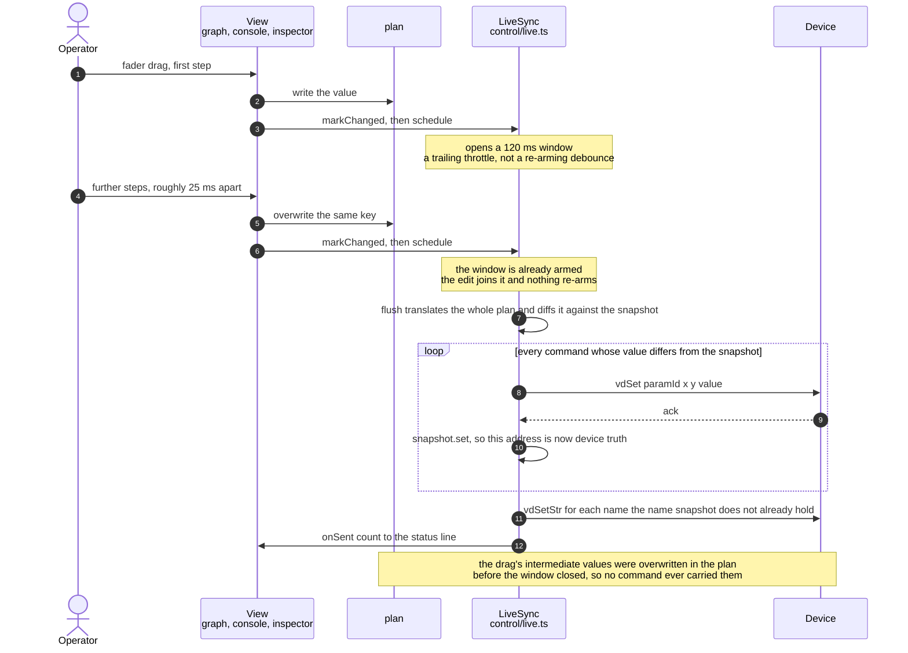
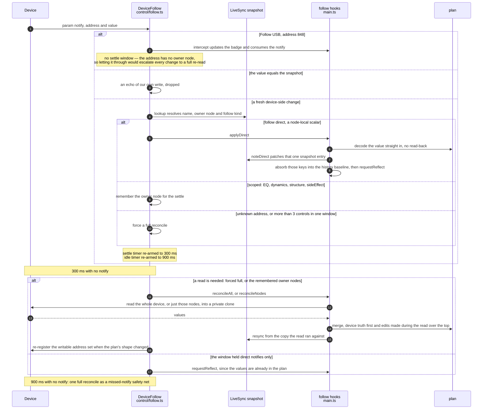
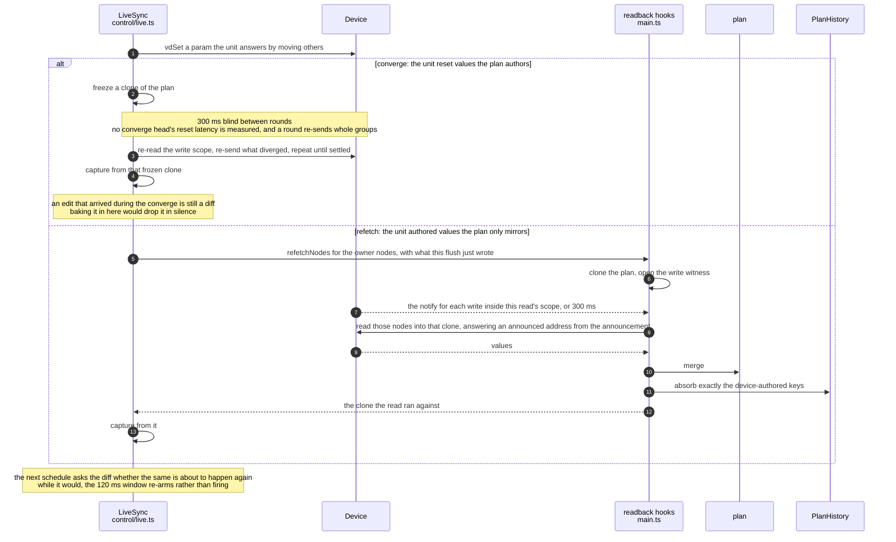
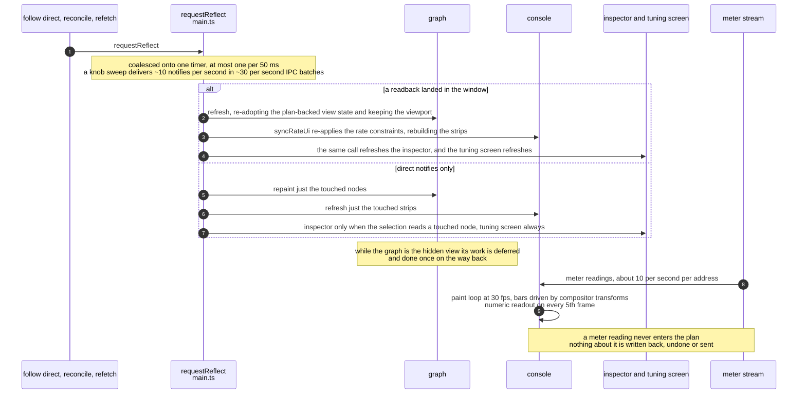

# Architecture

> 日本語版: [../ja/architecture.md](../ja/architecture.md)

## Purpose

Create and visualize routing plans for the YAMAHA URX22 / URX44 / URX44V in a GUI, constraining
the editor so that only paths the device physically allows can be wired. Plans persist as JSON and
can be exported as images. The same plan data is also reflected onto real
hardware over live sync in the desktop build.

## Tech stack and rationale

| Layer | Choice | Rationale |
| --- | --- | --- |
| Desktop shell | Tauri 2 | Ship Windows 11 / Apple silicon macOS from one source. Small binary. Hardware control is implemented natively in Rust |
| Frontend | TypeScript + Vite | The planning UI is pure frontend. It can be verified in a browser even without Rust |
| Rendering | Plain SVG | Draws the node-graph wiring. Keeps the no-runtime-dependency policy |
| Persistence | JSON | Human-readable. Also serves as the input for hardware reflection |

Hardware control is handled on the Tauri (Rust) side, and the UI and core (model / constraints /
plan) are kept shell-independent.

## Module structure

```mermaid
flowchart TD
  subgraph frontend[Frontend src/]
    main[main.ts<br/>bootstrap & wiring]
    subgraph models[models/ device definition]
      types[types.ts]
      build[build.ts<br/>model generation]
      reg[index.ts<br/>URX22/44/44V]
      seed[initial-state.ts<br/>new-plan defaults]
    end
    subgraph core[core/ logic]
      routing[routing.ts<br/>connection constraint engine]
      constraints[constraints.ts<br/>sample-rate limits]
      plan[plan.ts<br/>plan state + JSON]
      levels[levels.ts<br/>level_gain grid<br/>snap/step/position]
      storage[storage.ts<br/>save/load/PNG/PDF]
      platform[platform.ts<br/>Tauri bridge / fallbacks]
      meters[meters.ts<br/>live meters<br/>map/decode/store]
      midicore[midi/ external MIDI control<br/>message/mapping/controls/engine]
      settings[settings.ts<br/>user preferences store]
      scenescope[scene-scope.ts<br/>scene boundary on plan state]
    end
    subgraph ui[ui/ presentation]
      graphts[graph.ts<br/>SVG node graph<br/>theme-aware palette]
      inspector[inspector.ts<br/>selected-element editing]
      console[console.ts<br/>mixer-style level overview]
      midiui[midi.ts<br/>MIDI control panel]
      prefsui[prefs.ts<br/>Preferences modal]
    end
    subgraph i18n[i18n/ localization]
      cat[en.ts / ja.ts<br/>message catalogs]
      runtime["index.ts<br/>language state + t()"]
    end
  end
  subgraph shell[Tauri shell src-tauri/]
    rust[main.rs / lib.rs<br/>webview host<br/>dialog plugin + file IO<br/>hardware-control vd_* / MIDI midi_* commands<br/>idle-sleep hold set_keep_awake]
  end

  main --> models & core & ui & i18n
  ui --> core & i18n
  core --> models
  shell -. hosts .-> frontend
```



## Source layout

The diagram above is the shape. This is what each file is for and why it is that way; `CLAUDE.md`
carries a one-line map of the same directories and points here.

- `src/core/` — `plan-history.ts` the reversible plan patch behind undo / redo (a **diff, not a snapshot**,
  keyed per top-level `NodeParams` key / per wire / per record entry: while Live sync is up a whole-plan
  restore would rewind a channel the operator just moved on the hardware and the next flush would write that
  stale value back, so an inverse patch only ever writes the keys the app authored. `unreadNodes` is
  excluded by name. The file is a second encoding of `Plan`, so `HISTORY_FIELDS` is a mapped type over
  `keyof Plan` and `plan-history.contract.test.ts` round-trips one real mutation per entry — a field that
  reaches the plan without reaching the differ is an edit the user cannot undo, silently. It also arbitrates
  the device-read merge: `entryInContext` narrows a contested nested group (comp / gate / eqBands / …) to
  its sub-keys so an app edit and a device edit to *different* fields of one group both survive, and
  `PlanWriteWitness` records **which keys the app wrote while a read was in flight**, so `readIntoPlan`
  drops those by authorship rather than by value — an edit that went A→B→A is indistinguishable from an
  untouched key otherwise, and the read's transient B would be enshrined) / `routing.ts` connection
  constraint engine / `constraints.ts` sample-rate-dependent feature limits (warnings + 176.4/192 kHz forces
  stereo CH EQ OFF, `channelEqUnavailable`). These are **UI-only**: the device accepts and holds writes to
  the "unavailable" params at 192 kHz (measured), so the write set is never gated by rate — see "Sample rate
  and Follow USB". It also owns the insert-FX menu (`insertFxMenu` returns every option with its lock
  reason, `"rate" | "slot" | null`, so the inspector and the console are both defined over the one table and
  a third lock reason reaches them without either UI file being edited; a caller rendering many menus at
  once passes in one `insertFxCensus` sweep instead of paying it per node). And Ducker bypass detection
  (`channelDuckerOn` = PRE-send notes, `duckerBypassWarnings` = pre-fader tap warnings for USB direct outs;
  microSD Rec intentionally excluded), and what an analog output's MONO reads as (`outputMono` /
  `canPatchFromMonitor` — see "MONO on the analog outputs", which states rather than warns and says why)
  / `plan-validate.ts` the plan loader's single validation funnel,
  `planProblems` (split out of `constraints.ts`, which is rate limits and nothing else: a rate limit warns
  about a plan the app authored, these check a plan built ELSEWHERE — a file, a `?plan=` link, a generator).
  `routing.ts` cannot host them (the cycle constraints → translate → routing). It runs from `loadFromText`
  ALONE — a device readback and a `.urxf` import author a plan without it, deliberately — and its two halves
  are reported differently: an illegal wire refuses the document, an insert-FX slot collision only warns and
  offers to open it anyway / `plan.ts` plan state + JSON + the `?plan=` deep-link codec (deflate-compressed
  `"z"` format; legacy uncompressed links must keep decoding) / `levels.ts` the device's discrete level_gain
  grid (`LEVEL_STEPS_DB`, the canonical list of settable dB values, plus position/snap/step helpers. Every
  level the APP authors snaps to this grid — inspector, CONSOLE and external MIDI alike, with the steps laid
  out at even spacing — while a level the app RECEIVES does not: a device readback divides the raw value by
  100, and a JSON / `?plan=` / `.urxf` load only checks that it is finite, so the plan says what the unit or
  the file actually holds rather than the nearest name this grid has for it) / `storage.ts` save/load/image
  export (PNG/PDF; PDF via home-grown FlateDecode) / `platform.ts` runtime bridge between Tauri IPC and the
  browser / `meters.ts` live level meters (per-model node id → broker meter address tables
  (`NODE_TAPS_URX22` / `NODE_TAPS_URX44`), dBFS decoding, latest-value store; the gain-reduction meters live
  in their own table with their own decode (`grAddr(kind, node)` / `decodeGrDb`) because a reduction is not
  a level and `tapsFor` doubles as the CONSOLE meter-point selector's contract; the two idle values are
  measured states (`0` = the processor is not engaged, OVER = engaged with nothing to reduce) and a GR
  figure excludes any makeup gain; for the CONSOLE view. `tapsFor`/`tapFor`/`hasMeter`/`defaultTapKey` take
  an optional `modelId` and silently fall back to the URX44 table without it, so every resolution site must
  pass `getModel().id`) / `eq-response.ts` the 4-band PEQ's measured frequency response (RBJ biquads with
  the three corrections measuring the unit forced: its Q is twice the biquad Q, pass filters ignore Q, a
  shelf's nominal frequency is its −3 dB-from-plateau point; pinned against the device sweeps in
  `eq-response.test.ts`) / `env.ts` build-time flags (`DEMO`: demo builds hide save/image export and instead
  show share-URL / plan-JSON download buttons) / `settings.ts` user preferences (the Preferences modal's
  backing store: one validated localStorage record `urx-settings`, loaded lazily so the `?reset` clear runs
  first) / `scene-scope.ts` the URX scene boundary in plan terms (capture/apply/strip for scene-scoped
  fetch/save; the write-side mirror is the `sceneExternal` flags in `control/params.ts`, and
  `scene-scope.test.ts` pins the two encodings together)
  - `src/core/midi/` — external MIDI control (desktop only). `message.ts` decode/encode of CC/note/pitch
    bend / `mapping.ts` free-mapping model (address, takeover mode absolute/pickup) + persistence validation
    / `controls.ts` catalog of fixed control ids (`node/param[@scope]`) for every CONSOLE control **and
    every parameter the channel tuning screens edit** — normalized (0..1) get/set snapping to the same grids
    those surfaces use (a tuning-screen value takes its grid from the same `DynField` table its slider does,
    through `translate.ts`'s shared `dynToPos`/`dynFromPos`, so MIDI and a drag cannot land on different
    values of one grid). The id's third component is a **scope**: a send-target bus (`@bus.mix1`) or a
    processor / band (`@gate`, `@comp`, `@eq.low`) — a node has one fader but three thresholds, and a band
    is a scope rather than a cursor because a mapping has to work with the screen closed. Device locks
    reject writes (FIXED bus sends, Pan Link send pan, rate-restricted stereo CH EQ, COMP's device-driven
    values under 1-knob, EQ band values under 1-knob, the Q/gain a filter type does not read); the enum
    selectors (knee / filter type / 1-knob type) carry no control / `engine.ts` incoming-message application
    (14-bit CC pairs; toggles have a per-mapping button behavior named after the sender's button type =
    "Momentary" (edge) / "Toggle" (state), state meaning the value is the state directly, for Stream
    Deck-style alternating 127/0 senders), an incoming message is refused, before any receive bookkeeping so
    the refusal consumes no state, while a device read or a file flow holds the plan or a destructive
    round-trip run holds the unit (the operator-started latches — deliberately not a modal, not a live
    flush's refetch await, and not learn),
    reported to the status line once per gated window rather than once per message; MIDI-learn state
    machine, feedback (diff against a sent cache + 300 ms echo suppression while receiving + a one-shot
    receive-side echo guard for toggles); several mappings sharing one address form a gang (`byKey`) — one
    physical control drives every member (incoming messages fan out to all), while the first-learned list
    head owns feedback/echo/pickup
  - `src/core/control/` — live device control (vd protocol). Writes and Live sync are always enabled on
    desktop; only the round-trip diagnostics in `selftest.ts` require an `--experimental` launch
    - `vd.ts` value encoding / `translate.ts` plan→commands (**one device address yields exactly one
      command**: an insert effect's parameters live in one engine array per effect family with no channel
      axis, so two nodes holding the same family emit the same addresses — `collapseSharedAddrs` keeps the
      LAST, at its own position, because a type selector repopulates the array it binds and a hoisted
      survivor would be erased by the later owner's selector. It runs BEFORE the scope filter so the scene
      subset stays `all.filter(pred)`, and the dropped owners are stamped on the survivor as `shadowed` so
      the salvage is spoken on three surfaces rather than made in silence — see "One device address, more
      than one owner". `planToCommandsUncollapsed` exists only for the contract test that pins which
      families share an address; nothing that talks to a device may use it) / `readback.ts` device→plan, run
      through `readIntoPlan` — a read works on a private clone of the plan and merges back with the
      `plan-history` differ (device truth first, the edits made while it was in flight over the top), so a
      whole-node assign cannot overwrite a gesture made inside a window hundreds of milliseconds to tens of
      seconds wide. One read is not device truth throughout: Live sync's `sideEffect` refetch hands over the
      writes the flush just made (`settle.ts` `PendingWrites`) and `writeOverlay` answers those addresses
      from **what the unit announced** for them, since the unit does not answer a GET for a write that early
      — every other read path hands over nothing, and names are the one class the overlay never answers for:
      `readPass` skips them entirely while `pending` is present, for the reason given under `settle.ts`
      below / `settle.ts` the post-write settle: **a write is acked
      before its value is readable**, and the boundary is that write's own device notify (measured on a
      URX44V, 9-204 ms from the write's issue, 87 value-paired samples on six addresses, independent of the
      parameter's class; on hardware a 1-knob drag ended at the notify 10/10, 42-203 ms, never at the
      bound). The answer is **the value the device announced, never the value we sent** — an acked write the
      unit silently discarded is indistinguishable from one it took, so answering from the send would record
      our value as device truth with no diff left to retry; a quantised or clamped write therefore needs no
      case of its own, and an address the unit said nothing about is simply read. `follow.ts` registers its
      subscription as the notify source and feeds it every notify **before** the echo and intercept filters
      (the answer to our own write IS an echo). Marks are **per address** (a misattribution is
      self-correcting either way, so the mark buys one fewer spurious reconcile rather than the merge's
      correctness). Two ways the wait ends: an address the snapshot held a DIFFERENT value for must be
      announced and ends at its own notify; one the snapshot held NO entry for may be a no-op that never
      announces and can only end at the bound. Only `mustSettle` — the addresses inside the read's own scope
      — holds it open; a changed write OUTSIDE it that stayed silent is reported at the bound to the notify
      source, and `follow.ts` arms its existing idle full reconcile (class (b) must not, or a legitimate
      silence orders an ~800-read sweep). Nothing is withdrawn from the handle: the last announcement wins,
      so an address the operator moved on the board comes back carrying THEIR value. `sendConverging`'s
      INTER-ROUND wait stays blind **deliberately** — no `sideEffect: "converge"` head's reset latency has
      ever been measured, and a round sends whole groups the read diff never named — but its SEED read takes
      the same `PendingWrites` handle and waits the flush's writes out (17-84 ms on hardware, so the bound is
      the fallback and not the price). The NAME path is fixed by not reading at all: `readPass` skips names
      whenever `pending` is present, because a name is written on the string path and enters no write ledger, so
      the overlay has
      nothing to answer from and a settle could only spend its bound — and a rename read back inside its own
      81 ms window goes into the plan and `nameSnapshot` together, leaving no diff to retry. See "A write is
      not readable when it is acked" / `params.ts` catalog of confirmed parameters
    - `fx-effect.ts` catalog of FX-channel effects (Rev-X/Rev.R3/Mono Delay/Ping Pong) — slot addressing of
      the type selector + parameter arrays, and raw↔display encoding
    - `insert-fx-effect.ts` effect parameter catalog for insert FX (Guitar Amp Classics/Pitch
      Fix/Compander-H/S/Multi-Band Comp) — reads/writes the engine arrays bound by the selector (Guitar 697
      / Pitch 701 / Compander 689 / output 693) via slot addressing; raw↔display uses values calibrated
      against the device LCD (Compander reuses the existing COMP-family encodings; MBC/Pitch/Guitar have
      dedicated tables and enums for SP Type/Amp Type/Scale etc.)
    - `urxf.ts` reader for the unit's microSD settings file (`.urxf`, written by SETUP > SAVE) — two-level
      endianness (BE record/descriptor headers, LE block headers and values), a frameless D block walked
      only by its own F table, and an x axis stored flattened onto consecutive ids. It exposes a chunk as a
      `ParamSource`, so `readback.ts` runs its existing device→plan inverse against a file
      (`applySourceState`) instead of a second inverse — the source travels as a parameter, so a file import
      and a device follow reconcile cannot cross. An import is refused while Live sync is up. **Read-only**
      (writing back is untested against the unit's scene memory) and gated behind `--experimental`
    - `device-setup.ts` the unit's SETUP > GENERAL settings (brightness / auto power off / date-time formats
      + time zone / language / HDMI + USB Main / the 16 User Defined Knobs assignments) — catalogued in
      `params.ts` under the **`planExternal`** flag (the contract test derives "never emitted" from it): no
      `translate.ts` emit, no `readback.ts` group, bare `vdGet`/`vdSet` in the Follow USB (848) shape. Read
      on open, edited locally, applied as a diff (`ui/device-setup.ts`, Device menu). `timezones.ts` holds
      the unit's 154-entry city list — fixed data, **not strictly alphabetical**, sorting it shifts every
      index from 76 on
    - `firmware.ts` validated System firmware version gate (matches against `SUPPORTED_SYSTEM_FIRMWARE` and
      warns before read/write/live-sync on a version mismatch; an empty version skips the check)
    - `link-stats.ts` the link ledger (it owns its own session policy — the opening line, the per-minute
      interval, the warn-once latch — behind `begin`/`end`, as `LiveSync` and `DeviceFollow` do, so the
      timer's lifetime and `startedAt` cannot be kept in step by hand and drift) — what one session asked of
      the broker (commands, subscription replacements, registration frames, whole-device reads) and what the
      broker failed to answer (deadlines, the current stall run). Counted in the Rust worker's
      `LinkCounters` except the full reads, which are a decision this side makes; appended as JSONL to the
      app log directory a line a minute (path from the bundle identifier, so `tauri dev` and the installed
      app share ONE file — hence the `build` / `version` stamp on every line; rotated at 2 MiB keeping one
      generation, so the record is bounded at ~4 MiB and nothing in the app deletes it), which is the
      **point** — the symptom it was built for (Device Center needing a force quit) appears after the app is
      gone, so a reading that lives only on screen is missing exactly when it is wanted. Latency, queue
      depth and feed rates are deliberately NOT in it: they measure how the link feels from this side, and a
      broker answers promptly right up to the moment its own teardown deadlocks. The share of notifies the
      address filter drops is excluded for a stronger reason — registration and notify emission are
      decoupled on this protocol (measured), so a registration accumulating at the broker is invisible in
      the inbound stream and that figure cannot measure what it appears to. `LINK_BAR_KEYS` /
      `LINK_LEDGER_KEYS` are exported as unions so `linkstats.spec.ts`'s expectation tables are `Record<…>`
      over them and a field added without an assertion fails `pnpm typecheck:e2e`. See "The link ledger"
    - `client.ts` write sequence + dry-run + `readClockState`/`setFollowUsb` (the pre-write Follow USB (848)
      + rate (766) check; 848 is deliberately outside the plan) + `diffPlan`/`diffNames` (device vs plan
      diff for write) + `sendConverging` (send the diff, re-read, re-send what still differs — but what a
      round SENDS is `roundCommands`, not the diff: a `VdCommand.group` is a **reset chain**, where writing
      one member makes the device discard the ones emitted after it, so a round re-sends every member of a
      group any differing command belongs to. Emit order alone covers a whole send and not a partial
      re-send, which is how the EQ 1-knob's ON → TYPE → LEVEL chain used to consume one round per link and
      run out — see "Reset chains, and what a converge round sends"; `translate.test.ts` pins which
      `sideEffect` heads carry a group and which are knowingly left without one) +
      `comparePlan`/`compareNames`/`formatCompareReport` (the read-only "Compare with device" —
      experimental, writes nothing; reads every param and shows a full per-parameter log + compared count +
      elapsed time, so an instant "matches" is verifiable, not trusted) / `selftest.ts` round-trip
      diagnostics (a failing pass keeps its **converge trace** — what each round sent, in order, how long it
      took, and what the re-read found — because a residual names the end state and cannot say whether the
      parameter was ever re-sent; the report is offered for saving whenever the run found anything, and the
      headless `--self-test` launch logs it in chunks instead) / `prepare.ts` audit-prep writer
      (`--prepare-modified` launch flag, no UI exposure): captures the device, spreads every writable plan
      scalar to a distinctive in-range value, and writes it (tolerant send, no restore) so a scene
      SAVE/RECALL audit can save and diff the result; shares the `floorSilent` silence contract with
      `selftest.ts`. What a device scene stores vs not — and which excluded settings URX Router still
      preserves — is documented in `docs/{en,ja}/known-issues.md`
    - `live.ts` immediate device reflection of edits (snapshot diff, debounce; builds the address→node index
      alongside the snapshot and exposes it as `lookup`. One `capture`: the snapshot's SHAPE comes from the
      live plan — which addresses exist, and so what is registered for notifies — and its VALUES from the
      private copy the readback ran against, so an edit made during a read is neither overwritten nor
      recorded as a value the device was given, and an address the plan only just grew is left out entirely
      so the next diff sends it. The flush translates ONCE and then awaits per command, while the snapshot
      it diffs against keeps moving under it — the follow side writes into it from inside those awaits
      (`noteDirect`, `capture`) — so both bump a `snapshotEpoch` and a flush that sees it move re-takes the
      translate for its remaining VALUES only: the order is the flush's own and binds meaning, and an
      address that grew mid-flush is a pending app edit whose `markChanged` already scheduled the trailing
      flush. Without it the loop sent the value the plan had stopped holding — the device's own previous one
      — back over a knob still being turned. Names are held in a SECOND snapshot, `nameSnapshot`, with an echo
      test and a note of its own (`isEchoName` / `noteDirectName`): the numeric snapshot has no entry for a
      name, so asking it would read the app's own rename as a device-side change and bounce it back)
    - `follow.ts` board follow of device-side operations (subscribes to param notify → classifies via
      `live.lookup`: direct = node-local scalars (`follow: "direct"` in `params.ts`) applied with
      `applyDirect` without readback; scoped = readback of the owning node only via `applyNodeState`;
      unknown params or more than 3 controls escalate to a full readback; a safety full readback runs when
      idle. A rename is a fourth path, taken after the echo gate and before the numeric filters. **`isEcho`
      answers for both paths** — the host dispatches it on `valueStr`, because the numeric and name snapshots
      are separate maps and neither can answer for the other. One gate rather than two, and the unit makes
      that matter: it announces every name write it accepts, so the operator's own rename in the app comes
      back as an echo, and counting that echo as a followed change armed a full reconcile — whose reflect
      calls `planHistory.reset()` — after every rename. Past the gate, `applyName` answers with the owning
      node, which keeps a rename a direct follow (one repaint, no readback), or undefined for a string notify
      on an address that is not a name, which falls through to the unknown-address path)
- `src/ui/` — `graph.ts` SVG node graph (studio-rack styling, dark/light themes; `refresh()` re-adopts the
  plan-backed view state — the shelved and note-collapse sets plus the unread provenance, via
  `adoptPlanState`, shared with the constructor and `setModel` — and re-validates the selection through the
  one `selectionIsStale` predicate, because a caller cannot tell which of those a given in-place mutation
  moved and the sets are write-back caches (`commitHidden` pushes `hidden` into the plan, so a stale one
  resurrects an undone hide); unlike `setModel` it keeps the viewport. `labelOf` is public so every status
  line that names a node prints what the canvas prints) / `graph-text.ts` the board's text measurement,
  split out of it: how wide a string renders in monospace cells, how a note wraps to the panel's budget, and
  how far a label shrinks to clear the header button. None of it needs an element, and the cases that decide
  it — a fullwidth token wider than the whole budget, a codepoint above the BMP, a paragraph of blank lines,
  a clip whose last line is all wide glyphs — are trivial to state as arguments and awkward to produce by
  typing into a textarea / `history.ts` undo / redo (`Ctrl/Cmd+Z`,
  `Ctrl/Cmd+Shift+Z`, `Ctrl/Cmd+Y`): gesture boundaries, the keyboard predicate, and the apply sequence over
  `core/plan-history.ts`. One entry runs from the first edit to the first boundary
  (`pointerup`/`pointercancel`/a window `blur` a macrotask later, so a `click`-handler edit lands inside it — and the next
  `pointerdown` lands that commit first, or a late macrotask merges two clicks; a stepping-key `keyup`
  outside a text field and `focusout`, both committed **at once**, since nothing is dispatched after them on
  the gesture's behalf and deferring lets an autorepeat outrun the macrotask; a re-arming 300 ms idle
  matching the MIDI engine's `RECENT_MS`, armed only for edits with no boundary of their own — suppressed
  while a pointer is down and while a text field has focus, whose `focusout` is the boundary) and **the diff
  is taken at the commit, not at the edit** — several funnels mutate the plan further after calling
  `markChanged()`. A refusal is decided **before the open entry is closed**, not merely before it is
  consumed: committing under a device read would freeze that read's own writes into the entry, and the retry
  the refusal invites would push them back at the unit. Refused while a device read holds the plan — the
  operator's fetch / Live-sync start, and equally device follow's two reconciles and Live sync's 1-knob
  refetch, which are tracked by membership in the in-flight set rather than by a flag because the two
  families overlap; a converge round is not one of them, since it reads the whole write scope but writes
  nothing back into the plan — or while a file flow does, while a *drag* (a press that has moved — a press
  alone cannot gate it, since a wire is selected by a script-dispatched `pointerdown` with no matching
  `pointerup`) is in progress, with a modal open (except the channel tuning screen, the one that edits the
  plan), and for a `sampleRate` patch while live (refused WHOLE — a partial undo would put the plan in a
  state no gesture produced and `reflectHistory`'s `markChanged()` would push it at the unit — so the
  wording is chosen by `touch.fields.size === 1`: an entry that moved something else too says the whole step
  is held back, since naming only the rate leaves the collateral edits refused in silence. It is a deferral,
  not a discard: the refusal runs on a peeked entry before `take()`, and `deactivateLive` does not reset the
  history). A text field / textarea / `contenteditable` keeps the chord (no `preventDefault`) — measured on
  macOS: the page receives `Cmd+Z` even with a native Edit menu installed, and `preventDefault` is what
  suppresses WebKit's own field undo. `menu(kind)` is the macOS Edit menu's entry point and delegates to
  that field's own undo (`document.execCommand`, measured working in WKWebView) so the menu cannot mean
  something different from the chord; `notifyDepth` reports the depth only on a real transition, since
  `note()` fires per edit and each report crosses IPC to a native menu item / `keys.ts` who owns a
  keystroke: `ownsNativeUndo` (the text-surface allowlist both undo paths share) and `isChord` (asked by
  anything acting on a bare modifier — the Shift tracker behind fine mode must not latch on the Shift of
  `Cmd+Shift+Z`, and listing today's chords at each such site is what makes the next chord a bug in a file
  its author never opened) / `edit-menu.ts` the frontend half of the macOS Edit menu (routes a click into
  the history, pushes the items' enabled state and labels; the menu lives outside the document so neither
  follows from a re-render, and it self-registers its own `onLangChange`) / `inspector.ts` selected-element
  editor, with the layers a rendered panel cannot check split out of it: `inspector-format.ts` the value
  formatters and slider-position mappings (the exact display strings — which `glyph.ts` splits on the
  infinity glyph and the E2E specs assert verbatim — pinned without rendering a panel),
  `inspector-sections.ts` the persisted section folds, keyed by section kind rather than per node so the
  preference is the same on every node (a section with an ON-state default clears its override when the
  value is toggled, so it goes back to auto-collapsing when off, while a user fold persists; the store is
  resettable because clearing `localStorage` alone is not enough — its cache is loaded once and re-persisted
  on every write), `send-fields.ts` which per-send controls a wire shows and what a wire with none of them
  says instead (decided entirely by the routing rules and the destination bus's params, ordered as the
  device's SEND TO screen reads it; no DOM, and the note comes back as a catalog key so the module stays
  language-independent like `core/*`) and `insert-fx-model.ts` the insert-FX value model — which stored raw
  an engine slot reads, how an edit re-keys it, and what has to happen to the outgoing effect's values
  before the selector names another family, which is the step a rendered-DOM assertion passes straight over
  (the bare slot key) / `console.ts` CONSOLE view (mixer-style level overview. Switched via the
  GRAPH/CONSOLE tabs; an
  alternate view of the same plan; fader/MUTE/EQ edits go through `markChanged` for the same live sync as
  the graph; per-strip SENDS rack; a scribble power LED toggles each node master (CH_ON / bus master ON /
  osc.on) with the off-state dimmed via the shared `isNodeInactive`; live meters only during Live sync, ~10
  Hz) / `glyph.ts` wraps the `∞` glyph in a `.glyph-inf` span to compensate the reduced x-height of mono
  fonts (shared by console readouts and inspector values) / `dropzone.ts` drag & drop onto the window (two
  paths: the shell's `tauri://drag-*` events carrying real paths on desktop, DOM drag events carrying `File`
  objects in a browser; DOM handlers registered only outside Tauri so a drop is never handled twice) /
  `consent.ts` first-launch consent gate (fullscreen inert modal, disclaimer text, persisted in
  `localStorage`, declining exits the app; desktop only) / `load-report.ts` copyable report modal for plan
  load failures (`?plan=` decode failures, routing validation failures) / `rate-choice.ts` three-way modal
  for the write path's sample-rate settle (write at the device's rate / turn Follow USB off and write the
  plan's / cancel) / `licenses.ts` third-party license modal (parses the bundled cargo-about page with
  DOMParser and renders it as app DOM — a collapsed family index whose header rows unfold their license
  texts, text nodes only, released on close; no iframe, since WKWebView subframe scrollbars are a separate
  broken code path; File menu, desktop only) / `midi.ts` MIDI orchestration (Device menu → opens the MIDI
  control **window**; owns the ports, the engine, the learn state and the per-model persistence under
  `urx-midi`; wires the arming hooks and the feedback into `markChanged`/follow application). The panel
  itself is a separate OS window — `midi.html` + `src/midi-window.ts`, a second Vite entry dropped from the
  demo build, which does nothing but hand `ui/midi-window-app.ts` its host element (that module holds the
  state and the relay; `ui/midi-window-view.ts` is the state → DOM half, so both are drivable without a
  window) — which is a **view**: it renders a pushed state and reports intents (`ui/midi-protocol.ts`),
  because a MIDI input port delivers its bursts to the window that opened it and only the main window has a
  plan. Both directions are Tauri Channels through one Rust relay (`src-tauri/src/midiwin.rs`), so the
  second window needs no capability beyond core. It raises itself when learn turns ON and deliberately NOT
  when a binding lands — measured on macOS: a click on a window that is not active does not reach the
  webview (`accept_first_mouse` defaults to false), so raising per binding made every following assignment
  two clicks; gang members render contiguously below their head with a Linked tag, and the Behavior column's
  vocabularies are printed as a key under the table — for the vocabularies the list actually uses, since a
  native dropdown cannot annotate its own options and a hover-revealed card is an affordance nobody finds /
  `midi-learn.ts` the one MIDI-learn treatment and arming path, shared by the CONSOLE strips and the channel
  tuning screens (target ring, armed pulse, mapped dot — plus the bound address as a tooltip at all times,
  since the MIDI window can sit behind the app and a dot says only "assigned", never to what) /
  `keyprobe.ts` keyboard measurement harness, **dev builds only** (F2 IME record / F3-F4 an inspector
  repaint pulse through the app's gated path and through the ungated rebuild — the two arms of the IME
  measurement, whose keys avoid F6-F10 because **Kotoeri consumes those during a composition** / F6 blur /
  F7 chord log reporting `defaultPrevented` / F8 make + focus a probe text input / F9-F10
  `document.execCommand("undo"/"redo")`, every reading printed to the status bar). It exists because the
  questions that only the real desktop webview can answer — does a chord reach the page, does WebKit's field
  undo fire, what does a native menu click do — otherwise need pointer coordinates synthesized into a window
  other windows overlap, which lands clicks in the wrong app. Published as `window.__urxKeyProbe` under
  `import.meta.env.DEV`, statically dropped from a production build (guarded in `ci.yml` beside
  `__urxConsole`), bindings pinned by `keyprobe.test.ts`; installed from `main.ts` **after** the app's own
  keydown handler, which is what lets the chord log report whether the app claimed the chord / `dom.ts`
  shared DOM helpers — the builder `el`, `onOff` / `sliderRow` (the ON/OFF pair and the labelled range row
  every settings surface prints, so a hand-built one cannot silently drop the wheel-step contract),
  `onWheelStep` (a wheel notch steps by the wheel-step preference's detent count; reused by the SENDS/main
  faders, head knobs and inspector sliders), `popTop` (popover vertical flip calculation, used by the
  console popovers) the `settings*` row builders (the label-left/control-right `prefs-row` idiom shared by
  the Preferences and Device setup modals — the inspector stays out, its controls wrap `paramBlock`) and
  `wireDismiss` (capture-phase outside-press + Escape dismissal, shared by the Preferences modal, the Device
  setup modal, the licenses modal and the channel tuning screen; the three decision-gate modals — consent /
  load report / rate choice — deliberately stay off it) / `fine.ts` fine-tuning mode (hold Shift, or latch
  via the fineLatch preference; mirrors the device's push-and-turn fine grids on the verified params only —
  EQ band gain / COMP gain 0.1 dB, STREAMING TIME 0.02 ms — by toggling the `.fine-mode` root class and
  swapping `input[data-fine-step]` steps; faders/sends have no device fine mode and keep the
  `LEVEL_STEPS_DB` grid) / `dyn-screen.ts` the channel tuning screens (a per-node modal on the Preferences
  shell, one host for every processor chosen per open: the parameters beside the meter taps that show what
  they do. **The host knows nothing about which processor it is showing** — a `DynProcessor` resolves what a
  node has (`bind` → fields + meter lanes), reads and writes its own corner of the plan (`read`/`patch`),
  and arranges its display column out of the parts the host offers (`display` over `parts.lanes()` /
  `parts.plot()`). It owns the broker's single meter slot while open, so the console is told to release and
  regain it. `dyn-gate.ts` / `dyn-comp.ts` / `dyn-eq.ts` / `dyn-ducker.ts` / `dyn-ssmcs.ts` are the descriptors — DUCKER is
  the one whose node is not the node it tunes, since a ducker hangs under a stereo channel keyed by a wire
  from somewhere else, so its lanes are gathered from three places instead of read off the node the screen
  opened on — and `dyn-ssmcs.ts` the one that is three faces of one bank rather than one processor, moved between from
  the title row without closing — `dyn-chan.ts` the binding the
  MONO IN channel-strip processors share, `dyn-plot.ts` the dB×dB transfer plot they draw, `dyn-freq-plot.ts`
  the frequency×gain plot the two EQs draw, and
  `dyn-registry.ts` the one place that knows which processors exist.
  GATE/COMP show a LADDER of meters —
  where the threshold is dragged as a fader cap on the input meter, the two sharing one coordinate — or a
  CURVE; the EQ shows its response plot and the lane rack at once and its segmented bar selects a band
  instead. The EQ's filter model is `core/eq-response.ts` (measured: the unit's Q is twice the biquad Q,
  pass filters ignore Q, a shelf's nominal frequency is its −3 dB-from-plateau point). **Every plot draws
  its curve at the true value and the host clips it to the plot area** — the `drawAxes` / `drawCurve` split
  exists to enforce that: clamping a value onto the axis draws a horizontal bar along the edge, i.e. a
  response the processor does not have (an annotation *of* a value may still be clamped, deliberately, so it
  stays readable). See `docs/{en,ja}/channel-tuning.md`) / `device-setup.ts` the Device setup modal (Device
  menu, desktop only: reads the unit's SETUP > GENERAL settings on open, batches edits, applies the diff;
  rows for a page the model lacks render locked with a model tag) / `prefs.ts` Preferences modal (toolbar
  gear, every build: language + theme (moved off the toolbar; they keep their own stores `urx-lang` /
  `urx-theme`, read before settings load) + device read/write scope + plan-file save scope + update check +
  warning visibility + wheel step + fine style + the idle-sleep hold (taken only while Live sync is up, and
  stored only once the OS agreed) + export scale/background + recent plans; rows needing the desktop shell
  render locked with a "Desktop app only" tag, and the device scope locks while Live sync is up — see
  "Preferences") / `link-stats.ts` the link ledger's face: **two of the ledger's rows** (`Link up` /
  `No answer`) at the right end of the status bar and the full ledger on click, live while a session is up
  and **only under `--experimental`**. The bar is a subset held to it by
  `LINK_BAR_KEYS satisfies readonly LinkLedgerKey[]`, printing the panel's labels and the one `ledgerValue`
  — it briefly had a shorter vocabulary of its own and nothing said its `cmd` and the panel's `Sent` were
  one number — the counters and the log run in every desktop build, since a record that only exists when the
  operator remembered a flag records nothing. `#statusbar` is therefore a message span plus this readout,
  and `setStatus` writes the span (a `statusbar.textContent =` would take the readout down on the next
  message). Introduces no colour: the only cell that may change is the no-answer one, since a broker that
  stopped answering is the only state on the row that asks for something to be done
- `src/app/` — the parts of the app entry that are not wiring, lifted out of `main.ts` so each can be
  driven without booting the whole application. `view-state.ts` the UI state that persists per browser
  profile rather than per plan (the model and rate the app reopens on, the view, the label source, the
  off-send declutter, the per-model shelf, and the `?reset` clear that has to run before anything else
  reads storage) — every reader answers a default rather than throwing, because a throw out of module init
  takes the app with it / `node-param-effects.ts` which repaint a node-parameter edit earns. It is a pure
  function of the patch and the previous values, and the distinction it holds is **relayout versus in
  place**: a toggle changes which controls the inspector shows and must re-render, a value slider must not,
  since a re-render replaces the element under the pointer and the drag ends there / `flow-latch.ts` the two
  re-entry guards and the difference between them — `singleFlight` is a silent rapid-repeat guard on one
  handler, while `FileFlowLatch` is shared across every plan / settings entry point and **reports** a
  refusal caused by a device read (the operator's click went unanswered) while staying silent for a second
  file flow (its own dialog is already on screen)

- `src-tauri/` — Rust shell. Webview host + tauri-plugin-dialog + file IO commands
  (`read_text_file`/`read_binary_file`/`write_text_file`/`write_binary_file`; `third_party_licenses` reads
  the cargo-about notice bundled via `bundle.resources`, shown from File → "Third-party licenses") + device
  control commands (`vd_connect/vd_set/vd_get/vd_set_str/vd_get_str/vd_disconnect`; meter subscription
  `vd_meters_subscribe/vd_meters_unsubscribe`, device-side change subscription
  `vd_params_subscribe/vd_params_unsubscribe`, and link-loss events `vd_watch_link` are delivered over Tauri
  Channels; `vd_link_stats` reads the session ledger straight off atomics rather than queueing a `Cmd`, so a
  reading taken during an ~800 command sweep reports now instead of reporting the sweep's start;
  `append_link_log` appends one JSONL line to the app log directory; `--experimental` gate:
  `experimental_enabled`/`self_test_requested` are self-test only) + **the session teardown** (one epilogue
  every break lands on: unregister every address the session registered, then begin the orderly close the
  transport calls for — a replaced connection, an explicit disconnect, a dropped channel, the pump's own error and the
  app's quit all leave the same way, and the drain stops at the socket's first read timeout rather than
  spending the Quit on a quiet broker; the app is `build`+`run` rather than `run` so a `RunEvent::Exit`
  handler can call `vd::shutdown_blocking`, which WAITS, bounded, for those frames to reach the wire.
  Quitting used to abandon the session instead: nothing tore it down on exit, only on a page load. Whether
  an abandoned session is what leaves Device Center needing a force quit is **not established** — this
  removes it from the candidates, which is a different claim; see `docs/{en,ja}/known-issues.md`) + the MIDI
  control window and the relay between it and the main window (`midiwin.rs`: `open_midi_window` — async on
  purpose, since building a webview from a blocking command deadlocks on Windows — `close_midi_window`,
  `focus_midi_window`, `pin_midi_window`, `midi_window_open`, and four Channel relay commands; the main window's
  destruction closes it, and its own closing drops learn mode) + where each window was and whether it is
  still on a display (`winfit.rs` + `tauri-plugin-window-state`; see "Window geometry") + MIDI bridge commands
  (`midi_list_inputs/outputs`; `midi_open_input` delivers received bursts over a Tauri Channel;
  `midi_close_input`; `midi_open_output/midi_close_output`; `midi_send`; `midi_open_ports` answers which
  ports are open, since a native close cannot be reported to the page it happens to. Uses midir;
  synchronous commands since they only touch local OS APIs) + the idle-sleep hold (`set_keep_awake`, `keepawake.rs`: IOKit power
  assertions on macOS / a power request on Windows, both process-scoped and released by the `Hold`'s `Drop`;
  the bindings come from `core-foundation` / `windows-sys`, already in each platform's tree, and only
  IOKit's `IOPMAssertion*` is declared by hand) + the macOS Edit menu's app-owned Undo / Redo (`build_menu`
  rebuilds `Menu::default()` and swaps only the predefined pair, located by their own text; a click is
  emitted on `menu://edit` and the frontend routes it, and `set_edit_menu_state`/`set_edit_menu_labels` push
  the enabled state and the localized labels. Tauri's predefined `undo:` items reach AppKit, never the page
  — measured: a click ran WebKit's field undo on the last edited field even after focus left it, silently
  changing the plan — and they cannot be enabled/disabled at runtime, so replacing them is the only way to
  make the menu agree with the chord. macOS only; no other platform installs a menu). The installer's
  consent page is `bundle.licenseFile` (`LICENSE.txt` = disclaimer + trademarks + MIT); exiting on
  consent-gate rejection requires the `process:allow-exit` permission. `build.rs` is the crate's build
  script and nothing else (`tauri_build::build()`): it is what turns `tauri.conf.json` and
  `capabilities/*.json` into the code `tauri::generate_context!` expands to, so a capability added to the
  configuration reaches the binary through it rather than through any Rust under `src/`


## Data model

- **DeviceModel** — an immutable per-model device definition. It holds `nodes` (inputs / channels /
  buses / outputs / duckers), `rules` (legal paths = `RoutingRule[]`), and `channelPairs` (the mono
  channels that share one input source — CH1/2, CH3/4). `models/build.ts` generates it from per-model
  parameters. A node may *ride on* a parent via `attachTo` (a ducker on its channel, the microSD Rec
  slots on their header), drawn hung just below it ([below](#hung-nodes-ducker-microsd-rec-slots)).
- **Plan** — the mutable state the user creates. It holds `modelId`, node positions (`positions`),
  connections (`connections`), per-connection parameters (level / pan / pre-post, etc.),
  node name overrides (`nodeNames`, the device's CH SETTING name — read and written over the string
  IPC for the same nodes that carry a color; an empty name falls back to the model's default label).
  The toolbar's labels toggle chooses whether the canvas shows the planner's fixed labels ("CH 1",
  the default) or these device names ("ch 1"); model mode ignores `nodeNames` entirely),
  node color overrides
  (`nodeColors`, the device CH SETTING color, drawn as a thin top accent cap; the picker offers the
  device's fixed palette so a chosen color is read and written 1:1 to hardware — input channels,
  MIX, STEREO, FX and STREAMING; the CH SETTING **Icon**, a sibling of name and color, is
  intentionally not modeled — every node kind exposes it, but its value is a bare glyph id that
  would have to be calibrated against the unit's screen first), hidden nodes (`hidden`),
  and per-node notes (`notes`) with their minimized state (`noteCollapsed`). It serializes to JSON.
  These fields are also the unit of undo: `core/plan-history.ts` diffs them into a reversible patch
  ([below](#undo--redo)). The transient `unreadNodes` provenance is excluded, being neither serialized
  nor reachable through an edit.
  A new plan comes from `defaultPlan(modelId)` in `models/initial-state.ts`, which seeds every model
  with a factory initial state (node parameters + routing + CH SETTING colors and names). Only URX44V is captured from real
  hardware; URX44 reuses that capture verbatim (it differs only by URX44V's HDMI input, which no
  default routes), and URX22 is an inferred remap of it (`models/initial-urx22.ts`, unverified until
  a real reset is captured). A device fetch instead starts from an empty plan (`emptyPlan` in
  `core/plan.ts`) and lets the readback (`core/control/`) fill in the live values.
  On startup the model selection is restored from the last choice (`localStorage("urx-model")`),
  falling back to URX44V when it is unset or invalid (the same "saved value → fallback" pattern as
  the theme and language).

The constraint core (`core/routing.ts`):

- `legalTargets(model, plan, fromRef)` — returns the set of input ports an output port can connect to.
- `legalSources(model, plan, toRef)` — the reverse: the output ports that can connect into an input
  port, so a wire can be dragged from the input side as well.
- `possibleTargets(model, fromRef)` / `possibleSources(model, toRef)` — supersets of
  `legalTargets` / `legalSources` that ignore the plan and return rule-defined partners only,
  occupied single-input ports included, so a "rule exists but already full" target can still be shown.
- `canConnect(model, plan, fromRef, toRef)` — checks rule existence and receiver multiplicity
  (`source` / `patch` / `key` accept one wire; `send` accepts many). A single-input port's occupancy
  counts any existing wire into it regardless of kind, so a hand-edited file carrying a malformed /
  mismatched kind cannot slip a second input past the guard.
- `partnerChannel(model, nodeId)` — returns the paired mono channel. A `source` wire is mirrored onto
  the partner (and removed together with it) so a channel pair always shares one input source (UI: `graph.ts`).
  A ducker key source is the `key` kind, not `source`, so it never enters this mirroring — guaranteed by the
  kind rather than by the incidental fact that duckers are not in `channelPairs`.
- `isBalLinkedPair(model, plan, id)` / `mirrorBalPair(model, plan, id)` — when a STEREO-linked MONO IN pair is in
  BAL mode, an edit to one channel is mirrored onto the partner (node params in general plus each send's
  LEVEL / PRE-POST / ON / pan — in BAL the pan is the pair's one shared balance; the Signal Type / PAN-BAL flags
  stay on the primary). Called from each edit funnel: `main.ts` `onUpdateParams` / `onUpdateNodeParams` for the
  graph / inspector, and `console.ts` `commit` for CONSOLE — both views share the one function so they behave
  identically. No mirroring in PAN mode. See [device-model.md](device-model.md).
- **The insert FX is the one thing a link does not carry, and it answers to Signal Type alone.** Measured on the
  unit: the Signal Type transition itself — in **either** direction — clears the selector and its ON on **both**
  members, whichever member was holding one, and the engine array keeps its values (only a selector write
  re-seeds it). While the pair *is* linked the selector mirrors both ways and both members point at one engine
  instance, so a linked pair holds one insert effect between them rather than one each. That mirror does **not**
  depend on PAN/BAL: it was measured in both modes, and a PAN⇄BAL toggle on its own never clears the effect.
  So the insert FX is the one piece of pair state gated on `stereoLink` rather than on `isBalLinkedPair` —
  a STEREO-linked pair in PAN mode is reachable, and there the unit mirrors while the BAL-only mirror does not.
  `applyPairTransition` clears `insertFx` / `insertFxOn` / `insertFxParams` on both members at the transition,
  the mirror carries them whenever the pair is linked, and the 1-of slot census (`insertFxCensus`) counts a
  linked pair as a single holder — the app follows what the device does instead of modelling a second copy of
  the rule ([What the app models, and what it leaves to the unit](#what-the-app-models-and-what-it-leaves-to-the-unit)).
- A STEREO-linked pair is tied on canvas by a heart connector and drags as one unit. Linking
  (`alignStereoPair`, called from `onUpdateNodeParams` when `stereoLink` turns on) first snaps the partner back
  beside the kept node — the selected member stays put, the other moves to its default-layout relative offset —
  so the tie is never stretched across a gap an earlier manual move opened. The pair keeps independent saved
  positions afterwards (unlike a ducker's parent-derived position), so it stays freely draggable.

The UI (`graph.ts`) uses these to let a wire be dragged from either an output or an input port,
highlighting the opposite-side ports in two layers: legal targets filled, rule-defined-but-occupied
ones outline-only. A drag from an output opens on any possible route; a drag from an input opens only
when a legal source exists. Clicking a single-input port that already holds a source selects that
wire, the same as clicking the wire itself.

**Path trace**: long-pressing a node (`LONG_PRESS_MS`, ~450ms, held without moving past
`LONG_PRESS_TOLERANCE`) highlights the signal path feeding it. `routing.ts`
`upstreamNodes` walks connections backwards through live wiring only (`isOffSend` false) to gather
the node's upstream closure (its inputs, channels, and buses) — OFF / -∞ sends are skipped, or the
always-wired send mesh would trace every node back to all inputs and the closure would be the whole
board. Nodes in the closure wear an accent frame; live wires with both endpoints in it light up. Both
wires and nodes off the path fade (the same lit / faded split a multi-selection uses); a node fades
by a factor of its resting opacity, derived from node state by `restingOpacity` (the same precedence
`makeNode` dims it: rate-disabled > inactive > unread > plain), so a muted / unread node keeps its own
dim instead of having it clobbered. The trace is a state (`pathNodes`)
independent of the selection, cleared by any selection change, Escape, or an empty-canvas click. A
node with no upstream (an input) just reports it on the status bar and lights nothing. The closure is
route-accurate, not per-node: a stereo input mirrors its source onto a channel pair, so muting one
half of the pair leaves the muted channel off the path while its shared input stays lit through the
still-live partner channel — the input is genuinely on the path until both halves are silenced.

**Uniform OFF display**: every state that silences a node — a muted channel / master / FX / MONITOR
(`params.on`), a bypassed ducker (`duckerOn`), the oscillator off (`osc.on`) — funnels through the
`isNodeInactive` predicate, dimming the node and tagging it (MUTE, or OFF for a ducker / the
oscillator). A node can be in several states at once, so only the highest-ranked one shows —
**rate-disabled > muted > unread** — to keep the badges from colliding. A fixed send bound to a
silenced node recedes through the `isOffSend` predicate (dimmed and finely dotted, behind the live
wires; an OSC → bus wire also when both its L/R assigns are off), and its jacks stop glowing (port
lighting follows the wires' off-state). A multi-selection lights every wire incident to the whole
selection, matching the node highlighting.

For the detailed routing rules, see [device-model.md](device-model.md) (derived from the official
block diagram).

## Localization (i18n)

The UI is English-first with Japanese localization. The implementation is a dependency-free,
in-house module `src/i18n/`:

- `en.ts` — the base language and the source of truth for the message shape (the `Messages` type).
  Every string in it is wrapped in one of three markers, and interpolation functions sit beside
  them unwrapped: `dev()` for a control reproduced from one of the unit's own screens, `fixed()`
  for one that is identical in every language for a reason that is not the device (only the
  CONSOLE strip group separators), and `tr()` for this app's own copy. `dev()` and `fixed()` are
  identity functions whose generic parameter keeps the value's **literal type**; `tr()` brands it
  as `Translatable`. `Messages` is `Unbrand<typeof en>`, which drops the brand — so a `tr()` slot
  becomes an ordinary `string` a translation can fill, while a `dev()` / `fixed()` slot keeps its
  literal and can only be filled by the same characters.
- **A string added without a marker widens to `string`, and that is the one case where
  `string extends T` holds** — the `_everyLeafIsMarked` assertion at the foot of the file resolves
  to an error message instead of `true` and the build stops. This is what makes the choice
  explicit at the moment a key is added rather than a translation being the silent default. It
  cannot check that the choice is *right*: a device row marked `tr()` and then translated compiles
  cleanly, so that call is stated in the pull request and confirmed by review.
- `ja.ts` — the Japanese translation that satisfies `Messages`. Adding a key makes TypeScript
  require a translation in every language.
- `index.ts` — the current language state, `t()` (returns the active catalog), and
  `setLang()` / `onLangChange()`. On startup it reads `localStorage("urx-lang")`; if absent it
  detects from `navigator.language`, with English as the final fallback.

> **The core stays language-agnostic.** `canConnect` in `core/routing.ts` returns failures as
> `ConnectError` codes, and `deserialize` in `core/plan.ts` throws a `PlanError` (with a code). The
> UI maps them to text (`t().error[code]`). This keeps `core/` and `models/` free of i18n, so the
> Node smoke test runs without browser APIs.

The language is switched from the Preferences modal (a dropdown of native names in the
"Language & theme" section); `setLang()` notifies listeners, which re-render the static labels,
the inspector, and the open modal itself.

> **Terminology.** Keep product / industry terms in English even in the Japanese UI: `Bus`,
> `Ducker`, `Bus send`, `Bus send (ON/OFF switch)`, `Pre-fader send`. **Those five apply to prose as much
> as to labels** — a sentence, hint or tooltip that names one writes it in English, so the same term
> cannot read `Ducker` in a heading and in kana in the line under it. It had split exactly that way:
> the node kinds, the legend and the screen titles kept the English while **nine** strings in `ja.ts`
> transliterated it — seven of them sentences, plus two that are labels rather than prose (the console
> PRE tooltip and the Preferences warning row), which is why "the labels kept it" is true only of the
> ones the type system pins. Nothing could catch any of it, because the `dev()` / `fixed()` / `tr()`
> marks force a string's *identity* and say nothing about which words a translated sentence may use.
> The rule reaches the Japanese documents for the same reason: they quote these labels.
> **A row that reproduces a control
> on one of the unit's own screens keeps that screen's English label, in every app language** — the unit
> is English there whichever of its three display languages is selected. That was **read off the hardware
> with its own Language set to Japanese**, screen by screen: GATE, COMP, EQ, DUCKER, OSCILLATOR, MONITOR
> and CH SETTING carry no kana at all. The Japanese user guide names the same controls in English too
> (`[Attack]`, `[Hold]`, `[Decay]`, `[Release]`, `[Knee]`, `[Threshold]`, `[Gain]`, `[Frequency]`,
> `[HPF Freq.]`, `[Level]`, `[Width]`, `[Interval]`, `[Pan]`, `[Name]`, `[Color]`, and the `Assign`
> sub-menu). So the whole of those seven screens is untranslated: the GATE / COMP / DUCKER rows including
> `Range` and `Ratio`, the EQ band, filter type, frequency and gain, the input HPF frequency, the level
> and pan / balance rows, the oscillator block with its bus assigns, the monitor block, the CH SETTING
> name and colour, and the matching MIDI control names. It does **not** extend to the app's own vocabulary
> — section headings, the legend, the node and connection kinds, status and error text are all translated,
> and so is any sentence, hint or tooltip — **except where it names one of the five terms above, or a
> control from one of the unit's own screens**, both of which stay English wherever they appear. That
> second half is why a translated sentence still writes `MONO`, `MONITOR`, `STEREO`, `Rec Point`,
> `PRE` and `POST`: they are the unit's labels, and the rule below does not stop at the row that
> reproduces one. A tooltip that spells out a device
> abbreviation keeps the unit's own wording (`C.INT` → `Cue Interrupt`), and so do the MIDI takeover
> mode names (`Absolute` / `Pickup`), which name a controller behavior the same way the button
> behaviors do. The CONSOLE strip group separators (`INPUTS` / `BUS / FX` / `MONITOR` / `MASTER`) stay
> in English for a reason that is layout rather than terminology: they are set in vertical writing mode,
> where a full-width glyph is as wide as the column itself, so translating one moves the rack's geometry
> and not only its wording. The visible canvas element is a **node**; reserve "module" for software modules
> (`src/i18n/` etc.). The legend groups the wire kinds under "Connection types" and the node kinds
> under "Nodes".

### Error codes

The same rule applies past the app's own edges: a failure raised outside the UI layer carries a
**stable kebab-case code**, not prose. The message is either the bare code or `"<code>: <detail>"`,
where the detail is the technical part only the source can supply — an OS message, a parameter
address, a broker URI. Both sides of the shell raise them:

| Source                          | Codes                                                                                                                                                                                  |
| ------------------------------- | -------------------------------------------------------------------------------------------------------------------------------------------------------------------------------------- |
| `src-tauri/src/lib.rs` (file IO) | `file-not-found`, `file-denied`, `file-io`, `file-bad-extension`                                                                                                                       |
| `src-tauri/src/vd.rs` (broker)  | `broker-unreachable`, `no-device`, `control-worker-gone`, `not-connected`, `device-lost`, `broker-closed`, `broker-timeout`, `broker-rejected`, `broker-bad-response`, `broker-io`      |
| `src-tauri/src/midi.rs`         | `midi-port-not-found`, `midi-output-not-open`, `midi-init-failed`, `midi-open-failed`, `midi-send-failed`                                                                              |
| `src-tauri/src/keepawake.rs`    | `keep-awake-failed`, `keep-awake-unsupported`                                                                                                                                          |
| `core/storage.ts` (export)      | `png-encode`, `canvas-unavailable`                                                                                                                                                     |

`errorText` (`i18n/index.ts`) resolves a code against `error.shell` and hands the detail to the
entries that take one; an unrecognized message passes through unchanged, so an unexpected JS error
is still reported rather than swallowed. Every site that embeds a cause in a localized frame goes
through it — otherwise "Save failed: …" would end in an English sentence in the Japanese UI. The
aggregated error lists `core/control/*` builds for its Markdown reports keep the codes verbatim:
those reports are diagnostics, where a stable code carries more than prose would.

What passing through resolves to depends on the value: `split()` takes `.message` from an `Error` and
`String()`s anything else. A `DOMException` — what a cancel arrives as — therefore reports as
`aborted` where it inherits from `Error`, and as `AbortError: aborted` where it does not. Every engine
this has been measured in answers the first way (WebView2 on Windows, read from the running app;
WebKit and bare V8 on macOS); jsdom builds it in another realm and is the only one that answers the
second. That is why `error-text.test.ts` pins the property they share rather than either literal —
pinning a literal here would pin the environment instead of the app.

## Display themes

The UI has a studio-rack aesthetic modeled on pro-audio gear, with two palettes (dark and light)
selected by a three-way theme **mode**: `light`, `dark`, or `auto`. The mode persists to
`localStorage("urx-theme")`; a fresh install defaults to `auto`, which resolves to a palette from the
OS color scheme (`prefers-color-scheme`) and re-resolves live when the OS scheme changes. The mode
is picked in the Preferences modal (the "Language & theme" section); `resolveTheme()` maps the mode
to the applied palette.

The palette is split into two layers, kept in correspondence per theme:

- HTML elements (toolbar / inspector / background) — CSS custom properties in `src/style.css`
  (`:root` is dark, `[data-theme="light"]` is light; the attribute is set on `document.documentElement`).
- SVG nodes / wires — `PALETTES.dark` / `PALETTES.light` in `src/ui/graph.ts`. `setTheme()` re-renders.
  Light-theme nodes also get a soft drop shadow (`#node-shadow` filter) for physical lift.

The connection and node colors live in both layers: wire colors as `--w-*` (CSS) / `PALETTES.wire`
(graph.ts), and node-rail colors as `--rail-*` (CSS) / `PALETTES.rail`. The inspector's empty-state
**legend** reads the CSS variables, so it labels exactly the colors the graph draws and follows the theme.

**Six connection kinds share three wire colors.** `WIRE_GROUP` in graph.ts maps each `ConnectionKind`
to one of `select` / `send` / `out`, and both layers are keyed by that group rather than by the kind:
`source` and `key` are `select`, `send` and `sendSwitch` are `send`, `patch` and `record` are `out`.
The three merged distinctions are already carried by geometry — a `key` is a `source` that lands on a
ducker, a `sendSwitch` is a `send` with an on/off, a `record` is an output selection that lands on a
microSD track — so a hue spent on each bought nothing and cost separability: measured under
deuteranopia, the old `record` and `source` were 1.6 apart in OKLab (x100), which is to say the same
color. `WIRE_GROUP` is `Record<ConnectionKind, WireGroup>`, so a new kind does not compile until it is
placed; the read site takes no fallback, because the previous `?? "#888"` drew a missed kind in grey
with no halo and said nothing.

> As with model/rule consistency (device-model.md ↔ models/), **keep the theme palette in sync
> between the CSS variables in style.css and `PALETTES` in graph.ts** — wire (`--w-*` ↔ `PALETTES.wire`),
> node rail (`--rail-*` ↔ `PALETTES.rail`), the page background (`--canvas-bg` ↔ `PALETTES.canvasBg`),
> and the surface colors. The background pair is the one with no on-screen tell: the page reads the CSS
> variable, while an export under a *fixed* theme rasterizes `canvasBg` instead — so if the two drift, only
> the exported PNG/PDF is wrong, and only for the theme that is not the active one.
> The `--w-*` variables back the legend swatches and the inspector routing-list dots (`.dot-select` /
> `.dot-send` / `.dot-out`, named for the group rather than the kind). One more reader sits outside the
> graph entirely: the MIDI window's ganged-row rail borrows `--w-send` to mean "these move together",
> which a grep for "wire" will not find.
> **This pair is the one palette relationship with a test.** `src/ui/palette.contract.test.ts` parses
> style.css and holds every `--w-*` against `PALETTES.wire`, refuses an orphan on either side, and pins
> `WIRE_GROUP` itself — re-splitting a group has to be a decision, not a drift. The `--rail-*` and
> `--canvas-bg` pairs still have nothing checking them.

> **What a theme switch repaints, and what it does not.** `applyResolvedTheme()` in `main.ts` is the
> funnel for surfaces a CSS variable cannot reach on its own: the SVG graph (built from a palette) and
> an open tuning screen's plot (a canvas that reads its theme tokens once per render — and auto mode
> can flip underneath it with no press at all). **The CONSOLE is deliberately not in that funnel, and
> that is now an assumption rather than a free ride.** Its scribble ink stopped being a stylesheet
> value when `inkOn()` began picking black or white from the ground it lands on: for a strip wearing a
> rail colour, that ground is a theme token, so the inline ink a switch leaves behind was computed
> against the ground that just left. Measured 2026-08-07: harmless, because **all five rails resolve to
> white in both themes**, so the stale answer is the right one. Move a rail to a ground where the two
> themes disagree and it becomes a strip inked for the theme that left; the fix is one
> `consoleView.refresh()` in that funnel, at the cost of one strip rebuild per switch.

PNG and PDF export (`core/storage.ts`) paint the background from the export palette — the active
theme by default, or the fixed theme chosen in Preferences (the export clone renders under that
palette; see the Preferences section). The PDF is a hand-built single-page document embedding one
FlateDecode image (deflate via the platform `CompressionStream`), so no runtime dependency is added.

## Windows high contrast (forced colors)

A Windows contrast theme turns on the CSS `forced-colors` mode, which replaces every background and
every text colour with a handful of OS system colours, deletes `box-shadow` outright, and paints an
opaque backplate behind text. Anything this UI says with colour alone stops saying it: measured before
the rule block existed, the default board's 51 lit chips and 73 unlit ones all computed to the same
colour — one rectangle each, with no way to tell an engaged control from an idle one.

Two mechanisms survive, and the one `@media (forced-colors: active)` block in `src/style.css` is built
from them. Nothing in it touches a declaration used outside the query, so the ordinary themes stay
pixel-identical.

- **An outline.** An engaged control takes `3px double CanvasText`, the one weight the system palette
  cannot flatten into its neighbours. Anything whose job is to mark a position or a path — the knob
  pointer, the fader and mini-fader cap bars, the 0-dB lines, the slot each cap rides in, and the
  parameter sliders' track — trades its fill for an outline of the same geometry.
- **An island.** A surface whose colours ARE the reading — the scribble's device colour, the meters'
  green/yellow/red zones on the CONSOLE **and on the tuning screens' lanes**, the board's whole
  vocabulary of wires and rails — opts out with `forced-color-adjust: none`. Forcing those into two
  system colours would not raise contrast, it would delete the information. The board additionally
  takes a rim so the island still has an edge. The property inherits, so `.gt-slot` covers a lane's
  sides, bar, shade, peak and threshold cap at once.

A third mechanism exists but is narrow: a **system** colour may still be used as a fill. The fader caps
and the slider thumbs take `background: Canvas` for one reason only — to keep occluding the track they
ride over the way an opaque handle does in the ordinary themes, which is the layering the 0-dB rule is
written against. An *author* colour cannot be used this way; the mode replaces it. An outlined track
without this is worse than no rule at all: the line reads straight through the handle.

Two traps are worth stating, because each has already produced a defect here.

- **A part repeats another part's grammar under its own selectors**, so a rule naming one does not
  reach the other. `.con-vfad` shares the groove / cap / 0-dB grammar with `.con-fader` by convention;
  the first version of the block named only `.con-fader`, and the mini-fader silently lost its 0-dB
  line and its cap bar. The same trap fired twice more, and both times on a surface the block had never
  named at all: the tuning screens' meter lane is the CONSOLE meter's grammar, and the parameter
  slider's track is the fader groove's — both were left out, and both were invisible until a real
  contrast theme was on screen.
- **A state's own rule can out-specify the block.** A media query adds no specificity, so
  `.con-scol.off .con-vfad .cap::after` (four classes) beats `.con-vfad .cap::after` (two) and kept a
  filled bar in a send column that had been switched off. Every state that repaints one of these parts
  has to be named in the block.

`e2e/forced-colors.spec.ts` pins all of the above under Chromium's emulation of the mode and asserts no
absolute colour — the values belong to the OS theme, not to this app. What the emulation cannot answer
was measured against a real Windows contrast theme in WebView2 (2026-08-07) and held: the system colour
values are unguessable from their names, the opaque text backplate makes the usual
`Highlight` / `HighlightText` idiom unreadable, `3px double` resolves as three distinct pixel rows, and
the meter island keeps its three zones. The tuning-screen lane and the slider track were measured the
same way (2026-08-08, hcblack and hcwhite) — both were found broken there and are fixed and re-measured
under both themes.

**A locked control is a question this block does not answer**, because `opacity` is one of the few things
forced colors leaves alone, so the read-only dims written elsewhere are supposed to survive it. Measured
2026-08-13 in WebView2 151.0.4129.78 (debug build, 1280x800 viewport, URX44V) on the inspector's SD Rec
track-count select, locked by setting the property rather than by holding a session — the same paint path —
across all four Windows contrast themes: it is separable in pixels under every one, 714–719 of the 8544
pixels in the rectangle captured around it (its box plus a 2 px margin — the box itself is 263x28), and
mean luma over that whole rectangle 48.8 → 36.6 (hcblack), 236.3 → 245.3 (hcwhite), 64.7 → 53.1 (hc1) and
19.2 → 5.6 (hc2). Every theme's locked face moves toward its own ground — which is what both the authored
alpha and the substitution below do — and hcwhite is the only one where that shows as a **rise**, because
it is the only theme whose ground is brighter than the control. So the difference survives the mode and
this block needs no restatement of the lock; whether it *reads* to an operator was not measured. The engine
also substitutes on its own here: a disabled select's text and border become `GrayText`, and, with the
authored rule withdrawn through the stylesheet in each theme, the computed opacity came back **1**, where
the same withdrawal in the ordinary themes leaves **0.7** of the engine's own — so under forced colors the
engine supplies none of its own, and the authored dim is the whole opacity signal, added to that
substitution rather than replacing it. The launcher caret goes the other way on purpose, and the
stylesheet has to say so by hand for the same reason: the mode would leave its authored dim standing, so
the forced-colors block **drops** it and draws the caret at full strength (`e2e/forced-colors.spec.ts`).
That dim encoded a step against a NEIGHBOUR, and the mode paints the two the same colour — leaving the
step nothing to say and a legibility cost to pay; a lock's dim encodes one control against its own
unlocked state, which the mode leaves intact.

One assertion in that spec reads painted pixels rather than a computed style, and has to: a range
input's track and thumb are `::-webkit-` pseudo elements whose author declarations this engine does not
report through `getComputedStyle`. The rule that draws the track computes to `0px none` while the track
is on screen, so the frame is the only place the pair can be checked.

Its border-width assertions ask for **more than zero**, not for at least one pixel. A 1px border is snapped
to the device pixel grid and reported as its used value, so at a 1.25 display scale `border-top-width`
comes back as `0.8px` — measured on Windows, and invisible to this suite, which always runs at a scale
factor of 1. The intent is that a border exists; a floor of 1 quietly assumes the ratio the emulation
happens to use.

## CONSOLE view (mixer-style level overview)

Alongside the node graph (GRAPH), a second view surveys the same plan as mixer-style vertical strips.
The GRAPH / CONSOLE toolbar tabs switch between them; while CONSOLE is shown the graph and inspector are
hidden (`setView` in `main.ts`). `src/ui/console.ts` lays strips out in INPUTS / BUS · FX / MONITOR /
MASTER groups, scrolling horizontally (there is no shared left ruler). The fader zone is three columns —
a **fader** (a real-console thin slot + cap; the cap position is the value), a **dB scale**, and a **level
meter** — the meter shares that one scale: the signal ladder (signal only while Live sync streams)
maps each dBFS reading onto the same travel as the matching dB tick, its **top at the 0 dB mark** and its
bottom at the lowest real detent (−96 dB). The ladder is split into **three color zones — green / yellow / red** keyed to
**absolute dBFS** (not the lit height): green ≤ -18 dBFS / yellow -18 to -9 dBFS / red -9 to 0 dBFS. The boundaries
match the EBU R68-2000 reference levels (alignment level -18 dBFS / permitted maximum level -9 dBFS); the threshold
constants live in `core/meters.ts` (`METER_GREEN_TOP_DB` / `METER_YELLOW_TOP_DB`). A separate **OVER box** sits just
above the 0 dB top (clipping ≠ the level ceiling); it lights red on a device clip (raw 32767) via a per-channel over latch and decays over ~1 s.
On a **stereo** tap (`isStereoTap` — the tap carries a second `r` meter address), the ladder and OVER frames stay undivided but each hold **two bar
columns and two clip cells** (`.mtrcol.l/.r`, `.lit.l/.r`, a 2px centre gap between), so L and R meter and clip independently; a mono strip keeps a
single column. The strip's meter state is a `MeterLane[]` (one entry mono, two stereo) that `paintMeters` steps by index (lane 0 = L, lane 1 = R). The scale
follows each strip's range and aligns its top/bottom to the fader travel, so one ruler reads both the fader
and the meter (a functional scale, 10/5/0/-5/-10/-20/-40/-∞); the 0 dB line crosses the fader cap centre,
and the −∞ tick sits at the very bottom of the travel — the fader's off position, one notch below the
−96 detent.
Strips whose fader/meter top out at 0 dB (the meter-only STREAMING and OSCILLATOR strips) drop the
unreachable +5/+10 ticks. Each tick centres its digits with the minus sign hanging left, so `10` and
`-10` line up vertically. Above the zone the scribble shows two lines — **node name + device CH SETTING
name** (the monitor buses carry no CH SETTING name, so their second line names the linked PHONES output instead —
`Phone 1` / `Phone 2`). Left of the name sits a **power LED** — the whole scribble is a button toggling the
node master ON/OFF (see the inactive-dim note below). Below it sit two 2-column chip groups: (1) channel / input (HA) — **MUTE**, only on the strips that
send to STEREO (channels, FX channels, MIX buses): it drives that fixed → STEREO send's ON/OFF — an **input /
FX channel's → STEREO assign ON** (firmware V1.3, the post-fader SEND TO STEREO switch) or a **MIX bus's
MIX → STEREO TO ST switch** (`params.on`, muted = TO ST off) — never the node master (CH_ON / FX-channel ON /
MIX 675), which is the scribble power LED. STEREO and the MONITOR buses have no → STEREO send, so they carry
no MUTE chip; their master ON is the power LED alone. A MONITOR
bus also carries **CUE Int** (`cueInterrupt` → `MONITOR_CUE_INTERRUPT`, ships ON) and **MONO** (`mono` →
`MONITOR_MONO`, ships OFF) chips. Then +48 / φ /
HPF on mono MIC channels (Hi-Z on CH3/4) or φL / φR on stereo channels (gated by `channelControl`); (2) the processing
chain GATE → COMP → EQ → INS FX, plus EQ + DUCKER on stereo channels (toggling the `duckerOn` of the ducker
node hung under them). An odd group gets an invisible spacer so its last chip never stretches to
full width. At the bottom (knobs bottom-aligned) are rotary knobs (`addKnob`/`wireKnob`, drag / arrow keys)
— channel **Gain and PAN/BAL** (the CH→STEREO send's pan, L63–C–R63), the **master BALANCE** on the STEREO
master and MIX buses (the bus output's L/R balance, `nodeParams.pan` → STEREO 583 / MIX 676; it keeps the
`BAL` label even under Pan Link), or the **PHONES level** (a 0–10 non-dB
scale) on the monitor buses (PHONES 1 ↔ mon1, PHONES 2 ↔ mon2, independent of the monitor fader, so no extra
tab). A knob's indicator can place specific values at the horizontal (`KnobSpec.angle`, left = -90° / right =
+90°): PHONES 2.0/8.0, A.Gain +8/+55, D.Gain -14/+15, OSCILLATOR LEVEL -50/-8. Double-clicking a fader cap or
a knob resets it to the **factory value** (from `defaultPlan`).

**Pressing the main fader** — a press that lands **on the cap grabs it where it is** and writes nothing; a
press on the **bare track jumps** the cap centre to the pointer, which is what an `<input type="range">`
does when clicked away from its thumb (the mini-fader has no jump at all — one pixel there is most of a
detent; see [console-sends.md](console-sends.md)). Either way the rest of the gesture is **relative** and
measured against the cap's own travel — the fader element's full height, since `--pos` is a percentage of
it under a `-50%` translate. Both halves used to be one absolute mapping over the *groove's* inset span
(`height - 12`), which made the press position agree with the cap at mid-travel only and put a plain press
on the cap's edge up to 1.7 detents out at the default window size (3.6 at the minimum one) — reaching the
unit, live, before the operator had moved. The channel tuning screens' threshold cap already had the split
(`dyn-screen.ts`: the cap's own listener grabs it, the slot's jumps and defers to the cap with
`e.target === cap`), so the two surfaces now share one press grammar — the CONSOLE fader was the one that
did not have it.

The ordinary tier pins this in Playwright's Chromium (`e2e/console.spec.ts`) and **nothing pins it in
WebKit** — every `@webkit` case in the race tier is about a strip rebuilt under a live pointer or about the
chord/focus matrix, not about the press. **The shipping WebView2 was measured separately** (2026-08-13,
debug build, runtime 151.0.4129.78, 1280x800 viewport, URX44V), because that engine is not the one any
tier runs. From two detents above the factory value, so a stray reset could not read as "the press changed
nothing": presses at the cap's top edge, centre and bottom edge left the readout unchanged; a press at 80%
of the fader's height (164 px there) put the cap centre **0.013 px** from the pointer against a half-detent
tolerance of 2.05 px; and a three-detent drag from a grab moved the cap 12.313 px for the 12.3 px asked.
Identical for the `mouse`, `pen` and `touch` pointer types — the tiers only exercise the first. One thing
belongs to touch alone: a **double-tap is a `dblclick` there**, so two taps on the cap inside the
double-click interval hit the factory reset above. Measured with its control (two taps 150 ms apart reset a
-3.2 dB fader to 0.0; the same two 700 ms apart left it at -3.2), which is what separates it from "any two
taps reset it".

**Fine-tuning (hold Shift)** — the controls whose device parameter has a verified fine grid tighten their
step while Shift is held, mirroring the hardware's (undocumented) push-and-turn fine mode: the inspector's
EQ band Gain and COMP Gain sliders step 0.1 dB (coarse 0.5 dB), and the STREAMING TIME knob steps 0.02 ms
(coarse 1 ms; the fine step is fixed — it does not follow the sample rate, matching the device). Every
fine-eligible control carries a printed `FINE` legend at all times — silkscreen-dim, so eligibility reads
before any interaction, and placed so it can never shift the control's layout by appearing (pinned
beside the static label in the inspector's row — anchored to the value readout it would jitter with the
value's digit count — and floated in the whitespace above the console knob); while armed it lights
amber on the hovered / focused control. **At all times includes while the row is locked**: a value the
device has taken over (`Device-driven`) keeps its legend, ahead of the tag that says so — the legend
describes the parameter, not who is holding it, so it is not a lock indicator, and one that came and
went with the lock would move the label block it sits in. There it dims with the row and never lights,
since the slider refuses the gesture it describes. `ui/fine.ts` tracks the key globally:
it toggles the `.fine-mode` root class (the tag CSS) and swaps the `step` attribute of every
`input[data-fine-step]`, so native slider drag, arrow keys and the wheel all inherit the fine grid; the
console knob reads the modifier per event (drag rebases when Shift flips mid-gesture, so entering or
leaving fine never jumps the value). Faders, sends and every other parameter keep their normal grids — the
device has no fine mode there, so `LEVEL_STEPS_DB` remains the full settable set.

- **Meter point (per-strip tap)** — a node exposes several observable meter tap points along its signal
  chain, and each strip picks which one its meter (and the live readout) shows. An amber badge — carrying a
  meter-bars glyph so it reads apart from the send-tap PRE/POST chip — above the
  meter opens a vertical signal-chain popover (`con-tappop`, listed in flow order, active tap highlighted);
  it is position-fixed so it escapes the strip scroll container. Tap → `meter_id` was confirmed on the
  device against the block diagram (`core/meters.ts`; the stereo-channel maps are per-model — `NODE_TAPS_URX22` / `NODE_TAPS_URX44`, with URX44V aliasing the URX44 map — because the meters are indexed by stereo-pair position and the URX22's first stereo channel is CH3/4, confirmed on real URX22 hardware): mono channels INPUT → PRE GATE → PRE COMP →
  PRE EQ → PRE INS FX → PRE FADER → POST; stereo channels INPUT → PRE FADER → PRE DUCKER → POST (no
  HPF/GATE/COMP/INS FX, and the LEVEL sits before the DUCKER); output buses PRE EQ (sum) → PRE FADER →
  PRE INS FX → POST; FX channels PRE FADER → POST; monitors and the oscillator are single-meter and have
  no selector. STREAMING and the OSCILLATOR have device meters but no level fader, so they are **meter-only
  strips** (`buildMeterOnlyStrip`: a live meter with no fader, no set-level readout, and no tap selector). The
  **OSCILLATOR**'s on/off is the scribble power LED (`osc.on`, normally OFF, so its strip rests dimmed until
  switched on); it carries a **LEVEL
  rotary knob** (−96…0 dB, the shared device level; its indicator's horizontal marks read -50 left / -8 right)
  in place of a fader; **STREAMING** carries a **DELAY on/off chip** (`delay.on`) and a **TIME knob** (the delay
  time, 1…1000 ms; holding Shift steps the device's 0.02 ms fine grid, and the inspector keeps the full
  0.01 ms grid) so the otherwise-bare head reads as a purposeful
  strip. The choice persists per model in
  `localStorage` (`urx-metertap`). The readout has two captioned cells: **FADER** (the set level, white) and
  **METER** (the selected tap's live value, amber); default tap = the most downstream point.
- **Shared edit path** — fader / chip / gain edits mutate the plan directly and flow through the same change
  funnel as the graph and inspector (`markChanged` → `live.schedule()`), so live device sync mirrors a
  CONSOLE edit through the same snapshot diff. CONSOLE re-renders only the edited strip itself, avoiding a
  full rebuild mid-drag; returning to GRAPH reflects the edits via `graph.repaint*`.
- **A re-render keeps what the DOM was carrying** — a full render (`render()`) replaces every strip element,
  and some edits still take it (the power LED's per-strip dim, a BAL-linked partner) as does every device-follow
  read-back. The transient state those elements held is carried across the rebuild rather than lost with them:
  each strip's meter ballistics move onto the fresh lanes when it still meters the same tap (`carryMeterState`,
  shared with `refreshStrip`), and keyboard focus is handed back to the same control (`markFocus` /
  `restoreFocus`, matched by strip id + index + class, dropped when the rebuild changed that strip's shape).
  The strip rack's scroll offset carries itself and is deliberately not saved and restored: the clear and the
  refill are one task, so the empty rack is never laid out and the offset is never clipped, and the restored
  focus passes `preventScroll` so it does not drag an off-screen control into view. Rewriting the offset around
  the rebuild instead reads and writes `scrollLeft` against a dirty tree, forcing a synchronous layout of the
  whole rack — measured at ~25 ms per render on WKWebView (against ~2 ms on WebView2) where a full render is
  ~6 ms without it — on the path Live sync takes for every read-back reflect. Both halves are engine behaviour
  rather than app logic, so the bench's `scrollCheck` (`scripts/meter-bench.mjs`) re-checks them on WKWebView
  each run; the E2E suite pins the same contract in Chromium. The rebuilt meters are then redrawn in the same
  task (`redrawMeters`, narrowed
  to the one strip on the single-strip path), so no frame ever draws them undrawn — bars at the floor,
  readout "—". The redraw writes the state the meter already holds without advancing its ballistics
  (`paintStrip(…, step: false)`); only the animation loop ages them, on its own clock. The single-strip path
  needs it most: the numeric readout is throttled to every few frames (~1/6 s) while a device-side sweep
  rebuilds the strip at up to 20 Hz, so without a redraw the value flickers against "—" for the whole sweep.
- **Levels only (no routing)** — CONSOLE adjusts the levels of existing sends / paths; it never adds or
  removes connections (routing stays in the graph). The SENDS-rack mini-fader only mutates an existing
  connection's `params.level`, so lowering a send to -∞ keeps the wire (the strip stays). INS FX has no
  separate on/off (No Effect is off), so toggling on restores the last chosen effect (or the first real option).
- **SENDS rack** — the head always shows the MAIN control set; every strip's MIX/FX sends live in a
  per-strip **SENDS rack** between the head and the fader zone (spec: [console-sends.md](console-sends.md)).
  The rack has one fixed column per model send slot (order FX 1 / FX 2 / MIX 1 / MIX 2 = `SEND_TARGETS`, a
  shelved bus drops its column on every strip), each an **enable chip** (`params.on`, amber = active, ON
  polarity), a **PRE button** (`params.tap`; a CH → FX tap the device cannot accept is shown read-only while
  live — `sendTapWritable`, see [known-issues.md](known-issues.md)), and a **vertical mini-fader**
  (`params.level`, relative drag snapped to the level_gain grid; FIXED BUS Type locks it read-only). A strip
  with no sends (MIX / MONITOR / STEREO / OSCILLATOR / STREAMING) renders a dimmed `SENDS` header only, and
  meter-only strips get the same spacer, so fader tops stay aligned. The header swaps its `SENDS` label for a
  value readout (`MIX 1 PRE -3.2`) while a column is touched, and a full-width **PAN ▾** button opens the
  **SEND PAN popover** below it — the MIX sends' pan as rotary knobs (FX sends are mono; Pan Link locks a knob
  read-only). Clicking any `SENDS` header collapses/expands every rack together (a `sends-collapsed` host
  class, persisted in `localStorage` `urx-sends-open`), showing one amber dot per active send when collapsed.
  When any node's **master is off** (the power LED off — CH_ON / MIX 675 / STEREO 582 / MONITOR 723, all on
  `np.on`, or the oscillator's `osc.on`), the strip **dims** — the shared `isNodeInactive` predicate the graph
  view uses, so both views dim the same nodes — with the unlit power LED, not a badge, marking why. The head
  MUTE and the rack sends stay operable (the → STEREO send ON/OFF and the node master are independent device
  params).
- **Scribble colour** — the scribble uses each node's **CH SETTING colour** (`plan.nodeColors`, a device
  parameter) rather than the node-kind rail. The text colour is whichever of black/white has the higher
  actual contrast ratio (WCAG relative luminance, `inkOn`), paired with a faint opposite-tone halo
  (`text-shadow`) so the small device name stays legible over a mid-tone colour; nodes with no assigned
  colour fall back to the rail colour.
- **Layout / scroll** — `#console-host` uses `min-width:0; overflow:hidden` to stay within `#stage`, keeping
  horizontal scroll inside the strip grid (`.con-strips`, its bar above the status bar). It does not scroll
  vertically except on very short windows (then within the strip grid). The master (STEREO) is no longer
  pinned to the right; it scrolls with the rest. **The head area (name / chips / knobs) is locked to the
  tallest strip** across every channel (measured by laying the strips out off-screen in `mainHeadHeight`,
  cached by model + hidden set); the fixed-height SENDS rack sits below it, and the fader / level-meter zone
  (`flex: 1`) takes the rest of the window height, so the fader and meter heights fit the open window.
- **Readout** — each strip's bottom readout carries no send-destination row (the FADER / live METER cells are
  covered above); the send destinations are conveyed by the rack columns, and per-send levels by the rack
  header readout on column touch. The mono font draws `∞` at x-height, smaller
  than the digits, so a `-∞` readout scales the `∞` up to digit height (`setLevelText` wraps each `∞` in a
  `.glyph-inf` span; shared `src/ui/glyph.ts` covers the CONSOLE readout, the dB scale, and the inspector values).
- **Live meters** — the meter column is always shown; signal only flows while Live sync is on
  (`console.setLive`; at rest it sits at the floor). `core/meters.ts` maps node ids to broker meter addresses
  (`meterId:x`), decodes the raw value (deci-dBFS, 32767 = OVER) to dBFS, and holds the latest reading in a
  `MeterStore`. The UI samples the readings on a `requestAnimationFrame` loop capped to ~30 fps (the device
  updates at ~10 Hz, so painting faster gives no gain) and renders with fast attack / slow release, peak hold,
  and a per-channel OVER latch (the top OVER box), writing only the lanes (L/R on a stereo strip) that changed
  (compared at integer-percent). **The paint is kept compositor-only**: the bars are driven by
  `transform: scaleY` / `translateY` from typed (`@property`) 0..1 custom properties rather than an animated
  `height` / `bottom`, so a moving meter never triggers per-frame style-recalc / layout / paint. Only the numeric
  readout text is throttled to every few frames (a text change forces layout), and `will-change` is applied only
  to strips with signal (`.live`) so idle strips drop their compositor layers. A tap that has streamed nothing
  yet resolves to no reading at all (`readingTap` → null) and its cell holds "—": a stream that has not started
  is not a measurement of silence, and printing the resting floor would claim one. Subscriptions are scoped to the
  on-screen strips that have a meter in the current model (`startMeters` collects each visible strip's
  selected tap and passes it through `tapAddrs` / `subscribeMeters`). Meter ids were confirmed on a real
  URX44V; models without a mapping show no meter.
- **Streaming path** — the Rust side (`src-tauri/src/vd.rs`) handles a meter subscription
  (`MetersSubscribe`/`MetersUnsubscribe`) by registering each address with the broker, and forwards meter
  `notify` frames to the frontend over a Tauri Channel during the socket drain (`pump` parses each frame with
  `parse_meter` and sends one `Vec<MeterUpdate>` batch per drain). The broker streams ~250 readings/s, so a
  per-reading send would cross the IPC boundary ~250×/s; batching cuts that to ~30×/s. Each drain is
  time-bounded (`PUMP_BUDGET`, 30 ms) so a continuous feed neither monopolizes the worker (live writes wait
  behind it) nor delays the batch; while a subscription streams the worker also polls commands on a shorter
  interval so the bounded pump runs back-to-back and keeps up with the feed. That budget bounds the wait only
  while the feed is running: on a QUIET link the drain ends at the socket's own read timeout instead, and the
  worker is not looking at the command channel until it does — measured on a URX44V, the first live write after
  a quiet gap waited 152 ms against a 200 ms timeout, which is why that timeout is 50 ms (`READ_TIMEOUT`), not
  the 30 ms budget. Changing the budget would not have moved it: on a quiet link the loop leaves at the drained
  branch and never reaches the budget check.
  A subscribed notify that lands while a command awaits its response (the `do_set` / `do_get_value` loops) is
  absorbed into the same pending batch instead of discarded, and the batch flushes on the pump cadence
  (subscription channels and pending batches live in the worker's `Subs`) — so the meters keep streaming with
  bounded latency even while a long command sequence (e.g. a device-follow readback) holds the worker.
  Meters stream only while Live sync is on (subscription starts in `console.setLive`).
  The subscription is bound to Live sync, not to view visibility: a GRAPH ↔ CONSOLE tab switch only stops the
  paint loop (`requestAnimationFrame` → `stopPaint`) and keeps the broker subscription warm. Re-registering every
  address on each toggle would stall the meters for ~1 s, so the full teardown (`stopMeters`) runs only when Live
  sync ends, and re-showing resumes from the warm stream at once.
- **Device follow** — the reverse of live sync. The same drain path also carries device-side parameter
  changes: `ParamsSubscribe`/`parse_param` (sharing the `notify_frame` envelope parse with the meter path)
  register every writable address and forward each `notify` (batched per drain, like the meter path). A notify carries the changed address **and its
  new value**, so detection is free and exact. The broker sends a notify to **every** connected client, not just
  the one that registered the address, so both forwarders drop what this session did not register (the worker
  keeps its registered sets in `Subs` for exactly this, alongside the unregister-on-replace they already served).
  Without that filter another broker client's registrations ride in, and so does the unit's own clock — one push
  every 10 s, which resolves to no node and escalates to a full readback every 10 s for the whole session. The
  address-less bulk-change sentinel below is the one exemption: it belongs to no address by design.
  While Live sync is on, `core/control/follow.ts` `DeviceFollow`
  classifies each notify against the live snapshot's address→node index (`live.lookup`): a **direct** node-local
  scalar (fader / pan / on / level, flagged `follow: "direct"` in the catalog) is decoded straight into the plan
  with no read-back (`applyDirect`), and its single snapshot entry is patched to the device value in place
  (`live.noteDirect`, no full re-translate); anything else is **scoped** — the owner
  node is re-read once the burst settles (`applyNodeState`, the same device→plan inverse as `applyDeviceState`
  but gated to just the touched node(s), so it can never drift); an unknown address or **more than three** distinct
  controls at once (more than two hands plus one — a scene / preset recall) escalates to a full read. A scene
  recall on the unit actually pushes a single address-less bulk-change notify instead of per-address ones;
  the Rust side forwards it as an unmappable sentinel so it takes the same full-read path. After the
  device goes quiet a single full read runs as a missed-notify safety net. So a fader moved on the unit itself
  follows on screen with no round-trip, while a deeper edit re-reads only its node. Every reflect funnels through
  one timer capped at ~20 Hz (the device streams at ~10 Hz). A direct-only reflect repaints just the touched nodes
  (`graph.repaintDirtyNodes`) and strips (`console.refreshStrip`) — not the whole board — and skips the snapshot
  re-base (already patched by `noteDirect`). A hung node has no console strip of its own — its chip is drawn on the
  parent strip — so `refreshStrip` retargets a node with `attachTo` (a ducker) to that parent, else the chip stays
  stale until a full re-render; the graph needs no such retarget since a ducker is its own graph node. Only a scoped
  / full read-back re-derives both views. Since only one view is ever visible the hidden view's rebuild is deferred until it is next shown.
  **Every device read runs against a private copy of the plan** (`readback.readIntoPlan`) and merges back through the
  undo differ — device truth first, the edits made while the read was in flight over the top — so a whole-node assign
  cannot overwrite a gesture the operator made inside a window that is hundreds of milliseconds to tens of seconds
  wide. "Device truth" is what the device answered for all but one read: Live sync's own `sideEffect` refetch is
  issued in the same millisecond as the write that caused it, and the unit does not answer for a write that early
  (see [A write is not readable when it is acked](#a-write-is-not-readable-when-it-is-acked)), so that read waits
  those writes out and answers their addresses from what the UNIT ANNOUNCED for them rather than asking again — so
  the clone it merges from carries the device's own word for that set too, and `readback.test.ts` pins that an
  address the unit has spoken for is not asked about a second time while one it stayed silent about still is.
  Every other read path — Fetch, Live-sync start, device follow's reconciles, the self-test, compare, prepare, the
  `.urxf` import — hands over no such set and is device truth throughout. The snapshot re-base is the other half of
  the same rule and happens at the read rather than in the coalesced
  reflect: its VALUES come from that copy and its SHAPE from the live plan, so an edit made inside a read is neither
  overwritten nor recorded as something the device was already given, and an address the plan only just grew is left
  out of the snapshot entirely so the next diff sends it.
  Echoes of the app's own writes are filtered against the live snapshot, and the address set is re-registered only
  when a structural edit changed it.

### The inspector repaint versus an IME composition

That reflect rebuilds the inspector with `replaceChildren`, and a node name is typed into it. **Measured in the real
WKWebView** with the panel repainted at the 20 Hz a knob sweep produces (`ui/keyprobe.ts`, the dev-only F2 / F3 / F4
harness): typing `nihonngo` produced **`nいhおnngお`**, with **eight compositionstarts for eight keystrokes**. The
romaji buffer that spans keystrokes goes with the removed element, so a consonant that has no vowel yet lands as
literal ASCII. Focus and caret are not the problem — they are carried across the rebuild and every character landed
in the right place; the composition alone is destroyed. Through the composition gate, at the same repaint rate: **one
compositionstart, one compositionend, `日本語` intact**, 67 of 397 repaints deferred to the commit.

Confirmed on the device path the synthetic repaint stands in for, with a URX attached and Live sync up: sweeping
CH 1's A.Gain (`HA_GAIN`, a direct follow) with that channel selected repaints the panel **6 times**. With a
composition open, **all 6 are held and exactly one runs, at the commit** — one compositionstart, one
compositionend, the name whole.

The same measurement corrected what the gate's own backstop is worth. Across 349 rebuilds that took the composing
field away, **zero compositionend and zero focusout reached the host**. `focusout` backstops a field that loses
focus, not one that is removed — so nothing releases the gate if the composing field disappears by some other path,
and what makes that unreachable is that `renderInspector` has exactly **one** call site, behind the gate. A second
one would latch the gate for the rest of the session and the panel would silently stop updating.

## External MIDI control

The CONSOLE view's controls (faders / send levels / MUTE / PAN-BAL / GAIN / PHONES / the toggles) and every
parameter the channel tuning screens edit (GATE / COMP / the 4-band PEQ) can be driven from an external MIDI
controller (desktop app only).

Configuration lives in a **window of its own** (Device → "MIDI control"), not an overlay. That is what lets it
stay visible while a tuning screen — which is modal and runs full-bleed — is open, and it is why the assignment
list is a table with room for a whole control name: the operator reads what is bound to what there. `midi.html`
+ `src/midi-window.ts` are a second Vite entry; the demo build drops them, since MIDI is desktop-only and an
orphan page would ship to GitHub Pages.

The window is a **view**. It holds no plan, no model, no engine and no port — a MIDI input port delivers its
bursts to the window that opened it, so a window with no plan must never open one. It renders a state the main
window pushes and reports intents back (`ui/midi-protocol.ts`); everything that decides what it shows stays in
`ui/midi.ts`. Both directions are Tauri **Channels** through one Rust relay (`src-tauri/src/midiwin.rs`), the
same way the meter / param / MIDI-input streams already reach the frontend — which keeps the traffic inside
`invoke`, so the second window needs no capability beyond core. Where it sits is the shell's to remember (see
"Window geometry"). What keeps it in front of the main window is the shell's too, and it differs by platform —
a Win32 **owner** on Windows, a pin held while learn is armed on macOS, where the AppKit parent it used to
have was measured and dropped. Closing the main window closes it; closing it drops learn mode, which would
otherwise stay armed against a control nothing on screen names.

Because it is a window rather than an overlay it can drift behind another application — and on macOS, where
it has no owner, behind the MAIN window the moment the operator clicks the control being armed. Two things
bring the binding back to where the operator is looking: it **raises itself when learn turns on**
(`set_focus`, and always-on-top for exactly as long as the learn is armed — never for the session, which
would cover the app to solve a problem lasting a gesture), and every bound control carries **its address as
a tooltip** (`CH 1 CC 21`), which costs no layout and is readable with the window closed.

It deliberately does **not** raise itself when a binding lands, which is measured rather than assumed (macOS,
2026-08-01). A click on a window that is not active does not reach the webview: wry's `acceptsFirstMouse:`
returns the `accept_first_mouse` attribute, and Tauri's default for it is `false`
(`tauri-runtime/src/webview.rs`; the `tauri.conf.json` window key is `acceptFirstMouse`). Measured both ways —
with the MIDI window focused a single click on a console fader neither armed it nor moved it, and with the main
window focused the same click armed it. Raising on every binding therefore turned each following assignment
into two clicks, one to activate and one to arm, right in the middle of the run of gestures that assigning a
bank of controls is. Turning `acceptFirstMouse` on would buy the click back at the price of a focus-click
moving whatever control is under the pointer, which on a mixer is a fader jumping.

- **Bridge (Rust)** — `src-tauri/src/midi.rs` enumerates ports through midir (CoreMIDI on macOS, WinMM on
  Windows) and holds one open input plus one open output. Incoming messages are batched per burst — the same
  idea as the vd meter pump — and streamed to the frontend through a Tauri channel (`midi_list_inputs/outputs`,
  `midi_open_input`, `midi_close_input`, `midi_open_output`, `midi_close_output`, `midi_send`). Everything is a
  local OS-API round-trip (no broker), so the commands stay synchronous. The frontend bridge is
  `core/platform.ts` (no-ops outside Tauri). midir has no hot-plug notification, so the port lists are
  re-enumerated every time the MIDI window announces itself. A port that fails to open reports the error on the
  status line — the app's and the window's own — and drops the select back to "None" (the stored port entry is
  removed too). The reverse direction — a port closed from the NATIVE side, which the page-load teardown
  under "Session teardown" does — cannot be reported, because the side that closes it is talking about a page
  that is going away. So it is **read instead of pushed**: `midi_open_ports` answers which ports are actually
  open, and every port refresh checks this side's record against it (`reconcileOpenPorts`), adopting the
  shell's answer. Without that the frontend went on naming a port nothing was listening on and the window
  went on offering it as chosen — with no way back, since re-picking the same entry fires no `change`. The
  reconcile stands down for anything that opens a port: the two commands are answered on different threads,
  and a reply that overtook the open it describes would clear a port that is being connected right now. In
  flight when it starts is not enough on its own — an open that begins and ends inside the round trip leaves
  that count back at zero — so finished opens are counted too and the count is compared across the trip.
  `src-tauri/src/midiwin.rs` adds the window itself: `open_midi_window` (async on purpose —
  building a webview from a blocking command deadlocks on Windows), `close_midi_window`, `focus_midi_window`,
  `midi_window_open`, `pin_midi_window`, and the four relay commands; see "Window geometry".
- **Mapping (core/midi/)** — pure, language-agnostic logic. `message.ts` decodes/encodes CC / note / pitch
  bend; `mapping.ts` holds the free-mapping model (address, take-in mode) plus persistence validation (a
  persisted mapping in the removed "relative" take-in mode migrates to absolute on load, and the STEREO /
  MONITOR power LED's old send-less "mute" id migrates to the uniform "chOn"); `controls.ts`
  enumerates and resolves every assignable control under a **fixed control id**
  (`node/param[@scope]`, e.g. `ch1/level@bus.mix1`). Fixed ids do not depend on the visible view, the
  SENDS rack's collapse state, or on any screen being open: "CH 1 main fader" and "CH 1 → MIX 1 send" are
  separate controls, assigned individually (the rack chip / PRE button / column fader arm the same
  send-scoped ids, plus a `tap` control for a MIX send's PRE/POST).

  The id's third component is a **scope**: it names what the param belongs to when the node alone does not
  say. A send target is one kind (`@bus.mix1`); a processor or an EQ band is another (`@gate`, `@comp`,
  `@eq.low`) — a node has one fader but three thresholds, and "which threshold" is the same question as
  "which send's level". A band is a scope rather than a cursor because a mapping has to keep working with
  the tuning screen closed, and the screen's band bar resets to LOW on every open. The two kinds print
  differently in the assignment list, because they mean different things: `CH 1 → MIX 1 · Level` is where the
  signal goes, `CH 1 · EQ LOW · Gain` is a stage of this node.

  Values cross the boundary normalized (0..1) and are snapped on set to the same grids the surfaces use
  (the level_gain grid in `levels.ts`, the channel's GAIN dB range, PAN ±63, PHONES 0.1 steps). A tuning
  screen's parameter takes its grid from the same `DynField` table its slider is built from, through the
  shared `dynToPos` / `dynFromPos` in `control/translate.ts` — both resolve a position first, so a MIDI value
  and a dragged slider cannot land on different values of one grid (an EQ band frequency is logarithmic and
  carries positions rather than its value). Device locks refuse the write: a FIXED bus's send level, a
  Pan-Link send pan, the stereo-channel EQ at 176.4 / 192 kHz, COMP's threshold / ratio / gain and Auto
  Makeup while 1-knob is on (the device computes them), COMP's 1-knob level while it is off, every EQ band
  value while EQ 1-knob is on, and the Q / gain a filter type does not read. The enum selectors (COMP knee,
  the EQ filter type and 1-knob type) carry no control at all.
- **Engine (`engine.ts`)** — routes incoming events onto bound controls. Take-in modes are per-mapping:
  absolute / pickup (swallowed until the physical value reaches or crosses the plan value). 14-bit CC assembles the MSB/LSB
  pair (n / n+32). Toggles carry a per-mapping button behavior instead of a take-in mode, named after the
  SENDER's button type (the controller-side setting the user reads): the default "Momentary" (edge — flips
  on each on-value: a note-on or a CC ≥ 64, the release ignored; not a rising-edge test, so a push button
  that sends a fixed on-value per press with no release-to-0 between still flips every press, not just the
  first — the feedback loopback, also ≥ 64, is swallowed by the receive-side echo guard so it does not flip
  back) and "Toggle" (state — for buttons that alternate 127/0 per press, e.g. an Elgato Stream Deck
  MIDI-plugin toggle button, which value-follows-state handles per press; note on / CC ≥ 64 = on, else off,
  so a momentary button gives hold-to-enable). The stored values stay edge / state.
- **Learn** — turning the window's Learn on gives armable controls a dashed target ring, on the CONSOLE
  strips and on an open tuning screen alike (`ui/midi-learn.ts` holds the one treatment and the one arming
  path, so the two surfaces cannot drift); clicking one arms it (pulsing outline; already-bound controls carry
  an amber dot) and the next MIDI input binds. On a tuning screen the target is the row's control cell, and
  the press is taken in the capture phase so the slider never starts a drag; the wheel is gated for the same
  reason. A tuning screen opens normally while learn is on — its `▸` opener is not itself assignable, so it
  passes the arming guard through. A CC
  settles on its second message (same CC = 7-bit, its pair partner = 14-bit); a lone CC (a button) commits
  after a 500 ms quiet gap. One binding per console control (a new binding replaces the control's previous
  one), but a physical control may drive several controls: learning it to more than one gangs them — one
  message moves all of them — and the first-learned owns that address' feedback (the assignment list tags the
  later rows "Linked"). A control on a hung node (a ducker, which sits under its stereo channel and is labeled
  only "Ducker") is named by its parent channel in the list, so the binding reads e.g. `CH 5/6 · DUCKER`.
  Replacing the plan or model (a model switch, a plan load) cancels an in-flight
  learn, dropping the armed control instead of committing it under the new model's mapping key.
- **Feedback (MIDI OUT)** — plan changes (UI edits, device follow, device readbacks, plan loads) are sent back
  through the reverse lookup so motor faders / LEDs follow. It hangs off the shared change funnel
  (`markChanged`) and its readback twin (`planReadFromDevice`: follow reflect, fetch, the initial readback at
  Live-sync start), debounced at 120 ms and diffed against a sent cache so only changed values go out. Feedback
  to an address that is still sending is deferred until a 300 ms quiet gap (echo suppression). Two moments
  bypass the diff and send every binding's current value once: opening the output port, and **every broad
  device readback** — `planReadFromDevice` itself, so fetch, Live-sync start and the `.urxf` import all get
  it. At those the plan has just become the unit's own state, and a value the device confirmed unchanged is
  precisely the one a controller replugged (or moved to another bank) since the cache was filled would
  otherwise keep showing wrong. The receive side mirrors the guard: for 300 ms after feedback
  goes out, the first incoming value equal to it on the same address is dropped as an echo and the guard
  disarms (a shared virtual MIDI bus, or a controller that re-sends its state when feedback changes it,
  would otherwise flip an edge-mode toggle straight back; consuming the echo one-shot keeps an equal real
  press right after it alive). It covers **both kinds**, and for a continuous control the damage it prevents
  is not a flip but an EDIT: a plan grid finer than the 7 bits the value crossed on decodes to a
  neighbouring detent, so the echo moves the value and — while live — writes it to the unit, once per
  feedback pass and so once per Live-sync start. The comparison is made in the domain the message was
  actually SENT in, since a note address carries on/off whatever position the sent cache holds; a fader
  bound to a note echoes back as full scale, which is the worst case in the family. The **14-bit forms are
  deliberately unguarded**: a cc14 echo arrives as two 7-bit halves that cannot be matched, and needs no
  matching, because at 14 bits every control round-trips onto the same plan value (pinned in
  `core/midi/controls.test.ts`; at 7 bits 90 of 282 controls on a URX44V do not — the tuning screens' EQ
  frequency and Q, GATE attack / hold / decay, COMP attack / release / ratio).
  Setting `localStorage["urx-midi-log"]` traces every rx/tx
  byte string and the engine's per-message decision (drop/ignore/apply) to the console; a dev build also
  carries `window.__urxMidiProbe` (`ui/midi-probe.ts`), which records the same stream **with timestamps** on
  the engine's own clock plus the live-sync marks, because the question a console trace cannot answer is a
  gap — how long after a burst goes out the controller answers, and whether that answer lands before or
  after incoming MIDI stops being refused. Measured on macOS with a Stream Deck+ over one IAC bus
  (2026-08-09): the whole 8-address resync goes out inside 1 ms, the refusal window ends in the same
  millisecond, and the loopback returns 5 ms later — so that window protected none of it, and one sized to
  cover it would only discard genuine input for as long as it lasted. That measurement is why the resync is
  **not** kept inside the window: it hangs off `planReadFromDevice` like every other post-readback
  re-baseline, which runs after the latch clears. What protects the plan is the echo guard above, which
  decides by value and so does not depend on that latency at all. The same run recorded no `vd_set` reaching
  the unit.
- **Gating** — an incoming message is refused while a device read holds the plan (`deviceReadInFlight`:
  Fetch, the Live-sync starting readback), while a file flow does (`fileFlowBusy`: New / Open / Save /
  drop / `.urxf` import), or while a destructive round-trip run holds the **device link**
  (`deviceLinkHolder === "run"`: the self-test, `--prepare-modified`). That third latch is the one whose
  reason is not the plan: both runs perturb the device and then verify address by address that it holds
  exactly what they wrote, so a controller move that reaches the unit inside that window is reported as a
  write the device refused, and the self-test's restore then puts back a state that was never the
  operator's. It is also the only latch measured in **minutes** rather than seconds. It is read off the
  link holder rather than a flag of its own, so what refuses a message and what refuses a second
  connection ([Live control connection](#live-control-connection)) cannot diverge. Refusing it does not
  depend on whether Live sync is up — a controller is a physical surface the operator keeps moving, and a
  run is the one window in which what that moves must not become a device write. The refusal is decided in the engine, before any
  receive bookkeeping (the receive timestamp, the pickup engagement, the 14-bit pair assembly), so it
  consumes no state: the identical message applies once the window clears. It reaches the status line
  **once per window**, on the first message that would actually have edited something — incoming MIDI is
  wire-rate, and every refused message still reaches the trace log. During a run that means the status
  line stops showing the run's own "do not disconnect" line for the rest of it, which is accepted: the
  Device menu's entry still reads Cancel self-test, and a refusal nobody is told about is the worse
  trade. Three windows are deliberately outside it: an open modal (the MIDI
  panel itself is one, and a desk is a second physical surface), a live flush's converge / refetch await
  (it recurs per flush of a 1-knob drag, and an edit made inside one now survives it, since the read merges
  rather than assigns), and MIDI learn (it binds a control, it does not edit the plan).
- **Applying edits** — an incoming edit runs the same funnel as a console edit: BAL pair mirror
  (`mirrorBalPair`) → `markChanged` (dirty + Live sync) → the ~20 Hz reflect shared with device follow
  (`requestReflect`) repaints the touched strips / nodes.
- **Persistence** — one `localStorage` key (`urx-midi`) holds the port choice (hardware-specific, shared
  across models) and the mapping list per model (control ids depend on the model's node set). Saved ports are
  reopened best-effort on boot.
- **Scope** — the browser / demo builds are out of scope (`isTauri` gate; the demo build dead-code-eliminates
  the feature). E2E stubs the Tauri IPC bridge to inject incoming messages and capture `midi_send` bytes
  (`e2e/midi.spec.ts`).

## Live control connection

Every device action (fetch, write, live sync, self-test) opens a connection through `vdConnect`, which runs
the Rust worker's `handshake`: it finds the unit, then confirms it is physically attached by reading
`/vd/synchronize` — `sync_status` is `"online"` only while a URX is connected. Finding it is the one step the
two transports do differently (below); confirming it is not. Device Center keeps listing a unit after it is
unplugged, and answers cached parameter reads for it, so the listing alone cannot tell a present device from a
stale entry; the `sync_status` check is what distinguishes them. Measured on **both platforms** with the unit
physically unplugged: the listing comes back unchanged, `/vd/synchronize` answers `"lost"`, and a parameter
read still succeeds out of the broker's cache — so of the shapes `no-device` collapses (below), the empty
list is the one that has never been observed to happen. Once online, the handshake also reads the
unit's System firmware version from
`/vd/device` (the `firm_list` entry named "System") and carries it on `DeviceSummary.firmware`; the frontend
compares it against the validated `SUPPORTED_SYSTEM_FIRMWARE` (`core/control/firmware.ts`) and warns at the
start of fetch / write / live sync when it differs, letting the user continue or stop. The field is a
**three-valued** `Option<String>`, and the three values do not collapse: a version arms or disarms the warning
by comparison, `Some("")` means the unit answered with no System entry and legitimately disables the gate, and
`None` means the read itself did not land — the version is unknown rather than absent, so the operation stops
instead of proceeding with the gate silently off ([Aborting on failure](#aborting-on-failure)).

**Two transports, and only one of them is exclusive.** Device Center serves the casket socket to **one client
at a time**: a second connection silences the first, with no error on either side — and **the silenced one
never comes back**, not even when the second leaves; its socket stays open and delivery to it simply stops
(measured). So any other tool touching the broker would take the device link away for good, and the app could
not tell that from a quiet link. It also
advertises a **per-session port** that it serves to concurrent clients, and that is the default route. Casket
stays reachable under `--experimental --casket` and deliberately **not** as an automatic fallback — falling
back on a discovery failure would hide a regression on the default route behind a working old one. The
messages are the same on both; what differs is framing and addressing (an envelope naming the unit by GUID on
every message, versus a socket already scoped to one unit and so naming nothing), which is why finding the
unit is the step that changes and reading `/vd/synchronize` is not. `Link` holds whichever is open and hides
the difference from everything above it. The port is looked up on every connection and never cached: it
belongs to a Device Center session, not to a device.

**Concurrency is what makes a reply hard to recognise.** The broker sends every notify to every connected
client, whether or not this session registered the address, so a notify for the address a command is waiting
on arrives whenever anything else touches the unit — and the reachable-by-everyone route is the one that makes
that ordinary rather than rare. A notify names the address it is about, so matching a reply by address alone
lets one answer the command: a read returns the pushed value instead of the read, and a write, finding no
`response_code`, reports a write that landed as refused and aborts. Replies are therefore matched on **verb
and address together** (`reply_for`), and each command keeps the verb it sent and the verb it will accept in
one place so the two cannot drift. Notifies for a subscribed channel are still absorbed into that channel's
batch rather than dropped, as they were before.

**Measured on both platforms.** Windows was the open question, since a difference in the endpoints or the
reply shapes would have meant the Windows build could not connect at all. On Windows 11 with a URX44V it is
the same: the same endpoints, the same replies, the same handshake, and live sync plus a write both reaching
the unit. One number differs — a sequential sweep of the broker's whole address space (7074 reads, 0
unreadable on either platform) takes **≈1.9 s on Windows against ≈0.3 s on macOS**. That is per-round-trip
cost on the local socket rather than anything about the protocol, and the whole-device readback behind a Fetch
and a Live-sync start pays it in the same proportion.

**The shell has one connection slot, so "a second connection" is not what happens.** `VdState::install`
stops the worker already installed before putting the new one in, and commands are addressed to whatever is
installed rather than to the connection that opened them (`sender` takes no epoch). A second `vdConnect`
therefore **takes the first one's link**: the original owner's next command silently rides the new
connection, and the moment that owner disconnects — by its own epoch, correctly — the first one's next
command fails as `not-connected`. `core/control/connection-race.test.ts` models exactly that contract, and
the epoch guard it exercises is about a *stale teardown*, not about two links coexisting. Nothing here
changes with the transport: it is a property of the shell's state, not of casket or the vdp port.

For a destructive round-trip run the cost is not a failed action. The run perturbs the unit and then
verifies it address by address, so being cut off mid-perturbation leaves the unit silent-but-modified with
the captured original living only in the dead call stack — the same unrecoverable shape as an HMR reload
during a run.

**So the link is held by exactly one thing at a time, named.** `deviceLinkHolder` is one of `fetch` /
`write` / `compare` / `device-setup` / `follow-usb` / `live` / `run`; `holdDeviceLink` takes it or refuses,
`releaseDeviceLink` gives it back and ignores a release that does not name the current holder (the same
rule the epoch enforces on the Rust side). Every frontend path that opens a connection goes through it:
`withDevice` for the seven menu actions, `activateLive` for the whole activation — **not just its connect**,
since the starting readback runs for seconds with `liveSessionUp` still false — and the two runs, which
call `vdConnect` from `core` and so cannot be funnelled any lower.

`syncDeviceActionUi` is that latch's affordance: while the link is held, every device entry greys **except
its holder's own**, which is that holder's Cancel (fetch, write, compare, the self-test) or its stop (Live
sync). The rate picker locks for every holder — a rate change re-clocks the unit and renegotiates the USB
stream. The model picker locks for a live **session** only: a switch replaces the plan wholesale (which is
why `loadPlan` ends a session), and while live the picker is the only surface naming the unit on the wire —
the on-air tally prints the tag alone rather than repeating a model the picker already states, since a
mismatch is refused before any read. A live *start* is deliberately not covered: the model may still change
there (`offerModelSwitch`), and the switch is refused for the read's duration by `deviceReadInFlight`.
Follow USB is the one exception in the other direction: a live **session** lends it the session's
link (its handler writes over that link rather than opening one, and measured on a URX44V the session
survives the re-clock), so it stays usable while live and greys for every other holder — including a live
*start*, where the session is not up yet and the same handler would take the connecting branch.

The lock is the affordance and the latch is what makes it true, which is why both exist: a drop target, a
keyboard path or a click that races the lock reaches `holdDeviceLink` and is refused there, with the status
line saying so rather than the action silently doing nothing.

Every failure raised outside the UI layer returns a stable, machine-readable code rather than a raw English
string — see [Error codes](#error-codes) for the scheme. The broker link's are `broker-unreachable` (Device
Center not running), `no-device` (running, but no URX attached — the empty-list, `sync_status != online`, and
list-timeout shapes all collapse to this single code, since the user's remedy is the same),
`control-worker-gone` (the Rust worker thread died, stopped responding, or panicked — handshake, command send,
reply-wait, and task-join failures all collapse to this code), `not-connected`, `device-lost`, `broker-closed`,
`broker-timeout`, `broker-rejected`, `broker-bad-response`, and `broker-io`.

The first three name a state the user can act on directly, so `connectFailureStatus` lets them **replace** the
"<action> failed: …" frame instead of filling it; every other code fills the frame, localized like any other
embedded cause. The MIDI panel's `midiErrorStatus` is its peer, treating `midi-port-not-found` the same way.
Because the connect doubles as a pre-check, fetch and live sync connect *before* prompting to discard edits, so
a no-device state is reported plainly without first disturbing the plan.

### What the app models, and what it leaves to the unit

Two kinds of device-side change are handled differently, and the distinction decides whether any code is
written at all:

- **The unit switches what a value reflects.** A meter that follows the output patch, the engine array an
  insert-FX selector rebinds, the 4-band EQ the unit recomputes while 1-knob EQ is on. The app subscribes or
  reads and does **not** model the switch: two copies of the same switching logic drift apart, and the unit is
  the one that is right. So `insertFxParams` addresses the engine by effect family and lets the unit move the
  pointer, and the EQ band commands are simply not emitted while 1-knob is on.
- **The unit changes actual state.** Selecting an insert effect turns its ON switch on by itself. Here the
  write model's contract applies instead — `planToCommands` writes absolute state, so the plan has to win: the
  ON parameter is emitted *after* the selector to put the unit back where the plan says. Leaving this one to
  the unit would silently make an effect the user switched off audible again.

Which case a parameter falls into is settled by measurement rather than assumption: the change is made on the
unit and the *other* parameters and readouts are observed — especially those downstream of the one being
operated — before either behavior is implemented.

### Event timing while Live sync is up

While the session is up, four kinds of event move values, each on its own window: an **edit made in the app**
(a view, the inspector, a tuning screen, or an incoming MIDI message), a **device-side change** arriving as a
notify, the **internal re-bases** those two schedule, and the **display update** that shows the result. What is
*not* sent, and what is dropped rather than queued, is as much a part of the contract as what is; the notes and
the two tables below name where. Every interval quoted is the constant in the source: `DEBOUNCE_MS`
(`control/live.ts`), `RECONCILE_DEBOUNCE_MS` / `IDLE_FULL_MS` / `MAX_CONCENTRATION` (`control/follow.ts`),
`REFLECT_MIN_MS` (`main.ts`), `FEEDBACK_DEBOUNCE_MS` (`ui/midi.ts`). The defects this timing exists to prevent,
and the harness that measures them, are in [live-race-harness.md](live-race-harness.md).

#### An edit in the app → the device



Every edit funnel reaches `markChanged`, so a graph drag, a console fader, an inspector field and a mapped MIDI
control all enter here — the `WriteSource` argument only changes what the trace ledger attributes. The same
call schedules the MIDI feedback pass (120 ms, `FEEDBACK_DEBOUNCE_MS`) and opens the undo entry, which closes
at the next gesture boundary rather than here ([Undo / redo](#undo--redo)).

One window costs a whole-plan translate plus a diff — 0.20 ms for the URX44V default plan, 782 commands — so
flushing per window rather than per gesture is 0.2% of a core. A re-arming debounce was measured sending
*nothing* while a drag was in motion: the device only ever heard the end of a move.

A snapshot entry is written after its own `vdSet` returned, so a flush that stops at a failure leaves every
unsent address a diff. The failure itself ends the session ([Aborting on failure](#aborting-on-failure)).

The command list is translated once, at the top of the flush, but the snapshot each command is diffed against
is not frozen with it: the follow side writes into it from inside those awaits — `noteDirect` for a direct
notify, `capture()` for a reconcile's whole re-base. Both bump a counter the loop checks between commands, and
a flush that sees it move **re-takes the translate** and reads its remaining values from that. Without it the
loop reached an address the device had just moved and sent the value the plan had stopped holding — the
device's own previous one, back over the hand still on the knob, with the idle safety net then reading that
reverted value into the plan. Only the values are re-taken: the order stays the flush's own (a type selector
types the array after it), an address that grew during the flush stays out (it is an app edit, and its own
`markChanged` scheduled the trailing flush that carries it), and one that left the plan is skipped.

#### A device-side change → the app



Which branch a parameter takes is the catalog's `follow` flag, not a guess at the notify: `direct` is the
node-local scalar set (fader, pan, on, level), everything else is read back so a scoped read can never drift
from a full one. A parameter flagged `direct` that `applyDirect` cannot actually place falls back to the scoped
branch rather than being dropped.

More than `MAX_CONCENTRATION` distinct controls inside one settle window is not two hands on the unit but a
scene or preset recall, which changes more than a scoped read would catch — hence the escalation. A reconcile
that cannot read **stops following** instead of leaving the plan claiming values the device does not hold: the
notify already fired and nothing re-triggers the read, so the next converge would write the stale value back
over the operator's own move on the hardware.

#### A write is not readable when it is acked

The broker acks a write before the unit will answer for it. **Measured on a URX44V (System V1.3.1.0), and the
window is not small**: a GET of a just-written address answers the value that write REPLACED until that write's own
change notify arrives. Pairing each write with the notify carrying its value — strictly by value, since matching on
the address alone during a drag picks up the PREVIOUS write's answer and manufactures a fresh-before-the-boundary
reading that does not exist — produced no counterexample in either direction across **87 samples on six addresses**,
53 of them taken during a real drag: not one fresh read before that notify, not one stale read after it. The notify
is the boundary rather than an estimate of it. From the write's issue the window is **9-204 ms**, median ~101,
polled every 4 ms; the ack tells nothing about it (one write acked in 2 ms stayed stale for another 31 ms), and it
is always the ack that lands first. The parameter's class is
irrelevant: the same behaviour was measured on a `sideEffect` head, a `follow: "direct"` scalar, plain storage and
the PEQ band gains. Two consequences bound any repair. A side effect goes readable **1-2 ms after** the address that
caused it, so no separate wait is needed for what a write makes the unit recompute; and a write of a value the unit
already holds emits **no notify at all**, so a wait for one has to be able to end on a timer.

`core/control/settle.ts` is that wait, and the whole of it is one sentence: **the answer for an address this flush
wrote is the value the DEVICE ANNOUNCED for it, never the value that was sent.** An acked write the unit silently
discarded is indistinguishable from one it took, so answering from the send would put a value on the unit's behalf
that the unit does not hold — with plan and snapshot then agreeing, no diff left to retry, and the unit never
speaking about it again. It is also why a write the unit quantised, clamped or refused needs no case of its own: a
notify is a confirmation whatever value it carries, and that value is the answer. An address the unit has said
nothing about is simply absent from the result and comes off the device like any other, which is the blind read this
path has always taken and the one answer that cannot enshrine a divergence.

`DeviceFollow` registers its notify subscription with the settle and feeds it every notify **before** the echo and
intercept filters — the answer to our own write IS an echo, so a settle fed after those would never see the one
message it waits for. A notify counts as OUR write's announcement only if it arrived after that address's own
`vdSet` was issued, so the mark is taken **per address** rather than once per flush: the loop awaits per command, so
a device-side notify for the fader can easily land before the fader was reached. Getting that attribution wrong is
self-correcting in either direction — the real write's answer arrives later and overwrites it, and a notify that
predates the write leaves the address to be read off the unit — so the mark buys one fewer spurious reconcile, not
the correctness of the merge.

Two ways the wait ends, and which one an address gets is decided by what the snapshot held:

| | The snapshot held | The wait ends at | Because |
| --- | --- | --- | --- |
| class (a) | a DIFFERENT value | that address's own notify | the unit must change, and a change is announced |
| class (b) | NO entry | the bounded window | the write may be a value the unit already holds, and a no-op emits no notify at all |

Only the addresses inside the read's own scope may hold it open (`mustSettle`); a collateral write to some node this
read does not touch names no boundary it needs and would cost the drag that produced it a window. Those outside the
scope are still judged: one the unit was OBLIGED to announce (class (a)) and did not is a write that went nowhere,
and the settle reports it — at the bound, not when the wait happened to end on some other address — to whoever
registered as its notify source. `follow.ts` is that source, and its repair is to arm the **existing** idle full
reconcile. Widening the read instead would undo the reason it is scoped, and class (b) must never arm it: a
legitimate silence would order an ~800-read sweep every time.

Nothing is withdrawn from the handle the flush passes over, and nothing needs to be. The read is answered from what
the unit announced and **the last announcement wins**, so an address the operator moved on the board after our write
comes back carrying THEIR value. A `capture()` landing inside the flush needs no answer either: it re-authors the
snapshot from a device read, and a device read cannot contradict a later word from the same device.

**The name path has the same window, and the numeric repair cannot reach it.** Measured on a URX44V: a channel
name written and then polled every 4 ms answered the PREVIOUS name for 81 ms. `writeOverlay` answers an address
out of what the unit ANNOUNCED for it, and no name announcement can reach it: names are not emitted by
`planToCommands` but written on the string path (`vdSetStr`), and that loop records a NAME in nothing the
overlay is built from — it records a mark for a catalog string write (the SSMCS preset, as `boundaryMarks`), and a
name is not one, so a name address is never in the `PendingWrites` handle. A settle on one would always spend its
whole bound, and answering from the send is what this section forbids. The notify itself does arrive —
name addresses joined the registration set when the follow learned to carry a device-side rename, which is the
paragraph below; before that they were in no registration and `Subs::absorb` dropped every one of them. So the refetch does not read names at
all: the read exists to collect what the unit RECOMPUTED, and no parameter write makes the unit recompute a name.
Leaving it in could only do harm — a rename flushed in the same window comes back as the name it replaced and
goes into the plan and the name snapshot together, so they agree, no diff remains, and the rename is reverted
with nothing left to retry. Unlike a numeric revert it does not oscillate, so nothing draws attention to it. A
rename made on the unit still arrives: every other read path (device follow's reconciles, Fetch, compare, the
self-test) runs the same pass with no pending set and still reads names.

Registering them is what the follow costs, and it is small: **17 name addresses on a URX44V and a URX44, 15 on a
URX22** (mono channels differ), against the ~800 the numeric set carries — and a name notify only fires when
someone renames, so there is no steady-state traffic at all. The set comes from `nameControl` over every node the
model has, not from what the plan currently holds: a node the operator has not named yet is registered all the
same, and a stereo pair is registered at both of its `instances`, so both are real addresses rather than an
extrapolation from a numeric sequence. `planToNameWrites` is the write side of that same identity and is
deliberately not the same set — it skips a node the plan holds no name for, and it carries one string that is not
a name at all: the SSMCS Sweet Spot preset (param 91). That one **is** registered, and separately, because it is a
catalog row rather than a name — it resolves through the numeric index to its owner node, so a preset changed on
the unit takes that node's scoped read instead of a direct placement, and a write of it can end its settle on the
unit's announcement. Not the write that PUTS it there: the mode change's own flush writes the preset on the string
path ahead of its converge, and the registration that covers it is posted at the end of that same flush — after
the settle has spent its bound. It is registered only while the plan carries a preset, i.e. while the channel is
in SSMCS mode.

**The set is re-registered by the flush that changes it.** `capture()` is what rebuilds the set, and a flush
reaches one only through a `sideEffect` param's converge or refetch epilogue — a COMP/EQ mode change does, and
nothing without such a head does. So the flush also **compares the emitted set against the follow list before its
first await**, and rebuilds the list (not the snapshot — nothing has been read) when they differ. That comparison
has no reachable trigger today, and the measurement is why it exists rather than why it does not: `SEND_LEVEL` /
`SEND_PAN` / `SEND_ON` / `SEND_TAP` carry no `sideEffect`, so a wire edit is the shape that would move the set with
no capture behind it — but **every connection the default plan carries is fixed routing the graph refuses to cut**,
and of the **310 routes** the model would let an operator draw, the emitted set moves for **none**. The property
holds by construction instead of by that inventory staying true.

Nothing asked the follow layer to re-subscribe from a flush at all, so an address a mode change added stayed
unheard until the next reconcile happened to run. The flush now asks at its END, never inside itself: a
re-registration unsubscribes before it subscribes, and doing that mid-flush would drop the notifies the refetch's
settle is waiting for. `DeviceFollow.refresh` compares the set's identity and returns without touching the broker
when it has not moved, so an ordinary flush costs one comparison and no traffic; it is deliberately not `begin`,
whose generation bump is how an in-flight registration tells a dead session from a live one. Registrations run one
at a time within a generation: `refresh` is fire-and-forget from a flush and shares no lock with the other two
callers, and two of them in flight under one generation each install a handle and a settle source over the
other's. The overwritten handle costs nothing (`vd_params_unsubscribe` takes no argument and acts on the
connection, so either handle releases the stream); the overwritten settle source is a sink left in `writeSettle`'s
module singleton that `end()` cannot reach, which is the pairing this section's own registration invariant states.

**A registration belongs to the session that asked for it**, and two places have to say so rather than read the
generation when they run. A queued call waits for the one in front of it, and that wait outlives its session
whenever `end()` lands inside it — reading the generation at its turn would make an ended session's re-registration
run as the NEXT session's, alongside the one that session already has on the wire, which is the pile-up the queue
exists to prevent. And a rejection leaves the registration by exception, so it never reaches the post-await
generation guard: `refresh`'s catch compares the generation it started with before it stops anything, or a refusal
arriving after its session ended stops the live one instead, with nothing to restart it.

**Two read-only addresses join for the same reason**, and the name path is their precedent rather than a
coincidence: an address the app only READS was in no registration, so the unit's announcement reached nobody and
the value caught up only at the next full read. Both were measured announcing a front-panel change on a URX44V
(2026-08-11, System V1.3.1.0), which is what separates them from the addresses that genuinely stay silent — D.Gain
and the FX / insert-FX engine arrays emit nothing when the panel moves them, and for those a registration would be
useless.

| Address | Why the app never writes it | Which node's scoped read repairs it |
| --- | --- | --- |
| CH → FX send tap (193 / 197 / 320 / 324) | the broker publishes `max_value` 0, so PRE cannot be written (`sendTapWritable`) | the **channel** — its scoped read re-reads `params.tap` for every bus it sends to |
| microSD Rec Track Count (839) | the broker caps the value at 1, leaving only "two tracks" and a value the unit has no meaning for | **`out.sdrec`** — the node 839 lands on, and the only address that read touches |

Both are enumerated by `planToFollowOnlyAddrs` in `translate.ts`, beside the emit decision they mirror, so the
registration and the write suppression cannot drift apart; `live.ts` consumes that list the same way it consumes
`planToCommands`, **including its write scope**. That scope is not symmetry for its own sake: under *Scene only* a
whole-device read puts the plan's scene-external values back after reading (`applyDeviceStateScoped` →
`core/scene-scope.ts`, which names `sdRecTrackCount`), so a follow that pulled 839 in would be the one path where
that preference does not hold — the notify-driven read and the full read would disagree about one value under one
setting. Track Count is `sceneExternal` and drops out under *Scene only*; the send taps are scene state and stay. **The index entry and the readback gate are one decision, not two.** Naming an owner node is
correct only while `readback` reads that address on a scoped read of that node — 839 is gated on
`want("out.sdrec")` for exactly this reason, and the full-read behaviour is identical either way because `want` is
`only === undefined || only.has(id)`. Were that gate to go back to `only === undefined`, every front-panel Track
Count turn would take a scoped read that never touches 839: the follow runs, the read succeeds, and the value does
not change. The opposite mistake — leaving the owner node off — works, at a whole-device read per turn. Sample
rate keeps `only === undefined` because `plan.sampleRate` is a plan-level scalar no node owns, which is a
difference in kind rather than a convention to copy.

**The converge loop is deliberately left out of all of this** and keeps its blind 300 ms. What it re-reads is not
the address it wrote but what that write made the unit reset, and no `sideEffect: "converge"` head's reset latency
has ever been measured — the 1-2 ms figure above belongs to the `refetch` family, which never reaches this loop. Its
round also sends `roundCommands`, whole groups, so a wait that ended at the read diff's own notifies would return
while the rest of a group was still inside its window.

**What the wait costs was measured on the unit, not estimated** (2026-08-02, URX44V V1.3.1.0, a throwaway build of
this branch carrying the diagnostic instrumentation). A 1-knob LEVEL drag produced ten flush cycles, and the settle
ended at the device's own notify in **10 of 10** — 42-203 ms after the write was issued, write to read-complete
58-298 ms. **The 300 ms bound was never reached.** Two things follow. Lowering `SETTLE_TIMEOUT_MS` cannot make a
drag faster, because what ends the wait is the announcement and not the bound — the constant governs class (b)
alone. And the added latency IS the device's announcement window, so the only ways to remove it are not to read at
all (which leaves the plan's band gains stale for the whole drag, and the EQ plot then draws a curve the unit is not
producing) or to read inside the window, which is the defect this exists to fix.

#### The internal re-bases: the snapshot and the history baseline



The split between the two is who owns what moved: **converge** pushes the plan's own values back at a unit that
reset them, **refetch** reads the unit's back because pushing would fight it (the EQ 1-knob's four bands). A
failed write inside a converge round is routed into the same teardown a direct write failure takes — otherwise
the next `capture` would record the plan as device truth and leave those parameters diverged with no diff left
to retry them.

The refetch carries one extra thing across: **what the flush that triggered it just wrote** — the addresses, the
notify position each was sent from, and which of them this read is going to ask the unit about. The values sent are
deliberately not in it; they are not an input to any answer the settle gives. Both halves of what the handle buys —
the wait and answering an announced address from the announcement — happen **inside** the read, after
`readIntoPlan` has cloned the plan and opened the write witness. Taken outside, the wait would be a window in which
an operator edit lands in neither, and the merge would revert it. That does widen the window undo is refused in,
since the wait sits inside the same in-flight set as the read it belongs to; kept that way deliberately, because
committing an entry against an open clone and witness would freeze this read's own writes into it, and the refusal
is a deferral bounded by the settle's own window.

Nothing is withdrawn from that handle before it travels, and the earlier design that withdrew two things is gone.
The reason it can be gone is that the answer is the unit's own announcement and **the last one wins**: an address
the operator moved on the board after our write announces THEIR value, which is the answer the withdrawal used to
reach by falling back to a read. A `capture()` landing inside the flush needs no answer either — it re-authors the
snapshot from a device read, and a device read cannot contradict a later word from the same device. What the
withdrawal was protecting against remains real and is what the whole mechanism exists for: answer a written address
from OUR value and the merge reverts the operator's move on the hardware, the `capture` after it records our value
as device truth, plan and snapshot agree, no later flush finds a diff, and only the idle reconcile heals it.

Every re-base takes its values from **the private clone a read ran against**, never from the live plan, and the
snapshot's *shape* from the live plan: an address the operator moved during the read then holds their value in
the plan and the device's in the clone, so it stays a diff and the next flush sends it. An address the plan only
just grew is absent from the clone and is left out of the snapshot entirely, for the same reason.

| Event | Live snapshot | History baseline |
| --- | --- | --- |
| Session start | `begin` from the starting read's clone | `reset` |
| App edit, `markChanged` | per address, as its own write returns | entry opened, closed at the gesture boundary |
| Device notify, direct | that one entry, `noteDirect` | `absorb` of the keys that notify wrote, diffed around the apply; an entry the operator has open stands |
| Reconcile readback, scoped or full | `resync` from the read's clone, then the direct journal's entries stamped after the read was issued | `reset`, in the reflect |
| EQ 1-knob refetch | `capture` from the read's clone, then the same journal replay | `absorb` of the device-authored keys only |
| Converge round | `capture` from the frozen clone | untouched |

#### The display update



The reflect is coalesced across *producers*, so it cannot know what the device authored — which is why the
history is settled at each producer's own site (see the table above) and not here. Its full branch does call
`PlanHistory.reset`, because a readback of any breadth re-authored the plan's values and no earlier entry
describes a state it can return to.

#### What is discarded, and where

| What | Discarded at | Why |
| --- | --- | --- |
| A drag's intermediate values | the plan itself — the next step overwrites the key inside the window | only the final value of an address ever becomes a command |
| An address whose value equals the snapshot | the flush's diff | the device already holds it |
| A notify whose value equals the snapshot | `isEcho`, before the settle window | our own write coming back is not a change |
| A notify for Follow USB, 848 | `intercept`, ahead of node resolution | host-owned and outside the plan; it would otherwise force a full re-read |
| A device read whose plan was replaced | `readIntoPlan`'s identity guard, after the read resolves | its values belong to a document nothing shows |
| An undo taken while a device read or a file flow holds the plan | `PlanHistory.blocked`, before the open entry is closed | it is deferred, not consumed, so the retry is exact |
| A `sampleRate` patch while live | refused whole, with the wording chosen by whether the entry touched anything else | a partial undo would leave a state no gesture produced |
| A MIDI message arriving under those same latches, or during a self-test / `--prepare-modified` run | the engine's gate, before any receive bookkeeping | a refusal must consume no pickup, timestamp or 14-bit pair state |
| A device-authored key the app has moved since | `absorb`'s per-key context check | the plan holds the app's newer value, so the device is echoing the app's own write back on it |
| A read's value for a key the app wrote while that read was in flight | `readIntoPlan`'s authorship filter, before the patch is applied | the operator authored it after the read sampled the address; comparing values instead would take an edit that returned to where it started for one that never happened |
| A meter reading | never enters the plan at all | display only, and the stream stops with the session |

### One device address, more than one owner

An insert effect's parameters live in **one engine array per effect family**, addressed `engine:0:slot` with no
channel axis (`control/insert-fx-effect.ts`). Two nodes holding the same family therefore write the same
addresses with their own values.

**A conforming unit never gets into that state.** The user guide's Effect list gives each effect a "Number of
simultaneous uses", and the compander's is "MONO IN channels: 1 slot; output channels: 1 slot", with the
Supported-channels row adding that it "cannot be inserted into two mono channels". The 1-of slot rule in
`control/params.ts` (`InsertFxSlot`) is that documented constraint, not an app policy, and the inspector and the
console are defined over it (`insertFxMenu`). The plan loader warns about a file that carries the collision
and opens it on the operator's word (`planProblems` in `core/plan-validate.ts`) — a refusal would make
Fetch → Save → reopen impossible for the app's own document, since a **device readback** and a `.urxf`
import deliberately do not validate; neither can produce it from a unit that honours its own spec.

A **STEREO-linked MONO IN pair** is one holder, not two, and the census counts it as one: measured on the unit,
a linked pair's two members mirror the selector both ways and point at a single engine instance, and the link
transition clears the effect on both. The census reads `stereoLink`, not PAN/BAL: the mirror was measured in
both modes. Counting it as a collision would lock the pair's own menu against a selection the app itself
authored (see the pair rules above).

The collapse below is therefore not a repair of a state the hardware reports. It is an invariant on the app's
own emission: `Plan` is free to hold two owners for one address — nothing in its type prevents it, and a
hand-edited file or a future family that shares an engine would — and **a command list with two values for one
address is never correct to send**, whatever put them there.

The emitted set therefore collapses a repeated address to its **last** command, kept at its own position
(`collapseSharedAddrs` in `control/translate.ts`):

- **Last wins** is what an ordered send already leaves on the unit, so the device's final state is unchanged
  by the collapse.
- **At its own position**, never hoisted to the first occurrence's: a type selector repopulates the engine
  array it binds with that type's defaults, so a hoisted survivor would be written *before* the later owner's
  selector and erased by it — the unit would end up holding neither owner's value.
- **Before the scope filter**, so the scene subset stays `all.filter(pred)`.

Because one owner's values are dropped, the collapse is a salvage, and a silent salvage is what the abort rule
forbids. It is reported on three surfaces: the **live status line** (once per distinct owner set, not once per
flush — the identity is the owner set, so a drag does not re-report), the **Write confirm** (prefixed to the
question, and appended to "nothing to write" when the losing owner's change was the only pending one), and the
**Compare report** (a "Shared device settings" section naming kept and dropped nodes). A Fetch or a `.urxf`
import authors no commands and so says nothing.

The live line's latch re-arms in **`capture()`** — every device-truth re-base — and not only in a flush that
finds no collision. A device-follow reconcile reads the shared address once and assigns it to both owners,
erasing the divergence, then re-bases through `resync()` *without running a flush* (follow funnels through
`planValuesChanged`, which unlike `markChanged` schedules none). Without the `capture()` clear, the operator's
obvious next move — the value snapped back, so redo it — is a second loss reported nowhere. It is deliberately
not re-armed by elapsed time: the emitted list carries a standing collision whatever is being edited, so a
timed re-arm would repeat the sentence during unrelated work.

The honest limit: the dropped owner's values are on **no address of their own**, so nothing can write them.
Only changing one of the nodes' effect, or re-reading the unit (which makes both nodes report the same value),
resolves it.

### Connection generations

Only one connection is installed at a time (`VdState`), but the lifecycle of two actions can overlap: replacing the
plan (loading a file, switching model) tears the live session down with a *fire-and-forget* `vdDisconnect`, and a
later action (e.g. write) opens its own connection before that teardown has run. To stop a delayed teardown from
closing the wrong connection, every connection carries a generation (`epoch`): `install` increments and returns it
on connect, and `disconnect(epoch)` only closes when the current generation matches — a stale teardown of an earlier
session is a structural no-op. Each frontend owner disconnects with the epoch it connected with (`withDevice` and
self-test from their local `device`; the held-open live session from the `liveEpoch` it captured at connect). This
makes the ordering of an un-awaited disconnect against a later connect harmless instead of relying on call-order
discipline.

### Cancelling a long operation

Fetch, write, self-test, and compare each round-trip the whole device serially over one connection, so a stalled
link can take minutes. Each therefore holds an `AbortController` and toggles its menu item to a "Cancel" label while
running (a second click calls `abort()`). The signal is checked between round-trips in the readback
(`applyDeviceState`) and the diff/send (`diffPlan` / `sendConverging`); the in-flight round-trip is allowed to
finish (leaving the device consistent) before bailing. A cancel surfaces through `withDevice` as `status.canceled`.

### Compare with device (experimental)

A read-only check that reads every parameter the plan implies, records the device's value beside the plan's, and
**writes nothing** — the automated counterpart to eyeballing an imported settings file. Import a `.urxf`, connect the
unit it came from, and compare: a faithful import shows no differences. `comparePlan` reads each planned command's
device value and keeps every one (matched or not); `compareNames` does the same for CH SETTING names against the
device's actual name. Unlike a write it does not stop on the first read failure: the audit wants every parameter it
can still read, with the unreadable ones listed as gaps that leave the comparison incomplete.

**Its scope is exactly what the plan would write**, since it walks `planToCommands` (plus the names). Two kinds of
parameter fall outside it: the ones the app reads and never emits — the microSD Rec Track Count (839) and the CH →
FX send tap (193) — and the device-wide settings that are not in the plan at all (`planExternal`: Follow USB and the
thirteen SETUP > GENERAL addresses, which the unit's own settings screen reads and writes). Neither kind can ever be
reported as a difference, and neither is in the compared count. That is a different silence from the read failures
above, which are listed as gaps: here nothing was read, and nothing says so.

The report (`formatCompareReport`, shown in the shared `#load-report` modal) is **always shown, even on a full
match**, and carries a compared count, the differences, and a **full per-parameter log** — because a comparison that
returns "matches" instantly is otherwise indistinguishable from one that read nothing. The status line states the
count and the elapsed read time (`status.compareMatch` / `compareDiff` / `comparePartial`), so ~500 serial
round-trips reading in a fraction of a second, or a suspiciously instant verdict, is visible rather than trusted.
Behind `--experimental` and, like fetch and write, disabled while Live sync holds the connection.

### Reporting a drop or partial failure

A link that drops *during* a command surfaces on the next operation as a broker error, but a held-open connection
sitting **idle** (live sync with no edits) would go unnoticed. Unplugging *only the URX* is also invisible to a
socket check: the broker socket stays up and keeps ACKing writes (a success reply with no unit attached), so neither
a socket drop nor a write error reveals it. To close both gaps the Rust worker watches, in `pump` (the idle socket
drain) and in the read/write round-trip loops (`do_set` / `do_get_value`), for (a) a socket drop and (b) the
`/vd/synchronize` frame Device Center spontaneously sends at the moment of disconnect (`sync_status` flipping away
from `online` — distinct from the handshake / sync_status reads that fetch it on purpose). On either, it pushes a
single `LinkEvent` to the frontend (`vdWatchLink`), or fails the in-flight command, and the frontend tears the live
session down. That drop is also **latched** in the worker: the `/vd/synchronize` push arrives exactly once, so
without latching only the command that consumed it could ever notice, and every command after it would keep talking
to a broker that ACKs writes with no unit attached and answers reads from its cache. Once latched, every later
command fails until a reconnect.

### Reset chains, and what a converge round sends

Some device parameters reset others when written. Emit order handles that for a whole send — `planToCommands` puts a
type selector before the array it types, and the EQ 1-knob before the values it discards — but a **converge round
re-sends only what still differs**, and that is where order alone stops being enough.

The measured case is the EQ 1-knob, on a URX44V. Writing ON (`46`) discards the type back to Intensity; writing the
type (`47`) discards the level (`48`) to that type's neutral point (Intensity 50, the presets 0). Three links. When a
COMP/EQ bank switch reset all three at once, the loop walked the chain one link per round: round 2 re-sent ON and
un-set the type, round 3 re-sent the type and un-set the level, and the 3-round budget ran out with the level wrong —
reported as a residual the device had in fact accepted every time it was written.

`VdCommand.group` names the chain, and `roundCommands` (client.ts) expands a round to **every member of a group any
differing command belongs to**, in emit order. One round then lands all three. The plan is re-translated only when a
group is actually involved, so a write with no 1-knob difference pays nothing.

The other `sideEffect` heads (`COMP_EQ_TYPE`, `INSERT_FX` and the two output selectors, `FX_EFFECT_TYPE`,
`SIGNAL_TYPE`, `PAN_BAL`) are two links deep, which one extra round settles, so they carry no group today. That is a
budget coincidence rather than a property, so `translate.test.ts` pins the split: a new `sideEffect` param fails the
test until someone records which side it is on. `SIGNAL_TYPE` and `PAN_BAL` reset addresses owned by *other* nodes,
which a group cannot express — their ordering is pinned separately.

A round's budget only works if the residual it measures is real, so **the seed read waits out the writes that
preceded it**. The caller that leaves the diff to be seeded — Live sync's converging flush — has just written the
device, and the unit answers a GET with the pre-write value until each write's own notify arrives
([above](#a-write-is-not-readable-when-it-is-acked)). A seed read taken inside that window reports differences that
are not there (a redundant selector write repopulates the engine array it binds with type defaults) and misses the
resets this loop exists to settle: an empty residual exits before the first re-read, and `live.ts` then records the
plan as device truth with no diff left to retry.

The flush therefore hands `sendConverging` the same `PendingWrites` handle the refetch gets, and the loop holds the
seed read until the unit has spoken for **every** address it wrote — the whole set, not one node's worth, because
the seed read asks about the whole write scope. This was left open when the refetch was fixed, on the reading that
it would cost a flat +300 ms on every `sendConverging`. Measuring the window on hardware is what changed the answer:
the wait ends at the device's own notify, 17-84 ms across four probe runs on a URX44V, and the 300 ms bound is the
fallback rather than the price. Callers that hand over `initialDiffs` — the Write button — never seed and are
untouched. The reads *between* rounds stay blind, for the two reasons in that section.

Seeding the loop from the flush's own send list instead was tried and is wrong — those values freeze at send time,
so an address the operator moved on the unit during the flush's awaits would be written straight back off the board.

### Aborting on failure

On the device link a failed operation **aborts the operation**, rather than continuing on a premise the link just
failed to establish. `diffPlan` / `diffNames` report an unreadable parameter and leave it out of the diff, and the
write handler stops there with a report — writing a parameter whose current value was never confirmed, over a link
that just demonstrated it is unreliable, is the case with the least justification for proceeding. `sendCommands`
stops at the **first** failure and marks the rest `skipped`, because order binds meaning: a type selector precedes
the array it types (FX type, insert-FX engine), so continuing past a failed selector writes slot values the device
reads under the wrong type. `sendConverging` ends its loop on a failed round or an unreadable re-diff instead of
re-sending the whole plan over a broken link. Name writes are held back until the numeric phase has reached the
device intact. A write that stops part-way leaves the device holding some of what was confirmed, so the handler
offers to **run it again** rather than print a breakdown nobody can act on — the retry re-diffs, so whatever landed
drops out by itself.

The read paths draw the line differently, by what the result is used for. **Fetch tolerates a partial read**: the
count goes to the status line (`fetchPartial`), the nodes that failed carry `unreadNodes` provenance, a Markdown
report is offered (`formatReadbackReport` / `formatWriteReport`, after the connection is released), and nothing
arms a write on it. **Live sync does not**, because its snapshot would enshrine the plan's defaults as device truth
and the first sideEffect edit would converge them onto the hardware unconfirmed — so an incomplete read refuses to
start the session, and a reconcile that cannot read stops following instead of letting the next converge write a
stale value back over the operator's own edit on the device. A cancelled fetch restores the plan it started from, so
a cancel means nothing happened rather than leaving an unlabelled mixture of old and device values.

An undo whose write fails is not a special case: the flush's failure ends the session as any edit's
would. The plan keeps the undone state and the entry stays **consumed** — re-pushing it would make the
stack a claim about hardware. The remedy is re-arming Live sync, whose starting read clears the history
anyway ([above](#undo--redo)).

The live session's two registrations — the device-side notify stream and the link watch — are awaited before the
session counts as started, and the worker replies only once every address is registered with the broker, so a
refused registration ends the attempt rather than starting a session that cannot do its job. A THIRD registration
can be refused in that window and is not awaited by anything: `live.begin()` runs first, so a structural edit can
flush while the notify stream is still being registered, and that flush asks the follow layer to re-register. Its
refusal stops follow and reports through `stopLiveOnError`, which returns without doing anything while the session
is not yet up — so the session checks that follow is still following immediately before declaring itself started,
and fails the attempt when it is not. Without it the app reports "Live sync on" over a follow that discards every
notify for the rest of the session.

Everything **outside** the device link keeps a softer rule — salvage what can be salvaged, but never in silence. A
failed MIDI feedback send drops the engine's sent-cache so the next pass re-sends (a one-off heals; a port that
keeps refusing is given up after `FEEDBACK_FAIL_PASSES` passes — closed on both sides and reported on the status
line, because dropping the cache is what makes every following pass re-emit every mapping), boot port restore
reports to the status line instead of leaving the panel showing a
controller that was never opened, and a file write goes through a temp file and a rename so a failure cannot
destroy the copy already on disk.

**Four exceptions are permanent**, and each is a place where aborting would be the weaker behavior. They are
listed here so they are not proposed again as gaps:

1. **The self-test aggregates instead of stopping.** It is the diagnostic, not a user action: its job is to
   report every parameter that failed a round trip in one pass, so a partial capture still runs the sweep and
   the restore rather than leaving the unit perturbed. **Its restore reaches past what the plan implies, and
   its verdict says where it stops.** A plan emits an address only under the mode that owns it, and the sweep
   runs in every mode, so a pass writes addresses the captured plan has no command for — and whose absence the
   residual cannot see either, being a diff over those same commands. Three families do it: the 4-band PEQ,
   which the app never authors while EQ 1-knob is on because the unit drives it; the insert-FX ON switch,
   emitted only while an effect is selected; and the SSMCS GATE/COMP/EQ section toggles, which exist only in
   the other COMP/EQ order. The first is handled by the restore asking for it (`EmitOptions`), the other two
   by reading them off the unit before the sweep and writing them back after — and whatever still differs
   joins `restoreResidual`, so a unit that insists on its own value is reported rather than passed over. Both
   rest on measurement: a band written while 1-knob is on is accepted and still holds 1.5 s later, and what
   matters is the order — the 1-knob chain before the bands, which is the emit order.

   **What it still cannot restore is what it cannot address.** A run also perturbs the unit's 1-knob base
   save-off — the block it copies a channel's PEQ into when 1-knob goes on — which has no entry in the
   parameter catalogue, so the app can neither read nor write it. Measured on a URX44V (2026-08-10): 27
   addresses, and nothing observed restores from them (1-knob off, a preset reload, a neutral level, and a
   power cycle read back by eye on the unit's own screen). `diag` reports what a run could not send; the
   save-off is outside even that, and the private reference tree carries the measurements.
2. **`translate.ts`'s value coercion clamps instead of refusing.** It is the last line before the hardware, and
   a coerced in-range value is a better outcome than an out-of-range one reaching the unit.
3. **`pump` discards an invalid binary frame.** The vd protocol is JSON text, TCP has already settled frame
   integrity underneath it, and a stray frame on the idle drain is noise rather than a failed operation —
   so discarding it *is* the salvage. A binary frame arriving while a command waits for its reply still fails
   loudly, in `read_text` (`broker-bad-response: binary frame`).
4. **MIDI unplug is not detected at all.** midir has no hot-plug notification, and a virtual port (Stream Deck
   and its kind) outlives the hardware behind it, so polling cannot tell a live port from a dead one even in
   principle. The lists are re-enumerated on demand instead, and a port that fails to open reports it.

Errors are surfaced by meaning. An **operation that did not complete** (a failed load, save, image export,
fetch, write, self-test, connect, or live-sync start, plus a link drop during live sync) is shown as a
**modal** so it cannot be missed
(`errorDialog` → `showError`, which clears the status line first so a stale "Connecting…" does not linger behind
it). **Routine progress, info, cancellation, and partial successes** stay on the status line at the bottom. A live
runtime error can arrive from several sources at once (live / follow / link watch), so they funnel through
`stopLiveOnError`, which uses the `liveSessionUp` flag to drop the connection and show the dialog exactly once — the
second and later calls return early because `deactivateLive` clears that flag synchronously.

### Sample rate and Follow USB

The sample rate is the one plan value the device can accept and then undo by itself. With **SETUP > Follow USB**
on, the URX slaves its clock to the USB host: a write to 766 is accepted, re-clocks the hardware, and roughly
0.4 s later the host's rate is reasserted (measured on a URX44V). Writing straight through would report success
for a change that did not last.

`Write to device` therefore reads the device's clock state — Follow USB (848) and the running rate (766) — before
the diff, and settles the rate before anything is sent (`settleSampleRate` in `main.ts`, `readClockState` in
`client.ts`). Matching rates proceed unchanged. With Follow USB **off**, a mismatch is a plain confirm, since the
plan's rate is the one that sticks. With it **on**, a modal (`ui/rate-choice.ts`) offers the two real answers —
write at the device's rate, or turn Follow USB off and write the plan's — rather than guessing which was meant.
A failed read cancels the write, per the rule above: the rate decides which parameters the write may even contain.

The check lives at the **write boundary**, not where the rate is chosen. The picker and plan loading both happen
with no device attached, so there is nothing to compare against until a connection exists.

Follow USB is deliberately **not** part of the plan or `planToCommands`: it is a device-side clock policy rather
than a routing choice, and emitting it would make every Live-sync flush re-assert it. It is read as a pre-check and
written with a single `vdSet`. Live sync registers 848 for notifies alongside the plan's writable set and
**intercepts** it ahead of node resolution (`DeviceFollow`'s `intercept` hook) — an address with no owner node
would otherwise escalate every change to a full device re-read. The **FOLLOW USB** badge beside the Rate picker
shows and toggles the state. Before any device has been read it is drawn as a dimmed "unknown" (clicking it then
reads the state rather than toggling), never as "off" — hiding it until a device action meant the warning only
arrived once the operator had already committed to one. It is session-scoped rather than persisted, since a
remembered value would be a claim about
hardware that may not even be attached. The Rate picker itself locks while Live sync is on, because re-clocking
renegotiates the USB stream, interrupting audio and putting the held connection at risk. The badge stays live:
toggling Follow USB only re-clocks when the host is on a different rate, and the connection survived it on a URX44V.

Above 96 kHz the device drops whole features (stereo channel EQ, insert FX, the FX2 bus), but it still **accepts
and holds writes to their parameters** — measured on a URX44V at 192 kHz for the stereo CH EQ (213), FX2's fader,
send and effect type, and the insert FX selector (135). "The feature is unavailable" does not mean "the parameter
is unwritable": only the DSP is gone, the stored value survives. So the write set is not gated by rate. Doing so
was tried and reverted: it did not prevent a non-convergence (there was none to prevent), it only stopped the plan
from reaching the device, which would leave settings the plan never asked for in place once the rate came back
down. The UI still reflects the functional limits (`channelEqUnavailable` / `insertFxMenu` lock the EQ and
INS FX chips, `rateConstraints` dims FX2), because those features genuinely do not run at those rates.

`SAMPLE_RATE` is emitted **first** so the rest of the write lands on a device already clocked the way the plan
says. Confirmed on hardware: a rate-changing write completes, with the commands after the re-clock all arriving.


## The link ledger

A Live sync session records what it asked of the Device Center broker, and what the broker failed to answer.
The counts are collected in the worker (`src-tauri/src/vd.rs`, `LinkCounters`), tracked per session in
`src/core/control/link-stats.ts`, appended to a log file, and — under `--experimental` — shown at the right
end of the status bar with the full ledger behind a click (`src/ui/link-stats.ts`).

The bar carries **two** of the ledger's rows, `Link up` and `No answer`: the two whose value is in being
glanced at, on a strip it shares with the message text. It prints them with the panel's own labels and the
panel's own figures — `LINK_BAR_KEYS satisfies readonly LinkLedgerKey[]`, and one `ledgerValue` for both
surfaces. That is not tidiness. The bar briefly had a shorter vocabulary of its own, and a reader had no way
to tell that its `cmd` and the panel's `Sent` were one number.

### What it records, and what it deliberately does not

| Value | Where it is counted |
| --- | --- |
| Link up | The frontend, from the connect |
| Sent (`set` / `get`) | The worker, per command it puts on the socket |
| Subscriptions (params / meters) | The worker, per subscription command — including the session's first, which is why the row is not called "re-subscribes": a healthy session opens at 2 and that is not churn. The churn is the row below, where a first registration has no `unregist` beside it |
| Registration frames (`regist` / `unregist`) | The worker, per address — subscription is per-address, never a bulk post |
| Full reads | The frontend: a whole-device readback is a decision this side makes, and the broker only sees the ~800 commands it decomposes into |
| No answer | The worker, in `Health::guard`, where a deadline is already classified. Two figures with different tenses: the count is the session's total, and `n/3 to cutoff` is the CURRENT consecutive run — three deadlines in a row (~9 s with nothing answered) latch `broker-unresponsive` and end the session, and any answered command puts it back to zero |

Round-trip latency, queue depth, notify and meter rates, and the share of notifies the address filter drops
were all considered and **left out**. The first four measure how the link feels from this side, which is not
evidence about the broker's internal state: it can answer promptly right up to the moment its own teardown
deadlocks. The drop share is worse than merely weak — it cannot measure what it looks like it measures.
Registration and notify emission are decoupled on this protocol (measured: a registered address can change and
announce nothing), and an address nobody moves emits nothing however many times it is registered, so a
registration piling up at the broker is invisible in the inbound stream.

What is left is the set of quantities this side can count exactly and that describe what it *did*: causes,
not symptoms.

### Why a file, and what its lines mean

The symptom the ledger was built for shows up **after the app is gone**, so a reading that lives only in the
status bar is missing exactly when it is wanted. Each session appends JSONL to `link-ledger.jsonl` in the
app's log directory (`append_link_log`): one line when the session opens, one a minute while it runs, and one
as it ends carrying `end: "off"` or `end: "error"`.

The path comes from the **bundle identifier** and does not vary by build profile
(`~/Library/Logs/com.semnil.urx-router/` on macOS, `%LOCALAPPDATA%\com.semnil.urx-router\logs\` on Windows), so
`pnpm tauri dev` and the installed app append to the **same file**. Every line therefore carries `build`
(`dev` / `release`, from `debug_assertions` — the binary that opened the socket, not the frontend bundle) and
`version`, or a diagnostic run and ordinary use would interleave with nothing to separate them.

**Lifecycle.** The file rotates at 2 MiB, keeping one previous generation (`link-ledger.1.jsonl`), so the whole
record is bounded at roughly 4 MiB however long the install lives. 2 MiB is on the order of ten thousand lines
— over a hundred hours of continuous session — so the run before an incident is still on disk. An age cap was
rejected (it needs every line parsed on every append) and so was truncate-from-the-front (it rewrites the file
each time); one rotation is the cheapest thing that bounds it. Nothing in the app deletes the log: it is the
record of the sessions before this one, which is the only thing that makes it useful.

There is deliberately no `end` value for "the app exited". A dying page's IPC is not guaranteed to leave before
the webview is torn down — the same reason the session teardown is native (below) — so the app's own exit is
identified by its **absence**: a session whose last line carries no end reason is one that nothing closed.

A log line that cannot be written does not stop a device session. It is reported once on the status line and
every time to the console — salvage, not abort (see "Aborting on failure"): the failing-operation-aborts rule
covers the device link, and this is not on it.

### Session teardown

Every way out of the worker loop lands on one epilogue: it unregisters every address the session registered,
then begins the orderly close. Over casket that means completing the WebSocket close handshake rather than
dropping the socket with the Close frame still queued; over the plain socket of the default route there is no
handshake to complete, so it shuts the write half and the drain below simply meets the peer's EOF.
A replaced connection, an explicit disconnect, a dropped command channel and the app's own exit therefore all
leave the same way, and so does the pump's own error break. The drain that finishes the handshake stops at the
socket's first read timeout: an empty read means the peer has nothing queued, and counting those against a
frame budget would spend seconds of the operator's Quit on a broker that has already gone quiet.

On the app side the same is true of the connection: `releaseLive` in `main.ts` is the one release, so "read the
ledger's final counters, then drop the link" is a property of the code rather than a rule each of the three
exits re-implements.

The app's exit is the case that needs more than telling: `lib.rs` builds the app and runs it with a
`RunEvent::Exit` handler that calls `vd::shutdown_blocking`, which **waits** (bounded, 1.5 s) for the
unregisters and the close to reach the wire. Everywhere else the worker outlives the caller and finishes on its
own; at exit it does not, and "told to close" and "closed" are the same thing only when something outlives the
telling.

**A page load is the other teardown, and it is scoped to what that page owns.** `on_page_load`
(`PageLoadEvent::Started`) shuts the worker down, closes both MIDI ports and releases the idle-sleep hold:
everything the frontend held goes with the page, including the connection epoch `vd_disconnect` needs, so a
session that outlived it would be an open broker socket and an open MIDI port nothing can name again. It is
native rather than a `pagehide` handler in the page, because the IPC a dying page posts is not guaranteed to
leave before the webview is torn down. It ends **what that page holds, and nothing else**: each hold records
the webview that took it (`vd::shutdown_owned_by`, `midi::close_owned_by`, `keepawake::release_owned_by`), so
the question is answered by the hold rather than by a rule about which windows exist. The app has two
webviews and the difference was measured the hard way — the MIDI control window owns no plan, no session and
no port, and its own load used to end the main window's session and close the MIDI input that window had
already restored. Nothing told the frontend: it went on showing the port as selected, and re-picking the same
entry fires no `change`, so the only way back was picking "none" and the port again. Opening MIDI control
therefore left MIDI learn unable to receive anything at all, which is what a control window is opened to do.
A third window inherits the right behaviour without anyone remembering to add it to a list.

Whether an abandoned session is what leaves Device Center needing a force quit is **not established**. Closing
it properly removes it from the candidates, which is a different claim — see `docs/en/known-issues.md`.

## Device setup (the unit's SETUP > GENERAL)

`Device > Device setup` opens the settings that belong to the **unit** rather than to a routing plan:
`Brightness`, `Power Management` (Auto Power Off enable and time), `Date/Time` (time zone and the date
and time display formats), `Language`, `Peripheral` (USB Main's generic-driver channel suppression, and
the URX44V's HDMI HDCP and Input Audio Channels), and the 16 `User Defined Knobs` assignments.

Section and control names come from the unit's own menu and stay in English in both app languages — the
Japanese user guide keeps them in English too — so a row here reads as the row on the hardware. Only the
explanatory notes are translated.

**Outside the plan, deliberately.** `core/control/params.ts` catalogs the addresses (it is the one place
an address may be written down) and flags them **`planExternal`** — no `translate.ts` group emits them and
no `readback.ts` group reads them, so `sceneExternal`'s write-scope filter is inert for them. The flag is
what the contract test derives its "never emitted" guarantee from, rather than a hand-copied name list
that fails nothing when someone forgets to extend it; Follow USB (848) carries it too.
`core/control/device-setup.ts` is their whole surface, in the shape Follow USB already established: bare
`vdGet` / `vdSet`, no diff engine, no snapshot. The reason is that a plan travels — as
a saved file, a recent-files entry and a `?plan=` link — and `planToCommands` writes absolute state, so
carrying these would push one operator's screen brightness, menu language, power-off timer and knob
assignments onto another operator's hardware. Two smaller consequences fall out of the same choice: the
self-test's perturbation walk (which nudges scalars by +1) never reaches values like brightness 10 or a
20-minute power-off timer, and `scene-scope.ts` needs no new branch.

The complement is what makes a plan worth keeping, and it is easy to lose sight of while reading the list
above. Everything a **device scene** leaves behind — monitor routing and levels, phones, the output / USB /
microSD patches, streaming, the oscillator and the sample rate — *is* in the plan, so a saved file or a
`?plan=` link carries it across sessions and across units, which a scene recall on the unit does not. What
the URX itself excludes from a scene is listed in [known-issues.md](known-issues.md); the "Scene only" device
scope in Preferences is how the app draws the same line the other way.

**Batch, not live.** Unlike Preferences, which applies each change immediately, this screen is read →
edit → apply:

1. Opening connects, confirms the firmware, refuses a model mismatch, reads the whole set, and
   disconnects. A read failure leaves the screen **unopened** — a half-established baseline would invite
   applying a diff against values that were never read (see "Aborting on failure").
2. Edits accumulate in the modal. A row whose value differs from what the device reported takes the
   accent dot, and the footer counts the pending settings.
3. `Apply to device` connects, sends **only the differences**, and disconnects. Only a clean apply moves
   the baseline; after a failure the draft still differs from what the device holds, which is what a
   retry needs.

Closing with unapplied edits asks first. The entry disables while Live sync holds the connection, on the
same list as Fetch / Write / Compare.

**Model gating.** The URX22 has no `Date/Time` menu (it has no microSD recorder for the clock to stamp)
and the `HDMI` sub-page is URX44V only. Those rows render **locked with a dashed model tag** rather than
disappearing, the idiom Preferences uses for a desktop-only row, and they are neither read nor written.

**What the screen cannot do.** The unit's clock is not settable from a computer and does not follow a USB
host's clock, so there is no clock row and no readout of one — only the formats and the time zone. The
`Time Zone` value is an index into a list of city names held in the unit; `core/control/timezones.ts`
reproduces that list, checked against hardware at a few points only, so an entry may name the wrong city
(the unit shows the city it actually selected — pick again). The array is fixed data: it is **not**
strictly alphabetical (`La Paz (Mexico)` precedes `La Paz (Bolivia)`), so sorting it shifts every index
from 76 onward.

**User Defined Knobs.** Banks 1–4 × knobs A–D are one flat `y = 0..15`. Each assignment is a triple of
free-form strings (`Function` / `Parameter 1` / `Parameter 2`) that the device stores verbatim and never
validates, so the app owns the exact user-guide spelling: picking a function re-seeds both parameter
columns from the catalog, and all three are always written together. A partial write is not reconciled by
the device — it would leave the unit showing a triple no menu could have produced.

## Window geometry

Two OS windows exist: `main`, declared in `tauri.conf.json`, and `midi`, built on demand by
`open_midi_window`. Three rules apply to both, and all three live in the shell — nothing about where a
window sits reaches the frontend any more.

**Where each window was is remembered.** `tauri-plugin-window-state` keeps a position, a size and the
maximized flag per window label in `<app config dir>/.window-state.json`, written when a window closes and
when the app exits. `VISIBLE` and `FULLSCREEN` are deliberately outside the saved set: restoring a window
that was hidden at quit as hidden is an app with no window and no way to ask for one, and fullscreen is a
mode entered for a session rather than a place a window sits. The MIDI window used to remember its own
rectangle in `localStorage`, beside the port choice and the mappings; that half is gone, and both windows
are now remembered the same way, in one place.

**A window is never placed outside a display.** `winfit.rs` corrects a remembered rectangle against the
work areas of the attached displays — each monitor minus its menu bar / taskbar. The whole window is
brought inside: moved first, and shrunk only when it is larger than the work area itself. The display it
belongs to is the one it overlaps most, or — when it overlaps none, which is what unplugging that display
looks like — the one whose center is nearest, so a window comes back to the side of the desk it was on.
This exists because the plugin's own guard is weaker; `winfit.rs`'s header states how, and against which
version of it. The arithmetic is a pure function over rectangles (`fit` / `host_display` / `at_least`) and
is covered by `cargo test`. The work area is whatever the platform reserves, from any edge: measured on
Windows by reserving a desktop band on each of the four sides in turn — the taskbar itself can no longer be
moved off the bottom in Windows 11 — and starting each time from a rectangle saved outside it, the window
came back inside on all four.

**All of that arithmetic runs in one coordinate space, and which space that is depends on the platform.**
`winfit.rs` calls it the *desk*, and `physical_per_desk` is the single place the platform is consulted.
On **Windows** the desk is in physical pixels: `rcWork` comes from `GetMonitorInfoW` in virtual-screen
coordinates, which are real pixels laid out coherently across displays for a per-monitor-DPI-aware
process. On **macOS** the desk is in points, because a "physical" rectangle there is points times the scale
factor of *the object it belongs to* — a monitor by its own, a window by its own — so displays at different
scales are not measured in one space at all. Measured on a 1512x982@2.0 built-in panel beside a
2560x1440@1.0 external one: the two work areas report as (0,66 3024x1898) and (1512,-458 2560x1380),
which **overlap by 1,294,272 px² where the displays themselves share nothing**. That overlap fed the
decision about which display a window belonged to, and the clamp into that display's rectangle
afterwards. The module did its arithmetic in physical pixels until 2026-08-09 on the grounds that both
monitors and windows are reported in them — true, and not the same as being reported in one space.

**A restored window is also raised to its own minimum, measured on the display it is going to.** The
remembered size is in desk units and the configured minimum in logical pixels, so the two agree only where
one logical pixel is one desk unit. Nothing downstream puts a too-small window back — measured on Windows,
**a programmatic size is not raised to the minimum**, because the platform enforces one through the
message a user drag goes through and a programmatic move does not, and AppKit's `contentMinSize`
constrains a drag rather than a `setContentSize:`. `at_least` therefore raises the rectangle, and the host
display is chosen **before** it does, for two reasons: the minimum is only a number of desk units once a
display is known, and a rectangle already inflated to a minimum overlaps the displays differently from the
window that was actually there — measured, a 1400x900 window on one display was inflated to 1920x1280 and
the inflated rectangle then named the *other* display as its host. Each window passes its own minimum in:
the main window's is read from the running configuration, the MIDI window's is the one constant its builder
also uses. A window whose minimum exceeds the work area still ends up smaller than that minimum — fitting
wins, its top-left corner is pinned, and there is nothing better to do.

**What scale a remembered rectangle was measured at is recorded beside it**, in
`<app config dir>/.window-scale.json`. `.window-state.json` holds a rectangle in physical pixels and says
nothing about the display it came from, so on macOS the numbers cannot be interpreted at all afterwards:
1234x813 saved on a 1.0 display and 617x407 saved on a 2.0 one are the same rectangle to a reader that does
not know which it is looking at, and applying the first while the window sits on a 2.0 panel halves both
its position and its size. The plugin's schema belongs to the dependency, so the missing field is a file of
our own, written at the two moments the plugin captures a rectangle — a window closing and the app exiting
— both of which re-read the live window, so the pair cannot drift.

For a state file written before that field existed, the scale is **derived by trial**: assume each display
in turn, convert with its scale factor, and accept the display the result lands inside. Measured over the
two displays above, 98% of the positions a 1234x813 window can take resolve uniquely and 87% of a 440x620
one, with **no position resolving to the wrong display** — and two holes that are the reason the value is
recorded going forward rather than only derived. A rectangle inside the region both displays' desk
rectangles cover is consistent either way, and a rectangle that is no longer on any display — the case this
module exists for — matches nothing. Both fall back to the window's own scale factor, which is what every
restore used unconditionally before.

**The correction is applied to numbers, not to a window.** At startup a window cannot be read back: a
`set_position` issued from the setup hook is queued, and both that hook and `RunEvent::Ready` still report
the position the window was BORN at — measured, after assuming the opposite. A read-then-correct at either
point is therefore worse than nothing: it finds the birth rectangle, declares it fine, and the restore
moves the window off the display afterwards. So **both** windows' restores are taken away from the plugin
(`skip_initial_state` for each), and a saved rectangle is read from the state file, corrected, and applied
once — one `restore_window`, called from the setup hook for `main` and from the end of `open_midi_window`
for `midi`. What is left of the plugin is the half that works: the saving, which re-reads the live window at
each capture. The MIDI window used to keep the plugin's restore and correct the result afterwards, which
cannot work — the restore has already lost the rectangle by then, and a correction can only enforce "inside
a work area", not recover what was intended. The end of `open_midi_window` is still the only place its call
can go: a plugin hook of our own, registered behind the window-state plugin so that any future window would
inherit the treatment, was tried and **measured not to work** — inside a `window_created` hook the window
still reports the position it was born at, because a `set_position` issued from one is queued exactly like one
issued at startup. A third window built that way has to make the same call.

Measured end to end on macOS (2026-08-09, a seeded state file read by a dev build under its own bundle
identifier — so the operator's own geometry was never touched — with the window rectangle read back through
`CGWindowListCopyWindowInfo`), on a 1512x982 built-in panel at 2.0 beside a 2560x1440 external at 1.0, and
re-run unchanged after the two-pass work below:

| remembered | scale file | came back |
| --- | --- | --- |
| 1234x813 at (2405,-29) on the 1.0 external | none, so derived by trial | exactly that rectangle |
| 1280x800 at (4032,892), on no display at all | 1.0 | (2792,122) 1280x800, inside the external |
| 1200x700 at (2000,400), overlapping the Dock | none | (2000,222) 1200x700, its bottom edge flush with the work area |
| 2400x1600 at (200,200) — 1200x800 points on the 2.0 panel | 2.0 | (100,100) 1200x800 on that panel |
| nothing saved at all (the `fit_window` path) | — | 1280x800 inside a work area |

The second row is the one that isolates the recorded scale: the trial alone would have produced
(2016,446) 640x400. The fourth is the reverse crossing — remembered on the high-DPI panel and restored while
the window was born on the low-DPI one — and it is exact, so both directions hold. A graceful quit rewrites
the rectangle and the scale in the same instant. The frame is **(0,0) on macOS**, which these runs measure
rather than assume: the remembered inner height, the frame height on screen and the height saved back are
all the same number, which a title bar inside the frame would separate.

Which display a window is born on is **not** the one carrying the menu bar — AppKit centres a new window on
`NSScreen.mainScreen`, the screen holding the key window, so it follows wherever the operator was working.
That is why the birth display cannot be a premise anywhere in this: it is the reason the scale a rectangle
was saved at has to be recorded rather than inferred.

**On Windows the placement runs twice, because the first pass cannot know the display it is aiming at.**
The desk being in physical pixels there means the arithmetic above is unaffected, but the *size* a restore
applies lands before the window moves: `set_size` runs while the window is still on the display it was born
on, and the move that follows can cross a DPI boundary, at which point the OS resizes the window to preserve
its LOGICAL size (`tao`'s `WM_DPICHANGED` handler; on Windows 11 it applies the rectangle Windows suggests).
Two things are wrong in that one step, and both were measured on a 100% and a 150% display: the size comes
back multiplied by the ratio of the two scale factors — a window placed at 1516x1004 became 2274x1506 on a
work area 1008 tall, and in the other direction a remembered 1296x839 collapsed to 868x571, below the
configured minimum — and the window *frame* is a different thickness at the other DPI, (16,39) against
(22,56), which also makes the minimum be raised against the wrong number.

Neither can be predicted from the departure display. The frame is not reachable at a DPI the window has not
visited, and scaling it by the ratio does not give the answer (1.5 times (16,39) is (24,58.5), not (22,56)).
So the pass is simply **repeated once the move has landed**, where both are readable, and the size is applied
a second time in the destination's own pixels. A placement is therefore stated as a position and an INNER
size, never as an outer rectangle: an outer rectangle can only be built by adding a frame, and until the
window has moved, the only frame anyone holds is the departure display's. Building it in the caller loses
the difference between the two frames at *every* launch — measured over four consecutive launches while the
outer rectangle was what travelled, the outer width fell 1516, 1510, 1504, 1498. The rescale
is synchronous (Windows sends `WM_DPICHANGED` inside the move's `SetWindowPos` and `tao` resizes from within
that handler), so the second pass sees the new state immediately. Waiting for the `ScaleFactorChanged` event
instead would not work at all: the main window is placed from the setup hook, before the event loop delivers
anything, and measured, **the event never arrives there** — it does arrive for the MIDI window, which is
built while the loop runs, which is exactly what makes it useless as the trigger.

Measured end to end on Windows 11 (2026-08-09, a 2560x1440 primary at 100% and a 1920x1080 secondary at
150%, rectangles read back through `GetWindowRect` in a per-monitor-DPI-aware probe and cross-checked
against the app's own `outer_size`): a rectangle remembered on the 100% display and restored onto the 150%
one now lands entirely inside its work area and reproduces byte for byte over three further launches, and
the reverse direction returns the remembered rectangle exactly. On macOS the desk is in points and the scale
factor does not change, so the loop runs once and nothing about that platform's path moves — re-measured on
macOS afterwards across the five cases in the table above, all unchanged. The raw readings behind the
2026-08-09 numbers were taken in `reference/work/windows-verify/`, whose settled sections are folded into
this document and then deleted; they are read back out of that ledger's history. **The 2026-08-13 run's are
not**, so the folded text is all there is: this document for the fader press, the MIDI window and the
forced-colors half of the locked select, and `src/style.css` for the dropdown and that lock's
ordinary-theme half, beside the screenshots that directory keeps.

**The MIDI window is an owned window on Windows and an independent one on macOS** — the `.parent(&main)`
call sits behind `#[cfg(target_os = "windows")]`. On Windows that ownership is what keeps the panel in
front: an owned window is always above its owner in the z-order. `addChildWindow` did the same on macOS
until what it cost there was measured, and the relationship was dropped; what holds the panel in front
there now is `pin_midi_window`, for as long as a learn is armed. "Always on top" for the whole session was
deliberately not taken on either platform. `focus_midi_window` still exists and is still called when learn
turns on — raising this window above another application is a different thing from ordering these two
windows against each other.

What the relationship costs, measured on both platforms — and **the two do not agree**:

| | macOS (AppKit child — **dropped**) | Windows (Win32 owner — in place) |
| --- | --- | --- |
| Stays above its owner | yes | yes — measured with the owner activated by a real click |
| Hidden while the owner is minimized | yes | yes |
| **Composited on another display** | **no** — reported on-screen at layer 0 and alpha 1.0, drawn on neither | **yes**, drawn in full |
| **Moves with the owner** | **yes**, the same delta to the pixel | **no**, it stays where it is |

The bottom two rows are what the `#[cfg]` rests on: on macOS both are defects an operator meets, and
neither exists on Windows. The Windows answer to the last row is structural rather than incidental: the
panel is a top-level **owned** window, not a child of the main window's client area, and the window manager
only moves the latter with its parent — so there is nothing that could implement the follow, whatever
issues the move. Measured through a drag's own message sequence as well as a plain programmatic move.

The macOS column is what the relationship cost while it was there; what that platform does now, with the
panel independent, is not measured here. Three of the four Windows cells were measured on 2026-08-13 (debug
build, WebView2 151.0.4129.78, a 2560x1440 primary and a 1920x1080 secondary, both at 100%) — every row
except **hidden while the owner is minimized**, which stands on the 2026-08-08 run and was not re-run.

The top row is an operator's click rather than a probe's call, because **a probe cannot activate a window
across processes**: the foreground lock makes `SetForegroundWindow` a silent no-op. Two programmatic
attempts to break the order from the other side back it up, and one of them carries its own control:
`SetWindowPos(midi, HWND_BOTTOM)` **did** move the pair down the global z-order — so a call against that
window was not inert — and left the panel above the main window all the same. `SetWindowPos(midi, main)`
left it above too, and inherits that control by acting on the same window. The symmetric attempt,
`SetWindowPos(main, HWND_TOP, SWP_NOACTIVATE)`, left the order alone too, but that reading is **not**
evidence: an earlier run recorded the same call moving nothing at all, so "the panel stayed above" and "the
call did nothing" are not separated there. `pin_midi_window` composes with the ownership rather than
replacing it: arming the learn from the panel's own button turned on `WS_EX_TOPMOST` (bit 0x8; the extended
style went 0x110 → 0x118) and disarming turned it back off, with the owner order unchanged either way.

`--reset-storage` clears the remembered geometry as well as `localStorage` — both files, since a scale left
behind for a rectangle that no longer exists would be read against the next rectangle written under that
label. The state file is read during the plugin's own setup, so the delete has to happen before that; it is
a plugin of its own, registered ahead of it.

## Responsive layout (mobile)

The inspector — a fixed 300px column on desktop — becomes a bottom sheet (a rack drawer that slides up
from the foot of the screen) on narrow viewports (≤720px). For nodes whose inspector runs long
(channels, etc.) the selected node's identity (heading / name / color) stays pinned as a sticky header
while the parameters group into collapsible rack-module sections (ROUTING / INPUT / GATE / COMP / EQ /
Parameters) built on `<details>` (`section()` in `inspector.ts`). GATE / COMP / EQ / Ducker light their
header led from each section's ON state and an off section folds itself away; ROUTING defaults collapsed.
The GATE, COMP and EQ sections each hold their ON toggle and a control that opens that processor's
**channel tuning screen** — a modal that puts its parameters beside the meter taps showing their effect
(spec: [channel-tuning.md](channel-tuning.md)); the CONSOLE strips open the same screens from a chip
beside each processor chip. The screen owns the broker's single meter subscription slot while open.
A node's ON/OFF (channel ON, each master, FX, MONITOR, Ducker, OSC) always leads its parameters, mirroring
the canvas OFF display.
A hand-folded section persists its open/closed state per section kind to `localStorage`
(`urx-inspector-sections`), so it survives re-renders and reloads; toggling a section's ON value clears
that override so the fold reverts to following the on-state. Within a section, the INPUT toggles flow
two-up; the EQ's band editor is not here at all — it moved to the tuning screen with GATE's and COMP's
sliders, for the same reason (a second copy reads a render-time snapshot and writes stale values back). Its visibility is driven by CSS alone:
`main.ts` toggles a single `has-selection` class on `<body>` from whether anything is selected, and
`body.has-selection #inspector` raises the sheet with `transform: translateY(0)` (off-screen at
`translateY(105%)` otherwise). It is dismissed by the heading's ✕ button (`onClose` →
`graph.clearSelection()`, reusing the existing deselect path) or by tapping empty canvas. Canvas zoom
works by mouse wheel (desktop) and two-finger pinch (touch); both share one "zoom about a fixed point"
routine (`zoomAt` in `graph.ts`). `viewport-fit=cover` plus `env(safe-area-inset-bottom)` clears the
notch / home indicator.

**One control stays outside the comfortable target.** The same breakpoint gives the rack's and the
inspector's controls a 40px minimum height, and a `<select>` does not take it: WebKit ignores
`min-height` on a menulist, so a parameter row's dropdown keeps the platform's own height — measured
19px there against 40 in Chromium, which does take it. The only way to make it take one is
`appearance: none` plus a caret drawn as a background image (a select cannot host a pseudo-element),
which would change every select in the app, on desktop too, for a phone target. The platform control
is kept instead, and the same reason is why a parameter select is 19px tall beside a text input's 26.

## Node graph rendering constraints

Four constraints on the SVG canvas do not read off the code, and an obvious change reintroduces each
of them.

- **Hit testing runs on enlarged transparent overlays, and their fill must be set as an inline
  attribute.** The drawn jack circles (r=6) and wires (2–3.5px) are too thin to click reliably, so
  every port carries a transparent `PORT_HIT_R` circle and every wire a transparent `WIRE_HIT_W`
  band, with the drawn shapes set to `pointer-events:none`. Moving that transparent fill into CSS
  **breaks image export** — PNG/PDF render a clone of the same SVG without the page's stylesheet, so
  the default black shows up. Only the hover affordance belongs in CSS.
- **Never filter a wire in `objectBoundingBox` units.** A horizontal wire (input source ↔ channel)
  has a geometry bbox of zero height, the filter region collapses, and **the element stops being
  drawn at all**. Selection and emphasis glow use an underlying halo (a thicker, low-opacity stroke
  in the same colour) instead. Jack pins are circles, so a filter is fine there.
- **A `pointerdown` that calls `preventDefault` suppresses the browser's `dblclick`.** Node and port
  presses do call it, so anything relying on a `dblclick` listener is **dead on the desktop build**
  (easy to miss: dispatching a synthetic event in a preview still works). Double presses are
  detected in-house from the previous press's timestamp and id.
- **`fitView` breaks on the transient size it sees from the constructor.** It measures the viewport
  with `getBoundingClientRect`, so measuring before the webview has settled its stylesheet and
  layout clamps the zoom to its lower bound and leaves the nodes tiny and pushed off the top. It
  never shows in the browser (Chromium, inline CSS) and **reproduces every time on the desktop**
  (WKWebView, external CSS link). The fix is a `ResizeObserver` plus an `autoFit` flag: re-fit once
  the real size lands and on window resize, and drop `autoFit` on a manual pan or zoom. **The
  toolbar has the same desktop-only failure** — without `white-space:nowrap`, a flex child wraps CJK
  text at any character boundary, so buttons and labels grow to two lines at narrow widths. Any new
  width-sensitive control follows the same `nowrap` + `flex-shrink:0` pattern.

This class of desktop-only rendering difference reproduces without launching Tauri: serve a
`pnpm build` `dist` with `vite preview` and open it in Playwright's **webkit** engine, which stands
in for WKWebView, then compare the numbers against Chromium.

## Hiding nodes

On larger models the nodes a plan does not need take space and clutter the diagram, so **any node**
can be collapsed off the canvas — connected or not. Hidden nodes collect on a **shelf**
docked along the bottom (an HTML overlay `graph.ts` builds — kept out of the SVG, so it never shows in
an export) as rail-colored chips; clicking a chip restores that one, and "Show all" restores them all.

- The toolbar "Hide unused" shelves only nodes with *no wires at all* (fixed sends count as wires, so a
  channel sitting on just its factory sends is left in place — collapse unused channels by hand). The
  inspector adds a "Hide this node" button for any selected node.
- **Multi-select**: Ctrl/Cmd-clicking nodes toggles them into a selection without dragging. With two or
  more selected, a floating action bar (an HTML overlay, like the shelf) offers a batch "Hide" that
  shelves the whole selection. "Clear" and `Escape` drop the selection. The selection set is transient
  view state, not persisted.
- **Wires of a hidden node**: any wire (fixed or editable) is skipped while either endpoint is hidden,
  so a shelved node takes its wires off-canvas with it and rendering never leaves a wire dangling. The
  connections themselves stay in `plan.connections` — hiding is purely visual — and reappear when the
  node is restored.
- **Ducker**: hiding a parent channel hides its ducker too, and restoring the ducker restores the
  parent — a ducker is never shown without its channel. On the shelf, a parent and its hidden ducker
  collapse into one chip (the child chip is suppressed); restoring the parent chip brings the whole
  unit back.
- A hidden node also drops from the **CONSOLE view** (`console.ts` filters `plan.hidden` out of its
  strip list, and a shelved ducker drops its chip from the parent strip).
- The hidden set persists as `plan.hidden` (an array of node ids) and is restored on load. Like
  `positions`, it is pure view state and does not affect routing rules (the live hardware reflection
  ignores it).
- The hidden set is also mirrored per model in `localStorage("urx-hidden")` (a model-id → node-id-array
  map); `newPlan` restores that model's entry on startup, model switch and new plan, so the layout
  survives an app restart for the live device-control workflow. A loaded file's `hidden` still wins
  (overriding the current state as before), and `loadPlan` re-records it into `urx-hidden` so the current
  state and localStorage stay in sync. An undo of a hide re-records the mirror too, before the repaints
  — the graph keeps its own copy of the set and writes it back on the next commit, so a stale one would
  resurrect what was just undone ([below](#undo--redo)).
- The bulk "hide" and "show all" re-fit the diagram to reclaim space; while the shelf is open `fitView`
  frames the content above it, and a single restored node is parked at the viewport center.

## Hung nodes (ducker, microSD Rec slots)

Some nodes *ride on* a parent rather than being laid out on their own; they name the parent via
`attachTo` and are drawn **hung at a fixed gap below** it. Two kinds use this:

- A **ducker** (sidechain key-source selector) hangs under its stereo channel — its own `"ducker"`
  kind (a dedicated rail color), one child per channel.
- The **microSD Rec slots** (`out.sdrec.t1` … `t8`) hang under the SD Rec header node (`header: true`).
  A header takes no direct wire — its port is not drawn and the inspector shows no routing list — and
  owns **several** hung children stacked in order.

Shared mechanics:

- **Derived position** — a hung node's coordinates are never stored in `plan.positions`; `posOf`
  follows `attachTo` and offsets by the parent's height + gap, plus the heights of any earlier visible
  siblings (so SD Rec slots stack and a hidden one collapses the rest up). It tracks the parent even
  when the parent's note expands.
- **Moves as one** — dragging the parent moves every hung child by the same delta (`attachedDescendants`);
  grabbing a child redirects the drag to the parent, so either grab moves the unit.
- **Tether** — a single thin rail-colored line spans the gap to the parent, marking the unit.
- **Auto-layout** — `autoLayout` skips the hung children and reserves their summed height below the parent.
- **Shelving** — a hung node shelves like any node (its own chip restores it); shelving the parent
  collapses the whole unit behind one chip. SD Rec slots beyond the Track Count are *gated* (hidden
  without a chip — restored by raising Track Count), distinct from being user-shelved.

## Column layout

Nodes lay out in five columns following the signal flow, left to right: inputs → channels → mix buses
(STEREO / MIX / FX) → derived buses (STREAMING / MONITOR) → outputs. The split of the bus stage into
two columns is deliberate: STREAMING and MONITOR take only the mix buses as input, so they are
downstream and sit in their own column rather than crowding the dense channel-to-bus convergence;
OSCILLATOR is a generator that feeds the mix buses, so it joins the channel column. The result is that
every wire flows strictly left to right, with no wire doubling back through the bus column. The
per-node column index is `layoutCol` in `build.ts`, stored as `pos.col`; `autoLayout` and the default
grid both stack each column independently. Both also share one vertical grid: a default row is
`pos.row * ROW_GAP` (with `build.ts` reserving an extra row under each stereo channel for its hung
ducker), and `autoLayout` snaps each node's advance to whole `ROW_GAP` rows — so running Arrange on a
fresh board moves nothing, while an expanded note simply claims more rows. Because Arrange and the
default grid are the same grid, the row pitch is not adjustable for one of them alone. The gutter it
leaves (`ROW_GAP - NODE_H`) is working space rather than slack: a Rec Point tap rises into it and runs
across it, so a tighter pitch makes those wires hug the underside of the node above.

A node's `kind` (which drives its rail color and the channel/bus-only name field) can differ from its
layout column: OSCILLATOR is `kind: "input"` (a signal source) and the MONITORs are `kind: "output"`
(sinks), so their rail color reflects their signal role even though they sit in the bus/channel
columns. The device does not color these in CH SETTING, so — unlike the STEREO / MIX / FX / STREAMING
buses — they carry no color picker.

## Rec Point tap jack

A channel carries two source jacks, because it has two places a signal leaves it. The right-edge
output feeds the mixer stage — the bus sends and a ducker key — while the **Rec Point tap** on the top
edge feeds the direct outs (USB MAIN / SUB) and the microSD Rec tracks, which the block diagram takes
**ahead of the fader and the Ducker** (see `device-model.md`). Classifying a wire is `directOutTarget`
in `core/routing.ts`; the canvas simply draws from whichever jack the route actually leaves.

A node gets a tap when the model actually gives it such a route — read from the rules, not from its
kind — so the jack and the wires that leave it can never disagree. Today that is exactly the channels.
The jack is drawn whether or not it is wired (otherwise the drag origin would be undiscoverable) and
lit only while it carries an audible route; its wire climbs a short straight riser into the row gutter
before sweeping across. That exit is the point: a route leaving the top visibly bypasses the Ducker
hung below the channel, so the same fact the inspector states in words is also readable from the
geometry. A single cubic bent upward was tried first and rejected — it dives back through the
channel's own faceplate whenever the destination sits below, hiding the exit entirely.

The two jacks are **separate origins**, not two handles on one port: a drag from the tap offers only
USB and microSD Rec, a drag from the output offers everything else, and dragging back from a USB input
highlights each channel's tap rather than its output. Committing a route from the wrong jack is
refused with a message naming the one to use — but only when that route exists at all, so a target
neither jack can reach still reports plainly that there is no such route. A ducker key stays on the
output even though the device takes it at the same Rec Point stage, so the top edge means "audio taken
before the fader" alone.

None of this reaches the plan: both jacks carry the channel's `ch:out` ref, so the saved JSON, the
`?plan=` link and the device translation are unchanged by which jack a wire was drawn from. In the DOM
the tap is addressed by `data-tap` (not `data-ref`), keeping a `[data-ref]` lookup single-element.

## MONO on the analog outputs

The device carries its [MONO] switch on the MONITOR buses alone (`device-model.md` §4). MAIN OUT and
LINE OUT are pure source selectors with no parameters of their own, so whether a speaker output can be
summed to mono is decided entirely by what it is patched from: a MONITOR patch brings the switch with
it, a STEREO / MIX / STREAMING patch has none.

**Where the switch sits is read off the block diagram**, not inferred from the user guide, and the
order is what makes the whole surface true. `MONITOR 1–2 OUT` runs `Monitor Source` → `CUE Interrupt`
→ `MONO` → `ON`, and only then splits: one branch through the monitor `LEVEL` to `MONITOR n OUT`, the
other through the phones `LEVEL` to `PHONES n OUT`. `MONITOR n OUT` is in turn an input of the
`Output Patch` box that feeds the analog connectors. Three consequences follow from that one figure,
identical on every model's page:

- a MONITOR-sourced MAIN / LINE patch **does** carry the mono sum — MONO is upstream of the tap;
- **so do the headphones**: the PHONES branch is taken after MONO, so switching a pair of speakers to
  mono takes that monitor's PHONES with it. The inspector says so on the MONITOR node while MONO is on,
  and the way to keep one path stereo is the other MONITOR;
- **CUE Interrupt reaches the analog connectors too**, being upstream of both taps — **while it is
  on**, which is how it ships. With a MONITOR patched to MAIN OUT and the interrupt left on, engaging
  CUE anywhere replaces what the speakers carry. The patch wire's note says exactly that, conditional
  clause included: a statement on the same footing as the MONO row below rather than a warning, and
  unlike that row it does **not** read the switch — `sendlessNote` classifies a wire without the plan,
  by design, so the note states the mechanism rather than the current state.

What the figure does **not** give is the MONO block's gain law, and that was measured on the unit
(URX44V, System 1.3.1.0, 2026-08-13, reading `129:0/1` — the monitor's own meter, downstream of MONO
on the same figure). It is a **power sum, (L+R)/√2**, and it takes two states to say so:

| oscillator | MONO off | MONO on | delta |
| --- | --- | --- | --- |
| STEREO L alone, −30 dBFS | L −30.0, R at the floor | both lanes −33.0 | **−3.0 dB** |
| both lanes in phase, −30 dBFS each | both −30.0 | both **−27.0** | **+3.0 dB** |

Switching back returned L to −30.0 exactly, so the reading is the switch rather than drift. The first
row alone does **not** identify the law — an energy sum `√((L²+R²)/2)` produces the same −3.0 there —
and the second is what separates them, since an energy sum would not have moved. What it rules out on
the way: a straight `L+R` (0 dB on the first row), an average `(L+R)/2` (−6.0) and a plain copy of L.

| material | when MONO engages |
| --- | --- |
| uncorrelated (a wide mix) | **unchanged** — incoherent power adds and the ÷2 takes it back |
| centre-panned (L = R) | **up 3 dB** — coherent, so the amplitudes add before the ÷√2 |
| hard-panned to one side | **down 3 dB** |

So the centre of a mix gets louder relative to its sides, which is the direction that flatters a mono
fold-down rather than exposing it. No string in the app depends on the law; a person judging mono
compatibility does.

Nothing in a plan records whether the operator *wants* mono, so this is **stated, not warned about**.
The inspector gives MAIN / LINE a standing **MONO row** — either the monitor that owns the switch and
its state, or that this patch has no switch at all, with the routing change that gets one — and the
patch wire carries the matching note. `outputMono` / `canPatchFromMonitor` in `core/constraints.ts` decide
it; the wire's wording comes from `sendlessNote` in `ui/send-fields.ts`, which feeds the hover `<title>`
and the selected-wire hint from **one** classifier, so the two carriers cannot drift apart (its union
return type also refuses a new case until that case has its own wording). The row shows on an unpatched
output too — the state a note on a wire can never reach, since there is no wire.

Routing the hover through that classifier **widened it**: the title used to be keyed on the direct-out
destinations alone, so a channel-sourced **ducker key** carried an explanation when selected and none on
hover. It now carries the same sentence in both places, which is what the older comment already claimed
for the taps. That is a behaviour change with no visible tell, so `e2e/directout.spec.ts` pins it by
reading the panel's hint and comparing the wire's `<title>` against it rather than against a literal.

The row is scoped to MAIN / LINE because they are the only outputs whose lock a routing change can
remove: a USB output cannot take a MONITOR source at all (`device-model.md` §6), so a standing note
there would be a lock nothing can unlock — the same reason `duckerBypassWarnings` leaves microSD Rec
alone.

**There is deliberately no warning card**, which is where this parts company with the Ducker bypass it
otherwise mirrors. That one fires on a contradiction inside the plan (`duckerOn` true *and* a pre-fader
tap to a live output). Here there is no contradiction to find: a STEREO patch on MAIN OUT is the factory
arrangement, so a card keyed on it would fire on nearly every plan, and no tighter predicate exists —
`mono` being on elsewhere does not imply this output should carry it, since an A/B rig deliberately
keeps one output stereo while the other is summed, and a monitor bus feeding no analog output at all is
an ordinary arrangement. The cost of stating rather than warning is that the notice is read only when
the output or its wire is selected: unlike the Rec Point tap above, there is no always-visible geometry
that could carry it, because MONO is a state of the path rather than a second route out of the node.

## Node labels

The label sits at a fixed left inset and must clear the header button (its visible box starts near the
right edge), which leaves room for roughly 15 monospace characters. Longer labels are handled two ways:
a node with a `sublabel` stacks two tiers in the fixed-height header — the node name, then a dim
secondary legend below it (e.g. a ducker's `CH 3/4 · Source`); a long single-line label with no sublabel
is shrunk just enough by `fitScale` to stay clear of the button (`microSD Playback`, `HDMI (down-mix)`).
Lists and the inspector show both tiers joined via `fullLabel()` so no context is lost.

## Node notes

Each node can carry a free-text note. The note renders **inside the node frame**, below the
header, in a recessed panel; the node grows downward to contain it while the header (label, jacks,
wires) stays anchored, so routing is unaffected. Notes are part of the SVG, so they appear in PNG /
PDF exports.

- **Add** — a note-less node shows a faint pen button at the header right (`graph.ts` `makeNoteAdd`).
  Clicking it (or double-clicking the node) opens an in-place editor: a floating HTML `<textarea>`
  positioned over the panel, kept out of the export. (A sustained long-press traces the signal path
  instead, so a quick double-press and a held press are distinct gestures.)
- **Edit** — once a node is selected, clicking its open note area edits it; the header (outside the
  note) still drags the node, and an unselected node drags from anywhere. Editing is canvas-only —
  the inspector has no note field.
- **Minimize / expand** — a noted node shows a `+` / `−` button (`makeNoteToggle`): `−` minimizes
  the note to the header, `+` re-expands it. The minimized state persists per node.
- **Persistence & layout** — notes persist as `plan.notes` (node id → text) and the minimized set as
  `plan.noteCollapsed`, both pure view state (the live hardware reflection ignores them). `Arrange` stacks each column
  by the nodes' actual heights (`nodeHeight`, expanded note included), so a note never overlaps the
  node below it.

## Undo / redo

`Ctrl+Z` (`Cmd+Z` on macOS) undoes the last edit; `Ctrl/Cmd+Shift+Z` and `Ctrl/Cmd+Y` redo it. Both
platforms accept both redo chords. On macOS the application menu's **Edit ▸ Undo / Redo** are the same
two operations ([below](#the-macos-edit-menu)); in the app's own chrome the keyboard is the only entry
point, and `ui/history.ts` exposes `canUndo` / `canRedo` / `undo` / `redo` / `menuUndo` / `menuRedo` so
a toolbar affordance can be added without touching the mechanism.

### What an entry is

One entry spans from the first edit after the previous commit to the first **gesture boundary**, and
the diff is taken at the commit rather than at the edit. That order is load-bearing: several funnels
mutate the plan *further* after calling `markChanged()` — switching a channel's COMP/EQ type resets
the destination chain to factory, and linking a STEREO pair moves the partner's position — and taking
the diff at the boundary is what puts those in the same entry as the edit that caused them.

The boundaries are global and observational (capture phase, never preventing or stopping anything).
Per-control begin/end bracketing was rejected: it would be twenty places to remember, and a missed
one is an edit that silently cannot be undone.

| Boundary | Ends | Timing |
| --- | --- | --- |
| `pointerup` / `pointercancel` / window `blur` | Every drag and click | One macrotask later, because `click` and `dblclick` are dispatched *after* `pointerup`, so a chip toggle's edit arrives after the gesture that produced it. The next `pointerdown` lands that commit first — its own click has been dispatched by then, and a late macrotask on a busy page would otherwise merge two deliberate clicks. The `blur` is there because the window can go away while the button is still down, and neither engine ends the drag when it does — measured 2026-08-14 on Chromium (over its own DevTools socket) and on the shipping WKWebView (macOS 26.6.1, packaged 1.8.3): the foreground moves away, `blur` fires, `pointercancel` does not, and the pointer capture is kept, so on the unit-facing build the CONSOLE fader went on following the pointer, and writing, while another application was frontmost. The drags in `console.ts` / `dyn-screen.ts` now end at that same event, confirmed in WKWebView on the fixed build (the same gesture left the value where the window was lost). What macOS does *not* lose is the release itself — letting the button go over another application still ended the gesture — so on that platform this closes the writing done while the window is away rather than a drag standing indefinitely |
| `keyup` of an Arrow / Page / Home / End / Enter / Space key, outside a text field | Keyboard stepping on a fader or knob, which autorepeats one edit per repeat with no other terminator | At once. Nothing is dispatched after a keyup on the gesture's behalf, and the next press is a new gesture — deferring would let an autorepeat outrun the macrotask and merge two presses |
| `focusout` | The node-name field and the in-frame note editor, which edit the plan on every keystroke | At once |
| 300 ms idle, re-arming | A wheel-notch burst and an incoming MIDI sweep, which produce no DOM gesture at all | Only armed for edits with no boundary of their own: suppressed while a pointer is down, and while a text field has focus (its `focusout` is the boundary, so a name typed with a pause between letters must not cost an entry per letter) |

The 300 ms matches `RECENT_MS` in `core/midi/engine.ts`, the repo's existing definition of "messages
from this control have stopped arriving". The timer re-arms on every edit, the opposite of `live.ts`'s
deliberately non-re-arming debounce — live sync cannot let a drag go unsent, whereas the values are
already in the plan here and the entry only has to close before the next `Ctrl+Z`.

Character keyups inside a text field are deliberately **not** boundaries: the name field edits the
plan per keystroke, so committing there would cost one `Ctrl+Z` per letter.

A gesture that moved no value diffs to nothing and records no entry, so a mis-grab costs no `Ctrl+Z`
and leaves the redo stack alone.

### The patch

`core/plan-history.ts` holds the reversible patch: a **diff, not a snapshot**, keyed as finely as the
funnels write — per top-level `NodeParams` key, per wire (by `from`/`to`), per record entry, with a
whole-array fallback for the unreachable case of two wires sharing one key. Wires carry the index they
held, so undoing a delete puts one back where it was rather than at the tail.

That granularity is the design's load-bearing choice, not tidiness. While Live sync is up, device-side
operations land in the same plan object outside any edit funnel (follow's `applyDirect`). A whole-plan
restore would rewind a channel the operator had just moved on the hardware, and the next live flush
would write that stale value back over them — the failure this document forbids by name in
[Aborting on failure](#aborting-on-failure). An inverse patch only ever writes the keys the app authored.

Presence is a state of its own: a slot carries a `present` tag rather than `value: undefined`, because
an explicit undefined key survives `structuredClone` while `JSON.stringify` drops it, and a
`nodeParams` entry left empty is deleted rather than kept as a husk — absence is the documented "use
the device default" state, and a husk changes what a scene-scoped save writes.

`plan.unreadNodes` is excluded by name: it is transient device provenance, never serialized, and only
ever enters the plan through a readback.

The file is a second encoding of the `Plan` interface, so two guards keep it honest: `HISTORY_FIELDS`
is a mapped type over `keyof Plan` (tsc fails on a new field), and `plan-history.contract.test.ts`
drives one real mutation per table entry through diff → apply → invert (so a field the differ does not
actually read fails too).

### Applying

The plan object is replaced on exactly one path — `loadPlan` (New / Open / drop / model switch / deep
link). Every view resolves through its `getPlan()` hook per use and so follows it; the MIDI binding
cache is the one holder that memoizes bound controls, and it drops the memo when the plan object it
was bound against is no longer the one `main.ts` holds. (A cancelled Fetch used to be a second such
path — it restored a pre-read clone by replacing the object, leaving every MIDI binding attached to a
plan nothing else referenced. The read now works on a private copy, so a cancel leaves the plan on
screen untouched and there is nothing to restore.) An undo never replaces the object: it patches in
place, then re-derives the
view state held *outside* the plan and repaints: `graph.refresh()` (which re-derives the shelved and
note-collapse sets — `commitHidden` writes them back, so a stale set would resurrect the undone state
— and re-validates the selection), the persisted hidden mirror, the channel tuning screen, and then
either the rate UI or the inspector + console (the rate path repaints both through
`applyRateConstraints`, so stacking them cost a second full strip rebuild). `graph.setModel` is
deliberately not used: it refits the viewport, and an undo must not reframe the canvas.

Convergence to the device goes through `markChanged()` alone, last, so the live diff measures the
settled plan. `live.resync()` is **not** called — it would re-base the snapshot to the plan and
suppress the very write the undo needs. If that write fails, the session ends by the usual rule; the
plan keeps the undone state and the entry stays consumed (see [Aborting on failure](#aborting-on-failure)).

### Refusals

An undo is refused, with the reason on the status line and **without spending the entry**, while:

- a device read or a file flow holds the plan — both re-author or replace it across awaits, so
  patching under either acts on a premise that is still moving. Every read that re-authors the plan
  counts, not only the two the operator starts (fetch / Live-sync start): device follow's scoped and
  full reconciles and Live sync's 1-knob refetch do the same. A converge round is not one of them —
  it reads the whole write scope but writes nothing back into the plan. The refusal is taken before
  the open entry is **closed**, not merely before it is consumed, so the press is exact when it is
  retried; note that the two reconciles reset the history in their reflect a moment later, so for
  those the refused entry is one the operator loses — visibly, rather than as an edit that may or may
  not have reached the unit. Those three deliberately do **not** refuse a file flow: they start on
  their own and nothing on screen names them, so the plan-replacement side is handled at the read
  instead (`loadPlan` ends the session and abandons the read; the read is bound to the plan it was
  issued for and drops its result if that plan is gone). The 1-knob refetch now holds the refusal
  open for **up to 300 ms longer** than the read itself takes, because it waits the flush's writes
  out from inside the read
  ([above](#a-write-is-not-readable-when-it-is-acked)) and that wait is inside the same in-flight
  membership. Deliberate: the clone and the write witness are open for the whole of it, so an entry
  committed there would freeze this read's own writes into it — and the refusal is a deferral, not a
  discard, bounded by the settle's own window;
- a **drag** is in progress (a press that has moved), because it holds start values and element
  references in its own closures that the repaint would rebuild from under it;
- a modal is open — none of them edits the plan, except the channel tuning screen, which is exactly
  what its sliders do, so an undo taken with that one open belongs to the plan behind it;
- the patch touches `sampleRate` while a live session is up, which is why the rate picker is locked
  for the same reason. A patch is applied atomically, so the refusal takes the **whole** entry: when
  the entry carries more than the rate, the status line says so (`undoRateLiveMixed`, chosen by
  whether the entry's field set is nothing but `sampleRate`). Either way the entry is held back, not
  lost — the refusal runs on a peeked entry and nothing consumes it, and leaving the session makes
  the same press work.

### History clear points

Both stacks are dropped, and the baseline re-taken, when no earlier entry describes a state the plan
can return to: a **new document** (`loadPlan` — New / Open / a drop / a recent row / the model picker
/ the `?plan=` deep link), and a **device readback of any breadth** (`rerenderPlan`, covering fetch,
the cancelled-fetch restore, Live-sync start and the `.urxf` import; plus device-follow's full
reconcile). A one-node follow readback only re-takes the baseline, keeping the entries already
recorded.

The depth cap is 100 entries, oldest dropped. The unsaved flag is untouched: undo and redo set it
through the same funnel as any edit, so undoing back to the last-saved state still counts as
modified — the same false positive any round-trip edit already produces.

### The macOS Edit menu

Tauri installs a default macOS menu whenever the app sets none, and its Edit submenu carries
`PredefinedMenuItem::undo` / `::redo`. Those send the AppKit `undo:` selector, which **never reaches the
page**: measured, a click ran WebKit's own text-field undo — on the last edited field, *even after focus
had left it*, re-focusing that field — while the plan's undo did nothing and nothing was reported. Since
the field edits the plan on every keystroke, that silently changed the plan by a path the operator did
not choose. Nothing on the page can intercept or even observe it (muda emits a menu event only for
items the app created), and a predefined item cannot be enabled or disabled at runtime.

So the pair is replaced by app-owned items (`src-tauri/src/lib.rs` `build_menu`, macOS only — no other
platform installs a menu). `Menu::default()` is rebuilt and only those two items are swapped, located by
the predefined items' own text rather than by position; a miss leaves the default menu untouched and
says so on stderr. A click arrives as a menu event the frontend routes into `menuUndo` / `menuRedo`,
which hand a **focused text surface its own undo instead** (`document.execCommand`, deprecated but the
only way to reach WebKit's field undo from script; measured working in WKWebView, a typing burst being
one unit as it is for the chord). That is what makes the menu agree with the chord instead of meaning
something different.

Their enabled state and labels are pushed from the frontend (`set_edit_menu_state` /
`set_edit_menu_labels`), so they grey out with the history and follow the app's language — the rest of
that bar is AppKit's and stays in its own wording. The menu is built before the frontend loads, so the
items start disabled and in English until the first push. The accelerators are **shown, not claimed**:
measured, the page receives the chord and the item's key equivalent never fires, so they are set only so
the menu prints the shortcut the operator actually uses. A push failure is logged rather than surfaced —
the menu is a nicety, and a dialog for it would interrupt work it is not part of.

The depth is reported only on a real transition (`notifyDepth`): `note()` fires on every edit, dozens
per drag, and each report crosses the IPC boundary to set a native item's state.

### Keyboard bindings

| Keys | Effect |
| --- | --- |
| `Ctrl/Cmd+Z` | Undo (macOS: also Edit ▸ Undo) |
| `Ctrl/Cmd+Shift+Z`, `Ctrl/Cmd+Y` | Redo (macOS: also Edit ▸ Redo) |
| `Delete`, `Backspace` | Delete the graph's selection (GRAPH view only, and not past a modal) |
| `Escape` | Clear the graph's selection; dismiss a dismissable overlay; close the note editor |
| `Shift` (hold, or latch) | Fine-tuning mode ([above](#node-notes) — `ui/fine.ts`) |

The undo branch runs before the `Delete` / `Escape` handling and applies its own target test, because
that handler's broader "focus is in a field" bail is wrong for the shortcut: a focused range slider or
the model picker owns no undo stack of its own, and bailing there would make `Ctrl+Z` quietly do
nothing right after a slider drag. Conversely a text field, a textarea and a `contenteditable` region
**do** own one, so the shortcut is left to them and `preventDefault` is not called — measured on
macOS: the page receives `Cmd+Z` even with the native Edit menu installed, and calling
`preventDefault` is what suppresses WebKit's own field undo. The listener is registered in the bubble
phase like the rest of that handler, which is what lets the note editor's `stopPropagation` shield an
in-progress note from the shortcut.

## Preferences

The toolbar gear opens the Preferences modal (`ui/prefs.ts`), available in every build. It is the
consent-box family (920 px, two columns), and at a shrunken window height the box scrolls inside
itself, so the content and the Close action stay reachable. Since every setting applies the moment
it is changed, a press outside the box or Escape dismisses the modal like the MIDI panel and the
licenses modal — the capture-phase wiring all three share lives in `ui/dom.ts` (`wireDismiss`).
Settings persist as one
validated localStorage record (`urx-settings`, `core/settings.ts`,
loaded lazily so the `?reset` clear runs first). Language and theme are the exception: they keep
their pre-existing stores (`urx-lang` / `urx-theme`), read before settings load so the first paint
is already localized and themed. Rows whose feature needs the desktop shell
(device scope, update check, firmware warning, computer sleep, recent plans — plus the export rows in the demo)
render disabled with a dashed "Desktop app only" tag instead of hiding, so the demo still shows
what the desktop app offers.

- **Language & theme** — the UI language (a dropdown of native names, ready for more languages)
  and the three-way theme mode (auto / dark / light; see Display themes). Both rows moved off the
  toolbar, which was overflowing into a horizontal scrollbar at narrow widths.
- **Device read / write scope** — one bidirectional scope for fetch, write and Live sync: "All
  supported" (default) or "Scene only", which leaves the URX's device-wide settings untouched
  (monitor / phones, output + USB / SD patches, streaming, oscillator, sample rate — the set a
  device scene excludes; see known-issues.md). The boundary is deliberately encoded twice:
  `sceneExternal` flags in `control/params.ts` filter the write side at the one `planToCommands`
  chokepoint (so the diff, the live snapshot / flush and the follow notify registration all
  inherit it), and `core/scene-scope.ts` names the same boundary in plan terms for the read / save
  side; a contract test pins the two together. The same chokepoint also collapses a shared device
  address (see "One device address, more than one owner"), and it does so **before** the scope
  filter, so the scene subset stays the full list filtered by ParamName. Reads stay full — a scoped fetch reads every
  parameter (reads are side-effect free) and then restores the kept values
  (`applyDeviceStateScoped` in `main.ts`). The diagnostics (compare / self-test / prepare) always
  run at full scope, and the control locks while Live sync is up, since the scope is part of the
  held session's snapshot and notify registration. A scene-only write also skips the sample-rate
  settle: the rate is out of scope, so the device keeps its own clock.
- **Plan-file save scope** — full plan (default) or scene only, applied to file save, the share
  URL and the demo JSON download (see Persistence format below for the document shape and the
  merge-on-load semantic).
- **Application version** — the running version, the launch update-check toggle, and a manual
  "Check now". The outcome lands inline beside the version — the modal stays open, so a "no
  update" answer is seen where it was asked for — and while the check is in flight every
  dismissal locks (Close disables, an outside press and Escape are inert), bounded by the
  check's 10 s timeout. Only an accepted update closes the modal, since the scrim would hide
  the download status.
- **Warnings** — visibility of the untested-firmware confirm and the sample-rate / Ducker-bypass
  warning cards. Display-only: the behavior locks (rate-disabled nodes, the stereo-EQ force-off)
  stay on regardless.
- **Controls** — wheel steps per notch (each detent still snaps to the control's own grid), and
  the fine-tuning entry style (hold Shift, or latch — each press flips the mode).
- **Computer sleep** — hold off the computer's idle sleep, system and display, for as long as
  Live sync is running (off by default; desktop only). The scope is the session, not the app:
  editing a plan does not need the machine awake, and holding the idle screen lock off for every
  launch is a cost no editing session earns. `setLiveUi` drives it, so the toggle, a write
  failure and a link loss all release it, and the OS releases whatever is left when the process
  exits. The OS can also refuse the hold, so while a session is up the preference is stored only
  after `set_keep_awake` (`src-tauri/src/keepawake.rs`) succeeds and a refusal leaves the row
  where it was, explained under it; off-line the toggle only stores.
- **Files & export** — the PNG / PDF raster scale, the export background (active theme or a fixed
  one — the graph re-renders under the target palette just for the export clone and swaps back
  within the same task, so the screen never shows it), and the recent-plans length / clear.

## Persistence format

```jsonc
{
  "format": "urx-router-plan",
  "version": 1,
  "modelId": "URX44V",
  "sampleRate": 48000,
  "positions": { "ch1": { "x": 1, "y": 0 } },
  "connections": [
    { "from": "in.micline1:out", "to": "ch1:in", "kind": "source" },
    { "from": "ch1:out", "to": "bus.stereo:in", "kind": "send",
      "params": { "level": 0, "pan": 0, "tap": "post" } }
  ],
  "nodeNames": { "ch1": "Lead Vox" },
  "nodeColors": { "ch1": "#4a78c0" },
  "hidden": ["in.micline2", "out.sdrec"],
  "notes": { "ch1": "Lead vox — comp + chorus +2 dB" },
  "noteCollapsed": ["ch1"]
}
```

Phase 1 implemented save/load with browser standards (Blob download / file input). Phase 2 adds
native save/open dialogs (`tauri-plugin-dialog`) plus a recent-plans list; file IO uses small
app commands (`read_text_file` / `read_binary_file` / `write_text_file` / `write_binary_file`), each
`async` with the `std::fs` work on a worker thread (`spawn_blocking`, like the vd commands) and each
enforcing an extension allowlist (read text: `json`; read binary: `urxf`; write text: `json` / `md`;
write binary: `png` / `pdf`).
`write_binary_file` receives the PNG/PDF bytes as the raw IPC request body — not a JSON number
array — with the destination path in a percent-encoded `x-file-path` request header. The webview
itself runs under a strict CSP (`security.csp` + `devCsp` in `tauri.conf.json`): scripts from
`'self'` only, inline styles allowed,
`blob:` / `data:` images for the export rasterizer and the noise texture, and the Tauri IPC
endpoints in `connect-src` (dev additionally allows the Vite HMR websocket). Everything is
reached via `core/platform.ts` through `window.__TAURI_INTERNALS__.invoke`, so no Tauri npm package
is bundled; when not running under Tauri it falls back to the browser path. A failed save or image
export surfaces as a modal error dialog (`status.saveError` / `status.exportError`); a failed save
keeps the plan dirty. A recent-plans entry whose file no longer loads (moved / deleted /
corrupted) is dropped from the list automatically — keeping it would only reproduce the same
error — and the status line says so; declining the discard confirm attempts nothing and keeps
the entry. The plan format is
unchanged apart from the added `sampleRate`, `nodeNames`, `nodeColors`, `hidden`, `notes` and
`noteCollapsed` fields (older files default them on load). Loading (`deserialize`) is tolerant of
corrupt input at two levels. A collection that is not the right container at all falls back to its
empty default (`positions` included, symmetrically); within a collection each element is validated on
its own and a non-conforming one is dropped rather than the document refused — a wire that is null,
wrong-typed or carries an unknown `kind`; a node parameter leaf that is not a finite number or a
boolean; a note, name or colour that is not a string; a hidden / note-collapsed id that is not a
string; a position whose coordinates are not both finite. This keeps garbled values from a hand edit,
a generator or an older build out of the plan, where they would break routing invariants or reach a
formatter that throws on them — a note written as an object used to load cleanly and then take the
canvas down on its first paint.

One value is **rewritten** rather than dropped, and it is the only one: a **node name** is cut to
**8 characters**, which is what the unit's own CH SETTING name screen takes (`ch 1xxxx`). Dropping
would lose a name for being long, and keeping one the unit could not have produced puts a label on
the canvas that runs across its neighbouring nodes. Nothing else in the stack enforces it: measured
on a URX44V, the broker accepts a 20-character name and reads it back unchanged, and the settings
file's 64-byte NUL-padded element is the container rather than the limit — reading that width as the
limit is the mistake this rule replaced. The name is also the one plan string that leaves the app
over the device link, where the numeric leaves have `boundRaw` and strings had nothing, so the cut is
applied again at the emit site: a name reaches the plan from a device read and from a rename made on
the unit itself, neither of which passes this funnel. Notes and colours are the app's own and stay
unbounded.

The cut carries a second rule, and the order between them is load-bearing: **trailing whitespace is
stripped after the cut**, never before. A leading space is kept — the unit right-aligns the numbers
in its stereo pair labels, so the factory name really is ` 5/ 6`, and stripping both ends would write
the shortened form back on the next sync. Trailing is stripped because the unit does not treat it as
padding: measured on a URX44V (2026-08-14), a name written with a trailing space is stored and read
back with it, while every path that reads a name into the plan trims one off. A plan holding one is
therefore never equal to what the device answers, and the name is re-sent on every sync — forever,
and invisibly, since the two render identically and each round reports one write that then succeeds.
Stripping after the cut is what stops the cut from creating one: a name whose eighth character is a
space has nothing to trim before the cut and ends on that space after it.

A scene-scoped save (Preferences > Plan files) additionally writes `"scope": "scene"`, omits
`sampleRate`, and strips the scene-external state (the monitor / oscillator node params, the
streaming delay and color, and every patch / record / monitor- or streaming-source / OSC-assign
wire). Loading such a document keeps the current plan's values for that state when the model
matches — the same semantic as a scene recall on the unit; an older build simply loads the absent
fields at their defaults, since every field is optional on load.

## Opening files: drag & drop, and settings files

A file can be dropped onto the window instead of going through File > Open (`ui/dropzone.ts`).
There are two delivery paths, because the desktop shell intercepts drops before the webview sees
them:

| | Desktop (Tauri) | Browser / demo |
| --- | --- | --- |
| Events | `tauri://drag-enter` / `-leave` / `-drop` via `platform.listenEvent` | DOM `dragenter` / `dragover` / `dragleave` / `drop` |
| Payload | real file paths | `File` objects, no path |
| Consequence | a dropped plan joins the recent list, exactly as if opened from the dialog | no recent-list entry (there is no path to record) |

The DOM handlers are registered only outside Tauri, so a drop is never handled twice. Both paths
funnel into the same check: the extension has to be one the build accepts, and exactly one file may
be dropped — a multi-file drop is refused rather than resolved by guessing which one was meant.
A refused drop reports on the status line (a routine "not that file"); a dropped plan that fails to
parse raises the same modal File > Open would.

`listenEvent` drives the event plugin directly through
`window.__TAURI_INTERNALS__.transformCallback` + `plugin:event|listen`, keeping the frontend free of
npm runtime dependencies like the dialog / updater calls.

### Settings file (`.urxf`) import — experimental

The unit writes its own settings to microSD from SETUP > SAVE. That file carries **the same
parameter space as the vd broker**, so importing it needs no second device→plan inverse: `core/control/urxf.ts`
parses the file and exposes one chunk as a `ParamSource`, and `readback.ts` runs its existing
`applyDeviceState` logic against that source instead of the live device (`applySourceState`). The
source travels as a parameter: the pass and each reading helper bind their own `vdGet` / `vdGetStr`
from it, so a device follow reconcile and a file import cannot read each other's source and need no
guard against overlapping. Because an import replaces every value at once — which Live sync cannot
follow — it is refused while a session is up, the same rule fetch and write already follow.

Format notes that shape the reader (full spec: the private reference repository):

- **Endianness alternates by level.** Record headers and the F descriptor records are big-endian;
  block headers and every value in the D block are little-endian.
- **D is a frameless concatenation** walked only with its own F table. `Σ(elemSize × count) == D
  length` and `record bytes == F length` are the file's only integrity checks, so both are asserted.
- **Branch on `typecode`, never on element size** — a 4-byte unsigned bitmask and a 4-byte ASCII
  field are the same width, and reading either by width alone gives a wrong value silently.
- **An x axis is stored flattened onto consecutive ids** (id + band), folded back into an `(id, x)`
  address by the parameter source.

Two things a settings file cannot supply, both stated in the import confirm:

- **The model.** The header reads `URX` for every variant, so the values land on the model currently
  selected and the operator vouches for the match.
- **The editing layer.** No parameter holds positions, hidden nodes, or notes, so those are kept as
  they are rather than reset. (Scene names are the same kind of gap in reverse: they exist only in
  the file scaffolding, with no parameter behind them.)

One parameter — the oscillator's ON state (710) — has no descriptor in the format at all: the unit
does not persist it and loads with it off. So the source supplies off (0) rather than failing on it,
and a clean file imports with no failures and no unread nodes. This is a whitelisted gap; anything
else genuinely absent still surfaces as a read failure.

Import is gated behind `--experimental` (File > Import settings file, and `.urxf` in the drop
target's accept list), and is **read-only**: writing a settings file back is not implemented, because
whether loading a file with fewer scene chunks erases the unit's scene memory is untested on
hardware. Reading the bytes uses `read_binary_file` (extension allowlist `urxf`), which returns them
as the raw IPC response body rather than a JSON number array.

## Build and distribution

Installers are produced by `pnpm tauri build`, which embeds `frontendDist`
(`../dist`) into the binary. A plain `cargo build` artifact instead reads
`devUrl` and shows a blank window without the dev server (always verify with
`tauri build`). The app version has a single source: `src-tauri/tauri.conf.json` sets `version`
to `"../package.json"`, so Tauri reads it from the root `package.json` at build time. `Cargo.toml`'s
version is pinned at `0.0.0` because the crate is never published, so a version bump touches
`package.json` alone.

| Platform | Output | Notes |
| --- | --- | --- |
| macOS (Apple silicon) | `.dmg` + `.app` (`src-tauri/target/release/bundle/`) | arm64 only; a local build is ad-hoc signed (Gatekeeper warning) — CI release builds are Developer ID signed and notarized (see below) |
| Windows | `.exe` (NSIS) | built on a Windows host or in CI; cross-compiling from macOS is unsupported |

Windows ships NSIS only; no MSI (WiX) is built. WiX points the Start Menu shortcut's icon at
`%WINDIR%\Installer\{ProductCode}\ProductIcon`, and the ProductCode is regenerated on every build while the
major upgrade deletes the old ProductCode's cache — so every update leaves a pinned taskbar shortcut aimed at
a path that no longer exists, which the shell draws as a blank icon. An NSIS shortcut targets
`$INSTDIR\urx-router.exe` directly, so it cannot happen. An existing MSI install is detected by the NSIS
installer (matching `DisplayName` + `Publisher`) and uninstalled first — this runs even under the updater's
passive mode — but the install location moves to `%LOCALAPPDATA%\URX Router`, so that one migration prompts
for the MSI uninstall and elevation, and an existing pin has to be re-pinned.

`bundle.windows.nsis.languages` carries English + Japanese, and the installer **picks one from the OS
language** (falling back to the first entry, English). The language selector (`displayLanguageSelector`) is
deliberately off: it is `MUI_LANGDLL_DISPLAY` in `.onInit`, which — unlike a page — is not skipped in passive
mode, so it would pop a dialog mid-auto-update. The `LICENSE.txt` on the agreement page stays English.

Releases are automated by `.github/workflows/release.yml`. Pushing a `vX.Y.Z`
tag — or, for a prerelease, `vX.Y.Z-` followed by `alpha`, `beta` or `rc` and then
digits and dots only (`v1.9.0-rc1`, `v1.9.0-rc.2`; **not** `v1.9.0-rc-2`) — runs
five jobs: `check-tag` validates the tag and fails the run on one outside those
forms, `create-release` opens a **draft** GitHub Release, `licenses`
generates the bundled notice once (see "Third-party licenses" below), and a
`build` matrix (`macos-14` / `windows-latest`) packages each platform with
[`tauri-action`](https://github.com/tauri-apps/tauri-action) and attaches the
bundles to the draft. The draft is left for manual review before publishing. A
manual `workflow_dispatch` run builds without creating a release, uploading the
bundles as job artifacts only (to verify the packaging pipeline).

Those forms are decided in one file, `scripts/release-tag-shape.sh`. `check-tag`
runs it on the tag it was given, and `.github/workflows/tag-release.yml` — which
turns a merged version bump into that tag — runs it **before** pushing anything.
So a version the release path would decline is refused while it is still text in
`package.json`, rather than after it has become a tag a published release could
point at and which therefore cannot be moved.

The `build` matrix restores its Rust cache read-only: a run can restore caches from its own ref or the
default branch only, and every tag is its own scope, so a cache saved during a release is unreachable
from the next one. `post-merge.yml`'s `warm-cache` job fills it — and the platform pnpm caches — by
building the same targets on `main` instead, which is what keeps a release from recompiling the whole
dependency tree. Both sides pass the same rust-cache `shared-key`, which the action otherwise derives
from the job name.

macOS signing and notarization are optional: when the signing secrets (`MACOS_SIGNING_CERT` /
`MACOS_SIGNING_CERT_PASSWORD` / `MACOS_SIGNING_IDENTITY`) and notarization secrets
(`MACOS_NOTARIZATION_USERNAME` / `MACOS_NOTARIZATION_PASSWORD` / `MACOS_NOTARIZATION_TEAM_ID`) are
present the workflow forwards them to `tauri-action`; otherwise it ships an unsigned bundle. The
secret names are shared with the author's other repos for reuse.
The Windows console window is already suppressed in release builds by
`windows_subsystem = "windows"` in `src-tauri/src/main.rs` (it appears in dev /
`cargo build`).

Across all workflows, third-party actions are pinned to full commit SHAs with a version comment
(`uses: owner/repo@<sha> # vX.Y.Z`), so a moved or compromised upstream tag cannot change what runs
in CI. Dependabot's `github-actions` ecosystem (`.github/dependabot.yml`) bumps the pin and the
comment together. `dtolnay/rust-toolchain` is the exception: it has no version tags and its channel
branches are force-pushed, so it is pinned to an append-only `master` commit with the channel passed
as an explicit `toolchain:` input, updated manually.

### Browser demo (GitHub Pages)

Separate from the desktop app, a browser-only demo is published to GitHub Pages. `vite build --mode demo`
(`pnpm build:demo`, with `.env.demo` setting `VITE_DEMO=1`) builds it, and `.github/workflows/pages.yml`
publishes `dist` to Pages when a **release is published** (`release: published`) — not when its tag is cut.
The tag produces a draft Release that carries the installers, and the demo goes live with the same gesture
that ends that draft's review, so the demo and the installers never describe different versions. That
depends on a person publishing the draft: a publish performed from a workflow with the repository's
`GITHUB_TOKEN` triggers nothing, and the demo would simply not deploy. To
check the demo bundle locally before a release, run `pnpm build:demo` then `pnpm preview` (serves `dist` at
`http://localhost:4173`). The demo has no native file IO, so the save / load dialogs and PNG / PDF
export are hidden from the toolbar (`src/core/env.ts`'s `DEMO` flag hides `[data-demo-hide]` elements) —
though a plan JSON can still be opened by dropping it on the window (the browser drag & drop path is not
demo-gated). In
their place the demo reveals `[data-demo-only]` controls: Share URL copies the plan as a `?plan=` deep link
(also placed in the address bar as a copy-by-hand fallback), and Download JSON downloads the plan document —
identical to a desktop save — so a plan built or opened in the demo carries over to the desktop app. The
`?plan=` payload is deflate-compressed (`"z"` + URL-safe base64, via the platform CompressionStream) so even
a full device capture stays inside GitHub Pages' ~8 KB URL limit; legacy uncompressed links keep decoding. A
normal (desktop) build eliminates that branch as dead code and keeps every feature, so distributed binaries
are unaffected. `vite.config.ts`'s relative `base: "./"` lets assets resolve under a sub-path.

### Auto-update

The desktop app checks for a newer release at startup (Preferences can turn the launch check off,
and offers a manual "Check now" that also reports the outcomes the launch check keeps silent — up
to date, or check failed). The Tauri updater / process plugins are registered
in `src-tauri/` on desktop only, and the frontend calls `plugin:updater|check` /
`plugin:updater|download_and_install` / `plugin:process|restart` directly from `src/core/platform.ts`, the
same way as the dialog calls (no added npm runtime dependency). When an update exists it shows a confirm
dialog, then downloads, installs, and restarts. Browser / demo builds disable this via the `DEMO` branch,
which is eliminated as dead code.

Distribution rides on GitHub Releases. Enabling `bundle.createUpdaterArtifacts` in `tauri.conf.json` makes
`tauri-action` emit signed bundles plus a `latest.json`, served from the
`https://github.com/semnil/urx-router/releases/latest/download/latest.json` endpoint listed under
`plugins.updater.endpoints`. Update bundles **require a minisign signature**, with a key pair separate from
macOS code signing.

Generate and register the signing key (one-time):

```sh
pnpm tauri signer generate -w ~/.tauri/urx-router-updater.key
gh secret set TAURI_SIGNING_PRIVATE_KEY < ~/.tauri/urx-router-updater.key
gh secret set TAURI_SIGNING_PRIVATE_KEY_PASSWORD
```

- The printed **public key** is set in `plugins.updater.pubkey` in `tauri.conf.json` and committed — a
  public key is safe to commit.
- Keep the **private key** and its password out of git and register them as the secrets above (`release.yml`
  forwards them to `tauri-action`). Without the secrets the bundles are unsigned and no `latest.json` is
  produced, so auto-update will not work.

### Use consent (license display and disclaimer)

Because the desktop app can write settings to a connected URX — overwriting its current state — consent to
that risk is collected in two places. The **installer** shows a license-agreement page from
`bundle.licenseFile` in `tauri.conf.json` (`src-tauri/LICENSE.txt`, which folds the device-control safety
notice, the trademark statement, and the full MIT text into one file); on Windows the NSIS installer renders
the plain text as is and the user must accept it to proceed. The macOS `.dmg` is a drag-install with no
agreement page, so a **first-run consent gate** covers it: `src/ui/consent.ts` shows the same disclaimer in
a full-screen modal and, once accepted, records it in `localStorage` (`urx-disclaimer-accepted`) so it is
never shown again (no re-consent after an auto-update). Declining quits the app (`plugin:process|exit`). The
gate runs only on the desktop (`isTauri()`); the browser/demo never sees it.

## Third-party licenses

The web layer ships with zero runtime dependencies, but a distributed desktop build statically links
the Tauri runtime and its Rust crates, which carry their own open-source licenses. None are
GPL/AGPL/LGPL — the set is permissive plus file-scoped weak-copyleft (MPL-2.0), all satisfied by
bundling their notices.

The notice file is generated from the Cargo dependency graph with
[`cargo-about`](https://github.com/EmbarkStudios/cargo-about):

```sh
cargo install cargo-about            # once (or: brew install cargo-about)
cd src-tauri && cargo about generate about.hbs -o THIRD_PARTY_LICENSES.html
```

`src-tauri/about.toml` lists the accepted SPDX ids, `src-tauri/about.hbs` is the output template, and
the generated `THIRD_PARTY_LICENSES.html` is git-ignored — regenerated for distribution. It is already
wired into CI as the reusable `licenses.yml` workflow, which runs `cargo about generate` and fails if a
dependency carries a license outside `about.toml`, so a dependency change can't silently drop a notice.
`post-merge.yml` calls it as that gate; `release.yml` calls it once and hands the result to both platform
builds as an artifact. Generating it once is safe because the output is host-independent — `about.toml`
declares no `targets`, so cargo-about keeps every target's crates whatever the runner is — and it avoids
building cargo-about from source on each one. The page
also ships inside the desktop app: `bundle.resources` packages it as a Tauri resource — and `tauri-build`
copies that resource at compile time, so even a bare `cargo build` of the crate needs the file present
(which is why the `warm-cache` job, which never bundles, writes a placeholder). The
`third_party_licenses` command reads it from the resource dir, and File → "Third-party licenses"
renders it as app DOM (the entry is desktop-only; a plain browser and the demo hide it):
`ui/licenses.ts` parses the page with DOMParser — an inert document, nothing executes — into
license families (name → text variants → their used-by crates) and rebuilds it with text nodes
only as a collapsed family index — one header row per family, each unfolding its texts — released
again on close.
Deliberately no iframe: measured on the real engine (WKWebView), a sandboxed subframe scrolls
through a separate scroller code path that reserves an unpainted classic-scrollbar gutter, draws
only a paint-only indicator with no thumb dragging, and colors that indicator by the app scheme
rather than the page it indicates. Rendered natively, the notice scrolls as part of the main frame
like every other surface and follows the app theme. The modal is informational, so a press outside
the box or Escape dismisses it through the shared `ui/dom.ts` wiring. The generated page keeps its
own paper colors and `color-scheme` declaration for standalone uses (the CI artifact, a direct
open); the app only reads it as data.
