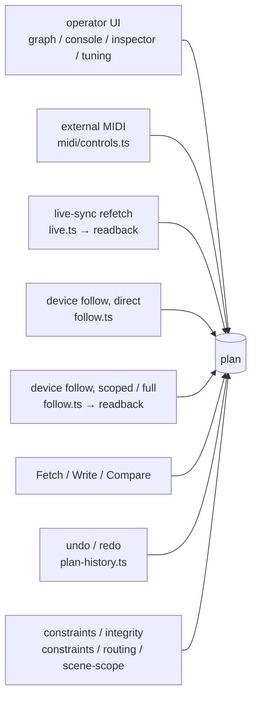

# Live-sync race diagnosis harness

Design for the instrumentation harness that systematically detects the defects where, during Live
sync, an operator's edit is overtaken by a device-originated readback, or is absorbed by a snapshot
re-base and never sent.

## Background — why not fix them one at a time

While Live sync is up, eight independent writers mutate one shared, mutable `plan` object. There is
no per-key ownership, no version stamp, and no record of who wrote last.



Three of those — refetch, follow and Fetch — have hundreds of milliseconds to seconds between the
moment they start reading and the moment they write. `readback.ts` assigns a whole node at a time,
so an operator edit landing mid-read is silently overwritten. When the snapshot is then re-captured,
that edit is not even a diff any more: it never reaches the device.

The same shape is not specific to the EQ 1-knob. It holds equally for the COMP 1-knob, `compEqType`,
the insert-FX selector, MIDI pickup, and every call site of `captureSnapshot`. Fixing them one by one
costs a hardware session each and leaves no proof that the fix holds.

## Stages

| Stage | Content |
| --- | --- |
| 1 | Trace bus + frontend taps + contract test + the `ci.yml` drop guard |
| 2 | Offline analyzer + the invariants |
| T-1 | The fake device, and its own conformance case |
| 4 | Scripted-gesture driver + CI job |
| 5 | Hardware calibration, and a fix per violation the analyzer reports |

Skipping T-1 makes the T0 floor meaningless: the fake must be shown, by its own log, to produce the
latency, notify behavior and refusals it was asked for.

**Stage 3 (Rust-side timestamps and `performance.now()` / `Instant` clock alignment) was dropped.**
No Rust runs anywhere in this harness's path — the fake replaces `window.__TAURI_INTERNALS__` outright,
so a timestamp on `ParamUpdate` / `MeterUpdate` is reachable from no case and read by nothing. Worse,
`ParamUpdate` derives `PartialEq` and that equality is what identifies `BULK_CHANGE`, so a time field
would break the comparison's meaning. Where a real round trip spends its time belongs to the self-test
/ Compare diagnostics, which already measure elapsed time. **Instrumentation only means something when
it has something to measure**, so this stage is dropped rather than deferred.

## Settled decisions

- **Observability**: a `VITE_TRACE=1` build (the same build-flag mechanism as `VITE_DEMO`) produces a
  production-shaped bundle that includes the probe, served only to the instrumented tier. The existing
  production-served E2E suite is untouched, and since the normal build carries no probe the `ci.yml`
  drop guard still holds
- **Implement the Tauri event plugin in the fake** (`transformCallback` + `plugin:event|listen`).
  Without it `dropzone.ts` registers no DOM handlers and `tauri://drag-drop` never arrives, so drag &
  drop is unreachable from both directions and `menu://edit` never fires
- **Clock control is barrier-first**: the fake blocks a specific `vd_get` / `vd_set` on a promise the
  test releases, and the gesture is dispatched from inside the page at that instant. Any case whose
  verdict is a window boundary is only defensible in this form. `page.clock` is used, stepped
  deliberately, for the sub-50 ms windows that are not tied to an IPC
- **Add a WebKit project scoped to three cases**. The precedent is `scripts/meter-bench-run.mjs`
- **The model axis is URX44V and URX22**

## Axes

| Axis | Values |
| --- | --- |
| Gesture shape | single click / continuous drag / key autorepeat / wheel burst / text entry / modal open-close / synthetic pointerdown with no pointerup / multi-step flow |
| Edit phase offset | 0-40 ms / 41-119 ms / 120-170 ms / 171-299 ms / 300±20 ms / 301-899 ms / 900 ms and beyond / 45-55 ms |
| Device latency | 0 / 25 / 100 / 250 ms, deriving a 0.9-2 s node read and a 6-27 s whole-device read |
| Notify behavior | silent / echo only / echo plus genuine / genuine only / burst above the concentration threshold / BULK_CHANGE / unregistered address |
| Concurrent second operator | none / MIDI absolute / MIDI pickup / MIDI toggle with feedback / device panel sweep / undo / file flow |
| Failure injection | none / write rejected / response code 400 / read rejected / accepted and ignored / link loss / device-lost latch / meter failure |
| Writable-address-set shape | stable / bank swap / set shrink / engine rebind / wire-presence dependent / unresolvable hole / scene scope / string path / planExternal |
| Surface state | GRAPH / CONSOLE / CONSOLE hidden / tuning screen / other modal / text field focused / MIDI panel |
| Undo entry state | none open / an entry with no boundary of its own / under a press / under a drag / with a text field focused / applying |
| Model | URX44V / URX22 |

Each phase-offset value sits on the edge of one of these measured constants.

| Constant | Value | Location |
| --- | --- | --- |
| `DEBOUNCE_MS` | 120 ms | `src/core/control/live.ts` |
| `RECONCILE_DEBOUNCE_MS` | 300 ms | `src/core/control/follow.ts` |
| `IDLE_FULL_MS` | 900 ms | `src/core/control/follow.ts` |
| `MAX_CONCENTRATION` | 3 | `src/core/control/follow.ts` |
| `REFLECT_MIN_MS` | 50 ms | `src/main.ts` |
| `IDLE_COMMIT_MS` | 300 ms | `src/ui/history.ts` |
| `RECENT_MS` / `ECHO_MS` | 300 ms | `src/core/midi/engine.ts` |

### Three constants that are easy to read wrong

- `armSettle()` and `armIdle()` are both armed, and the settle reconcile does not cancel the idle
  timer. Every non-echo notify therefore produces both a scoped-or-forced reconcile 300 ms later and
  a **whole-device** reconcile 900 ms later. There is no "scoped only" path in this code
- `REFLECT_MIN_MS` is a leading-edge rate limit, not a 50 ms coalesce delay. With no reflect in the
  previous 50 ms the wait is 0
- `isEcho` has no time window, and the flush writes its snapshot entry **after** the ack. The
  discriminating variable is whether an echo beats its own ack — there is no late echo here, only an
  early one

## Invariants

The analyzer decides these mechanically and reports the record pair that violated each.

| No. | Name | Content |
| --- | --- | --- |
| 1 | Stale-read overwrite | A device-authored write whose read started before a UI write to the same key |
| 2 | Lost edit | A UI write with no matching command emitted before the next snapshot capture |
| 3 | Snapshot poisoning | A capture that recorded a value which was never sent (clause A), or an entry contradicting the last value sent to that address (clause B, the VALUE form — opt-in) |
| 4 | Interval overlap | Two or more of flush / refetch / scoped reconcile / full reconcile / Fetch / Write intersect in time |
| 5 | Echo misclassification | A notify for an address just written with the same value classified as genuine, or the converse |
| 6 | Stimulus reachability | The fake bridge refused a notify the case pushed, so the app never saw it (clause A); an address the plan emits that the session has not registered, so a device-side change to it is undeliverable (clause B, the grown window); behind them, the old registration-lag check as a harness self-check (clause C) |
| 7 | Reflect latency | Plan write to paint exceeded the frame budget |
| 8 | Send ordering | The emitted sequence honours the translate order (a selector precedes its array) |
| 9 | Gesture-entry integrity | One operator gesture yields exactly one undo entry, or provably none |
| 10 | Detached-target write | A write from a handler whose DOM target was replaced or which lost pointer capture |
| 11 | Meter-slot exclusivity | Exactly one live registration; never unsubscribe a stream you do not own |
| 12 | Address-set agreement | The emitted command set and the snapshot key set agree |
| 13 | Authorship attribution | Every write in the ledger resolves to exactly one writer |
| 14 | Orphan-plan write | A write into a `Plan` object `main.ts` no longer references |
| 15 | Refusal integrity | A refusal consumes no state, and the identical retry succeeds once the condition clears |
| 16 | Teardown quiescence | No plan write, IPC or timer callback after session end or plan replacement |

Invariant 3 has two clauses of its own, and the second is **opt-in**. Clause A is the original: the snapshot holds
an address nothing in the run ever sent, so the next diff measures from a value the device was never given. Clause B
is the VALUE form — the address WAS sent and the entry holds something else. That is the shape post-write read
staleness produces: the flush wrote X, a read inside the staleness window answered the pre-write value, and the
`capture` after it put that value in the snapshot over the one the same flush wrote there. Beyond the next diff's
blind spot, it also makes the unit's own notify for X arrive as a foreign change (`live.ts`'s `isEcho` is bare
snapshot equality), costing a scoped reconcile and an idle sweep nobody asked for. Clause B runs only when a case
supplies `deviceState` (`memOf`, read at the same instant as `snapshot`), because it needs two exonerations without
which it is a false-positive machine: a value **the app itself sent** at some point in the run is its own write
coming back in another order, and a value **the unit holds** is the quantise case — `capture()` moves snapshot
entries from every device read, so disagreeing with the last send proves nothing unless it also disagrees with the
unit. No existing case supplies it, so none changed verdict.

Invariant 6 was originally phrased as "the registration agrees with the emitted set on every flush".
It does not: follow calls `subscribe()` only at `begin()` and after a completed reconcile, so an
app-side structural edit deliberately leaves the registration stale. That is designed behavior. Since
the fake gained the bridge's registered-set filter it has two clauses, and the number is kept so the
table, the analyzer and every case that cites it stay aligned:

- **Clause A — stimulus reachability.** A `notify-drop` inside `registrationWindow`: the case pushed a
  notify the bridge refused, so whatever it was meant to provoke never reached the app and any absence
  verdict resting on it holds for free. This is the working subject of the invariant — it fires
  exactly when a case is measuring nothing. A case whose SUBJECT is the refusal (the microSD Track
  Count, the CH → FX tap, a scene-scope drop, a SETUP > GENERAL address) lists those addresses in
  `expectedDrops`, and the clause subtracts them: otherwise the report names the assertion the case
  just made, and "clean" stops meaning clean in exactly the cases the bridge filter created. Judged
  with no `registration` in hand, unlike B and C — a dropped notify is unreachable whether or not the
  case captured a registration, and gating it on one silently lost the check for every case that
  captures none.
- **Clause C — registration lag.** A DELIVERED notify outside the registration snapshot, sentinel
  excluded. After the filter this can no longer be an observation about the app: the only ways to
  reach it are the `BULK_CHANGE` sentinel (excluded, it belongs to no address) or a
  `registrationWindow` scoped to the wrong instant. It is kept as a **harness self-check** on the
  window the case supplied.

- **Clause B — the grown window**. `emitted ∖ registered`: an address the app is actively writing
  whose device-side change the bridge would drop, because `follow.subscribe()` re-posts only at
  `begin()` and after a completed reconcile, so a structural edit leaves the window open until
  something reconciles. The emitted set is read as the **live snapshot's key set** (`snapshot` in the
  spec, from the trace probe) rather than from writes: invariant 12 already computes the write-based
  form, and as a *state* reading it is wrong in both directions — it goes silent once the grow-flush
  leaves the window while the window is still open, and keeps reporting a window a later `capture()`
  has closed. Being a state predicate over two same-instant readings, `registrationWindow` does not
  apply to it and `snapshot` must be passed beside `registration`.

A clean clause B is **not** "the emitted set is inside the registration". It cannot see an address
already in `planToCommands` but not yet flushed (that is invariant 2's subject), a window that has
since closed, the string path (`vd_set_str` — channel names, Sweet Spot Data — which has neither a
snapshot nor a registration entry), `planExternal` params, or anything at all with no session. The
reverse difference is deliberately not judged: `FOLLOW_USB` (848) is appended to the registration by
hand and is in no snapshot, which is the harmless direction.

The `addrs` argument of `vd_params_subscribe` is the registration set, so all of this can be read
mechanically.

Because those three clauses share a number but not a kind of question, every `Finding` carries a
**`class`** — `product` (the app misbehaved), `case` (the case may have measured nothing) or
`harness` (the harness contradicted itself) — and `report()` groups by it before grouping by
invariant number. It defaults to `product`, which every invariant but 6 is; within invariant 6,
clause A is `case`, B is `product` and C is `harness`. The reader answers a different question for
each group: fix the app, fix the case, fix the harness.

## Tiers and cases

Each tier's verdicts are only interpretable given the previous one. A red T1 with a red T0 is a
harness bug, not an app bug.

Per-case steps, fake-device profiles and assertions live in the `e2e/race/t*.spec.ts` files as the
single source of truth. This table states what each case measures.

### T0 baseline — floor and reachability

| id | Surface | What it measures |
| --- | --- | --- |
| `baseline-quiescent-floor` | mixed | That an idle live session produces no plan write and no readback. Every other verdict is a difference against this trace |
| `baseline-single-edit-latency-ladder` | console | One edit at four latencies: the canonical timeline every phase offset is measured against, and how much lateness is the link |
| `baseline-graph-surface-sweep` | graph | That every GRAPH gesture is reachable by the driver's vocabulary, and that gestures which should write nothing really do not |
| `baseline-console-surface-sweep` | console | Every CONSOLE control, exercising the three separate fader-travel encodings back to back at known offsets |
| `baseline-inspector-surface-sweep` | inspector | Every control on every node kind, pinning the "toggles re-render, sliders do not" rule per control |
| `baseline-tuning-surface-sweep` | tuning | GATE / COMP / EQ screens, all three ways of closing, and the reach of the fine grid |
| `baseline-shell-flows-sweep` | mixed | Consent, licenses, load report, rate choice, updater, dropzone, recent files and every Preferences row |
| `baseline-view-locale-churn` | mixed | The only non-device path that forces a full rebuild mid-gesture (language, theme, view switch) |

### T1 overtake — the core stale-read and lost-edit ladders

| id | Surface | What it measures |
| --- | --- | --- |
| `overtake-scoped-readback-vs-edit-ladder` | console | The headline defect in its smallest form, laddered across the read window |
| `overtake-full-reconcile-vs-edit-ladder` | mixed | Whether a multi-second whole-device read accepts edits, undo and a whole plan replacement |
| `overtake-edit-during-flush-send-loop` | console | The flush's own re-entrancy: whether one pending slot collapses several edits |
| `overtake-edit-during-converge-await` | inspector | The frozen-clone counter-example. Red here means the clone was lost |
| `overtake-edit-during-refetch-await` | tuning | An edit absorbed by a snapshot taken from the live plan. The difference from the counter-example locates the defect |
| `overtake-converge-and-refetch-one-flush` | mixed | Two repairs on one flush, the weaker one running last |
| `overtake-converge-latch-starvation` | console | A liveness defect: whether sustained editing stops reaching the device entirely |
| `overtake-notify-echo-vs-genuine-during-flush` | console | Phase and address held fixed while only the message's truth varies |
| `overtake-direct-notify-ahead-of-the-send-loop` | console | A device-side change on an address the frozen command list has not reached yet |
| `overtake-reconcile-during-reconcile` | mixed | The reconcile queue's own re-entrancy, with no operator involved |
| `overtake-direct-scoped-coalesce-boundary` | console | Whether a reconcile resolving inside the coalesce upgrades an unrelated direct reflect |
| `overtake-drag-flush-backpressure` | console | A realistic gesture on a realistic link, and the convergence latency an operator perceives |
| `overtake-refetch-reads-before-the-write-settles` | tuning | The one window the fake had no state for: a write the unit accepted and cannot yet report. `t1c-refetch-stale.spec.ts` |

### T2 shape-change — params that reshape the writable address set

| id | Surface | What it measures |
| --- | --- | --- |
| `shape-comp-eq-type-bank-swap` | inspector | The only param that changes address identity and value polarity at once |
| `shape-eq-oneknob-registration-blindspot` | tuning | The boolean that triggers a recomputation is the one that removes its notify addresses — the canonical dropped window |
| `shape-eq-oneknob-level-refetch-storm` | tuning | A readback per flush window during a drag, rebasing the history throughout |
| `shape-insert-fx-select-ordering` | inspector | The only case where correctness depends on the order of two commands, not their values |
| `shape-insert-fx-engine-array-collision` | inspector | Two plan owners sharing one device address |
| `shape-fx-effect-type-slot-family` | inspector | The slot set varies rather than the param id, and undo is incomplete by construction |
| `shape-signal-type-pair-link` | inspector | The only param whose write resets an entire other node on the device |
| `shape-pan-bal-mode-switch` | inspector | The device rewrites values on other connections, so the undo is itself a stale write |
| `shape-bus-type-and-pan-link-locks` | mixed | A write on node A changes the observable state of controls on B and C without writing them |
| `shape-sdrec-track-count-readonly` | mixed | The param the app reads and never writes — and whose device-side change never arrives |
| `shape-sample-rate-and-follow-usb` | mixed | The only scalar always first in the write set that the device can revert on its own |
| `shape-scene-write-scope` | mixed | A non-plan setting reshaping the write diff, the snapshot and the registration at one chokepoint — and blinding follow to the addresses it drops |
| `shape-routing-wire-selectors` | graph | The deliberate NONE sentinel and the accidental hole that says nothing, side by side |
| `shape-send-emission-wire-presence` | console | The most ordinary operator gesture that reshapes the address set without looking like a mode switch; the read-only FX tap is unfollowable |
| `shape-refused-and-acked-writes` | mixed | All three refusal shapes, and whether an unclosable diff forms a flush loop |
| `shape-string-path-writes` | mixed | The writes that bypass the diff engine entirely, benign case beside consequential one; a device-side rename is now delivered and Sweet Spot Data still is not |
| `shape-device-setup-plan-external` | mixed | The params never emitted, read back or registered — so never delivered — and the one intercept hook |
| `shape-insert-fx-rate-and-slot-availability` | inspector | A constraint expressed as data rather than as an emit gate, and cross-node contention |

### T3 undo — boundaries, chords, refusals, rebase and reset

| id | Surface | What it measures |
| --- | --- | --- |
| `undo-pointer-boundary-ladder` | console | Deferred commit, pending landing and drag collapse, straddling the macrotask |
| `undo-drag-latch-and-orphan-press` | mixed | A synthetic pointerdown with no pointerup suppressing the idle backstop indefinitely |
| `undo-keyup-autorepeat-boundary` | console | Stepping keys are boundaries and character keys are not, in one run |
| `undo-focusout-text-boundary` | graph | The only shape where the idle interval is deliberately exceeded without wanting a commit |
| `undo-idle-backstop-wheel-ladder` | inspector | The only gesture with no DOM boundary of its own, laddered across the constant that defines it |
| `undo-window-blur-mid-drag` | console | The only path where a gesture ends with no pointer event |
| `undo-diff-at-commit-post-mutations` | inspector | The four sites where the funnel mutates the plan after `markChanged` |
| `undo-empty-diff-and-redo-stack` | graph | The stack's own arithmetic (an empty diff, redo invalidation, cap eviction) and the transition-only depth reporting |
| `undo-chord-ownership-matrix` | history | Seven focus targets by eight chord shapes: who owns a keystroke |
| `undo-refusal-ladder` | history | Refusal order and non-consumption, including the deliberately permissive conditions |
| `undo-apply-sequence-hidden-and-viewport` | graph | The order inside the apply, and that an undo's write reaches the device |
| `undo-during-device-activity-ladder` | history | Five device activities by five offsets: whether the gates are per-flow or per-link |
| `undo-entry-survives-device-sweep` | history | That an app edit made while the device is being touched is still one entry, and still has the entry before it beneath |
| `undo-reset-paths-and-pending-commit` | history | All seven reset paths and the two races that outlive a reset |
| `undo-macos-edit-menu-path` | history | The only native surface, and the only path whose refusal ordering differs from the chord's |

### T4 midi — the second operator with no gate

| id | Surface | What it measures |
| --- | --- | --- |
| `midi-vs-main-fader-absolute` | midi | A MIDI reflect replacing a strip under an active pointer capture |
| `midi-vs-send-fader-relative-baseline` | midi | A relative drag erasing a MIDI write by arithmetic rather than overwriting it |
| `midi-pickup-without-output-port` | midi | Pickup never disengaging when no output port is open |
| `midi-toggle-echo-window-ladder` | midi | A one-shot guard that cannot tell a genuine press from a loopback |
| `midi-continuous-echo-reaches-the-unit` | midi | The same guard on a fader, where an unguarded echo is a device write |
| `midi-gang-fanout-and-head-reelection` | midi | The only many-to-one writer, and an unrelated edit reassigning ownership |
| `midi-learn-arm-during-rerender` | midi | The only case where the second operator's configuration races the device |
| `midi-write-during-refetch-snapshot` | midi | An ungated writer combined with a snapshot re-base |
| `midi-rebase-eats-ui-entry-ladder` | midi | The only writer classified two contradictory ways at once |
| `midi-14bit-pair-and-cross-binding` | midi | Message-level decoding, including a binding that can never fire |
| `midi-bal-mirror-clobbers-partner` | midi | The only collision between two app-side writers, mediated by a mirror |

### T5 drop — failure injection

| id | Surface | What it measures |
| --- | --- | --- |
| `drop-link-loss-mid-flush-ladder` | mixed | How many writes escape after the session is declared down |
| `drop-link-loss-mid-reconcile` | mixed | A half-read plan reflected as authoritative, with the history reset against it |
| `drop-write-reject-mid-send` | mixed | Whether the retry is built from a fresh diff and ordering survives an abort |
| `drop-read-reject-mid-fetch` | mixed | The only path producing a plan object with a live writer still attached to its predecessor |
| `drop-device-lost-latch` | mixed | The one disconnection shape that does not arrive as a link event, learned only by attrition |
| `drop-bulk-change-sentinel-mid-drag` | console | The largest device-side event landing on the smallest app state |
| `drop-unknown-address-notify-storm` | mixed | Three arms: unresolvable (the dropped window), resolvable, unregistered (refused) |
| `drop-missed-notify-idle-net` | console | Whether the safety net has the same trigger as the thing it protects against |
| `drop-concentration-threshold` | mixed | The only integer threshold in the follow layer, straddled exactly |

### T6 teardown — session and plan lifetime

| id | Surface | What it measures |
| --- | --- | --- |
| `teardown-plan-replacement-during-reconcile` | mixed | The guard that protects Fetch not protecting the identical read when follow starts it |
| `teardown-model-switch-during-flush` | mixed | The address vocabulary itself changing under an in-flight operation |
| `teardown-live-toggle-race` | mixed | The session lifecycle itself, and the only place the epoch guard is falsifiable |
| `teardown-deactivate-with-armed-timers` | mixed | Whether module-level latches are session-scoped |
| `teardown-dyn-screen-close-during-refresh` | tuning | A deferral mechanism added to protect drags becoming the hazard |
| `teardown-flow-refusals` | mixed | The guarded and unguarded readbacks contrasted with the same flows (File > New, File > Open; the model switch only in the guarded half, which has no live session to lock the picker) |

### T7 meter — the single process-wide subscription

| id | Surface | What it measures |
| --- | --- | --- |
| `meter-slot-handover` | mixed | The handover baseline the two failure cases are differenced against |
| `meter-late-unsub-kills-console` | mixed | A stale unsub from a closed screen tearing down the console's new stream |
| `meter-rescope-inside-subpending-ladder` | console | A re-scope arriving inside a pending registration being dropped entirely |
| `meter-tap-change-resubscribe` | console | One strip's tap change silencing every strip, and the model-id resolution |
| `meter-feed-paint-vs-follow-churn` | console | The only case measuring cost rather than correctness |
| `meter-error-ends-session` | mixed | The difference between a reported failure and a silent one |

### T8 stress — convergence, fuzz, jitter, leaks

| id | Surface | What it measures |
| --- | --- | --- |
| `stress-three-operators-one-node` | mixed | Whether operator, MIDI and device panel driving one channel converge at all |
| `stress-seeded-schedule-fuzz` | mixed | Three-way interleavings nobody hypothesised, reproducible from the seed |
| `stress-latency-jitter-storm` | console | Jitter spreads when the answers arrive; the fixed-latency comparison separates spread from queue depth |
| `stress-long-session-quiescence` | mixed | State that survives an operation rather than state produced by one |

### Differential design

Many cases are the same gesture laddered across phase offsets, or A/B pairs with one variable
changed. **A detection in a non-differential case is a lead, not a finding**, until it reproduces in
a ladder.

The main pairs are converge-await against refetch-await, scene scope against full scope, sweep on
against off, MIDI output port open against closed, churn on against off, jitter against fixed,
registered against unregistered notify, CONSOLE visible against hidden, and guarded Fetch against
unguarded reconcile.

## The fake device's contract

The current E2E stub resolves on the next microtask, so none of the windows above exists. The fake
must provide the following.

| Item | Requirement |
| --- | --- |
| a | Per-param configurable latency with optional jitter |
| b | A real state map so a readback returns what was written — immediately, unless `staleAfterWrite` (row n) scripts otherwise — plus a divergence hook that answers X regardless |
| c | A notify scheduler emitting echo, genuine, unregistered-address, BULK_CHANGE and silence at scripted times relative to an accepted write |
| d | Refusal injection by command index and param id, distinguishing transport rejection, response code 400 and accepted-and-ignored |
| e | A device-lost latch, after which every command fails identically |
| f | Link-loss events on demand |
| g | Meter and param channels with independently controllable subscribe latency and subscribe/unsubscribe counters |
| h | An epoch incremented per connect, honoured by disconnect |
| i | A MIDI bridge with scripted input bursts and a captured output byte log |
| j | `menu://edit` emission and edit-menu state/label counters |
| k | `transformCallback` and `plugin:event|listen` |
| l | The bridge's notify filter: a param notify is forwarded only while a subscription is installed and only for an address this session registered, plus the `BULK_CHANGE` sentinel — mirroring `Subs::absorb`, per ENTRY inside a batch |
| m | The same filter on the meter half: a reading is forwarded only while the meter channel is installed and only for a `(meter_id, x)` this session registered — no sentinel, since every reading carries an address |
| n | Post-write read staleness: `staleAfterWrite[addr] = n` makes the next `n` reads after EACH write to that address answer the value it held BEFORE that write, while `mem` stays truthful — the unit ACCEPTED the write and cannot yet report it. Numeric path only. What ENDS the window is not this setting's business: every value-changing write is announced (see below), and that announcement closes any window open on the address whether its scripted reads were spent or not |
| o | The announcement itself, which is unconditional and needs no case to arm it: a write that CHANGES the value the unit reports is announced `cfg.announceMs` (100, the measured median) after its **ack**. Three silences, all from the one rule — a same-value write (measured: 18 acked in 0-1 ms, none announced), an `ignoreWrites` address (acked and never stored, so nothing it reports moved) and a `diverge`d address (the unit goes on asserting what it already held) |

| p | The same window on the NAME path: `staleAfterWrite` applies to a string address too, so the next `n` reads of it after a `vd_set_str` answer the name it replaced. Measured on a URX44V — 81 ms, so the string path is not exempt and the fake modelled it as exempt for its whole life. **The announcement follows item o's rule too, and both halves of it are measured on this path rather than carried over**: a name write that changes the reported name is announced `announceMs` after its ack and closes the window (32 writes over two runs announced after their own ack, 32/32, at ack+1-102 ms — most of them 66-102, with 2 of the 32 under 10 ms, a low tail the numeric spread does not have and whose cause is not identified), and a same-value name write announces nothing (acked in 0 ms, silent for 2000 ms, bracketed by a changing write on each side so a dead stream could not pass for a silent device). The app hears it, because name addresses joined the registration set when the follow learned to carry a device-side rename; an address that did not — Sweet Spot Data (param 91) — is still dropped at the bridge. `t1d-name-window` is the case that needed the window |
Plus a **barrier**: `blockAt({ cmd, nth })` holds a specific command, and `release()` lets it through.

Items n, o and p are the ones the fake lived **without** for its whole life, and the omission was not neutral — see
"What the harness itself got wrong". WHICH reads are stale is a **count**, not a duration, for the reason the
barriers exist: a duration makes every verdict a property of CI load. Staleness is distinct from both its
neighbours — `divergeAt` says the unit holds a value the app never wrote and never agrees; `ignoreWrites` says the
write was acked and never stored, so it arms nothing; staleness says the unit agrees a moment later, and every
repair path in the app is built on reading again.

Item o is a **contract, not a knob**, and two things about it are load-bearing. The fake **owes** the announcement:
a device that accepts a value-changing write and never announces it is not a device any URX measurement describes,
so an app that waits for the announcement before re-reading would otherwise be failed here for the fake's own
contradiction. And it is anchored on the **ack**, not on the queue point — which is not a detail. Under a slow-link
profile a queue-point announcement is delivered before the app has even been told its write succeeded, an ordering
the unit never presents (acks land in 0-1 ms and the notify 9-204 ms after the write's issue, always after the ack).
T8-stress found this by going red and staying red through the fix; anchored on the ack it passes, with numbers
matching main's arm exactly. The `announceMs` **default** stays BELOW live.ts's 120 ms flush window so the ordinary
cases are not all measuring one thing: above it, an announcement is overtaken by the next write of a drag and
arrives against a snapshot that has moved on. That overtake is a real device behaviour rather than an artefact of
the fake — the measured ack+58-151 ms crosses 120 — and what used to happen next was the app's fault, not the
announcement's: the echo test compared one value against the snapshot, so an overtaken announcement read as a
device-side change, wrote a superseded value back into the plan, and the idle reconcile that followed wiped every
undo entry. `live.ts` now keeps the writes it has been acked for but not yet seen announced, and the case that
deliberately raises `announceMs` above 120 is `late echo of an overtaken write` in `t3-undo.spec.ts`.

**Coercion is deliberately not modelled at all.** `diverge` bends READS and leaves `mem` alone, so nothing the unit
reports has moved and there is nothing for it to announce; making it announce its asserted value instead would be a
notify carrying a value the app never sent, which to the app is a DEVICE-SIDE CHANGE rather than a coercion, and it
would silently change what `divergeAt` means in the dozen spec files already using it. Whether the unit ever coerces
a write, or acks and silently discards one, is unmeasured — never observed across three instrumented hardware
sessions — and it is not known whether it CAN be measured. So this is not a knob waiting on a measurement that
would settle it: one gets added if and when such a device behaviour is actually seen, and not before.

**Why the filter has to exist at all was measured, not assumed (2026-07-31).** A client that connects
to the broker and registers NOTHING still receives the whole push stream — meter frames and the
free-running RTC fields (`789`-`794`) arrived on a connection with no subscription of any kind. The
broker broadcasts; `Subs::absorb` is the only thing standing between that stream and the app, which is
why a fake that forwards unconditionally measures a device nobody ships.

On (l): `vd_params_subscribe` replaces the registered set wholesale and `vd_params_unsubscribe` drops
the channel, which is the load-bearing half of the Rust `param_ch = None`. It deliberately does NOT
clear `paramAddrs`, unlike `param_addrs.clear()` on the Rust side: that field is the harness's
"addresses the app **last** registered" observable, read by ~80 spec sites after a session ends. The
driver helpers are `pushNotify` (returns one verdict per entry — `""` delivered, the reason refused),
**`pushNotifyDelivered`** (pushes and throws naming any refused address — what a case whose subject is
the app's RESPONSE must use), **`pushBulkChange`** (the sanctioned way to force one whole-device
reconcile) and **`notifyDropsOf`** (for a case whose subject IS the refusal).

**`pushNameNotify`** is the string-path member of that family — a rename made on the unit's own LCD,
which carries its text in `value_str` and a numeric `value` of 0. It returns the same per-entry verdict,
and it **stores the name before announcing it**: announcing without storing would be a device that
reports a value it does not hold, so its own next read would contradict its notify. It shares one
emitter with the announcement a name WRITE produces (item p), so a scripted rename and the unit's own
cannot describe different devices. There is no string-path counterpart to `divergeAt` — the one that
existed was removed once its last caller moved to `pushNameNotify`, since an unexercised knob is a
claim about the device that nothing keeps true.

Both subscriptions are installed **at the queue point**, like every other value the fake settles there,
and for the same reason: `vd.rs`'s `ParamsSubscribe` / `MetersSubscribe` arms only *send* registrations
(`reg_param` / `reg_meter` are fire-and-forget — the reply is drained later by `pump`), so the handler
performs no socket read and `absorb` cannot run inside it. A notify arriving while a registration is in
flight is therefore judged afterwards, by the NEW set and through the NEW channel. Installing at the
resolve instead would judge it by the old set and deliver it to the old channel — wrong in both
directions, and reachable through a barrier on the subscribe or a scripted `subscribe` latency. The
install also sits ahead of the refusal and device-lost branches, because the Rust assignments run after
the registration loop whatever it returned and the failure travels back through `reply` alone: a refused
subscribe still replaces the subscription rather than leaving the previous one installed.

The other channel-dropping path is the **connection generation**. `vd_connect` and an epoch-matching
`vd_disconnect` both run a teardown that drops both channels and both registered sets, mirroring the
whole `Subs` going away with the worker on `Cmd::Shutdown` (and `install()` shutting the prior worker
down). Without it the fake's gate would be "the app called unsubscribe" where the bridge's is "the
worker is alive" — and the app's unsubscribe is fire-and-forget, so the two differ by a real window.
The two address sets survive the teardown, for the reason (l) gives above.

On (m): the same three shapes, one layer down. `vd_meters_subscribe` replaces the registered set
wholesale and `vd_meters_unsubscribe` drops the channel (`meter_ch = None` on the Rust side), while
`meterAddrs` is deliberately left standing for the same reason `paramAddrs` is. The helpers are
`pushMeters` (per-frame verdicts), **`pushMetersDelivered`** (throws at the push naming the refused
address — what a case whose subject is the READOUT must use, since a refused frame is
indistinguishable from a bar that was simply not repainted) and **`meterDropsOf`**. Only the refused
frames are traced, as their own `meter-drop` kind: a real feed is continuous, one record per reading
would bury the trace, and a separate kind keeps meter traffic out of invariant 6, which decides
param-notify reachability. Before this the meter half was unfiltered and each spec pre-filtered its
own pushes, so a frame the shipped app could never receive left nothing behind — the exact defect
class (l) had already fixed on the param side.

## Driver conventions

- Where a value is the point, prefer focus plus key stepping over a synthetic drag. It is the most
  robust path, and one press equals one undo entry
- The wire-selection trick (a dispatched pointerdown with no pointerup) must be used deliberately and
  its effect on press state recorded in the trace: it silently suppresses the idle backstop
- Every step records **both the intended and the achieved offset**. A ladder is only interpretable
  with the achieved values beside the intended ones — and a rung is placed against the achieved
  figure, never the intended one. The driver's own cost between the sleep and the mark (clicks,
  locator resolutions) is added to every rung and is **one-directional**: it only ever pushes a
  gesture LATER, so a rung placed after a window's edge is robust and one placed before it is what a
  slow runner takes away
- **The measured interval has to be the DECIDING one, and the two are easy to confuse.** A gesture
  that arms an app-side window is measured from the arming instant, not from the first step after it:
  `t1b`'s starvation stream sampled its gaps from the first tick (`at.slice(1)`), so its
  `maxGap < DEBOUNCE_MS` guard covered every interval except the click-to-first-tick one the verdict
  actually turned on — 22-30 ms of slack, and a CI runner took it. The same shape reaches further than
  one case: a repeat COUNT stands in for the interval between repeats, a `mark()` placed before a
  driver action rather than before an assertion measures the action's own cost into the next rung, and
  a phase sampled just before delivering a message is a LOWER bound on the phase the app applies —
  bracket it either side of the delivery and place a rung inside a window against the far end. Where a
  gesture and the edit that must share its window are separated by driver round trips, dispatch them
  in ONE in-page task instead of hoping they land together

## Implementation and running

Implemented under `e2e/race/`. The harness is its own pair of Playwright projects — `race` in
Chromium and `race-webkit` for the `@webkit`-tagged cases — both served a **trace build** from one
server on port 4174. The ordinary E2E suite stays the `chromium` project, unchanged and at its
former cost.

| File | Role |
| --- | --- |
| `fake-device.ts` | the fake, its barrier, the trace, the MIDI bridge, the event plugin |
| `analyze.ts` | invariants 1 / 2 / 3 / 4 / 6 / 8 / 12 / 13 / 16 and timeline rendering |
| `t0`–`t8` plus `t0b`–`tzb` | the cases, by tier |
| `t2c`–`t2f` | T2's remaining eight cases (the shape-changing params filled in later) |
| `t9-probe.spec.ts` | the probe's own contract, and invariants 13 and 3 |

**Every case in the tier tables above is present in a spec**, matched by id — `grep -rF <id> e2e/race`
answers it for one, and the ids are the census. What is not *driven* is a handful of permanently
skipped sub-arms, each carrying its reason beside it: a fixed connection the UI cannot delete; no
observable that separates the two branches; making the fake claim an `--experimental` launch mode would
measure the harness rather than the app; and so on. **Their census is `pnpm check:skips`, not a grep** —
it reads what Playwright collects, so a `test.fixme` counts as one and a case in a file a pattern misses
cannot hide, and it fails unless every one is registered in `e2e/race/skip-ledger.json` against the test
that keeps its reason true or an explicit statement that nothing does.

```sh
pnpm test:e2e:app                # the ordinary suite (--project=chromium; race is testIgnore'd out)
pnpm test:e2e:race               # the harness
pnpm test:e2e:race --shard=1/3   # split
pnpm test:e2e:race:webkit        # the cases that run in WebKit (@webkit)
```

**No `--` before a forwarded flag.** pnpm 10 passes the separator through to the script rather than
consuming it, and Playwright reads everything after a `--` as a positional file filter — so
`pnpm test:e2e:race -- --shard=1/3` runs the WHOLE harness in every shard and still passes, at three
times the cost, silently.

The `race` project raises the per-test timeout to **120 s** and drops to **one** CI retry. The longest
case measured 60 s on a two-worker CI runner — a barrier held across a converge round of ~800
sequential reads — so at the 30 s default a passing case turns into a timeout that reads like a defect.
Twice that worst case rather than three times it, because the handful needing more say so themselves
(`test.setTimeout` in `tzb-tail` and `t8-stress`), and a project figure wide enough to cover them would
let every other case burn three minutes before reporting, once per retry. One retry rather than the
suite's two for the matching reason: every pin here is placed on a barrier rather than on a delay, so a
case that only passes on the third attempt is not a pin holding — it is a flake, and at two retries it
stays hidden long enough to reach main.

**`race-webkit`** runs the same harness in the engine the macOS build actually renders in, scoped to the
**three cases whose verdict is about the engine rather than the app's logic**: a strip rack rebuilt under
a live pointer capture, a whole-view rebuild under one, and the chord × focus-target matrix (WebKit owns a
text field's own undo, and the app deliberately does not `preventDefault`). Anything else would only
re-measure logic Chromium already covers, at minutes a run. Same precedent as
`scripts/meter-bench-run.mjs`, which benches in WebKit for the same reason. Cases are selected by the
**`@webkit` tag** rather than by path, so one cannot drift out of the set by being moved between files.

| Condition | Wall clock |
| --- | --- |
| The race tiers at `--workers=4` | ~6 min (162 cases; measured on Apple silicon, isolated) |
| The heaviest file (T2) alone | ~2.5 min |

This table is **the only place the harness's wall clock is stated**: `CLAUDE.md` points here rather
than repeating a second figure that drifts out of step with this one.

The slow cases are the ones that deliberately provoke several whole-device readbacks (~800 sequential
reads each) — the cost of what is being measured, not overhead. Split with `--shard=1/3`, per file, or
`--grep`. **Do not chain whole-suite runs in one command.**

**One of those skips is unreachable rather than undriven**: the unresolvable-source hole in
`shape-routing-wire-selectors`. `sourcePorts()` returns null only for a node `models/build.ts` does
not admit as a selector source, and authoring one into a plan does not reach it either — `validatePlan`
rejects the wire before adoption, so what would be measured is the load report, not the selector.

### Where each tier runs

The project boundary is also the CI tiering, and these are the numbers that cut it there. **Measured
2026-08-11 on `d85af81`**, from the logs of one `ci.yml` run and one on-demand `race.yml` run — two
workers per job, `ubuntu-latest`, inside the Playwright container. Machine time is the sum of the
per-test durations the reporter prints, so it is the work rather than the wall clock the shards divide
it into:

| Tier | Machine time | Slowest test | Runs from |
| --- | --- | --- | --- |
| `chromium` — the ordinary suite | 6.5 min | 5.8 s | `ci.yml`, sharded three ways, on every PR and push to main except Markdown/docs-only ones (the generated `model-*.md` aside) |
| `race` — the harness | 24.6 min | 60 s | `race.yml`, sharded three ways |
| `race-webkit` | 2.1 min | 48 s | `race.yml`, its own job |

**Read the ordinary tier's figure as a range rather than a budget.** The same 428 cases measured 5.2
minutes in another run the same day, a fifth under the reading above — runner variance, not a change in
the suite. The harness is steadier (12.5 against 12.3 minutes for shard 1 across two runs), which is
what lets the comparison between the tiers survive noise neither figure is free of. The ordinary tier is
also measured **as CI runs it**: since the coverage upload landed that means `pnpm test:e2e:coverage`, an
unminified bundle and a native V8 collector, and that overhead is part of what a per-PR run costs.

Case counts are deliberately not a column here. They move with every pull request that adds a test —
the ordinary tier's had drifted 45 cases past what this table claimed before anyone noticed — and
nothing about the tiering follows from them. What cut the boundary is the time.

The harness is **about four fifths of the E2E machine time on its own** (79% of the ordinary-plus-race
readings above), which is what took it off the ordinary PR tier: at six and a half minutes the ordinary
suite is cheaper to run per-PR than to run after the merge, and at twenty-five it is not. Both figures
have grown since the tiering was cut and the ratio has barely moved, which is the part the boundary
actually rests on.

Where it runs instead is **the one pull request that changes the app version**. That PR carries nothing
else, and merging it is what tags a release (`tag-release.yml`), so the harness sits directly in front
of the only commit a user ever installs. In front of the tag rather than behind it: a release-time run
would report on a tag that already exists. A `paths: package.json` filter would not have said "version
bump" either — Dependabot edits that file weekly — so `race.yml`'s `detect` job compares the `version`
field across the PR and the shards run only when it moved.

`race.yml` carries **no trigger filter at all**, so `detect` runs on every pull request. That is what
makes `race-required` usable as a merge condition: a workflow skipped by a trigger filter reports no
check run, so the version-bump PR could never wait for a check the other pull requests do not even
have. Away from that one PR the two harness jobs skip on their own condition, which reports success in
seconds — the arrangement, and why a required check has to be able to report on every pull request, is
in CLAUDE.md's "What a merge waits for".

Against a branch, on demand — **available, not required**, for pulling the verdict forward before a
version PR exists:

```sh
gh workflow run race.yml --ref <branch>
```

The bargain that buys: **no pull request is obliged to run the harness**, and an ordinary merge does
not, so a break surfaces at the version PR or at whatever manual run someone chose to make, rather
than at the merge that caused it, and `git log` over the live-sync
surface is what narrows it. Every pull request does wait for `race-required`, but away from the
version PR that is a gate over **two** skipped jobs, green in seconds: `detect` runs, and `race` and
`race-webkit` skip on their own condition — **a matrix job whose own `if:` is false is not expanded**,
so `race` reports once rather than three times. What the merge condition buys is that the release
cannot be tagged over a red harness, not that every branch pays for one. WebKit is a separate browser download, so it is its own job rather than a
fourth shard — paying for it three times would cost more than the cases do.

### Observables

Invariants 1 / 2 / 4 / 8 / 12 / 16 are statements about IPC that either happened or did not, so they
are decided entirely by what the fake device saw, plus the DOM and the status line. None of them needs
to reach the app's module scope.

The remaining two — 13 (authorship attribution) and the general form of 3 (snapshot poisoning) — need
the probe. `src/ui/trace-probe.ts` exists only in the `VITE_TRACE=1` build (`.env.trace`,
`vite build --mode trace`). **A plain build folds it away, and `ci.yml` greps the bundle to keep it
out**, beside `__urxConsole` and `__urxKeyProbe`. It is a build flag rather than
`import.meta.env.DEV` because the E2E suite serves a production build on purpose; running the
instrumented tier on a dev bundle would be testing a different bundle.

| Question | Helper |
| --- | --- |
| Which plan key did **who** write (13) | `ledgerOf(page)` |
| What does the live snapshot **hold** (3) | `snapshotOf(page)` |
| Committed undo / redo depth | `depthOf(page)` |

The ledger reuses the differ the undo stack already uses (`clonePlanState` + `diffPlans`). A key that
reaches the plan without reaching that differ is an edit the user cannot undo, so the ledger and the
undo entries cannot disagree about what a gesture touched. Writers name themselves through
`markChanged(source)` / `planReadFromDevice(source)` and the three device-follow paths, undo and load.

**The eighth writer has no `WriteSource` of its own, deliberately.** Constraints / integrity never
writes on a schedule of its own: `constraints.ts` only reads, `routing.ts`'s mirrors
(`mirrorBalPair` / `applyPairTransition` / `mirrorLinkedInsertFx`) run inside the UI and MIDI funnels
before their `markChanged(source)`, and `scene-scope.ts`'s `applySceneExternal` runs at two sites that
are both *outside* the shared plan — into the readback's private clone in `applyDeviceStateScoped`,
and into the incoming document in `loadFromText` before `loadPlan` installs it. Both reach the plan
only through the merge or the replacement that follows, so a sample stamped at either site would diff
a plan those writes have not touched yet. Its keys are therefore attributed to the funnel they ride
in — `ui` / `midi` for a mirror, `load` for a scene-scoped file, and the device-read source
(`device-action` / `follow-full` / `refetch`) for a kept scene-external value — and invariant 13 names
that funnel. A case pairing it with another writer would be measuring the funnel, not this writer.

Invariant 13 can never appear in the IPC log: **the losing write never becomes a command.**

```
[13] connParams[ch1:out bus.stereo:in].level was written by {ui, follow-scoped}
     between 462 and 2810 ms; the last writer was "follow-scoped"
```

## Confirmed findings

The floor being clean is what makes everything below something other than harness noise.

**T0 — the floor**: four seconds of an idle live session cost **zero** device commands and fire nothing.
One fader detent at 0 / 25 / 100 / 250 ms latency produces exactly one write each, plan and device in
agreement, zero findings.

**T1 — overtake**

- **A scoped reconcile overtook an edit — fixed.** The read is issued before the gesture (444 ms), the
  edit lands (451 ms), the write reaches the device (586 ms) — and the held read resolved with the
  pre-edit value, so when the reconcile landed (3327 ms) **the screen went back**. The whole-device
  sweep ~20 s later repaired it, but only because the earlier write had already landed. **The damage
  was not a lost value: the plan asserted a value the device did not hold.** A read now runs against a
  private copy and merges back, so the operator's value stands the moment the reconcile reports itself
  done (`justAfter=+0.4`, where it used to revert to `0.0`)
- **An edit during a converge await survives** (the counter-example), which is what established that
  the refetch loss was not a consequence of a long await
- **Converge-latch starvation**: with a converge param still in the diff and edits closer together
  than 120 ms, **not one command leaves the app for five seconds**. Nothing is lost, but the unit plays
  the old value for the whole gesture
- **Echo versus ack**: a broker that echoes faster than it acks makes the app apply its own write as a
  device-side change and escalate to a whole-device readback — several hundred reads per echoed write
- **A flush wrote a device-authored value back at the device — fixed.** With the send loop held at CH 1's
  fader and a pan notify delivered while it was held, the loop reached CH 1's pan — one command behind —
  and sent the **pre-notify** value: the device was left holding `0` after reporting `24`, and the idle
  sweep then pulled that `0` back into the plan, so the move made on the unit was reverted end to end.
  The same defect is what `stress-three-operators-one-node` had been counting without being able to
  assert: **0 / 2 / 3 / 3 write-backs across four runs of one case**, all on pan, now 0 in four

**T2 — address-set shape**

- **The EQ 1-Knob blind spot**, isolated with a single-notify differential: one notify on a band
  address that left the set costs **two** whole-device reconciles, one on an address still in the set
  costs **one**. Neither can trip the concentration threshold. The registration is still 796 after the
  ON flush and drops to 778 only after the first reconcile — exactly the 18 band addresses. **The
  four-notify burst is confounded with the concentration cliff and discriminates nothing**
- **1-Knob OFF writes all 18 band addresses to addresses the app is not registered for**
- **The COMP/EQ bank swap** writes two new-bank addresses that are not yet registered; a notify on the
  abandoned bank costs two reconciles against one on the live bank
- **Signal Type = STEREO** writes both pair indices and **re-authors the partner node wholesale**; one
  undo restores all of it. But the converge round is a **re-send, not a repair** — it keeps pushing the
  app's value back at a channel the unit has reset
- **Insert-FX ordering is clean** (selector 135 before bypass 134) — it works as the counter-example

**T3 — undo**

- **A dispatched pointerdown with no pointerup** (the standard e2e wire-selection trick) leaves the
  press "down" for ever and suppresses the 300 ms idle backstop: **two wheel bursts 1.2 s apart collapse
  into one entry**, where the control arm produces two (achieved gaps 121 ms)
- **An edit made while the device was being touched was silently un-undoable — fixed.** Every
  direct-follow notify ran `planHistory.rebase()`, which drops the open entry and cancels the 300 ms
  idle backstop, so a wheel edit landing between two notifies recorded nothing and the Ctrl+Z spent the
  entry beneath it — the fader jumped *past* the value the operator was returning to. The direct path
  now absorbs the keys the notify authored; measured after the fix at Δ = 5 / 40 / 95 ms inside the
  100 ms notify interval, the edit undoes to where the press found it and the pre-sweep entry is still
  beneath it
- An undo fired inside a held reconcile is applied, and the reconcile then wipes both stacks
- The apply order is correct: the persisted mirror moves before any repaint, the viewport is untouched,
  and `markChanged` runs last

**T4 — MIDI**

- **MIDI is not gated at all during a held read** — not by the device-read latch, the file-flow latch,
  a modal or a drag — and its write is then absorbed by the snapshot
- **A MIDI-driven strip rebuild replaced the strip under an active pointer capture, and screen and
  device then disagreed for good — fixed** (fix 11). The rebuild still happens; the gesture now ends
  with its element instead of writing on from outside the document
- **The BAL mirror** deep-clones the whole source node onto its partner on every applied message,
  destroying an unrelated UI edit made moments earlier
- A relative drag recomputes an absolute value from a baseline frozen at pointerdown, so a MIDI write
  mid-drag would be **erased by arithmetic** rather than overwritten. The arithmetic is still there and
  is no longer reachable (fix 11): the move that would do the erasing is never made

**T5 — failure injection**

- **Writes escaped the teardown** at every position in the send loop, the count falling as the drop
  landed later — **fixed** (fix 10). Nothing escapes at any rung now; the command already on the wire
  completes, which is why the boundary is the teardown mark rather than the drop
- A rejected write **aborts on the first rejection** — the rule holds
- **The concentration cliff**: four pairs in one window escalate to a whole-device read; three stay scoped
- **Five notifies on addresses that no longer RESOLVE cost a whole-device read that five registered ones
  do not; five on addresses that were never REGISTERED cost nothing at all**

**T6 / tzb — teardown**

- **File > New during a follow reconcile is not refused** (`reconcileAll` does not raise the
  device-read latch). The orphaned sweep's epilogue reports its follow on the status line of a dead
  session, and its history reset **drops an entry made on the new plan**
- The subscribe/unsubscribe call order shows the console's meter registration displaced by a call it
  did not make
- **A model switch outlived its flush**, leaving the remaining commands aimed at the old model's
  addresses — **fixed** (fix 10)
- **That switch can no longer land on a live session at all**: the picker is disabled for the session's
  duration (`syncDeviceActionUi`), so what an operator is left with is leave live, then switch. The flush
  is held across both halves, and the reading separates them — the teardown moves the session generation
  and leaves the history alone (undo depth 1), the switch resets it (0). Nothing escapes either half:
  0 late `vd_set`, 0 orphan addresses, and the MIDI cache re-points (`0.0` → `+4.0`). The same lock is
  why the unguarded reconcile half now contrasts two flows and not three — the picker's cover there comes
  from the session, and the reconcile gate it was standing in for is still missing for the other two
- A rejected read during Fetch **commits a partial plan**, and MIDI's bound cache keeps a reference to
  the discarded one
- A Close press on a tuning screen can be **swallowed** between a deferred refresh and its own click

**T2c–T2f — the eight cases filled in later** (all measured, all pinned)

- **A 1-Knob LEVEL drag was not one undo entry — fixed.** Each refetch ran `planHistory.rebase()`,
  re-cloning the whole plan, so the same drag ended as 0 entries (one Ctrl+Z reached past it into the
  previous gesture) or as 1 entry describing only what followed the last re-base (75 of the gesture's
  91 units unreachable). Which one occurred was a race between the pointer and a device round trip.
  Measured after the fix: `1 entry / Ctrl+Z: 91 → 0 (where the press started) / 1-Knob still on`. The
  storm itself is the design and stays (one node readback per flush window that carried the level); the
  effective flush period goes 205 ms → 330 ms, each window paying ~67 `vd_get` plus a `vd_get_str`
- **An FX effect-type undo is incomplete by construction — and measuring "incomplete" split it in
  two.** Rev-X (12 slots) → Mono Delay (10): 3 arrive, 5 depart, 7 shared. **That the undo does not
  restore the departing slots is not a defect**: the selector re-types the array, so an unselected
  family's slots are not app state, and `681:0:6` carries the reverb's family-local sub-type index
  under Rev-X (measured 0/1/2 across Hall/Room/Plate) — "restoring" it would push an out-of-range
  sub-type into a live reverb. **The real defect was plan-side, and is fixed**: one FX channel's
  families share a params map, and descriptors addressing DIFFERENT slots carried the same `key` —
  `hpf`, `lpf`, `hiRatio`, `initialDelay`, `diffusion`, `feedback`, six of them. Rev-X's HPF is a
  1/6-octave index from 20 Hz and the delay family's a 1/12-octave index from 15 Hz, so a shared key
  wrote one family's index into the other's parameter. The keys are now family-qualified and a legacy
  plan migrates onto the saved type's family (`reverbTime` stays shared — slot 7 in both reverb
  families is one device parameter)
- **A device-side Pan Link ON left a stale PAN slider in the inspector — fixed.** `reflectFollow`'s
  direct branch never called `refreshInspector()`, so while `core/midi/controls.ts` was refusing the
  identical control, the on-screen slider was still live: one ArrowRight put **`147:0:0 = 153:0:0 =
  -42` on the wire**. The only one of the eight that put a wrong value on the wire
- **A shared address made the live diff permanently non-empty — fixed.** What it was:
  `writableAddrList` was not de-duplicated, so one address carried two commands against one snapshot
  slot. Every flush for the rest of the session paid two extra writes, the unit's threshold
  alternated between the two owners' values, and only a reconcile stopped it — by erasing one
  channel's edit, not by repairing anything. What it is now: `planToCommands` emits **one command per
  device address** (last wins, at its own position — `collapseSharedAddrs`), so the diff closes, the
  registration has one entry per address, and the losing owner's edit is dropped **at emit** and said
  out loud once per owner set (see architecture.md, "One device address, more than one owner")
- **A notify on a SETUP > GENERAL address buys NOTHING — the notify never crosses the bridge.** The
  Rust bridge's `Subs::absorb` (`src-tauri/src/vd.rs`) forwards a param notify to the frontend only
  when it is in the registered set (`param_addrs`) or is `BULK_CHANGE`. The registration is the
  writable address set, so **every address the plan never emits is undeliverable for the whole
  session**, and the thirteen SETUP > GENERAL addresses are only the largest family: the string-path
  addresses (`NAME`, `SWEET_SPOT`) are in it, the addresses the app only ever reads are in it (839
  microSD Track Count, 193 the CH → FX send tap), and under device scope `"scene"` so are the 64 that
  scope drops. The earlier "~1350 reads" figure was the fake answering a stimulus the shipped app
  cannot receive. **The fake now mirrors `absorb`** — `pushNotify` filters per entry against the set
  the session registered, traces a refusal as its own `notify-drop` kind, and only `pushBulkChange`
  bypasses it — so those cases now measure the refusal instead. The consequence is worse than the
  price it replaced: `DeviceFollow.armIdle()` is reachable only from inside `onNotify`, so a session
  that receives no deliverable notify has no idle safety net either. The change is invisible with
  nothing scheduled to discover it
- **The registration lags a converge/refetch flush, and that window is the reachable "unknown address
  escalates".** `live.ts` `capture()` builds the snapshot AND the address index, and runs at
  `begin()` / `resync()` / after a converge / after a refetch; `follow.ts` `subscribe()` runs only at
  `begin()` and after a reconcile. So a `sideEffect` edit's flush shrinks the index while the broker
  keeps the larger registration: an address is still delivered and `live.lookup` no longer resolves
  it, which is the genuine escalation to a whole-device readback. **An ORDINARY edit opens no such
  window** — a wire removal re-runs neither `capture()` nor `subscribe()`, so the address still
  resolves and follow applies it as usual. Three openers exist in the repo: EQ 1-Knob ON
  (`sideEffect: "refetch"`, drops 18 PEQ band addresses), COMP/EQ Type (`converge`), and Insert FX
  (`converge`, with the effect seeded before the session — otherwise the slots are a *grown* window
  instead). The address-free alternative is the `BULK_CHANGE` sentinel, which bypasses the filter by
  contract
- **WITHDRAWN — "scene write scope doubles the cost of a device-side knob move".** The scene-scoped
  session never registered the address, so its notify is refused: the cost is zero, not double. The
  honest finding is that **the preference silently blinds device follow to the 64 addresses it drops**
  — a MONITOR_LEVEL or OSC_MODE moved on the unit is never learned, for the rest of the session
- **WITHDRAWN — "839 / 193 / a device-side rename are expensive to follow (2 full reconciles each)".**
  All three were unfollowable, not expensive: no name address was in the registration (names ride the
  string path and have no snapshot entry either), and the idle net only arms on a delivered notify, so
  a rename made on the unit was picked up by nothing the session schedules. **The rename half was
  closed on 2026-08-06** — `live.ts` registers the name addresses beside `planToCommands`'s, and
  `follow.ts` places a name notify straight into the plan (17 addresses on a URX44V/URX44, 15 on a
  URX22, against ~800, with no steady-state traffic because a name notify fires only on a rename).
  839 and 193 stand: neither is ever emitted — 193 because the broker refuses a PRE write, 839
  because the broker caps it below every useful value — so neither is in a write set or a registration
- **A sample-rate undo refusal takes the whole entry with it**, and the status line names only the
  rate: an ordinary edit that shared the gesture window is refused alongside it and nothing says so.
  Refusing whole is correct — a partial undo would put the plan in a state no gesture produced, and
  `reflectHistory`'s `markChanged()` would push it at the unit. "The entry is destroyed before it can
  be retried" was overstated: `deactivateLive` does not reset the history, so leaving the session makes
  the same press work. The refusal is a deferral, not a discard; the entry is only lost if the DEVICE
  moves the rate first, which is the full reconcile's `reset()`, a separate question. **The wording gap
  is now closed**: an entry carrying more than the rate gets its own string (`undoRateLiveMixed`, chosen
  by whether the entry's field set is nothing but `sampleRate`), and both strings say the entry is held
  back rather than lost

**Against WebKit (`race-webkit`)**: the strip rebuild under a live pointer capture is
**engine-independent**. Both engines agree on every load-bearing observable (after the rebuild the
grabbed element is `connected=false` — detached — the screen shows the MIDI value `+5.0`, the detached
element holds `-1.2`, and the device ends at `-120`). The only difference is the number of flushes one
drag produces (Chromium 11–12, WebKit 9), which is the cost of a pointermove rather than a behaviour.

**T7 — meters**: the handover baseline is clean and the generation stamp does suppress the late unsub.

**T8 — convergence**: with three writers on one channel the plan, the device and the screen do agree
once quiescent. But **invariant 4 (a write issued inside an in-flight read) fires in every run**, at
22–32 overlaps per run.

## The fixes this harness drove

### 1. The snapshot side — the refetch epilogue (`live.ts`)

The refetch epilogue re-based from the live plan, so **an edit made during the await on another node
was recorded as device truth and never became a diff again**. Measured:
`snapshot holds 139:0:1 = 40 / device holds undefined / screen shows +0.4` — the screen kept the
operator's value and the unit was never given it.

**Designing that check went wrong once, instructively**: the first version edited a node the refetch
was scoped to, which measures the readback OVERWRITING the value — a different defect. Only an edit on
a node outside the scope isolates poisoning proper, where the plan keeps the value and only the send
fails to happen. The overwrite half stayed pinned in `t1-overtake.spec.ts` — and became the next fix.

### 2. The plan side — merging a read (`readback.readIntoPlan`)

A readback assigns whole nodes, and a read spans hundreds of milliseconds (one node) to tens of seconds
(the whole device), so every value the operator moved inside that window was replaced by what the
device held before the gesture existed. `readIntoPlan` runs the read against a **private copy** of the
plan and applies two diffs through the undo differ: **device truth first, the edits made during the
read over the top**. The order is the mechanism; written the other way round the defect survives intact.

**The two must ship together.** The plan-side merge alone stops the readback overwriting an edit while
leaving every snapshot capture measuring the live plan — which converts a visible, self-repairing
revert into "the screen keeps a value the unit never got, permanently, and nothing can see it again",
the worst outcome in the catalog. So the read RETURNS the copy it ran against, and `live.ts`'s two
capture functions (`captureSnapshot` / `captureRefetched`) collapse into one that takes its **shape
from the live plan and its values from that copy**. The owner-node split became unnecessary the moment
the copy existed: the copy already *is* "what the device holds as far as this read established it".

Three things fell out of it. A cancelled Fetch no longer needs its pre-read restore, which removes the
second path that replaced the plan object — the one that left every MIDI binding attached to a
discarded plan. A scoped read does carry names, so the old split **re-sent a name it had just read**.
And an address the plan grew during a read used to be recorded from the live plan as device truth and
so was never sent; it is now left out of the snapshot, and the next diff sends it.

Regressions are pinned in `t1-overtake.spec.ts`, `t9-probe.spec.ts` and `t4-midi.spec.ts`, and at unit
level in `read-merge.test.ts` and `live.test.ts`.

### 3. Orphaned reads and the refusal gate (`main.ts`)

A follow-side read (the two reconciles, the 1-knob refetch) is bound to the plan it was issued for and
drops its whole result if that plan is no longer the open document; every wholesale replacement calls
`abandonFollowWork()`, which aborts the read in flight. Undo now refuses during those three reads as
well as the two the operator starts — and **the refusal is decided before the open entry is closed**,
not merely before it is consumed: closing it would freeze the readback's own writes into the entry, and
the retry the refusal invites would push them back at the unit.

### 4. Scoping the inspector repaint to the selection's footprint (`main.ts` / `inspector.ts`)

A device-side Pan Link ON is `follow: "direct"`, so it lands through the direct branch — which never
called `refreshInspector()`. The panel renders a control whose OWNER is a different node, so the
slider the lock had removed stayed on screen, and stayed live.

A blanket call is not available: the direct branch runs at ~20 Hz and `renderInspector` opens with
`replaceChildren`. So the repaint is scoped to the nodes the selection reads (`inspectorNodes()` in
inspector.ts: a node selection reads that node, a wire reads BOTH endpoints, because the destination
bus's BUS Type / Pan Link decide which send controls exist at all). The footprint belongs to the
renderer, so it cannot rot as the param catalog grows. The repaint also carries focus and scroll.

The residual window — the slider under the operator's finger before the rebuild — is closed at the
write path: `onUpdateParams` asks the same `mixSendLocks` the MIDI catalog asks. Measured: an `input`
on the detached slider emits nothing and names the lock on the status line.

### 5. Making the readback's re-base per key (`plan-history.ts` / `main.ts`)

`refetchNodes`'s `planHistory.rebase()` re-cloned the whole plan, taking the value under the pointer
into the baseline with it and dropping the open entry. `readIntoPlan` already computes the device's
authorship — `diffPlans(before, deviceView)` — so it returns it as `devicePatch`, and the baseline
absorbs only the entries whose `before` side the baseline still holds (`applyPatchInContext`).

Why the rule works: the dragged key was moved by the operator after the read was issued, so it never
matches context and is always skipped; the `eqBands` the device recomputed do match and are taken. The
outcome does not depend on whether the unit echoes the written value or quantises it — which is what
keeps an unmeasured hardware fact out of the verdict.

The coalesced reflect joins several producers and cannot know what the device authored, so
`planReadFromDevice` splits into `planValuesChanged` (probe + MIDI feedback) and the history settle,
and the reflect calls only the first. **The `rebase()` MIDI relied on was relocated verbatim** to its
own site, so this change moves one behaviour and not two.

The **direct-follow apply** is the same rule at the one other site that writes device values into the
plan outside a readback, and it kept its whole-plan `rebase()` until the sweep case named the cost: an
app edit made while the unit was being touched was silently un-undoable, and the Ctrl+Z that should have
taken it back spent the entry beneath it. `applyDirect` reports only *whether* it placed the value —
where it lands is a node param for most of the set and a connection param for a fader / pan / assign ON
— so the site diffs a clone taken around the call rather than a scoped differ a newly flagged direct
param could silently fall out of. A whole-plan clone plus diff measures 0.12 ms for the URX44V default
plan, against a notify stream of ~10/s. The case turned over with it:
`undo-rebase-dropped-by-device-sweep` became `undo-entry-survives-device-sweep`, one press deeper — the
edit undoes to where it started, and the entry committed before the sweep is still under it.

### 6. Emitting the pair-level selectors before the pans (`translate.ts`)

`buildCommands` emitted the two pan-carrying connection blocks (CH_PAN, SEND_PAN) BEFORE the pair-level
CH SETTING block carrying `SIGNAL_TYPE` and `PAN_BAL`. Measured: a BAL→PAN switch put all ten of the
pair's pan addresses on the wire ahead of `891:0:0`, and the undo repeated it.

891 does not RE-TYPE the pan parameters — they are the same parameters under either mode, same ids,
same ±63 encoding. What it does is a write SIDE EFFECT: BAL→PAN slams `141` and eight send pans to
±63, PAN→BAL and unlink drive the same nine to 0 (measured by a whole-settings-file `.urxf` diff plus a
targeted probe). So a pan written ahead of the selector is not misread — it is DISCARDED. The ordering
rule is the one insert FX (135 → 134) and the FX effect type (679 → its 681 array) already keep.

The fix is a relocation of the two blocks and nothing else: the command set, the values and the owner
stamps are identical (sorting the added and removed diff lines leaves no difference). `PAN_BAL` keeps
`sideEffect: "converge"` — with the order right it is now the NET rather than the repair. Measured:
invariant 8 is clean over both the switch flush and the undo flush.

### 7. One place that decides insert-FX availability (`constraints.ts`)

The inspector computed the cross-node `taken` set; the console looked only at the rate. Measured: CH 3's
chip re-took the effect CH 2 had claimed one gesture earlier, putting `135:0:2` + `134:0:2` on the wire
while CH 3's own inspector was greying that option out.

`constraints.ts` now owns `insertFxMenu(model, plan, nodeId)`, returning every option with the reason it
is locked (`"rate" | "slot" | null`). The inspector renders it directly and the console's candidate list
is defined over it (`insertFxFree`), so a third lock reason later reaches both surfaces without either
UI file being edited. `params.ts` is pure data with zero imports, and `translate.ts` is the emit path —
a UI-only availability rule beside it invites consulting it while emitting, which must never happen.

Two sub-decisions. The bypass toggle at a rate that locks every effect is **locked and displayed OFF**,
the idiom `channelEqUnavailable` already uses for the stereo CH EQ, and the write set does not move (a
deliberate display/plan split). A plan that already puts two nodes on one slot is **warned about at
load and opened on the operator's word** — on the file / `?plan=` / drop / recent paths ONLY; a device
readback runs no such check, because the unit is the authority there and refusing would make Fetch
fail. That asymmetry is also why it warns rather than refuses: the app itself writes such a plan after
a readback, so refusing it made Fetch → Save → reopen impossible for its own document. An illegal wire
stays a refusal — that is a plan this app cannot represent. `routing.ts` cannot import `constraints.ts`
(cycle: constraints → translate → routing), so the loader's validation funnel lives in its own
`plan-validate.ts`, which reads the same slot census `insertFxMenu` does (`insertFxCensus`).

Taking a slot re-renders the whole console — every other strip's chip changes what it may do. Measured
in WebKit at **8.8 ms** per render (p95 13, max 14) against a 16.7 ms frame, fired once per gesture; the
bypass branch keeps its in-place update.

### 8. One device address, one command (`translate.ts`)

Two MONO IN channels holding a compander both write the input compander's engine array — `689:0:<slot>`,
no channel axis — so `planToCommands` emitted the same six addresses twice with different values. The
live snapshot is a Map keyed by address and can hold only one of them, so every flush for the rest of the
session sent both commands and the unit's threshold alternated between the two owners' values. The diff
never closed.

`planToCommands` now collapses a repeated address to its **last** command, kept at its own position
(`collapseSharedAddrs`). Last-wins is what an ordered send already leaves on the unit, so the device's
final state does not change; keeping the survivor in place matters because a type selector repopulates
the engine array it binds with that type's defaults, so a hoisted survivor would be written before the
later owner's selector and erased by it. The collapse runs **before** the scope filter, so the scene
subset stays `all.filter(pred)`.

The drop is reported, not swallowed. A dropped command whose value the survivor already carries is no
loss (the state every device readback produces), so only differing owners are stamped onto the survivor
and the report is **value-keyed**: it fires on an actual loss, latched on the owner SET, so a standing
collision is one sentence rather than one per flush. Three surfaces — the live status line, the Write
confirm (prefixed, and appended to "nothing to write"), and the Compare report's "Shared device
settings" section — and one deliberate silence: a Fetch or a `.urxf` import authors no commands. A
colliding plan opened from a file is not silent, though: it is warned about at load (fix 7), and the
collision it carries reaches these same three surfaces as soon as it is written.

The latch clears in **`capture()`**, not only in the flush that finds no collision — the first draft
did the latter and the review caught it. A reconcile reads the shared address once and assigns it to
both owners, erasing the divergence, then re-bases through `resync()`; it runs **no flush**, because
device follow funnels through `planValuesChanged`, which unlike `markChanged` schedules none. So the
operator's obvious next move — the value visibly snapped back, redo it — produced a second loss that
was swallowed as "already said", with zero writes and no sentence. Deliberately NOT re-armed by
elapsed time either: the emitted list carries a standing collision whatever is being edited, so a
timed re-arm would repeat it during unrelated work.

Measured before → after: registration 2 → 1 entry per engine slot; a losing owner's edit 2 phantom
writes per flush for the rest of the session → 0 writes plus one status line.

### 9. Re-taking the flush's values when the follow side moves the snapshot (`live.ts`)

A flush translated the plan **once**, at flush start, and then awaited one `vd_set` per changed
address. The snapshot it diffs each command against is not frozen with it: the follow side writes into
the snapshot from inside those awaits — `noteDirect` patches the single entry a direct notify carried,
and a reconcile's `capture()` rebuilds the whole map. The loop then reached an address the device had
moved, found its own frozen command disagreeing with the fresh entry, and **sent the value the plan had
stopped holding** — the device's own previous one. Nothing in the app authored it, so it is invisible to
invariant 13: on the wire it is indistinguishable from an operator's write.

The damage is not the redundant write. The value that goes out is the one from **before** the device-side
move, so the knob a second pair of hands is turning is pushed back, and the idle safety net then reads
that reverted value into the plan: the move is undone end to end, with the screen and the device agreeing
on it afterwards. That agreement is why `stress-three-operators-one-node`'s convergence assertion passed
throughout — it converges, on the wrong value.

The flush now carries a `snapshotEpoch`, bumped by `noteDirect` and by `capture()` and by nothing else
(the flush's own `snapshot.set` must not bump it, or every command would re-take). When the counter moves
between two commands, the loop re-takes `planToCommands` and reads the remaining values from it. Only the
**values** are re-taken: the order stays the flush's own, because order binds meaning (a type selector
types the array after it — fix 8), and an address the plan only just grew stays out, because that is a
pending app edit whose own `markChanged` has already scheduled the trailing flush. An address that left
the plan mid-flush is skipped rather than sent.

Measured, `stress-three-operators-one-node` run four times: **0 / 2 / 3 / 3 write-backs → 0 / 0 / 0 / 0**.
The count was a function of where the notifies fell in the flush's await chain, which is why the case had
carried it as a logged number rather than an assertion; the barrier case
`overtake-direct-notify-ahead-of-the-send-loop` places that window exactly and owns the verdict, and the
stress count is now asserted at zero as the tier's regression net.

### 10. Ending a flush with its session (`live.ts`)

`flush()` read `active` at its entry and never again, while `end()` is synchronous and the send loop is
not. Every command the loop had left when the session went down was still issued — after a link drop, and
after a model switch, where `loadPlan` deactivates the session and replaces the plan while the loop is
sitting in an await between two commands. Those commands carried the old model's addresses. The same
capture is what the fix-9 value re-take reads from (`model` and `plan` are flush-local), so past a
replacement it was re-taking from a document nothing holds any more.

`LiveSync` now carries a `sessionGen`, bumped by `begin()` and by `end()`, and the loop compares it after
every await — the two sends, the converge and the refetch — returning rather than throwing, because a
teardown is not a failure and there is nobody left to report one to. It returns **before** recording the
write in the snapshot: a session that ended and began again inside one await has already rebuilt that
snapshot from a device read, and writing a dead flush's value into it would poison the new session's
device truth. A generation rather than the flag for the same reason — across a stop/start the flag reads
the value the flush entered on.

The teardown itself is unchanged, and deliberately: `releaseLive` chains the disconnect rather than
awaiting it (`vd_disconnect` returns nothing to await), and its epoch guard is what makes a late one
safe. The window between `end()` and the disconnect landing in Rust is therefore still open — what the
generation closes is the app's own decision to keep sending into it.

Measured, the `drop-link-loss-mid-flush-ladder` at all three rungs: **15 / 10 / 5 escaping writes → 0 / 0
/ 0**, with 15 commands armed each time so the zeros are the guard's doing and not an empty remainder.
`teardown-model-switch-during-flush`: **the remainder of the loop, including URX44V-only addresses → 0**.
The one command still in flight when the session ends completes, which is why both cases anchor their
boundary on the teardown mark rather than on the drop.

### 11. Ending a gesture with its control (`console.ts`)

Every drag in the CONSOLE tracks on `window` — a capture on the control alone stops reporting once the
pointer leaves it — and closes over the `StripRef` it started on. A rebuild replaces that element, and
the handlers went on writing into the plan and out to the device from a control no longer on screen,
while the strip the operator can see showed whatever the rebuild painted. The two then stayed apart for
the rest of the session: nothing repaints a value neither side considers stale. Measured at **screen
`+5.0` against a device holding `-1.2`**, at every phase of the ladder and in both engines.

The trigger is not the device link. A MIDI reflect, a device-follow strip rebuild, a scene recall and a
**Preferences language or theme switch** all reach the same `Console.render()` / `refreshStrip`, which is
why the fix is not a gate on any one of them: `trackDrag`, the one place the view's three drags now
register from, asks whether the control is still in the document on every move and ends the gesture
where the control went — so the rule is stated once rather than in each drag. Nothing is deferred and no
rebuild site has to know a gesture exists — the deferral shape is what swallowed a Close press on the
tuning screens, and repeating it here would have bought the same class of defect.

What the operator loses is the rest of that drag. That is the cost, and it is the smaller one: the
alternative is a plan and a unit taking a gesture from a control that is not on screen.

Measured: `midi-vs-main-fader-absolute` at 50 / 300 / 900 ms — the visible readout, the last command on
the wire and the unit now agree on `+5.0` at every phase, with the detached element frozen at the value
it was replaced holding (`-24.0` / `-18.0` / `-7.2`). `midi-vs-send-fader-relative-baseline`: the frozen
baseline is still in the code and is no longer reachable — the drag that would recompute over the message
never makes another move, so `-22 → +5.0` survives instead of being erased down to the tail of the scale.
`baseline-view-locale-churn`, whose trigger is purely local: **writes after the rebuild → none**.

One measurement had to change with it. A plan edit is written up to one flush window later, so the trace
carries a set a few milliseconds past the detachment that belongs to an edit the gesture had already
made; the invariant-10 cases bound their window at `detachAt + 300 ms` rather than at `detachAt`, which
still excludes the seconds of pointer movement where every write used to be.

## What the harness itself got wrong

The audits found harness errors before they found app defects. They are recorded so the next tier does
not repeat them.

- **Silence is also true before anything has started.** `waitQuiet` called straight after a gesture
  returns immediately and reports "nothing was sent". Any verdict that is an ABSENCE must use
  `settleAfter`
- **For the harness's whole life a write was readable the instant it was acked**, and no URX behaves
  that way. Measured on a URX44V (System V1.3.1.0, 2026-08-01): a GET of a just-written address
  answers the value that write REPLACED until that write's own notify arrives — 9-204 ms from the
  write's issue, 87 value-paired samples on six addresses with no counterexample, and independent of
  the parameter's class. The fake settled a write at the queue point and answered a read from the same
  map, so there was no state between "acked" and "readable" **at all**. Every case that read an
  address back after writing it was therefore modelling a device that cannot exist, and the whole
  defect class in that window was unreachable — not merely untested. A barrier is no substitute: it
  holds the QUEUE, so it delays the read and the write together. `staleAfterWrite` (contract item n)
  is the missing state, and `t1c-refetch-stale` the first case to need it. Two lessons generalize.
  The fake's timing model was **inferred from the IPC surface**, which shows an ack and not a
  readability boundary, and nothing in the harness could have found the gap — it took an
  instrumented build against real hardware. And when the fake gained the state, the case that had to
  be re-anchored was in an unrelated tier (`t2c` counted refetch passes on the address the drag
  writes, which a correct app now never reads), so a missing device state does not only hide
  defects: it shapes the assertions that were written around it
- **Adding the missing state was not the end of it — the state needs an anchor, and the first one
  contradicted the measurement it came from.** The announcement (contract item o) was first scheduled
  `announceMs` after the **queue point**. Under a slow-link profile that delivers a write's own notify
  BEFORE its ack, which no URX presents: acks land in 0-1 ms, the notify 9-204 ms after the write's
  issue, always after the ack, 30/30. `t8-stress` went red and stayed red — the edit train landed on
  -2.0, +10.0 and -0.4 against an expected +5.0, with the screen agreeing with the device each time,
  which reads exactly like a serious app defect. Anchored on the ack it passes, with numbers matching
  main's arm exactly (16 writes, queue depth 2, +5.0 in both jitter profiles). Two lessons. A new
  device state is only as good as what its timing is measured AGAINST, and "the ack to the notify" is
  the interval the hardware brackets most tightly (58-151 ms), so it is the one to anchor on. And a
  red case is not evidence about the app until **both arms run the same fake**: the first attempt here
  compared a fixed tree against main with a fake that had changed in between, which would have
  reported the fix as the cause of a defect the harness had invented
- **The string path was exempted from both, and the exemption outlived its reason.** The fake never
  applied the staleness window to a name and never announced one. The second half carried a written
  reason — "a name notify reaches no registration on a real link, so the app would never see it" —
  which was true when it was written and stopped being true in the same series of commits that closed
  the window: registering the name addresses is what made a device-side rename followable. Nothing
  flagged the contradiction, because the fake's own comment was the only place the claim lived and it
  was not checked against the code it described. What it hid was in the app, not the harness. The unit
  announces every name write it accepts, so an operator's rename in the app comes straight back as an
  echo — and the follow layer answered that echo with the same tail a real device-side rename gets,
  arming the idle full reconcile. That reconcile's reflect calls `planHistory.reset()`, so **one
  rename during Live sync cost an ~800-read sweep 900 ms later and erased its own undo entry**. It was
  reachable on hardware from the moment names were registered and unreachable in the harness for
  exactly as long as the fake stayed silent. `t2b`'s undo-depth assertion is what caught it once the
  announcement existed; the pin is in `follow.test.ts`. The lesson is narrower than "model everything":
  **a modelling exemption is a claim about the device, and it has to be re-read whenever the app's
  registration set changes** — the exemption was not wrong when it was made
- **A filtered stimulus is the SECOND form of silence.** A notify the bridge refuses leaves the app in
  exactly the state "nothing has happened yet" leaves it in, so an absence verdict passes for free and
  a whole case can measure nothing while staying green. A case whose subject is the app's response
  must assert DELIVERY (`pushNotifyDelivered`) as well as using `settleAfter`; a case that wants an
  unknown-address escalation must either open the dropped window (a `sideEffect` edit's flush) or use
  the `BULK_CHANGE` sentinel. Four reconcile-forcing sites were driving a sweep the shipped app would
  never start (`9999:0:0` ×3, `758:0:0` ×3) before the filter landed
- **Invariants 6 and 12 need their phases aligned.** The registration is a snapshot of one instant
  while writes and notifies span the run; scope both with `registrationWindow`
- **A barrier can satisfy its own assertion.** `blockAt` holds every subsequent matching command on the
  same gate, so "X was issued before the held command resolved" is trivially true at release time
- **Do not report properties of the fake as run results.** Seeded determinism, FIFO ordering under
  equal delays, and the fake's `mem` holding the last write it accepted all say nothing about the app.
  Two cases were built on one anyway, and both were withdrawn when the fake was made to serialize
  commands through a single worker the way `vd.rs` does. **Response reordering** was the first: it
  existed only because each command awaited its own timer, so a cheap one could pass an expensive one.
  The real bridge answers one command at a time, so the count is now structurally zero and no run can
  produce it. What that arm was really establishing survives as **queue depth** — two chains on the
  link at once — which serialization does not remove. The second was **closing a tuning screen inside
  its own pending meter registration** by a route made of reads: on a serial worker those reads queue
  behind the held registration, so the window cannot be entered that way at all. The case now closes
  the screen with the Close button, which needs no read, and measures the same generation stamp
- **`paramAddrs` / `meterAddrs` are NOT proof of a live registration**, and a multi-session case is
  where that bites. Both survive an unsubscribe and a teardown on purpose (they are the "last
  registered" observable), so `expect.poll(() => meterAddrsOf(page)).toContain(X)` after a session
  restart can be satisfied by the PREVIOUS session's set and pass before the new one has registered
  anything. What the bridge actually decides from is the private registered set, which the teardown
  DOES clear — so the proof is `pushMetersDelivered` / `pushNotifyDelivered`, which throw at the push
  when the address is not live. Poll on the address set for readability if it helps; never let it be
  the only gate
- **A "cost = 0" assertion on a refused stimulus is a property of the filter, not of the app.** Once
  the bridge drops the notify, no escalation is reachable, so "no reads, no reconcile" would hold even
  if the app had regressed to sweeping the whole device on an unknown address. The app-facing half of
  those cases is the registration-membership verdict (`why === ["unregistered"]`); keep it asserted and
  keep the cost figures labelled as the consequence they are
- **The predicate for "a write nobody reported" is `unreported > 0`, not
  `reported === 0 && unreported > 0`.** The narrower one structurally cannot catch a gesture that
  reports some of its keys and writes the rest behind the funnel — which is the shape actually found
- **Invariant 8 (`spec.order`) keys on each address's FIRST write in the trace it is handed**, so an
  ordering claim about ONE flush must be asked of a trace sliced to that flush. Both failure directions
  were measured: over a whole run it reported an inversion between two unrelated gestures, and it
  reported "clean" over a PAN/BAL flush that **is** inverted, because `891`'s first write belonged to a
  STEREO link seconds earlier
- **A converge round's `diffPlan` read pass IS the current writable address set** — a third observable
  beside the subscription's `addrs` and the full-read counter, needing neither the probe nor a
  reconcile (793–795 reads on the URX44V default plan)
- **`writableAddrList` is not de-duplicated**, so an address's occurrence count in the registration is
  a direct measure of how many plan owners write it — shared-address detection with no probe.
  **This technique is now FALSE**: the emitted list is de-duplicated at the `planToCommands`
  chokepoint (fix 8 above), so every registered address has exactly one entry. A shared address is
  detected from the collapse report (`collisionOwners`) or the trace probe's plan-key ledger instead
- **`divergeAt` on an address a converge round reads is a trap**: every round sees the same mismatch
  and the converge never settles (measured: three consecutive 803-read rounds)
- **A mousedown that also moves focus fires `focusout`, which is a history boundary**, so a synthetic
  slider drag costs two undo entries — its first edit is committed on the spot
- **An offline edit before `goLive` makes Live start ask the discard confirm**, which the fake declines
  by default; `goLive` then times out on `#btn-live[aria-pressed="true"]` with no other symptom
- **Do not print a verdict you did not check.** `analyze()` with an empty spec can only emit invariant
  4, and an offline sweep has neither a read nor a write, so the line always says "clean"
- **A command named `vd_*` is not automatically a command on the worker.** `onWorker` routed the whole
  prefix onto the fake's single serial queue, on the reasoning that the prefix names the vd surface.
  The link ledger's reading breaks it: `vd_link_stats` takes the state mutex and reads atomics,
  sending no `Cmd` at all — which is the point of it, since a reading taken while an ~800 command
  sweep is running has to report now rather than the sweep's start. Queued in the fake it occupied a
  FIFO position the shipped app never puts anything in, at every session open and every teardown,
  and with no `case` of its own the trace went through the unhandled-command throw as well — invisible,
  because the tracker treats a failed reading as a link that has gone. What decides is whether the
  Rust command sends a `Cmd` to the worker; the prefix is a heuristic that happened to hold until it
  did not. Found by comparing flaky counts between two release runs (2 → 4), **not** by a failure: the
  causal link to those particular flakes was never established, and five local runs of the two cases
  on the unfixed tree all passed. The four were named from the run logs afterwards, and the comparison
  itself was off by one — each run reports its count per job, and 1.6.0's two jobs reported one each.
  Three of the four have mechanisms of their own and are fixed: the two `t7-meter` ladder rungs in
  `b96868c`, and `baseline-view-locale-churn` in `83eb598`. The fourth was a pin that required the
  defect to reproduce, which fix 11 above deleted in `3ba19c4` — so the `vd_link_stats` link is now
  unfalsifiable as well as unestablished. Every one of the 16 harness runs since those fixes landed
  has reported **flaky 0**
- **A precondition is not a gesture, and a page-wide fail-fast bound reaches it anyway.** `t0b-sweeps`
  sets a 4 s `page.setDefaultTimeout` in its `boot()` so an unreachable control lands in the sweep's
  error column by name — and Playwright applies a page default to every later action, including
  `goLive`'s own clicks, in the file's ONE case that is not a sweep. That case failed on
  `page.click("#btn-device")` at exactly 4000 ms in every WebKit run since the tier existed (1.6.0,
  1.6.1 and the run after it: first attempt 9.0-9.4 s, retry always green). It read as a flake and was
  not one — the FIRST attempt fails, deterministically, and the retry always passes. The mechanism is
  the actionability gate itself: it is a `requestAnimationFrame` loop wanting two consecutive frames
  with the same box, and a headless engine delivers a document's first frames sparsely (measured on
  macOS WebKit: 2 frames in the first 187 ms, against a ~16 ms cadence once the page is warm). Nothing
  to do with the app — the button's box is byte-identical across 92 consecutive frames, and the same
  `goLive` passes unbounded in the four other `@webkit` cases. `goLive` now carries its own bound on
  every step, as its `waitForSelector` already did for the readback; the sweeps keep theirs, which is
  what it was written for. The case prints how long the session took to come up (437 ms on an idle
  Mac) so the margin is a figure in the log rather than something to rediscover
- **A ladder's rungs were placed for a driver cost of zero.** `meter-rescope-inside-subpending-ladder`
  put its second re-scope 10, 50 and 260 ms into a 200 ms registration, and the two low rungs are
  meant to land INSIDE it. Between the sleep and the mark sit two clicks and a locator resolution,
  and on CI that cost 147, 150 and 153 ms across one job's three rungs — so D=50 achieved exactly
  200 ms into a 200 ms window, hit the dead-zone guard and failed, while D=10 achieved 157 with 14 ms
  to spare. It had been read as a flake for three release runs. It is not: with a 200 ms window an
  inside rung is **unplaceable** on that runner, and the guard was doing its job. The window is now
  1000 ms with the rungs at 10 / 300 / 1100, which clears the edge by 230 ms at the worst driver cost
  yet seen — 470 ms, on a retry, where `trace: "on-first-retry"` is in force. Two lessons. The cost is
  one-directional, so the failure mode is asymmetric: an "after the edge" rung cannot be taken away by
  a slow runner and a "before the edge" one always can. And a dead-zone guard that fails rather than
  passing vacuously reports as a flake, which is exactly how it was misread — the printed achieved
  phase is what says otherwise, and it was in the log the whole time
- **A case can be invalidated by an app change that breaks nothing, and the tiering is what hides it.**
  `picker.disabled = liveSessionUp` locked the model picker for a live session's duration — a deliberate
  guard rail, correct on its own terms. The two cases that switched model mid-session
  (`teardown-flow-refusals`'s unguarded half, `teardown-model-switch-during-flush`) were then waiting on a
  `selectOption` that could never resolve. Nothing reported it: the harness runs on the version-bump PR
  alone, so every later PR's `race` job reported success **by being skipped**, and the break surfaced only
  on an on-demand dispatch. Two properties turned "late" into "invisible" — a skipped job reports success,
  and a case whose PREMISE has been removed fails as a **timeout** rather than as an assertion, so the
  failure text names the locator and not the reason (`locator resolved to <select disabled
  id="model-picker">` is the whole diagnosis, and it reads like an infrastructure hang). When a case's
  gesture stops resolving, read the app's own guard rails first; and a green history since the change
  means the case has not run, not that it still holds

Across two audit rounds these accounted for **24 vacuous assertions and 28 over-stated claims**, all
fixed or withdrawn.

## Known gaps

- `playwright.config.ts` serves a production build, so `import.meta.env.DEV` handles are statically
  eliminated, and `addInitScript` can only patch globals — it cannot reach `main.ts`'s module scope.
  The `VITE_TRACE=1` build is the answer to that constraint
- The genuinely available observables are the DOM, the status line, `localStorage` and the IPC the
  fake sees. Among those, the edit-menu state push is the only machine-readable undo-depth signal
- The epoch guard is enforced in Rust, so a JavaScript fake implementing it would only test the fake.
  Assert the epoch argument passed to disconnect, nothing more
- The macOS native menu itself, real drag-and-drop path resolution and the OS-refusal semantics of the
  sleep hold stay outside automation
- The codebase has no test-id vocabulary, so every case depends on the current DOM ids and class names
- **A case cannot import from `src/core/control/` or `src/core/plan.ts`.** Those sit in a module cycle
  — `plan` → `control/insert-fx-effect` → `translate` → `vd` → `plan` — that resolves only because the
  app's own entry point orders it. Playwright loads a spec directly, so entering the cycle at the wrong
  end fails the whole project at collection with `Cannot access 'GATE_RANGE_OFF_DB' before
  initialization` — **no tests found**, not one red case. The src imports the harness does have
  (`core/levels`, `core/plan-history`) are leaves and are safe. The cost is real: `deviceLevelText` in
  `e2e/race/ui.ts` restates the off sentinel and the centi-dB scale that `vd.ts` already owns, and
  `FLUSH_TAIL_MS` copies `DEBOUNCE_MS` rather than deriving from it. Both say so at their definition
- **The three CI shards are balanced by test COUNT, and the tiers are not equally expensive.** Playwright
  splits the ordered list into equal-count contiguous chunks, cutting across file boundaries — so the
  split follows the file names, and the file names follow the tier order. Measured 2026-08-11 on
  `d85af81`: Playwright assigned the shards **57, 56 and 56** cases — the equal-count split this is about
  — and shard 1 carried **752 s** of test time against shard 2's 272 s and shard 3's 451 s. (56, 51 and 54
  of those cases ran; the remainder are skipped by their own guards and cost nothing, so the seconds are
  over what executed.) It is not a scheduling accident: T1 (overtake) and T2 (shape change) are the tiers whose
  cases provoke whole-device readbacks of ~800 sequential commands and hold a barrier through them, 33-48 s
  each, and being adjacent in the ordering they land together. The workflow's wall clock is the slowest
  shard, so this costs about **2 minutes per release run** (6.4 minutes against the ~4.2 an even split by
  duration would give). The reading this replaced had the same shape — 749 / 253 / 315 s — so the
  imbalance is a property of the ordering rather than of any one run. Left as it is — a
  release runs the harness once — and recorded because the obvious fix, raising the shard count, lowers the
  maximum without addressing the imbalance, while assigning files to shards by hand makes the split
  something a new case can silently unbalance
- **A plan EDIT never appears in the IPC trace** — only its write does, lagged by up to the 120 ms
  flush window and continuing after the read has resolved. So no predicate over the trace can decide
  "did an edit land inside the read's window", which became a load-bearing question once the readback
  started merging. One case turns on it (`tzb`'s BULK_CHANGE sentinel: `-7.0`, the recalled scene,
  running alone; `-14.0`, a value the drag passed through, under `--workers=4`). Deciding it needs the
  edit placed on a barrier, but that case's variable is already where the recall falls inside the
  gesture, so a barrier would replace the variable rather than add to it. Today the unconditional half
  is asserted and the pointer's key is logged — including **whether the plan and the unit end up apart
  on it**, which is the same interleaving read from the other side and was asserted until CI produced
  the case where they agree (both `-7.2` at D=1500). Two CI retries had been hiding it
- The string path (`vd_set_str`: channel names, Sweet Spot Data) is outside every address-set
  invariant — neither has a snapshot entry — so clause B is silent on it by construction. **Measured
  on hardware (2026-07-31)**: renaming a channel broadcasts exactly one notify,
  `/vd/parameters/18:0:0`, and nothing else — no `BULK_CHANGE`, no pointer param — and the broadcast
  is identical whether the rename is made on the unit's LCD or written by a client. That broadcast
  reached nothing for the life of the follow layer, because no name address was in the registration.
  **Since 2026-08-06 the names are registered**, so a rename is followed directly and the string path
  is half in and half out: a name is in the registration but in no snapshot, which is the same
  harmless direction as `FOLLOW_USB` (848) and the reverse difference clause B does not judge; Sweet
  Spot Data is in neither and stays wholly outside. The device-side facts are recorded in the private
  param ledger

## Related

- `docs/en/architecture.md` — Live sync and device follow design, keyboard bindings
- `docs/en/channel-tuning.md` — the `sideEffect` converge / refetch split
- `docs/en/known-issues.md` — limitations that cannot be reflected on the device
