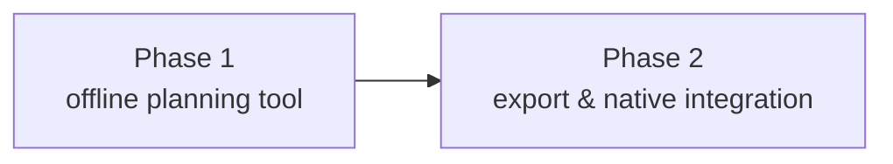

# Roadmap

> 日本語版: [../ja/roadmap.md](../ja/roadmap.md)

## Phase 1 — offline planning tool (done)

No hardware connection. Supports all three models.

- [x] Device routing model definitions (URX22 / URX44 / URX44V)
- [x] Connection constraint engine (multiplicity check for `source` / `patch` / `send`)
- [x] SVG node graph: node rendering, drag-move, wiring, suppression of illegal routes
- [x] Hide unconnected nodes onto a bottom shelf (collapse / restore, persisted in the plan) ([architecture.md](architecture.md#hiding-unconnected-nodes))
- [x] Inspector for the selected element (shows connection parameters)
- [x] JSON save / load
- [x] PNG export
- [x] Auto-layout
- [x] Studio-rack UI / dark · light theme toggle ([architecture.md](architecture.md#display-themes))
- [x] Localization (English base + Japanese, runtime switch) ([architecture.md](architecture.md#localization-i18n))
- [x] App icon (dependency-free generator `scripts/gen-icon.mjs` → `pnpm tauri icon`)

## Phase 2 — export and native integration (current)

- [x] PDF export (dependency-free: a hand-built PDF embedding one FlateDecode image via `CompressionStream`)
- [x] Native Tauri file dialogs (save-location selection / recent plans; falls back to download / file-input in the browser)
- [x] UI for editing connection parameters (level / pan / pre-post) (sends only; see [device-model.md](device-model.md) §2)
- [x] Sample-rate setting and FX-disable warnings (above 96 kHz: insert FX / FX2, plus HDMI EQ)
- [x] Release workflow (`.github/workflows/release.yml`: a `vX.Y.Z` tag push builds macOS `.dmg` / Windows `.msi`/`.exe` via `tauri-action` and attaches them to a draft Release; see [architecture.md](architecture.md#build-and-distribution))
- [x] Browser demo on GitHub Pages (`pnpm build:demo` + `.github/workflows/pages.yml`; save / load and PNG / PDF hidden) ([architecture.md](architecture.md#browser-demo-github-pages))
- [x] Code signing / notarization (the workflow forwards `MACOS_SIGNING_*` / `MACOS_NOTARIZATION_*` secrets; repository secrets configured)
- [x] Auto-update (updater plugin: check at startup → confirm dialog → download → restart, reading `latest.json` from GitHub Releases; requires the signing-key secrets. [architecture.md](architecture.md#auto-update))
