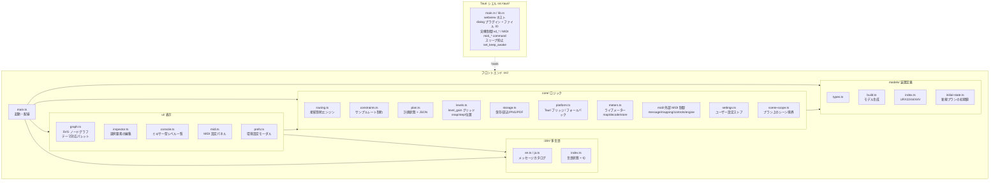
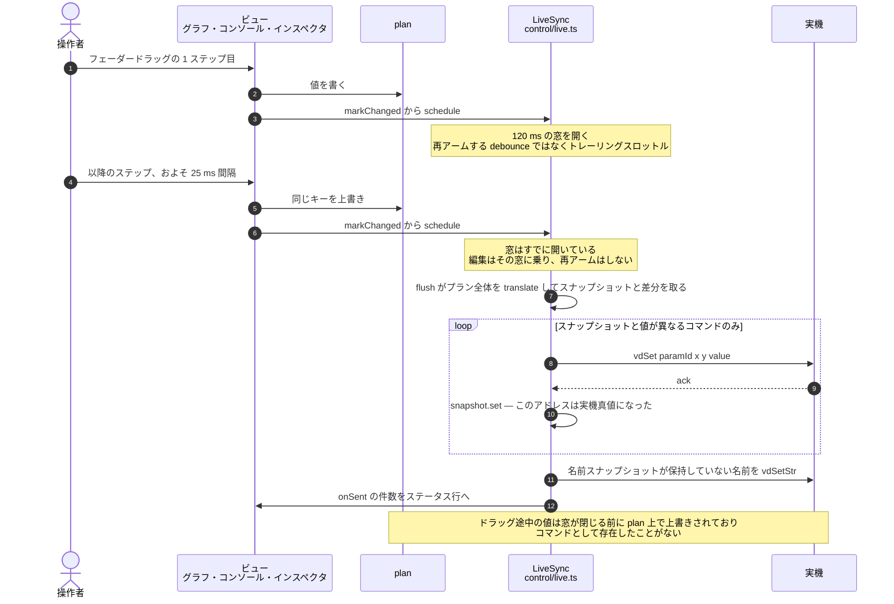
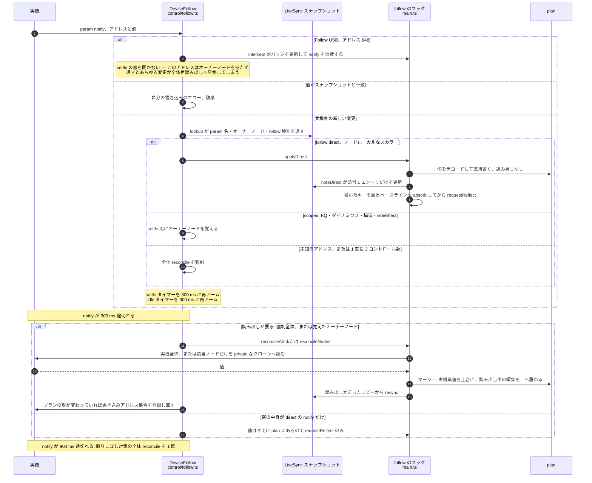
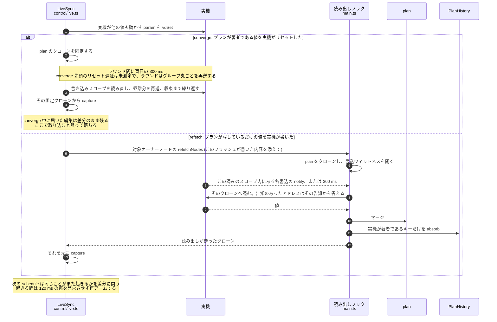
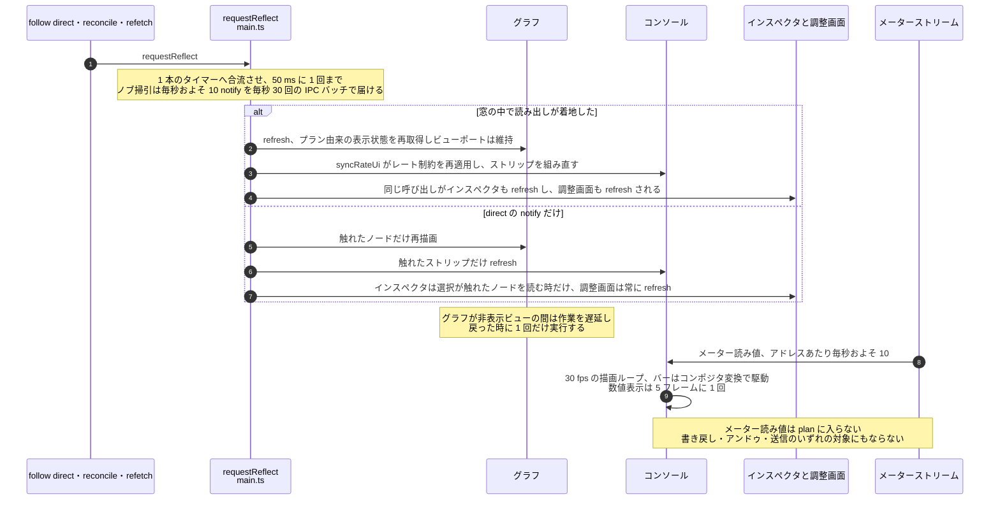

# アーキテクチャ

> English version: [../en/architecture.md](../en/architecture.md)

## 目的

YAMAHA URX22 / URX44 / URX44V のルーティング計画を GUI で作成・可視化し、
装置が物理的に許す経路のみを結線できるよう制約する。計画は JSON で永続化し、画像出力する。
同じ計画データはデスクトップビルドのライブ同期で実機へも反映される。

## 技術スタックと選定理由

| 層 | 採用 | 理由 |
| --- | --- | --- |
| デスクトップシェル | Tauri 2 | Windows 11 / Apple silicon macOS をワンソースで配布。小バイナリ。実機制御を Rust でネイティブ実装している |
| フロントエンド | TypeScript + Vite | 計画 UI は純フロント。Rust 未導入でもブラウザ確認できる |
| 描画 | 素の SVG | ノードグラフの結線描画。ランタイム外部依存を持たない方針 |
| 永続化 | JSON | 人間可読。実機反映の入力にもなる |

実機制御は Tauri (Rust) 側で扱う前提とし、UI とコア (モデル/制約/計画) はシェル非依存に保つ。

## モジュール構成



## ソース構成

上の図が形であり、ここは各ファイルが何のためにあり、なぜその形なのかを述べる。`CLAUDE.md` は同じ
ディレクトリの 1 行マップだけを持ち、詳細はここを指す。

- `src/core/` — `plan-history.ts` アンドゥ / リドゥの背後にある可逆なプランパッチ (**スナップショットではなく
  差分**で、トップレベルの `NodeParams` キー単位 / ワイヤ単位 / レコードエントリ単位にキー付けする: ライブ同期中に
  プラン全体を復元すると、操作者が実機で今まさに動かしたチャンネルまで巻き戻り、次のフラッシュがその古い値を
  書き戻してしまうため、逆パッチはアプリが著作したキーだけを書く。`unreadNodes` は名前で除外している。この
  ファイルは `Plan` の 2 つ目のエンコードなので、`HISTORY_FIELDS` は `keyof Plan` 上のマップ型であり、
  `plan-history.contract.test.ts` はエントリごとに実際の変更を 1 つ往復させる — 差分器に届かないままプランに
  届くフィールドは、ユーザーが黙ってアンドゥできない編集になる。デバイス読み出しのマージの調停もここが行う:
  `entryInContext` は競合したネストしたグループ (comp / gate / eqBands / …) をそのサブキーまで絞るので、1 つの
  グループの*異なる*フィールドに対するアプリ編集とデバイス編集が両方生き残る。`PlanWriteWitness` は**読みが
  飛んでいる間にアプリがどのキーを書いたか**を記録し、`readIntoPlan` はそれらを値ではなく著作者で落とす —
  そうしないと A→B→A と動いた編集は触れられていないキーと区別できず、読みが運んだ過渡値 B が正しい値として居座る) /
  `routing.ts` 接続制約エンジン / `constraints.ts` サンプルレート依存の機能制限 (警告 + 176.4/192 kHz では
  ステレオ CH EQ を強制 OFF、`channelEqUnavailable`)。これらは **UI 上だけのもの**である: 実機は 192 kHz でも
  「使用不可」な param への書込を受理して保持する (実測) ので、書込集合をレートでゲートすることは一度も
  していない — 「サンプルレートと Follow USB」を参照。Insert FX メニューもここが持つ (`insertFxMenu` は全選択肢を
  ロック理由 `"rate" | "slot" | null` つきで返すので、インスペクタとコンソールの双方が 1 つの表の上に定義され、
  3 つ目のロック理由が増えてもどちらの UI ファイルも触らずに届く。多数のメニューを一度に描く呼び出し元は
  ノードごとに払う代わりに `insertFxCensus` の一括集計を 1 回渡す)。そして Ducker バイパスの検出
  (`channelDuckerOn` = PRE 送りの注記、`duckerBypassWarnings` = USB ダイレクトアウトの pre-fader タップ警告。
  microSD Rec は意図的に除外)、およびアナログ出力の MONO が何を示すか (`outputMono` / `canPatchFromMonitor`。
  警告ではなく提示にした理由も含め「アナログ出力の MONO」を参照)
  / `plan-validate.ts` プラン読み込みの単一検証ファネル `planProblems`
  (`constraints.ts` から分離した。あちらはレート制限だけであり、レート制限が警告するのはアプリが著作した
  プランだが、こちらは**別の場所で**作られたプラン — ファイル、`?plan=` リンク、ジェネレータ — を検査する。
  `routing.ts` には置けない (循環 constraints → translate → routing)。`loadFromText` **だけ**から走る — デバイス
  読み戻しと `.urxf` 取り込みは意図的にこれを通さずにプランを著作する — そして 2 つの半分は報告のされ方が違う:
  不正なワイヤは文書ごと拒否し、Insert FX のスロット衝突は警告して「それでも開く」を提示する) / `plan.ts`
  プラン状態 + JSON + `?plan=` ディープリンクのコーデック (deflate 圧縮の `"z"` 形式。旧来の非圧縮リンクも
  デコードでき続けなければならない) / `levels.ts` 実機の離散 level_gain グリッド (`LEVEL_STEPS_DB` = 設定可能な
  dB 値の正規リストと、位置 / スナップ / ステップのヘルパ。**アプリが作る**レベルはインスペクタ・CONSOLE・外部
  MIDI のいずれもこのグリッドにスナップし、ステップは等間隔に配置する。一方**アプリが受け取る**レベルはスナップ
  しない — 実機読み戻しは生値を 100 で割るだけ、JSON / `?plan=` / `.urxf` の読み込みは有限性しか見ないので、
  プランは「このグリッドで呼べる最も近い値」ではなく実機やファイルが実際に持つ値を述べる) /
  `storage.ts` 保存 / 読み込み / 画像書き出し (PNG・PDF。PDF は自前の FlateDecode) /
  `platform.ts` Tauri IPC とブラウザの実行時ブリッジ / `meters.ts` ライブレベルメーター (機種ごとのノード id →
  ブローカーのメーターアドレス表 (`NODE_TAPS_URX22` / `NODE_TAPS_URX44`)、dBFS デコード、最新値ストア。
  ゲインリダクションのメーターは専用の表と専用のデコード (`grAddr(kind, node)` / `decodeGrDb`) を持つ —
  リダクションはレベルではないため — また `tapsFor` は CONSOLE のメーターポイント選択の契約も兼ねる。2 つの
  アイドル値は実測された状態であり (`0` = プロセッサが動作していない、OVER = 動作していて減らすものが無い)、
  GR の数値はメイクアップゲインを含まない。CONSOLE ビュー向け。`tapsFor` / `tapFor` / `hasMeter` /
  `defaultTapKey` は省略可能な `modelId` を取り、渡さないと黙って URX44 の表へフォールバックするので、
  すべての解決地点で `getModel().id` を渡さなければならない) / `eq-response.ts` 4 バンド PEQ の実測周波数特性
  (RBJ バイクアッドに、実機が強いた 3 つの補正を入れたもの: 実機の Q はバイクアッドの Q の 2 倍、パス
  フィルタは Q を無視する、シェルフの公称周波数はプラトーから −3 dB の点である。`eq-response.test.ts` で
  実機のスイープに対してピン留めしている) / `env.ts` ビルド時フラグ (`DEMO`: デモビルドは保存と画像書き出しを
  隠し、代わりに共有 URL とプラン JSON のダウンロードボタンを出す) / `settings.ts` ユーザー設定 (環境設定
  モーダルのバッキングストア。検証済みの localStorage レコード `urx-settings` 1 本で、`?reset` のクリアが先に
  走るよう遅延読み込みする) / `scene-scope.ts` プラン用語で表した URX のシーン境界 (シーンスコープの取得 /
  保存のための capture / apply / strip。書込側の対応物は `control/params.ts` の `sceneExternal` フラグであり、
  `scene-scope.test.ts` が 2 つのエンコードを互いにピン留めする)
  - `src/core/midi/` — 外部 MIDI コントロール (デスクトップのみ)。`message.ts` CC / ノート / ピッチベンドの
    デコード・エンコード / `mapping.ts` 自由割当のモデル (アドレス、テイクオーバーモード absolute/pickup) +
    永続化の検証 / `controls.ts` 固定コントロール id (`node/param[@scope]`) のカタログ。CONSOLE の全コントロールと
    **チャンネル調整画面が編集する全パラメータ**を対象とし、それらの画面が使うのと同じグリッドへスナップする
    正規化 (0..1) の get/set を持つ (調整画面の値はスライダーと同じ `DynField` 表からグリッドを取り、
    `translate.ts` が共有する `dynToPos` / `dynFromPos` を通るので、MIDI とドラッグが 1 つのグリッドの別の値に
    着地することはない)。id の第 3 要素は**スコープ**である: 送り先 Bus (`@bus.mix1`) か、プロセッサ / バンド
    (`@gate`、`@comp`、`@eq.low`) — 1 つのノードはフェーダーを 1 つ持つがしきい値は 3 つ持ち、バンドがカーソル
    ではなくスコープなのは、割当が画面を閉じたままでも働かなければならないからである。実機のロックは書込を
    拒否する (FIXED Bus send、Pan Link の送りパン、レート制限されたステレオ CH EQ、1-knob 下で実機が駆動する
    COMP の値、1-knob 下の EQ バンド値、フィルタタイプが読まない Q / ゲイン)。enum セレクタ (ニー / フィルタ
    タイプ / 1-knob タイプ) はコントロールを持たない / `engine.ts` 受信メッセージの適用 (14 bit CC ペア。
    トグルは送り手のボタン種別に因んだマッピングごとのボタン挙動を持つ = "Momentary" (エッジ) / "Toggle"
    (状態)。状態とは値がそのまま状態であることを意味し、Stream Deck 型の 127/0 交互送出に対応する)。受信
    メッセージの拒否は、受信の記帳より前に行うので拒否が状態を消費しない。これはデバイス読み出しやファイル
    フローがプランを保持している間、および破壊的な往復診断が実機を掴んでいる間 — 操作者が始めたラッチであり、
    モーダルでもライブフラッシュの再取得待ちでも learn でもない — に起き、ステータス行へはメッセージごとでは
    なくゲートされた窓ごとに 1 回報告する。MIDI ラーンの状態機械、フィードバック (送信キャッシュとの差分 +
    受信中 300 ms のエコー抑制 + トグル用の受信側ワンショットエコーガード)。複数のマッピングが 1 つの
    アドレスを共有するとギャング (`byKey`) を成し、1 つの物理コントロールが全メンバーを駆動する
    (受信メッセージは全員へ配る) 一方、最初に
    learn したリスト先頭がフィードバック / エコー / ピックアップを所有する
  - `src/core/control/` — 実機制御 (vd プロトコル)。デスクトップでは書込とライブ同期は常時有効で、
    `selftest.ts` の往復診断だけが `--experimental` 起動を要する
    - `vd.ts` 値エンコード / `translate.ts` プラン→コマンド (**1 つの本体アドレスはちょうど 1 つのコマンドを
      生む**: インサートエフェクトのパラメータはエフェクト系統ごとに 1 つのエンジン配列に載っていてチャンネル軸が
      無く、同じ系統を持つ 2 つのノードは同じアドレスを出す — `collapseSharedAddrs` は**最後のもの**を、その
      出現自身の位置のまま残す。タイプセレクタは自分が束縛する配列を埋め直すので、繰り上げた生存者は後続の
      オーナーのセレクタに消される。これはスコープフィルタの**前**に走るので、シーン部分集合は
      `all.filter(pred)` のままでいられる。落とされたオーナーは生存者に `shadowed` として刻まれ、救済が黙って
      行われるのではなく 3 つの面で語られる — 「1 つの本体アドレスに複数のオーナー」を参照。
      `planToCommandsUncollapsed` はどの系統がアドレスを共有するかをピン留めする契約テストのためだけに存在し、
      実機と話すものが使ってはならない) / `readback.ts` デバイス→プラン。`readIntoPlan` を通す — 読みはプランの
      私的な複製の上で動き、`plan-history` の差分器でマージし戻す (デバイスの真実が先、その間になされた編集が
      その上) ので、ノード全体の代入が数百 ms から数十秒の窓の内側でなされたジェスチャを上書きすることはない。
      1 回の読みが全体を通してデバイスの真実であるわけではない: ライブ同期の `sideEffect` 再取得は、そのフラッシュが
      行った書込 (`settle.ts` の `PendingWrites`) を引き継ぎ、`writeOverlay` がそれらのアドレスには**実機が告知した
      もの**で答える。実機はその早さの書込に対して GET へ答えないためであり、他の読み経路は何も引き継がない。
      名前だけはオーバーレイが決して答えない唯一の類であり、`pending` があるあいだ `readPass` はそれらを
      丸ごと読まない (理由は下の `settle.ts` の項) /
      `settle.ts` 書込後の整定: **書込は読めるようになる前に ack される**。境界はその書込自身のデバイス notify で
      ある (URX44V で実測、書込の発行から 9〜204 ms、6 アドレス 87 の値ペアサンプル、パラメータの種別に依らない。
      実機では 1-knob のドラッグが 10/10 で notify に終わり、42〜203 ms、一度も上限には当たらなかった)。答えは
      **実機が告知した値であって、こちらが送った値ではない** — 実機が黙って捨てた ack 済みの書込は受理した書込と
      区別できないので、送信側から答えると自分の値をデバイスの真実として記録し、再試行すべき差分が残らない。
      量子化やクランプを受けた書込に専用の場合分けが要らないのはこのためで、実機が何も言わなかったアドレスは
      単に読む。`follow.ts` が自分の購読を notify の供給源として登録し、エコーフィルタとインターセプトフィルタの
      **前**に全 notify を流し込む (自分の書込への答えこそがエコーである)。マークは**アドレス単位**である
      (誤帰属はどちらに転んでも自己修正するので、マークが買うのはマージの正しさではなく無駄な再照合が 1 回
      減ることである)。待ちの終わり方は 2 つ: スナップショットが**異なる**値を持っていたアドレスは必ず告知され、
      自分の notify で終わる。スナップショットに**エントリが無かった**ものは何も告知しない no-op でありうるので、
      上限でしか終われない。待ちを開いたままにするのは `mustSettle` — 読み自身のスコープ内のアドレス — だけで
      あり、スコープ**外**で沈黙したまま変化した書込は上限で notify の供給源へ報告され、`follow.ts` が既存の
      アイドル全体照合を張る (クラス (b) はこれをしてはならない。正当な沈黙が約 800 回の読みの掃引を命じてしまう)。
      ハンドルから撤回されるものは何も無い: 最後の告知が勝つので、操作者が卓で動かしたアドレスは**その人の値**を
      持って戻ってくる。`sendConverging` の**ラウンド間**の待ちは意図的に盲目のままである —
      `sideEffect: "converge"` のヘッドのリセット遅延は一度も測られておらず、1 ラウンドは読みの差分が名指し
      しなかったグループ全体を送る。ただし **SEED の読みは同じ `PendingWrites` を受け取り、フラッシュの書込を
      待ち合わせる** (実機で 17〜84 ms なので、上限は価格ではなく退避)。**名前の経路は「読まない」ことで塞ぐ** —
      `readPass` は `pending` があるとき名前を読まない。名前は文字列経路から書かれて書込台帳に入らないのでオーバーレイに
      答える材料が無く、settle は上限を使い切るだけで、しかも自分の 81 ms の窓の中で読み戻した名前はプランと
      `nameSnapshot` の両方に入って再試行の差分を残さない。
      「書込は ACK された時点ではまだ読めない」を参照 / `params.ts` 確定済みパラメータのカタログ
    - `fx-effect.ts` FX チャンネルのエフェクトのカタログ (Rev-X / Rev.R3 / Mono Delay / Ping Pong) — タイプ
      セレクタとパラメータ配列のスロットアドレッシング、および raw↔表示のエンコード
    - `insert-fx-effect.ts` Insert FX のエフェクトパラメータカタログ (Guitar Amp Classics / Pitch Fix /
      Compander-H/S / Multi-Band Comp) — セレクタが束縛するエンジン配列 (Guitar 697 / Pitch 701 /
      Compander 689 / 出力 693) をスロットアドレッシングで読み書きする。raw↔表示は実機 LCD に対して較正した値を
      使う (Compander は既存の COMP 系のエンコードを再利用。MBC / Pitch / Guitar は SP Type / Amp Type / Scale 等の
      専用の表と enum を持つ)
    - `urxf.ts` 実機の microSD 設定ファイル (`.urxf`、SETUP > SAVE が書く) のリーダ — 2 層のエンディアン
      (レコードと記述子のヘッダは BE、ブロックヘッダと値は LE)、自分の F 表からしか歩けないフレーム無しの D
      ブロック、連続した id へ平坦化して格納された x 軸。チャンクを `ParamSource` として公開するので、
      `readback.ts` は 2 つ目の逆変換ではなく既存のデバイス→プラン逆変換をファイルに対して走らせる
      (`applySourceState`)。供給源がパラメータとして渡るので、ファイル取り込みとデバイス追従の照合が交差する
      ことはない。ライブ同期中の取り込みは拒否する。**読み取り専用**であり (書き戻しは実機のシーンメモリに対して
      未検証)、`--experimental` の後ろに置いている
    - `device-setup.ts` 実機の SETUP > GENERAL 設定 (輝度 / オートパワーオフ / 日付時刻の書式 + タイムゾーン /
      言語 / HDMI + USB Main / 16 個の User Defined Knobs の割当) — `params.ts` に **`planExternal`** フラグつきで
      カタログしている (契約テストは「決して emit されない」をこのフラグから導く): `translate.ts` の emit 無し、
      `readback.ts` のグループ無し、Follow USB (848) と同じ形の素の `vdGet` / `vdSet`。開いたときに読み、
      ローカルで編集し、差分として適用する (`ui/device-setup.ts`、Device メニュー)。`timezones.ts` が実機の 154
      件の都市リストを持つ — 固定データであり、**厳密なアルファベット順ではない**ので、並べ替えると 76 番以降の
      index が全部ずれる
    - `firmware.ts` 検証済み System ファームウェアのバージョンゲート (`SUPPORTED_SYSTEM_FIRMWARE` と照合し、
      不一致なら読み / 書き / ライブ同期の前に警告する。バージョンが空なら検査を飛ばす)
    - `link-stats.ts` リンク台帳 (`LiveSync` や `DeviceFollow` と同じく `begin` / `end` の後ろに自分のセッション
      方針 — 冒頭行、毎分の間隔、一度だけ警告するラッチ — を持つ。タイマーの寿命と `startedAt` を手で歩調を
      合わせようとすると必ずずれるためである) — 1 セッションがブローカーに何を求めたか (コマンド、購読の
      差し替え、登録フレーム、デバイス全体の読み) と、ブローカーが何に答えられなかったか (期限、現在の停止の
      連続) を記録する。全体読み以外は Rust ワーカーの `LinkCounters` で数え、全体読みだけはこちら側の判断なので
      こちらで数える。アプリのログディレクトリへ JSONL として毎分 1 行追記する (パスはバンドル識別子から採るので
      `tauri dev` とインストール版が**同じ 1 ファイル**を共有する — だから各行に `build` / `version` を刻む。
      2 MiB でローテートし 1 世代だけ残すので記録は約 4 MiB で有界であり、アプリ側からは何も削除しない)。これが
      **要点**である — これを作らせた症状 (Device Center を強制終了する必要がある) はアプリが消えた後に現れるので、
      画面の上にしか存在しない読み取り値は、まさに必要なときに欠けている。レイテンシ・キュー深度・フィード
      レートは意図的に**入れていない**: それらはこちら側からリンクがどう感じられるかを測るものであり、ブローカーは
      自分自身のテアダウンがデッドロックする瞬間まで速やかに答え続ける。アドレスフィルタが落とす notify の割合を
      除外している理由はもっと強い — このプロトコルでは登録と notify の発行が分離している (実測) ので、ブローカー側に
      溜まっていく登録は受信ストリームからは見えず、その数字は見かけ上測っているものを測れない。
      `LINK_BAR_KEYS` / `LINK_LEDGER_KEYS` はユニオンとして export しているので、`linkstats.spec.ts` の期待値表は
      それらの上の `Record<…>` になり、アサーション無しに足されたフィールドは `pnpm typecheck:e2e` で落ちる。
      「リンク台帳」を参照
    - `client.ts` 書込シーケンス + ドライラン + `readClockState` / `setFollowUsb` (書込前の Follow USB (848) +
      レート (766) 検査。848 は意図的にプランの外) + `diffPlan` / `diffNames` (書込のためのデバイス対プラン差分) +
      `sendConverging` (差分を送り、読み直し、まだ違うものを送り直す — ただし 1 ラウンドが**送る**のは差分では
      なく `roundCommands` である: `VdCommand.group` は**リセット連鎖**であり、あるメンバーを書くと実機はその後に
      emit されたものを捨てるので、1 ラウンドは差分に残ったコマンドが属するグループの全メンバーを送り直す。
      emit 順だけでカバーできるのは送信全体であって部分的な再送ではなく、それが EQ 1-knob の ON → TYPE → LEVEL
      連鎖がリンク 1 本につき 1 ラウンドを消費して尽きていた理由である — 「リセット連鎖と、収束ラウンドが送るもの」
      を参照。`translate.test.ts` はどの `sideEffect` ヘッドがグループを持ち、どれが承知の上で持たないかを
      ピン留めする) + `comparePlan` / `compareNames` / `formatCompareReport` (読み取り専用の「デバイスと照合」 —
      実験的で、何も書かない。全 param を読み、パラメータごとの完全なログ + 照合件数 + 経過時間を出すので、
      即座の「一致」が信用ではなく検証になる) / `selftest.ts` 往復診断 (失敗したパスは**収束トレース**を保持する —
      各ラウンドが何をどの順で送り、どれだけ掛かり、読み直しが何を見つけたか。残差は最終状態を名指しできても、
      そのパラメータが再送されたのかどうかは言えないからである。走行が何かを見つけた場合は必ずレポートの保存を
      提示し、ヘッドレスの `--self-test` 起動では代わりにチャンク分割してログへ出す) / `prepare.ts` 監査準備
      ライタ (`--prepare-modified` 起動フラグ。UI には出さない): 実機を取得し、書込可能なプランのスカラを
      すべて特徴的な範囲内の値へ散らして書き込む (寛容な送信、復元しない) ので、シーンの SAVE/RECALL 監査が保存して
      結果を差分できる。`selftest.ts` と `floorSilent` の無音契約を共有する。実機のシーンが何を保存し何を保存しないか —
      および除外された設定のうち URX Router が保持するもの — は `docs/{en,ja}/known-issues.md` に記録している
    - `live.ts` 編集の即時反映 (スナップショット差分、デバウンス。スナップショットと並べてアドレス→ノードの
      索引を作り `lookup` として公開する。`capture` は 1 つ: スナップショットの**形**はライブプランから来る —
      どのアドレスが存在し、したがって何が notify に登録されるか — が、**値**は読み戻しが対象とした私的な複製から
      来る。読みの最中になされた編集が上書きもされず、デバイスに与えた値として記録もされないようにするためであり、
      プランがたった今生やしたアドレスは丸ごと除外して次の差分が送るようにする。フラッシュは翻訳を**1 回**行って
      からコマンドごとに await するが、差分の相手であるスナップショットはその下で動き続ける — 追従側がその await の
      内側から書き込む (`noteDirect` / `capture`) — ので、両者は `snapshotEpoch` を上げ、動いたのを見たフラッシュは
      残りの**値についてのみ**翻訳を取り直す: 順序はフラッシュ自身のものであって意味を持ち、フラッシュ中に生えた
      アドレスは `markChanged` が既に後続フラッシュを予約済みの保留中のアプリ編集である。これが無いと、ループは
      プランがもう持っていない値 — 実機自身の 1 つ前の値 — を、まだ回されているノブへ送り返していた。名前は
      **2 つ目の**スナップショット `nameSnapshot` に置き、専用のエコー判定と専用の記録を持つ (`isEchoName` /
      `noteDirectName`)。数値のスナップショットは名前のエントリを持たないので、そちらに問うとアプリ自身の
      リネームを実機側の変更と読み、送り返してしまう)
    - `follow.ts` 実機側操作の盤面追従 (param notify を購読 → `live.lookup` で分類する: direct = ノードローカルな
      スカラ (`params.ts` の `follow: "direct"`) で、読み戻し無しに `applyDirect` で適用。scoped = `applyNodeState` で
      所有ノードだけを読み戻す。未知の param や 3 つを超えるコントロールは全体読み戻しへ昇格し、アイドル時には
      安全側の全体読み戻しが走る。リネームは 4 つ目の経路で、エコー判定の**後**・数値のフィルタ群の**前**に置く。
      **`isEcho` は両方の経路に答える** — ホスト側が `valueStr` で振り分ける。数値と名前のスナップショットは
      別のマップで、どちらも他方には答えられないからである。**判定を 1 箇所に保つ**ことが効くのは実機の挙動の
      ためで、実機は受理した名前書込を必ず告知する = 操作者がアプリで行ったリネームがエコーで戻ってくる。
      これを追従対象として扱うと、リネームのたびに全体照合がアームされ、その反映が `planHistory.reset()` を
      呼ぶ。判定を通った先で `applyName` が所有ノードを返す = リネームは direct 追従のまま (再描画 1 回・
      読み戻し無し) でいられる。名前ではないアドレスへの文字列 notify には undefined を返し、未知アドレスの
      経路へ落ちる)
- `src/ui/` — `graph.ts` SVG ノードグラフ (スタジオラック調の意匠、ダーク / ライトテーマ。`refresh()` は
  プランに裏打ちされたビュー状態 — 棚上げとノート折り畳みの集合、および未読の出所 — を `adoptPlanState` 経由で
  取り直す (コンストラクタと `setModel` と共有)。加えて選択を唯一の述語 `selectionIsStale` で再検証する。
  ある in-place な変更がそのどれを動かしたかを呼び出し元は判別できず、これらの集合は書き戻しキャッシュだから
  である (`commitHidden` は `hidden` をプランへ押し込むので、古いものが 1 つ残るとアンドゥ済みの非表示が
  復活する)。`setModel` と違ってビューポートは保つ。`labelOf` は public であり、ノードを名指しするステータス行が
  すべてキャンバス と同じ表記を出すためである) / `graph-text.ts` 盤面のテキスト計測を切り出したもの。文字列が
  等幅セルで何セル分になるか、ノートがパネルの予算内でどう折り返るか、ラベルがヘッダーボタンを避けるまでに
  どこまで縮むか。どれも要素を必要とせず、しかも効いてくるケース — 予算全体より広い全角トークン、BMP を
  超えるコードポイント、空行だけの段落、最終行が全角ばかりのクリップ — は引数として書けば容易で、textarea
  に打ち込んで作るのは面倒である / `history.ts` アンドゥ / リドゥ (`Ctrl/Cmd+Z`、
  `Ctrl/Cmd+Shift+Z`、`Ctrl/Cmd+Y`): ジェスチャの境界、キーボードの述語、`core/plan-history.ts` の上の適用
  シーケンス。1 エントリは最初の編集から最初の境界まで続く (`pointerup` / `pointercancel` / ウィンドウの `blur` を 1 マクロタスク
  遅らせるので、`click` ハンドラの編集がその内側に入る — そして次の `pointerdown` はまずそのコミットを
  確定させる。さもないと遅れたマクロタスクが 2 回のクリックを融合させる。テキストフィールドの外での
  ステップキーの `keyup` と `focusout` は**即座に**確定させる。これらの後にジェスチャの代理として何も
  ディスパッチされず、遅延させるとオートリピートがマクロタスクを追い越すからである。再武装する 300 ms の
  アイドルは MIDI エンジンの `RECENT_MS` と揃えてあり、自前の境界を持たない編集にだけ張る — ポインタが
  下がっている間と、テキストフィールドがフォーカスを持つ間 (その `focusout` が境界) は抑止する)。そして
  **差分は編集時ではなくコミット時に取る** — 複数のファネルが `markChanged()` を呼んだ後にさらにプランを
  変更するためである。拒否は、開いているエントリが**消費される前**ではなく**閉じられる前**に判定する:
  デバイス読み出しの下でコミットすると、その読み自身の書込がエントリに焼き付き、拒否が誘う再試行がそれを
  実機へ押し戻してしまう。拒否されるのは — デバイス読み出しがプランを保持している間 (操作者の取得 / ライブ同期の
  開始、同様にデバイス追従の 2 つの照合とライブ同期の 1-knob 再取得。2 つの系統が重なるのでフラグではなく
  実行中集合への所属で追跡する。収束ラウンドはこれに含まれない。書込スコープ全体を読むがプランへは何も
  書き戻さないためである)、ファイルフローが保持している間、***ドラッグ*が進行中の間 (押下して動いたもの。
  押下だけではゲートにできない。ワイヤはスクリプトがディスパッチした `pointerdown` に対応する `pointerup` 無しで
  選択されるからである)、モーダルが開いている間 (プランを編集する唯一のもの = チャンネル調整画面を除く)、
  そしてライブ中の `sampleRate` パッチ (**丸ごと**拒否する — 部分的なアンドゥはどのジェスチャも生まない状態を
  プランに作り、`reflectHistory` の `markChanged()` がそれを実機へ押し出してしまう — なので文言は
  `touch.fields.size === 1` で選ぶ: 他のものも動かしたエントリは「ステップ全体を保留した」と言う。レートだけを
  名指しすると、巻き込まれた編集が黙って拒否されたままになるからである。これは破棄ではなく延期である:
  拒否は peek したエントリに対して `take()` の前に走り、`deactivateLive` は履歴をリセットしない)。テキスト
  フィールド / textarea / `contenteditable` はコードを素通しする (`preventDefault` しない) — macOS で実測: ネイティブの
  Edit メニューを入れてもページは `Cmd+Z` を受け取り、WebKit 自身のフィールド undo を抑止するのは
  `preventDefault` の方である。`menu(kind)` は macOS の Edit メニューの入口であり、そのフィールド自身の undo
  (`document.execCommand`、WKWebView で動作を実測) へ委譲するので、メニューがコードと違う意味を持つことはない。
  `notifyDepth` が深さを報告するのは実際に遷移したときだけである。`note()` は編集ごとに発火し、報告のたびに
  IPC を越えてネイティブのメニュー項目へ届くからである) / `keys.ts` そのキーストロークを誰が所有するか:
  `ownsNativeUndo` (2 つの undo 経路が共有するテキスト面の許可リスト) と `isChord` (裸の修飾キーで動作するものが
  問う — ファインモードの背後にある Shift 追跡は `Cmd+Shift+Z` の Shift でラッチしてはならず、今日のコードを
  各所で列挙することが、次のコードを「作者が開いたことのないファイルのバグ」にする) / `edit-menu.ts` macOS の
  Edit メニューのフロントエンド側 (クリックを履歴へ振り分け、項目の有効状態とラベルを押し出す。メニューは
  ドキュメントの外にあるのでどちらも再描画には従わず、自分の `onLangChange` を自分で登録する) /
  `inspector.ts` 選択要素のエディタ。描画済みパネルの検査では確かめられない層を切り出してある:
  `inspector-format.ts` パラメータ行の値フォーマッタとスライダー位置の対応 (表示文字列そのもの — `glyph.ts`
  が無限大グリフで分割し、E2E 仕様が逐語で検査する対象 — をパネルを描画せずに固定できる)、
  `inspector-sections.ts` セクション開閉の永続化。ノードごとではなくセクション種別ごとに持つので、折り畳みの
  好みはどのノードでも同じになる (ON 状態を既定とするセクションは値がトグルされた時点でオーバーライドを消し、
  OFF で自動折り畳みする挙動へ戻る。利用者自身の折り畳みは残る。キャッシュを一度だけ読んで書き込みごとに
  再永続化するため `localStorage` を消すだけでは既定に戻らず、ストアはテスト間でリセットできるようにして
  ある)、`send-fields.ts` 各ワイヤがどの送りコントロールを出すか、どれも無いワイヤは代わりに何を言うか
  (ルーティング規則と宛先 Bus の params だけで決まり、並びは実機の SEND TO 画面の読み順。DOM は持たず、注記は
  カタログキーで返すので `core/*` と同じく言語非依存)、`insert-fx-model.ts` インサート FX の値モデル —
  エンジンスロットがどの保存 raw を読むか、編集がどうキーを振り直すか、セレクタが別のファミリを指す前に
  出ていくエフェクトの値へ何をしなければならないか。ここは描画済み DOM の検査がちょうど素通りしてしまう段
  (裸のスロットキー) である / `console.ts` CONSOLE ビュー (ミキサー型のレベル一覧。GRAPH/CONSOLE タブで
  切り替える、同じプランの別ビュー。フェーダー / MUTE / EQ の編集はグラフと同じライブ同期のために
  `markChanged` を通る。ストリップごとの SENDS ラック。スクリブルの電源 LED が各ノードマスタ (CH_ON / Bus
  マスタ ON / osc.on) をトグルし、OFF 状態は共有の `isNodeInactive` で減光する。ライブメーターはライブ同期中
  だけ、約 10 Hz) / `glyph.ts` `∞` グリフを `.glyph-inf` span で包み、等幅フォントの小さい x ハイトを補正する
  (コンソールの読み値とインスペクタの値が共有) / `dropzone.ts` ウィンドウへのドラッグ & ドロップ (2 経路:
  デスクトップではシェルの `tauri://drag-*` イベントが実パスを運び、ブラウザでは DOM のドラッグイベントが
  `File` オブジェクトを運ぶ。DOM ハンドラは Tauri の外でのみ登録するので、1 つのドロップが二重に処理されることは
  ない) / `consent.ts` 初回起動の同意ゲート (全画面の inert モーダル、免責文、`localStorage` に永続化。拒否すると
  アプリを終了する。デスクトップのみ) / `load-report.ts` プラン読み込み失敗のコピー可能なレポートモーダル
  (`?plan=` のデコード失敗、ルーティング検証の失敗) / `rate-choice.ts` 書込経路のサンプルレート整定のための
  三択モーダル (実機のレートで書く / Follow USB を切ってプランのレートで書く / 取り消し) / `licenses.ts`
  サードパーティライセンスのモーダル (同梱した cargo-about のページを DOMParser で解析し、アプリの DOM として
  描く — 折り畳んだ系統の索引で、ヘッダ行がライセンス本文を展開する。テキストノードのみ、閉じたら解放する。
  iframe を使わないのは WKWebView のサブフレームのスクロールバーが別の壊れたコード経路だからである。File
  メニュー、デスクトップのみ) / `midi.ts` MIDI のオーケストレーション (Device メニュー → MIDI コントロールの
  **ウィンドウ**を開く。ポート、エンジン、learn 状態、`urx-midi` 下の機種ごとの永続化を所有し、武装フックと
  フィードバックを `markChanged` / 追従の適用へ配線する)。パネル本体は別の OS ウィンドウであり — `midi.html` +
  `src/midi-window.ts`、デモビルドからは落とす 2 つ目の Vite エントリ (ホスト要素を
  `ui/midi-window-app.ts` に渡すだけ。状態とリレーはそのモジュールが持ち、状態 → DOM は
  `ui/midi-window-view.ts` が担うので、どちらもウィンドウなしで駆動できる) — それは**ビュー**である: 押し出された
  状態を描き、意図を報告する (`ui/midi-protocol.ts`)。MIDI 入力ポートはそれを開いたウィンドウへバーストを
  届け、プランを持つのはメインウィンドウだけだからである。双方向とも 1 つの Rust リレー
  (`src-tauri/src/midiwin.rs`) を通る Tauri Channel なので、2 つ目のウィンドウは core 以外の capability を
  必要としない。learn が ON になったときは自分を前面に出し、割当が着地したときは**意図的に出さない** — macOS で
  実測: アクティブでないウィンドウへのクリックは webview に届かない (`accept_first_mouse` の既定は false) ので、
  割当ごとに前面化すると次の割当が毎回 2 クリックになった。ギャングのメンバーはヘッドの直下に連続して並び
  Linked タグを付ける。Behavior 列の語彙は表の下に凡例として印字する — リストが実際に使う語彙についてだけ。
  ネイティブのドロップダウンは自分の選択肢に注釈を付けられず、ホバーで現れるカードは誰も見つけない
  アフォーダンスだからである / `midi-learn.ts` CONSOLE のストリップとチャンネル調整画面が共有する、唯一の
  MIDI ラーンの見せ方と武装経路 (ターゲットのリング、武装中のパルス、割当済みのドット — 加えて割当先アドレスを
  常時ツールチップに出す。MIDI ウィンドウはアプリの背後に隠れうるし、ドットは「割当済み」としか言えず、
  何に割り当てたかは言えないからである) / `keyprobe.ts` キーボード測定ハーネス、**dev ビルドのみ**
  (F2 IME の記録 / F3-F4 インスペクタ再描画のパルスをアプリのゲート付き経路とゲート無しの再構築の両方へ通す
  = IME 測定の 2 本の腕。そのキーが F6-F10 を避けているのは**ことえりが合成中にそれらを消費する**ためである /
  F6 blur / F7 `defaultPrevented` を報告するコードログ / F8 プローブ用テキスト入力の生成とフォーカス /
  F9-F10 `document.execCommand("undo"/"redo")`。読み取り値はすべてステータスバーへ印字する)。これが存在するのは、
  実物のデスクトップ webview にしか答えられない問い — コードはページに届くのか、WebKit のフィールド undo は
  発火するのか、ネイティブメニューのクリックは何をするのか — が、そうでなければ他のウィンドウが重なる窓へ
  ポインタ座標を合成する必要があり、クリックが別のアプリに落ちるからである。`import.meta.env.DEV` の下で
  `window.__urxKeyProbe` として公開し、製品ビルドからは静的に落とす (`ci.yml` で `__urxConsole` と並べて
  ガードする)。バインディングは `keyprobe.test.ts` でピン留めし、`main.ts` からアプリ自身の keydown ハンドラの
  **後**に設置する。これがコードログに「アプリがそのコードを取ったか」を報告させている / `dom.ts` 共有 DOM
  ヘルパ — ビルダ `el`、`onOff` / `sliderRow` (すべての設定面が出す ON/OFF の対とラベル付きレンジ行。手で
  組んだものがホイールステップの契約を黙って落とせないようにする)、`onWheelStep` (ホイールのノッチが
  ホイールステップ設定の刻み数だけ進む。SENDS / メインのフェーダー、ヘッドのノブ、インスペクタのスライダーが
  再利用)、`popTop` (ポップオーバーの上下反転計算。コンソールのポップオーバーが使用)、`settings*` の行ビルダ
  (環境設定モーダルと本体設定モーダルが共有する、ラベル左 / コントロール右の `prefs-row` の書法。インスペクタは
  外れており、そのコントロールは `paramBlock` で包む)、`wireDismiss` (キャプチャ段階の外側押下と Escape による
  解除。環境設定モーダル、本体設定モーダル、ライセンスモーダル、チャンネル調整画面が共有する。判断を求める
  3 つのモーダル — 同意 / 読み込みレポート / レート選択 — は意図的に外している) / `fine.ts` ファインチューニング
  モード (Shift を保持、または fineLatch 設定でラッチ。実機の push-and-turn のファイングリッドを検証済みの
  param — EQ バンドゲイン / COMP ゲイン 0.1 dB、STREAMING TIME 0.02 ms — についてのみ、ルートの `.fine-mode`
  クラスをトグルして `input[data-fine-step]` のステップを差し替えることで再現する。フェーダーと送りには実機の
  ファインモードが無く、`LEVEL_STEPS_DB` のグリッドのままにする) / `dyn-screen.ts` チャンネル調整画面
  (環境設定のシェルに載るノードごとのモーダル。開くたびに選ばれる各プロセッサの唯一のホストで、メーター
  タップの隣に「それが何をしているか」を示すパラメータを並べる。**ホストは今どのプロセッサを表示しているかを
  一切知らない** — `DynProcessor` がノードの持ち物を解決し (`bind` → フィールド + メーターレーン)、プランの
  自分の一角を読み書きし (`read` / `patch`)、ホストが提供する部品から表示列を組み立てる (`parts.lanes()` /
  `parts.plot()` の上の `display`)。開いている間はブローカーの唯一のメータースロットを所有するので、コンソールには
  解放と再取得を指示する。`dyn-gate.ts` / `dyn-comp.ts` / `dyn-eq.ts` / `dyn-ducker.ts` / `dyn-ssmcs.ts` が記述子 — DUCKER だけは
  開いたノードを調整しない。Ducker はステレオチャンネルの下にぶら下がる別ノードで、キーはよそから来た
  ワイヤで決まるため、レーンは開いたノードから読むのではなく 3 か所から集める。`dyn-ssmcs.ts` だけは 1 つの
  プロセッサではなく 1 つのバンクの 3 面で、題の行から閉じずに行き来する — `dyn-chan.ts` が MONO IN
  チャンネルストリッププロセッサが共有する束縛、`dyn-plot.ts` がそれらが描く dB×dB の伝達プロット、
  `dyn-freq-plot.ts` が 2 つの EQ が描く周波数×ゲインのプロット、
  `dyn-registry.ts` がどのプロセッサが存在するかを知る唯一の場所である。GATE/COMP はメーターの**ラダー**
  (しきい値を入力メーター上のフェーダーキャップとしてドラッグし、2 つが 1 つの座標を共有する) か**カーブ**を
  表示し、EQ は応答プロットとレーンのラックを同時に表示し、そのセグメントバーは代わりにバンドを選択する。
  EQ のフィルタモデルは `core/eq-response.ts` (実測: 実機の Q はバイクアッドの Q の 2 倍、パスフィルタは Q を
  無視する、シェルフの公称周波数はプラトーから −3 dB の点である)。**どのプロットも真の値でカーブを描き、
  プロット領域へのクリップはホストが行う** — `drawAxes` / `drawCurve` の分割はそれを強制するために存在する:
  値を軸へクランプすると縁に沿った水平のバー、すなわちそのプロセッサが持たない応答を描いてしまう (値の
  *注釈*の方は、読めるように意図的にクランプしてよい)。`docs/{en,ja}/channel-tuning.md` を参照) /
  `device-setup.ts` 本体設定モーダル (Device メニュー、デスクトップのみ: 開いたときに実機の SETUP > GENERAL
  設定を読み、編集をまとめ、差分を適用する。機種に無いページの行はロック表示にして機種タグを付ける) /
  `prefs.ts` 環境設定モーダル (ツールバーの歯車、全ビルド: 言語 + テーマ (ツールバーから移設。保存キー
  `urx-lang` / `urx-theme` は自前のまま持ち、設定の読み込みより前に読む) + デバイスの読み / 書きスコープ +
  プランファイルの保存スコープ + 更新確認 + 警告の表示 + ホイールステップ + ファインの流儀 + スリープ抑止
  (ライブ同期中のみ取得し、OS が同意した場合にだけ保存する) + 書き出しの倍率 / 背景 + 最近のプラン。
  デスクトップシェルを要する行は「デスクトップアプリのみ」タグ付きのロック表示になり、デバイススコープは
  ライブ同期中はロックする — 「環境設定」を参照) / `link-stats.ts` リンク台帳の見える面: ステータスバーの
  右端に**台帳の 2 行** (`Link up` / `No answer`)、クリックで台帳全体。セッション中はライブに更新し、
  **`--experimental` の下でのみ**表示する。バーは `LINK_BAR_KEYS satisfies readonly LinkLedgerKey[]` で
  部分集合に縛られており、パネルのラベルと唯一の `ledgerValue` を印字する — 一時期バーは自前の短い語彙を持ち、
  その `cmd` とパネルの `Sent` が同じ数であることを誰も言っていなかった — カウンタとログ自体はすべての
  デスクトップビルドで動く。操作者がフラグを覚えていたときにしか存在しない記録は、何も記録しないからである。
  したがって `#statusbar` はメッセージ span + この読み取り値であり、`setStatus` は span の方を書く
  (`statusbar.textContent =` は次のメッセージで読み取り値を落としてしまう)。色は導入しない: 変わってよい唯一の
  セルは no-answer のセルであり、答えなくなったブローカーだけが、その行で何かをすべき状態だからである
- `src/app/` — アプリのエントリのうち配線ではない部分。`main.ts` から切り出し、アプリ全体を起動せずに
  駆動できるようにしたもの。`view-state.ts` はプランごとではなくブラウザープロファイルごとに永続化する
  UI 状態 (再起動時の機種とレート、ビュー、ラベル種別、オフ送りの間引き、機種ごとの棚、そして他が
  ストレージを読む前に走らせる必要のある `?reset` クリア) — どの読み出しも例外を投げずに既定値を返す。
  モジュール初期化中の例外はアプリごと落とすからである / `node-param-effects.ts` はノードパラメーター編集が
  どの再描画を要求するかの表。パッチと直前の値だけの純関数で、保持している区別は**再レイアウトか
  その場更新か**である: トグルはインスペクタが表示するコントロールの集合を変えるので再描画が要るが、
  値スライダーは再描画してはならない — 再描画はポインターの下の要素を差し替え、そこでドラッグが
  終わるからである / `flow-latch.ts` は 2 つの再入ガードとその違い。`singleFlight` は 1 つのハンドラに対する
  沈黙の連打ガードで、`FileFlowLatch` は全プラン / 設定の入口で共有され、デバイス読み出しによる拒否は
  **報告**し (操作者のクリックが未応答に終わった)、2 つ目のファイルフローには沈黙する
  (自分のダイアログが既に画面にある)

- `src-tauri/` — Rust シェル。webview のホスト + tauri-plugin-dialog + ファイル IO コマンド
  (`read_text_file` / `read_binary_file` / `write_text_file` / `write_binary_file`。`third_party_licenses` は
  `bundle.resources` で同梱した cargo-about の告知を読み、File → 「サードパーティライセンス」で表示する) +
  実機制御コマンド (`vd_connect/vd_set/vd_get/vd_set_str/vd_get_str/vd_disconnect`。メーター購読
  `vd_meters_subscribe/vd_meters_unsubscribe`、実機側変更の購読 `vd_params_subscribe/vd_params_unsubscribe`、
  リンク切断イベント `vd_watch_link` は Tauri Channel で届ける。`vd_link_stats` は `Cmd` をキューに積まず
  アトミック変数からセッション台帳を直接読むので、約 800 コマンドの掃引中に取った読み取り値が掃引開始時点では
  なく現在を報告する。`append_link_log` はアプリのログディレクトリへ JSONL を 1 行追記する。`--experimental`
  ゲート: `experimental_enabled` / `self_test_requested` はセルフテスト専用) + **セッションのテアダウン**
  (どの切れ方も 1 つのエピローグに着地する: セッションが登録した全アドレスを解除し、それからトランスポートに
  応じた正規の終了手順に入る — 置き換えられた接続、明示的な切断、落ちたチャンネル、ポンプ自身のエラー、
  アプリの終了がすべて同じ経路を通り、ドレインはソケットの最初の読みタイムアウトで止める。静かなブローカーに
  Quit を費やさないためである。アプリは `run` ではなく `build` + `run` にしてあり、`RunEvent::Exit` ハンドラが
  `vd::shutdown_blocking` を呼べる。これはそれらのフレームが実際に線に乗るのを有界に**待つ**。以前の終了は
  セッションを放置していた: 終了時には何もテアダウンせず、ページ読み込み時にだけ行っていた。放置された
  セッションが Device Center を強制終了させる原因なのかは**確定していない**。これはそれを候補から外すという、
  別の主張である。`docs/{en,ja}/known-issues.md` を参照) + MIDI コントロールウィンドウと、それとメイン
  ウィンドウの間のリレー (`midiwin.rs`: `open_midi_window` — Windows でブロッキングコマンドから webview を
  構築するとデッドロックするので意図的に async — `close_midi_window`、`focus_midi_window`、
  `pin_midi_window`、`midi_window_open`、および 4 つの Channel リレーコマンド。メインウィンドウの破棄がこれを閉じ、これ自身の
  クローズが learn モードを落とす) + 各ウィンドウが前回どこにあったか、そして今もディスプレイ上にあるか
  (`winfit.rs` + `tauri-plugin-window-state`。「ウィンドウの配置」を参照) + MIDI ブリッジのコマンド (`midi_list_inputs/outputs`。`midi_open_input` は
  受信バーストを Tauri Channel で届ける。`midi_close_input`。`midi_open_output/midi_close_output`。`midi_send`。
  `midi_open_ports` は開いているポートを答える — ネイティブ側のクローズは、それが起きるページには報告できない
  ため。midir を使用。ローカルの OS API に触れるだけなので同期コマンド) + スリープ抑止 (`set_keep_awake`、
  `keepawake.rs`: macOS では IOKit の電源アサーション、Windows では power request。どちらもプロセス
  スコープで、`Hold` の `Drop` が解放する。バインディングは各プラットフォームのツリーに既にある
  `core-foundation` / `windows-sys` から採り、手で宣言しているのは IOKit の `IOPMAssertion*` だけ) +
  macOS の Edit メニューのアプリ所有の Undo / Redo (`build_menu` は `Menu::default()` を組み直し、定義済みの
  2 つだけをそのテキストで見つけて差し替える。クリックは `menu://edit` に emit され、フロントエンドが振り分ける。
  `set_edit_menu_state` / `set_edit_menu_labels` が有効状態とローカライズしたラベルを押し出す。Tauri の定義済み
  `undo:` 項目は AppKit へ届き、ページへは届かない — 実測: フォーカスがそのフィールドを離れた後でも、クリックは
  最後に編集したフィールドで WebKit のフィールド undo を走らせ、プランを黙って変えた — しかも実行時に有効 /
  無効を切り替えられないので、置き換えることがメニューをコードと一致させる唯一の方法である。macOS のみ。
  他のプラットフォームはメニューを入れない)。インストーラの同意ページは `bundle.licenseFile`
  (`LICENSE.txt` = 免責 + 商標 + MIT)。同意ゲートの拒否で終了するには `process:allow-exit` 権限が要る。
  `build.rs` はこのクレートのビルドスクリプトそのもの (`tauri_build::build()` だけ) で、`tauri.conf.json` と
  `capabilities/*.json` を `tauri::generate_context!` が展開するコードへ変換する。設定に足した capability が
  バイナリへ届く経路は `src/` 配下の Rust ではなくここである

## データモデル

- **DeviceModel** — 機種ごとの不変な装置定義。`nodes` (入力/チャンネル/Bus/出力/Ducker)、
  `rules` (接続可能な経路 = `RoutingRule[]`)、`channelPairs` (入力ソースを共有するモノ CH の組
  = CH1/2・CH3/4) を持つ。`models/build.ts` が機種パラメータから生成する。
  ノードは `attachTo` で親に「載る」ことができ (Ducker はチャンネルに・microSD Rec スロットはヘッダに)、
  UI ではその真下にぶら下げて描く ([下記](#ぶら下げノード-duckermicrosd-rec-スロット))。
- **Plan** — ユーザーが作成する可変状態。`modelId`、ノード配置 (`positions`)、結線 (`connections`)、
  各結線のパラメータ (level/pan/pre-post 等)、ノード名の上書き (`nodeNames`、実機 CH SETTING 名。
  色と同じノード群について文字列 IPC で読み書きする。空文字は機種の既定ラベルにフォールバック。
  ツールバーのラベルトグルで、canvas に機種の既定ラベル (「CH 1」、デフォルト) を表示するか
  これらのデバイス名 (「ch 1」) を表示するか選べる。model モードは `nodeNames` を完全に無視)、
  ノード色の上書き (`nodeColors`、実機 CH SETTING 色。ノード上端の細い色キャップとして描画。
  ピッカーは実機の固定パレットを提示し、選んだ色は実機と 1:1 で読み書きする — 入力 ch・MIX・STEREO・FX・STREAMING。
  CH SETTING の **Icon** (色・名前の兄弟項目) は意図的に非対応 — 全ノード種別が公開しているが、値がどの絵柄かを示さない裸のグリフ ID で、実機画面との較正が先に要るため)、
  非表示ノード (`hidden`)、ノードごとのノート (`notes`) とその最小化状態 (`noteCollapsed`) を持つ。
  JSON にシリアライズする。
  これらのフィールドはアンドゥの単位でもあり、`core/plan-history.ts` が可逆パッチへ差分化する
  ([下記](#アンドゥ--リドゥ))。一時的な由来情報 `unreadNodes` は、シリアライズされず編集からも
  到達しないため除外する。
  新規プランは `models/initial-state.ts` の `defaultPlan(modelId)` が生成し、全機種に工場初期値
  (ノードパラメータ + ルーティング + CH SETTING 色・名前) をシードする。実機からキャプチャ済みなのは URX44V のみ。URX44 は
  そのキャプチャをそのまま流用する (差分は URX44V の HDMI 入力のみで、初期接続はこれを経路に使わない)。
  URX22 はそれを位置対応で再マップした推測値 (`models/initial-urx22.ts`、実機リセットを採取するまで未検証)。
  デバイス取得時のみ `emptyPlan` から始め、読み戻し (`core/control/`) が実機値で埋める。
  起動時の機種選択は前回の選択 (`localStorage("urx-model")`) を復元し、無効/未保存なら URX44V に
  フォールバックする (テーマ・言語と同じ「保存値 → フォールバック」)。

制約の核 (`core/routing.ts`):

- `legalTargets(model, plan, fromRef)` — ある出力ポートから結線可能な入力ポート集合を返す。
- `legalSources(model, plan, toRef)` — 逆方向。ある入力ポートへ結線可能な出力ポート集合を返す。入力側からのドラッグ結線に使う。
- `possibleTargets(model, fromRef)` / `possibleSources(model, toRef)` — plan を考慮せず規則のみで接続先/元を返す `legalTargets`/`legalSources` の superset。占有済みの single-input ポートも含むため、「規則はあるが既に埋まっている」結線先を示せる。
- `canConnect(model, plan, fromRef, toRef)` — 規則の有無と受け口多重度 (`source`/`patch`/`key` は1本、`send` は複数) を判定。single-input ポートの占有は既存結線の種別を問わず数えるため、壊れた/異種 kind を持つ手編集ファイルでも単一入力の不変条件をすり抜けられない。
- `partnerChannel(model, nodeId)` — ペアとなる相方のモノ CH を返す。`source` 結線時に同一ソースを相方へミラーし、削除時も連動させる (UI: `graph.ts`)。Ducker のキーソースは `source` ではなく `key` 種別なのでこのミラーリングを通らない (モノペア非所属という偶然ではなく型で保証)。
- `isBalLinkedPair(model, plan, id)` / `mirrorBalPair(model, plan, id)` — STEREO リンク済み MONO IN ペアが BAL モードのとき、片 ch の編集を相方へミラーする (ノードパラメーター全般 + 各 Send の LEVEL/PRE-POST/ON/pan。pan は BAL の共有バランス 1 値。Signal Type/PAN-BAL フラグは primary のみ保持)。各編集 funnel から呼ぶ: グラフ/インスペクタは `main.ts` の `onUpdateParams`/`onUpdateNodeParams`、CONSOLE は `console.ts` の `commit`。GRAPH/CONSOLE で同一関数を共有し挙動を一致させる。PAN モードでは非ミラー。詳細は [device-model.md](device-model.md)。
- **リンクが運ばない唯一のものが insert FX で、これは Signal Type だけに応答する**。実機実測: Signal Type の遷移は**どちらの向きでも**、どちらのメンバーが保持していたかに関わらず**両メンバー**のセレクタと ON を解除する。エンジン配列の値は残る (再シードはセレクタ書込のみ)。一方でリンク**中**はセレクタが双方向にミラーし、両メンバーが 1 つのエンジン instance を指す — つまりリンク済みペアは insert エフェクトを 1 つ共同保持する (各 1 つではない)。このミラーは **PAN/BAL に依存しない**: 両モードで実測しており、PAN⇄BAL の切替だけではエフェクトは消えない。したがって insert FX はペア状態のうち唯一、`isBalLinkedPair` ではなく **`stereoLink` で判定する**もの — STEREO+PAN は到達可能な状態で、そこでは実機がミラーするのに BAL 限定のミラーはしないためである。`applyPairTransition` は遷移時に両メンバーの `insertFx` / `insertFxOn` / `insertFxParams` を消し、ミラーはリンク中であれば常にこれらを運び、1 枠のセンサス (`insertFxCensus`) はリンク済みペアを 1 保持者として数える — 規則の写しを 2 つ持たず、実機がすることに追従する ([アプリがモデル化するもの・実機に任せるもの](#アプリがモデル化するもの実機に任せるもの))。
- STEREO リンク済みペアは canvas 上で♥コネクタで結ばれ、1 ユニットとしてドラッグできる。リンク時 (`stereoLink` が ON になった `onUpdateNodeParams` から呼ぶ `alignStereoPair`) はまず相方を保持ノードの隣へスナップする — 選択中のメンバーは固定し、もう一方を既定レイアウトの相対オフセットへ移動する — ため、リンク前の手動移動で開いた隙間に♥タイが伸びることがない。リンク後もペアは独立した保存位置を保つ (ducker の親由来位置と異なる) ので、自由にドラッグできる。

UI (`graph.ts`) はこれらを使い、出力・入力どちらのポートからもドラッグで結線できる。反対側のポートは2層でハイライトする (結線可能 = 塗り、規則はあるが占有済み = 輪郭のみ)。出力からのドラッグは possible があれば開始し、入力からは legal があるときのみ開始する。既にソースを持つ single-input ポートのクリックは、その結線を選択する (配線クリックと同等)。

**経路トレース**: ノードを長押し (`LONG_PRESS_MS` ≒ 450ms、`LONG_PRESS_TOLERANCE` を超えて動かさず保持) すると、そこへ流れ込む信号経路をハイライトする。`routing.ts` の `upstreamNodes` が、生きた配線 (`isOffSend` が偽) のみを後ろ向きに辿ってそのノードの上流クロージャ (入力・チャンネル・Bus を含む) を求める — OFF / -∞ 送りを辿ると常時結線の送りメッシュが全ノードへ到達してクロージャが盤面全体になるため除外する。クロージャ内のノードはアクセント枠で強調し、両端がクロージャに含まれる生きた配線を点灯する。配線・ノードとも経路外は減光する (配線と同じ lit / faded の二極。ノードの素の opacity は `restingOpacity` がノード状態から導出し (`makeNode` と同じ優先順位: レート無効 > inactive > 未確認 > 通常)、これに係数を掛けて下げるのでミュート/未確認ノードの減光を壊さない)。複数選択時の点灯と同じ視覚言語。トレースは選択とは独立した状態 (`pathNodes`) で、選択変更・Esc・空キャンバス のクリックで解除する。上流の無いノード (入力など) はステータスバーにその旨を出すだけで何も点灯しない。クロージャはノード単位ではなく経路単位で正確に求まる: ステレオ入力は source をチャンネルのペアにミラーするため、ペアの片方をミュートしても、そのミュートされたチャンネルは経路外になる一方、共有する入力は生きたままの相方チャンネル経由で点灯し続ける — ペアの両方を消すまで入力は実際に経路上にある。

**OFF 表示の統一**: ノードが無音化される状態 — チャンネル/マスター/FX/MONITOR のミュート (`params.on`)、Ducker のバイパス (`duckerOn`)、オシレータの停止 (`osc.on`) — は `isNodeInactive` 述語に集約し、ノード本体を一律に減光 + 右上バッジ (MUTE / Ducker・OSC は OFF) で表す。同時に複数状態に該当しうるため、表示は **レート無効 > ミュート > 未確認** の優先順位で 1 つだけ出す (バッジの重なりを避ける)。無音化されたノードに繋がる固定送りは `isOffSend` 述語で減光 + 細破線にして背面へ退避させ (OSC→bus は L/R アサインの双方 OFF でも対象)、両端のジャックも消灯する (ポート点灯は配線の OFF 状態に追従)。複数選択時は選択集合全体に接続する配線を点灯させ、ノード強調と一致させる。

詳細なルーティング規則は [device-model.md](device-model.md) を参照 (公式ブロックダイアグラム由来)。

## 多言語対応 (i18n)

UI は英語を基本とし、日本語ローカライズに対応する。実装は外部依存ゼロの自前モジュール `src/i18n/`:

- `en.ts` — 基準言語であり、メッセージ構造 (`Messages` 型) の一次情報。**文字列はすべて 3 つの印の
  いずれかで包まれ**、補間用関数だけが包まれずに並ぶ。`dev()` は本体の画面にあるコントロールを写した行、
  `fixed()` は実機以外の理由で全言語同一にするもの (CONSOLE のストリップ区切りラベルのみ)、`tr()` は
  アプリ自身の文言。`dev()` / `fixed()` はジェネリック引数で値の**リテラル型**を保つ恒等関数で、`tr()` は
  値を `Translatable` としてブランドする。`Messages` は `Unbrand<typeof en>` — ブランドを剥がすので
  `tr()` の枠は翻訳を入れられる素の `string` になり、`dev()` / `fixed()` の枠はリテラルのまま残って
  同じ文字列しか入らない。
- **印を付け忘れた文字列は `string` に広がり、`string extends T` が成り立つのはその場合だけ** —
  ファイル末尾の `_everyLeafIsMarked` が `true` ではなくエラーメッセージ型に解決してビルドが止まる。
  これによりキー追加時点で種別の選択が強制され、「黙って翻訳対象になる」既定が無くなる。ただし
  **選択が正しいかは検査できない** (実機の行を `tr()` と書いて訳してもコンパイルは通る) ため、その 1 点は
  プルリクエストに書き、レビューで確認する。
- `ja.ts` — `Messages` 型に従う日本語訳。キーを追加すると TypeScript が全言語の翻訳を要求する。
- `index.ts` — 現在の言語状態、`t()` (現在のカタログを返す)、`setLang()` / `onLangChange()`。
  起動時に `localStorage("urx-lang")` を読み、無ければ `navigator.language` で判定し、最終フォールバックは英語。

> **コアは言語非依存に保つ**。`core/routing.ts` の `canConnect` は失敗を `ConnectError` コードで返し、
> `core/plan.ts` の `deserialize` は `PlanError` (コード付き) を投げる。UI 側 (`t().error[code]`) で文言に変換する。
> これにより `core/` と `models/` は i18n に依存せず、Node 上のスモークテストもブラウザ API なしで動く。

言語は環境設定モーダル (「言語とテーマ」節のドロップダウン — 各言語のネイティブ名で表示) から切り替え、`setLang()` がリスナーへ通知して静的ラベル・インスペクタ・開いているモーダル自身を再描画する。

> **用語の統一**。製品/業界用語は日本語 UI でも英語表記を保つ: `Bus` / `Ducker` / `Bus send` /
> `Bus send (ON/OFF switch)` / `Pre-fader send`。**この 5 語はラベルだけでなく説明文にも及ぶ** — 説明文・
> ヒント・ツールチップがこれらを指すときも英語で書き、同じ語が見出しでは `Ducker`、その下の文では仮名、
> という状態を作らない。実際にその形で割れていた: ノード種別・凡例・画面名は英語のまま、`ja.ts` の **9 件**が
> 片仮名に転写していた — うち 7 件が文、残り 2 件は文ではなくラベル (CONSOLE の PRE ツールチップと環境設定の
> 警告行)。したがって「ラベルは英語を保っていた」が言えるのは型で固定されている側だけである。どれも検出
> できなかった — `dev()` / `fixed()` / `tr()` の印が強制するのは文字列の**同一性**であって、訳文がどの語を
> 使うかには何も効かないため。同じ理由でこの規則は日本語ドキュメントにも及ぶ: そこも同じラベルを引用する。
> **本体の画面にあるコントロールを写した行は、その画面の英語ラベルを
> どの言語でもそのまま使う** — 本体は 3 つの表示言語のどれを選んでも当該画面が英語のままである。これは**本体の
> Language を日本語にした状態で実機を画面ごとに目視**して確認した: GATE / COMP / EQ / DUCKER / OSCILLATOR /
> MONITOR / CH SETTING のいずれにも仮名は 1 つも出ない。日本語版ユーザーガイドも同じコントロールを英語で
> 参照している (`[Attack]` / `[Hold]` / `[Decay]` / `[Release]` / `[Knee]` / `[Threshold]` / `[Gain]` /
> `[Frequency]` / `[HPF Freq.]` / `[Level]` / `[Width]` / `[Interval]` / `[Pan]` / `[Name]` / `[Color]`、
> および `Assign` サブメニュー)。したがってこの 7 画面は全体が翻訳対象外になる — `Range` / `Ratio` を含む
> GATE / COMP / DUCKER の各行、EQ のバンド・フィルタータイプ・周波数・ゲイン、入力の HPF 周波数、レベルと
> パン / バランスの行、Bus アサインを含むオシレーターのブロック、モニターのブロック、CH SETTING の名前と色、
> および対応する MIDI コントロール名。**アプリ自身の語彙には及ばない** — 節見出し・凡例・ノードと接続の種別・
> ステータスとエラー文はすべて翻訳し、説明文・ヒント・ツールチップも同様 — ただし**上の 5 語と、本体の
> 画面にあるコントロール名は除く**。どちらもどこに出ても英語のままである。後半があるので、訳文の中でも
> `MONO` / `MONITOR` / `STEREO` / `Rec Point` / `PRE` / `POST` は英語で書く (本体のラベルであり、下の
> 規則はそれを写した行だけに閉じない)。実機ラベルの略号を展開するツールチップも本体の表記のまま
> (`C.INT` → `Cue Interrupt`)、MIDI の取り込みモード名 (`Absolute` / `Pickup`) も同様 — ボタン動作の
> ラベルと同じくコントローラー側の挙動を指す名前であるため。CONSOLE のストリップ群の区切りラベル
> (`INPUTS` / `BUS / FX` / `MONITOR` / `MASTER`) も英語のままにするが、理由は用語ではなくレイアウトにある —
> 縦書きで組んでいるため全角字は列幅そのものと同じ幅を持ち、訳すと文言だけでなくラック全体の幾何が動く。
> キャンバス 上の可視要素は **ノード (node)** と呼び、
> `モジュール (module)` はソフトウェアモジュール (`src/i18n/` 等) に限定する。凡例は配線種別を
> 「接続の種類」、ノード種別を「ノード」でグループ化する。

### エラーコード

同じ原則をアプリの境界の外側にも適用する。UI 層の外で発生した失敗は散文ではなく**安定した kebab-case の
コード**を返す。メッセージはコード単体か `"<コード>: <詳細>"` の形で、詳細はその発生源にしか出せない技術情報
(OS のメッセージ・パラメーターアドレス・broker の URI) に限る。シェルの各面が次のコードを返す:

| 発生源                             | コード                                                                                                                                                                            |
| ---------------------------------- | --------------------------------------------------------------------------------------------------------------------------------------------------------------------------------- |
| `src-tauri/src/lib.rs` (ファイル IO) | `file-not-found`, `file-denied`, `file-io`, `file-bad-extension`                                                                                                                  |
| `src-tauri/src/vd.rs` (broker)     | `broker-unreachable`, `no-device`, `control-worker-gone`, `not-connected`, `device-lost`, `broker-closed`, `broker-timeout`, `broker-rejected`, `broker-bad-response`, `broker-io` |
| `src-tauri/src/midi.rs`            | `midi-port-not-found`, `midi-output-not-open`, `midi-init-failed`, `midi-open-failed`, `midi-send-failed`                                                                         |
| `src-tauri/src/keepawake.rs`       | `keep-awake-failed`, `keep-awake-unsupported`                                                                                                                                     |
| `core/storage.ts` (画像出力)       | `png-encode`, `canvas-unavailable`                                                                                                                                                |

`errorText` (`i18n/index.ts`) がコードを `error.shell` で解決し、詳細を受け取るエントリにはそれを渡す。未知の
メッセージはそのまま通すため、想定外の JS エラーを握り潰さない。ローカライズ済みの枠に原因を差し込む箇所は
すべてこれを通す — さもないと日本語 UI で「保存エラー: …」の末尾が英文になる。`core/control/*` が Markdown
レポート用に集約するエラー配列はコードのまま保持する。あれは診断用の成果物であり、散文よりも安定したコードの
方が情報量が多いため。

「そのまま通す」の中身は値によって変わる。`split()` は `Error` からは `.message` を取り、それ以外は
`String()` する。したがって `DOMException` — キャンセルはこの形で届く — は、`Error` を継承している環境では
`aborted` に、していない環境では `AbortError: aborted` になる。これまで測定したエンジンはすべて前者
(Windows は起動中のアプリから読んだ WebView2、macOS は WebKit と素の V8)。後者になるのは jsdom だけで、
別の realm で例外を作るため。`error-text.test.ts` がどちらのリテラルでもなく両者に共通する性質を pin して
いるのはこのためで、リテラルを pin するとアプリではなく環境を pin することになる。

## 表示テーマ

UI はプロオーディオ機材を意匠としたスタジオラック調で、ダーク・ライトの 2 パレットを `light` / `dark` /
`auto` の 3 値テーマ**モード**で選ぶ。モードは `localStorage("urx-theme")` に永続化し、新規インストールの
既定は `auto`。`auto` は OS のカラースキーム (`prefers-color-scheme`) からパレットを解決し、OS 設定の変更に
ライブ追従する。モードは環境設定モーダル (「言語とテーマ」節) で選択し、`resolveTheme()` がモードを
適用パレットへ写像する。

配色は二層に分かれ、テーマごとに対応させる:

- HTML 要素 (ツールバー/インスペクタ/背景) — `src/style.css` の CSS カスタムプロパティ
  (`:root` がダーク、`[data-theme="light"]` がライト。属性は `document.documentElement` に付与)。
- SVG ノード/配線 — `src/ui/graph.ts` の `PALETTES.dark` / `PALETTES.light`。`setTheme()` で再描画する。
  ライトテーマのノードには立体感を出すソフトドロップシャドウ (`#node-shadow` フィルタ) を付与する。

接続色とノード色は両層に存在する: 配線色は `--w-*` (CSS) / `PALETTES.wire` (graph.ts)、
ノードのレール色は `--rail-*` (CSS) / `PALETTES.rail`。インスペクタの未選択時の**凡例**は CSS 変数を
読むため、グラフが描く色と完全に一致し、テーマに追従する。

**6 種の接続は 3 色を共有する。** graph.ts の `WIRE_GROUP` が各 `ConnectionKind` を
`select` / `send` / `out` のいずれかへ写し、両層はこの族で引く — `source` と `key` が `select`、
`send` と `sendSwitch` が `send`、`patch` と `record` が `out`。統合した 3 つの区別はいずれも
幾何が既に担っている (`key` は Ducker に着地する `source`、`sendSwitch` は ON/OFF を持つ `send`、
`record` は microSD トラックに着地する出力選択) ため、色相を 1 つずつ割いても得るものが無く、
むしろ識別性を損なっていた — 2 型色覚のシミュレーションで旧 `record` と `source` は
OKLab ΔE で 1.6 (×100)、すなわち同一色である。`WIRE_GROUP` は `Record<ConnectionKind, WireGroup>`
なので、種別を増やすと配置するまでコンパイルが通らない。読み出し側にフォールバックは無い —
以前の `?? "#888"` は、書き漏らした種別をハロー無しの灰色で描き、何も告げなかった。

> ルーティング規則とモデルの一致 (device-model.md ↔ models/) と同様に、**テーマ配色は style.css の
> CSS 変数と graph.ts の `PALETTES` を一致させる** — 配線 (`--w-*` ↔ `PALETTES.wire`)、
> ノードレール (`--rail-*` ↔ `PALETTES.rail`)、ページ背景 (`--canvas-bg` ↔ `PALETTES.canvasBg`)、
> および各サーフェス色。背景の組だけは画面上に手がかりが出ない — 画面は CSS 変数を読むが、**固定テーマ**での
> 書き出しは `canvasBg` をラスタ背景に使うため、両者がずれても壊れるのは書き出した PNG / PDF だけ、しかも
> 現在のテーマではない側だけである。
> CSS `--w-*` は凡例スウォッチとインスペクタのルーティング一覧のドット (`.dot-select` / `.dot-send` /
> `.dot-out` — 種別ではなく族の名前) を担う。グラフの外にもう 1 つ読み手がいる: MIDI ウィンドウの
> 連動行のレールが「これらは一緒に動く」の意味で `--w-send` を借りており、これは "wire" を検索しても出てこない。
> **この組だけはテストで守られている。** `src/ui/palette.contract.test.ts` が style.css を解析して
> `--w-*` と `PALETTES.wire` を突き合わせ、どちらか片側だけの孤児を拒み、`WIRE_GROUP` 自体も固定する —
> 族を再分割するのは決定であって、ドリフトであってはならないため。`--rail-*` と `--canvas-bg` の組には
> まだ何も無い。

> **テーマ切替が塗り直すもの、塗り直さないもの。** `main.ts` の `applyResolvedTheme()` は、CSS 変数だけでは
> 追従できない面の集約点である — SVG のグラフ (パレットから構築する) と、開いている調整画面のプロット
> (テーマトークンを描画ごとに 1 度読む canvas。自動モードは操作なしで裏返りうる)。
> **CONSOLE は意図的にこの集約点に入れていない。そしてそれは今や「ただ乗り」ではなく前提である。**
> スクリブルのインクは、`inkOn()` が地から黒か白かを選ぶようになった時点でスタイルシートの値ではなくなった —
> レール色のストリップではその地がテーマトークンなので、切替が残したインラインのインクは
> **直前に去った地に対して計算された値**である。2026-08-07 実測: 無害。**レール 5 色すべてが両テーマで白に決まる**
> ため、古い答えが正しい答えと一致している。両テーマで判定が割れる地へレール色を動かした時点で、
> 去ったテーマ用に着色されたストリップになる。直し方は集約点に `consoleView.refresh()` を 1 行、
> 代償は切替 1 回につきストリップ全再構築 1 回。

PNG / PDF 出力 (`core/storage.ts`) は出力パレットから背景を塗る — 既定では現在のテーマ、
環境設定で固定テーマを選んだ場合はそのテーマ (出力用クローンが対象パレットで描画される。
環境設定の節を参照)。
PDF は単一の FlateDecode 画像を埋め込んだ 1 ページ文書を手書きで生成する (deflate はプラットフォームの
`CompressionStream`) ため、ランタイム外部依存を追加しない。

## Windows のハイコントラスト (forced colors)

Windows のコントラスト テーマは CSS の `forced-colors` モードを有効にする。このモードは背景色と文字色を
OS のシステム色数個で置き換え、`box-shadow` を仕様上まるごと削除し、文字の後ろに不透明なバックプレートを
敷く。色だけで意味を伝えている要素はすべて意味を失う — ルールブロックを入れる前の実測では、既定盤面の
点灯チップ 51 個と消灯チップ 73 個が**すべて同じ色**に解決し、四角が並ぶだけで点灯と消灯の区別が付かなかった。

生き残る手段は 2 つで、`src/style.css` の `@media (forced-colors: active)` ブロック 1 つはその 2 つで
できている。ブロック内はクエリの外で使う宣言に一切触れないので、通常のテーマは 1 画素も動かない。

- **輪郭。** 押下状態は `3px double CanvasText` — システムパレットが隣接色へ潰せない唯一の太さ。
  位置や経路を示すことが仕事の要素 (ノブの指針、フェーダーとミニフェーダーのキャップの刻線、0 dB 線、
  キャップが走る溝、パラメーターのスライダーのトラック) は、塗りを同じ形状の輪郭へ置き換える。
- **島。** 色そのものが読み取りである面 (スクリブルの機種色、CONSOLE **と調整画面のレーン**両方の
  メーターの緑/黄/赤、盤面のワイヤとレールの語彙全体) は `forced-color-adjust: none` で離脱する。
  これらをシステム色 2 色へ潰してもコントラストは上がらず、情報が消えるだけ。盤面には加えて縁を付け、
  島が地に対して端を持つようにする。このプロパティは継承するので、`.gt-slot` 1 つでレーンの左右・バー・
  シェード・ピーク・スレッショルドのキャップまでまとめて覆う。

3 つ目の手段もあるが範囲は狭い — **システム色**なら塗りとして使える。フェーダーのキャップと
スライダーのつまみが `background: Canvas` を取るのはこの 1 点のためで、通常テーマで不透明なつまみが
下のトラックを隠すのと同じ重なりを保つ (0 dB 線の規則はその重なりを前提に書かれている)。
**著者の色**はこの用途に使えない — モードが置き換えてしまう。輪郭にしたトラックにこれを付けないと
規則が無いより悪い: 線がつまみを突き抜けて見える。

**書いておくべき罠が 2 つある。どちらも実際に欠陥を出している。**

- **ある部品が別の部品の文法を自分の選択子で持ち直している**ため、片方を名指した規則はもう片方に
  届かない。`.con-vfad` は `.con-fader` と溝 / キャップ / 0 dB の文法を共有しているが、共有は規約で
  あって選択子ではない。ブロックの初版は `.con-fader` しか名指しておらず、ミニフェーダーは 0 dB 線と
  キャップの刻線を黙って失っていた。**同じ罠はさらに 2 回、いずれもブロックが一度も名指していない面で
  起きた**: 調整画面のメーターレーンは CONSOLE のメーターと同じ文法、パラメーターのスライダーの
  トラックはフェーダーの溝と同じ文法で、どちらも入っておらず、実機のコントラスト テーマを入れるまで
  見えなかった。
- **状態側の規則がブロックを特異度で上回りうる。** メディアクエリは特異度を足さないので、
  `.con-scol.off .con-vfad .cap::after` (クラス 4 つ) が `.con-vfad .cap::after` (2 つ) に勝ち、
  OFF にした送り列だけ塗りが残っていた。これらの部品を塗り直す状態は、すべてブロック側で名指す。

`e2e/forced-colors.spec.ts` が以上を Chromium のモードエミュレーションで固定する。絶対色は 1 つも
assert しない — 値は OS テーマのものでアプリのものではないため。エミュレーションで答えられない部分は
実 Windows のコントラスト テーマ + WebView2 で実測し (2026-08-07)、いずれも成立した:
システム色の実値は名前から推測できないこと、不透明なバックプレートにより定石の
`Highlight` / `HighlightText` の反転が読めなくなること、`3px double` が 3 行の画素として分離すること、
メーターの島が 3 帯を保つこと。調整画面のレーンとスライダーのトラックも同じやり方で実測し
(2026-08-08、hcblack と hcwhite)、**どちらもそこで壊れているのが分かった** — 修正して両テーマで
測り直してある。

**施錠されたコントロールはこのブロックが答えない問い**である。`opacity` は forced colors が置換しない
数少ない性質の 1 つなので、別の場所に書かれた読み取り専用の減光はこのモードでも生き残る前提になっている。
2026-08-13 に WebView2 151.0.4129.78 (debug ビルド・ビューポート 1280x800・URX44V) で、インスペクタの
SD Rec トラック数のセレクトを — セッションを張るのではなくプロパティを直接立てて施錠し、描画経路は同じ —
Windows の 4 テーマすべてについて実測した: どのテーマでも画素で分離でき、そのセレクトの周りを撮った矩形
8544 画素 (箱の周囲 2 px を含む。箱そのものは 263x28) のうち 714〜719 画素が変化し、その矩形全体の
平均輝度は 48.8 → 36.6 (hcblack)、236.3 → 245.3 (hcwhite)、64.7 → 53.1 (hc1)、19.2 → 5.6 (hc2)。
**どのテーマでも施錠した面は自分の地へ近づく** — 著者側のアルファも下の置換もどちらもそう働く。
hcwhite だけそれが輝度の**上昇**として出るのは、4 つのうち地がコントロールより明るいのがこのテーマだけ
だから。つまり差はこのモードでも残り、このブロックで施錠を言い直す必要は無い。
**操作者に読めるかどうかは測っていない。** エンジン側も独自の置換を掛ける: 施錠したセレクトの文字と枠は
`GrayText` になる。そして著者の規則をスタイルシートから外して各テーマで読み直すと computed な opacity は
**1** に戻った — 通常テーマなら同じ撤回でエンジン自前の **0.7** が残るのに対し、forced colors では
エンジンが自前の opacity を当てず、著者側の減光がこのモードの opacity の全てで、置換を置き換えるのでは
なく重ねて効いている。調整画面のランチャーのキャレットは**逆向き**で、しかも同じ理由からスタイルシート
側が手で書く必要がある: このモードは著者の減光をそのまま残してしまうので、forced-colors ブロックが減光を
**外して**キャレットを全強度で描く (`e2e/forced-colors.spec.ts`)。あちらの減光が符号化していたのは
**隣との段差**で、このモードは両者を同じ色へ潰すため、符号化するものが無くなって可読性だけを損なう。
施錠の減光が符号化するのは 1 つのコントロールと自身の非施錠状態との差で、このモードはそちらを潰さない。

このスペックの 1 件だけは computed style ではなく描画された画素を読む。読まざるをえないため:
range 入力のトラックとつまみは `::-webkit-` の擬似要素で、このエンジンは著者の宣言を
`getComputedStyle` で返さない。トラックを描いている規則が画面に出ている状態で `0px none` に
解決するので、この 2 つを確かめられる場所はフレームしかない。

枠の太さの assert は **1 以上ではなく 0 より大**を要求している。1px の枠はデバイス画素グリッドへ
スナップされて**使用値**が返るので、表示倍率 1.25 では `border-top-width` が `0.8px` になる —
Windows で実測した値で、常に倍率 1 で走るこのスイートからは見えない。意図は「枠が存在すること」であり、
1 を下限に置くのはエミュレーションがたまたま使う比率を前提にしている。

## CONSOLE ビュー (ミキサー型レベル一覧)

ノードグラフ (GRAPH) に加え、同じ plan をミキサー型の縦ストリップで俯瞰する第 2 ビューを持つ。
ツールバーの GRAPH / CONSOLE タブで切り替え、CONSOLE 表示中はグラフとインスペクタを隠す
(`main.ts` の `setView`)。`src/ui/console.ts` が `INPUTS` / `BUS / FX` /
`MONITOR` / `MASTER` の 4 グループにストリップを並べる (区切りラベルはどの言語でもこの表記)。各ストリップは横スクロールで
並ぶ (左端の共有ルーラーは持たない)。フェーダーゾーンは **フェーダー** (実機調の細い溝＋つまみ。位置=設定値) /
**dB スケール** / **レベルメーター** の 3 列。メーターはこの 1 つの目盛を共有する: 信号ラダー (信号は
Live sync 中のみ) が各 dBFS 読み値を対応する dB 目盛と同じ位置に描き、**上端は 0 dB**・下端は最下段の実 detent (−96 dB)。
ラダーは **緑 / 黄 / 赤の 3 色帯**で、色は点灯部の高さではなく**絶対 dBFS 位置**に固定される: 緑 ≤ -18 dBFS / 黄 -18〜-9 dBFS /
赤 -9〜0 dBFS。境界は EBU R68-2000 の基準レベル (Alignment level -18 dBFS / Permitted Maximum Level -9 dBFS) に合わせる
(閾値定数は `core/meters.ts` の `METER_GREEN_TOP_DB` / `METER_YELLOW_TOP_DB`)。独立した **OVER 枠**は 0 dB の上端のすぐ上に置かれ
(クリップ表示。レベル天井とは別物)、実機クリップ (生値 32767) のチャンネル別ラッチで赤く点灯し約 1 秒で減衰する。
**ステレオタップ** (`isStereoTap` — タップが 2 本目の `r` メーターアドレスを持つ) では、ラダー枠・OVER 枠は分割せず、内部に **バー列とクリップセルを 2 本ずつ**
(`.mtrcol.l/.r`・`.lit.l/.r`。中央 2px のギャップで区切る) 持ち、L と R を独立にメーター表示・クリップ表示する。モノストリップは 1 列のまま。
各ストリップのメーター状態は `MeterLane[]` (モノ 1・ステレオ 2 要素) で、`paintMeters` は index で回す (レーン 0 = L・レーン 1 = R)。スケールは各ストリップのレンジに合わせ上端・下端をフェーダーの
可動域に揃えるので、1 本の目盛でフェーダーとメーターの両方を読める (機能的な目盛、10/5/0/-5/-10/-20/-40/-∞)。
0 dB の横線はフェーダーつまみの中心を貫き、−∞ 目盛は可動域の最下端 (フェーダーの off 位置、−96 detent の 1 ノッチ下) に置く。フェーダー/メーターが 0 dB で頭打ちになるストリップ
(メーターのみの STREAMING と OSCILLATOR) は届かない +5/+10 目盛を表示しない。目盛の数字は符号を分離して中央寄せ (「−」を左へハングさせ `10` と
`-10` の桁を縦に揃える)。上部のスクリブルは **ノード名 + 実機 CH SETTING 名** の 2 行 (MONITOR Bus は CH SETTING 名を持たないため、2 行目はリンク先の PHONES 出力名 `Phone 1` / `Phone 2` を表示する)。名前の左には **電源 LED** を置き、スクリブル全体がノード master ON/OFF のボタンになる (下記の inactive 減光を参照)。その下にトグルチップを
2 列グリッドで 2 グループ置く: ①チャンネル/入力 (HA) — **MUTE** は → STEREO send を持つストリップ (チャンネル・FX チャンネル・MIX Bus) のみが持ち、その固定 → STEREO send の ON/OFF を切り替える (**入力/FX チャンネルは → STEREO アサイン ON**〈ファーム V1.3・フェーダー後段の SEND TO STEREO スイッチ〉、**MIX Bus は MIX → STEREO の TO ST スイッチ**〈`params.on`、muted = TO ST OFF〉)。ノード master (CH_ON / FX チャンネル ON / MIX 675) ではなく、それは電源 LED が担う。STEREO と MONITOR Bus は → STEREO send を持たないため MUTE チップを持たず、master ON は電源 LED のみ。MONITOR Bus はさらに **CUE Int** (`cueInterrupt` → `MONITOR_CUE_INTERRUPT`、工場 ON) と **MONO** (`mono` → `MONITOR_MONO`、工場 OFF) のチップを持つ。モノ MIC CH は +48 / φ / HPF (CH3/4 は Hi-Z)、
ステレオ CH は φL / φR (`channelControl` の `phases`/フラグで判定) ②処理チェーン — GATE → COMP → EQ →
INS FX、ステレオ CH は EQ + DUCKER (直下に吊るした ducker ノードの `duckerOn` をトグル)。SSMCS モードの
mono CH は GATE と COMP の間に **SSMCS** を持つ — モーフィングストリップ自身のマスターで、値がプランの
1 段下 (`ssmcs.on`) にある唯一のヘッドチップなので、フラットキーのチップ書込ではなくストリップが自前で書く。チップが奇数の
グループは不可視スペーサで最後のチップが全幅化しないようにする。最下段に回転つまみ
(`addKnob`/`wireKnob`、ドラッグ/矢印キー) — チャンネルは **Gain と PAN/BAL** (CH→STEREO Send の pan、
L63–C–R63)、STEREO マスターと MIX Bus は **マスター BALANCE** (Bus 出力の L/R バランス、`nodeParams.pan` →
STEREO 583 / MIX 676。Pan Link 時も `BAL` ラベルのまま)、モニター Bus は **PHONES レベル** (0–10 の非 dB、
PHONES 1 ↔ mon1 / PHONES 2 ↔ mon2。モニターフェーダーとは独立で新タブは設けない)。
つまみの指針は値ごとに水平アンカーを置ける (`KnobSpec.angle`、左=-90°/右=+90°): PHONES 2.0/8.0・
A.Gain +8/+55・D.Gain -14/+15・OSCILLATOR LEVEL -50/-8 を左右の水平に。
フェーダーつまみ・各つまみはダブルクリックで**工場初期値** (`defaultPlan` から取得) にリセットする。

**メインフェーダーの押下** — つまみ (cap) の上で押した場合は**その位置のまま掴む**だけで何も書かない。
溝の上で押した場合は**つまみの中心がポインタへジャンプ**する (`<input type="range">` をつまみから外れた
位置でクリックしたときと同じ挙動。ミニフェーダーはジャンプ自体を持たない — 1 px がほぼ 1 detent に
当たるため。[console-sends.md](console-sends.md) 参照)。いずれの場合もそれ以降は**相対**ドラッグで、
基準はつまみ自身の可動域 = フェーダー要素の高さそのもの (`--pos` は要素高に対する百分率で、
`-50%` の translate が掛かるため)。以前は両者が**溝**の inset 幅 (`height - 12`) を使う 1 つの絶対
マッピングで、押下位置とつまみが一致するのは可動域中央だけだった。既定ウィンドウサイズではつまみの
端を押しただけで最大 1.7 detent (最小サイズでは 3.6 detent) ずれ、ライブ同期中はそれが実機まで届いていた。
なお**調整画面のしきい値キャップは元からこの分岐を持っている** (`dyn-screen.ts` — キャップ自身のリスナが
掴み、スロット側は `e.target === cap` でキャップへ譲ってからジャンプする)。持っていなかったのは
CONSOLE のフェーダーだけで、これで 2 つのサーフェスが同じ押下の文法を共有する。

これを固定しているのは通常 tier の Chromium (`e2e/console.spec.ts`) だけで、**WebKit で押下を見ている
ケースは 1 つも無い** — race tier の `@webkit` 付きケースはどれも、ポインタを掴んだままのストリップ再構築か
コード/フォーカスの組み合わせが主題で、押下そのものは見ていない。**出荷エンジンである WebView2 は別途実測した**
(2026-08-13・debug ビルド・ランタイム 151.0.4129.78・ビューポート 1280x800・URX44V)。どの tier もこの
エンジンでは走らないため。工場出荷値から 2 detent 上げた位置を起点にしている (でないと不意のリセットが
「押しても変わらなかった」として読めてしまう)。つまみの上端・中央・下端の 3 点を押しても読み値は 1 度も
動かず、フェーダー高 (このとき 164 px) の 80% を押したときのつまみ中心とポインタの差は **0.013 px**
(許容は半 detent = 2.05 px)、掴んでから 3 detent 分ドラッグしたときの移動量は要求 12.3 px に対し
12.313 px。`mouse` / `pen` / `touch` の 3 種ですべて同値だった (tier が動かすのは 1 種類目だけ)。
1 点だけタッチ固有の挙動がある — **ダブルタップはこのエンジンでは `dblclick`** なので、ダブルクリック
間隔の内側でつまみを 2 回叩くと上記の工場出荷値リセットに当たる。対照付きで実測した (150 ms 間隔の
2 回で -3.2 dB のフェーダーが 0.0 へ戻り、同じ 2 回を 700 ms 間隔にすると -3.2 のまま)。これが
「2 回叩けば必ず戻る」との切り分けになる。

**微調整 (Shift 押下中)** — 実機で fine グリッドが確認できたパラメータのコントロールだけ、Shift を
押している間ステップを細分化する (実機の非公開「押し込み+回転」微調整の対応操作): インスペクタの
EQ バンドゲインと COMP ゲインのスライダーは 0.1 dB 刻み (通常 0.5 dB)、STREAMING の TIME ノブは
0.02 ms 刻み (通常 1 ms。fine 刻みは固定でサンプルレートに追従しない — 実機と同じ)。対象コントロールには
`FINE` 凡例が**常時印字**される — シルクスクリーン調の減光表示で、操作前にどれが対象か判別でき、出現に
よるレイアウトシフトも構造的に起こらない (インスペクタは静的なラベルの右隣に固定 — 可変幅の値 readout 側に
寄せると桁数・符号の変化で横にガタつく — コンソールノブは直上余白に絶対配置)。
作動中はホバー/フォーカス中のものが琥珀に点灯する。**「常時」には行がロック中の場合も含む**:
実機が持ち分を取った値 (`Device-driven`) も凡例を保ち、それを示すタグの左に置いたままにする
— 凡例はそのパラメータが何を持つかを述べるもので、誰が握っているかではない (= ロック表示ではない)。
ロックのたびに出入りすれば、その凡例が属するラベル塊が動いてしまう。ロック中は行と一緒に減光し、
点灯はしない (スライダーが凡例の説明する操作を受け付けないため)。`ui/fine.ts` がキーをグローバルに追跡し、
ルートの `.fine-mode` クラス (タグの CSS) と全 `input[data-fine-step]` の `step` 属性を切り替えるため、
ネイティブスライダーのドラッグ・矢印キー・ホイールがすべて fine グリッドを継承する。コンソールの
ノブはイベントごとに修飾キーを読む (ドラッグ中に Shift が切り替わるとリベースし、fine の出入りで値が
跳ばない)。フェーダー・send ほか他のパラメータは通常グリッドのまま — 実機に fine が無いため、
`LEVEL_STEPS_DB` が設定可能値の全集合であることは変わらない。

- **メーターポイント (ストリップ毎のタップ)** — ノードは信号経路上に複数の観測可能なメータータップ点を持ち、
  各ストリップはメーター (とライブ読み値) にどのタップを表示するか選べる。メーター上端の琥珀バッジ (メーターバー
  のグリフを付け送りタップの PRE/POST チップと読み分ける) を押すと
  縦の信号チェーン popover (`con-tappop`・信号順・選択中をハイライト) が開く。ストリップのスクロールに
  クリップされないよう `position: fixed` で配置する。タップ → `meter_id` は実機で確定 (`core/meters.ts`・
  ブロックダイアグラムと照合。ステレオチャンネルの写像は機種別 `NODE_TAPS_URX22` / `NODE_TAPS_URX44`〈URX44V は URX44 のエイリアス〉— メーターはステレオペア位置でインデックスされ、URX22 は先頭ステレオが CH3/4 になるため実機 URX22 で確認済み): mono チャンネルは INPUT → PRE GATE → PRE COMP → PRE EQ →
  PRE INS FX → PRE FADER → POST、stereo チャンネルは INPUT → PRE FADER → PRE DUCKER → POST
  (HPF/GATE/COMP/INS FX 無し・LEVEL が DUCKER の前)、出力 Bus は PRE EQ (sum) → PRE FADER → PRE INS FX → POST、
  FX チャンネルは PRE FADER → POST。モニターと OSC は単一メーターでセレクタ無し。STREAMING と OSCILLATOR は
  実機メーターを持つが level フェーダーが無いため、**メーターのみの strip** (`buildMeterOnlyStrip`: フェーダー・
  設定値・タップセレクタ無しでライブメーターのみ) として表示する。**OSCILLATOR** の ON/OFF はスクリブル電源 LED
  (`osc.on`・通常 OFF なのでストリップは点灯するまで減光) が担い、フェーダーの代わりに **LEVEL 回転つまみ** (−96…0 dB の共有レベル・指針の水平
  マークは左 -50 / 右 -8) を持ち、**STREAMING** は **DELAY on/off チップ** (`delay.on`) と **TIME ノブ**
  (遅延時間 1…1000 ms・Shift 押下中は実機の 0.02 ms fine グリッド・インスペクタは細かい 0.01 ms グリッド)
  を持つ (空だったヘッドに内容を与え目的あるストリップ
  として読ませる)。選択は機種別に `localStorage`
  (`urx-metertap`) へ永続化。読み値はキャプション付き 2 セル: **FADER** (設定値・白) と **METER** (選択タップの
  ライブ値・琥珀)。既定タップは最下流点。
- **編集経路の共有** — フェーダー・チップ・Gain の編集は plan を直接更新し、グラフ/インスペクタと同じ
  変更ファネル (`markChanged` → `live.schedule()`) を通る。よって実機ライブ同期は CONSOLE の編集も
  同じ snapshot 差分で実機へ反映する。CONSOLE は編集したストリップだけを自前で再描画し、ドラッグ中の
  全体再構築を避ける。GRAPH へ戻る際に `graph.repaint*` で編集を反映する。
- **再描画は DOM が保持していた状態を引き継ぐ** — 全体再描画 (`render()`) は全ストリップの要素を差し替える。
  一部の編集 (電源 LED のストリップ単位の減光・BAL 連動の相方) と device follow の読み戻しは今も全体再描画を
  通るため、要素が抱えていた一時状態は破棄せず再構築をまたいで引き継ぐ: 同じタップを表示し続けるストリップは
  メーターの弾道を新しいレーンへ移し (`carryMeterState`・`refreshStrip` と共有)、キーボードフォーカスを同じ
  コントロールへ戻す (`markFocus` / `restoreFocus`・ストリップ id + 索引 + クラスで照合し、再構築でそのストリップの
  形が変わっていた場合は復元しない)。ストリップ領域のスクロール位置は**意図的に保存/復元しない** — クリアと
  再充填が同一タスク内で完結するため空のラックがレイアウトされず位置がクリップされない上、フォーカス復元は
  `preventScroll` 付きなので画面外のコントロールを可視域へ引き寄せることもない。再構築の前後で位置を書き戻すと
  ダーティなツリーに対して `scrollLeft` を読み書きすることになり、ラック全体の同期レイアウトを強制する
  (実測で WKWebView 約 25 ms/回・WebView2 約 2 ms。これが無ければ全体再描画は約 6 ms)。ライブ同期は読み戻しの
  反映のたびに `render()` を通るため、この経路に置いてはならない。いずれもアプリのロジックではなくエンジンの
  挙動なので、ベンチの `scrollCheck` (`scripts/meter-bench.mjs`) が実行のたびに WKWebView で再確認し、E2E は
  同じ契約を Chromium で固定する。再構築後のメーターは同じタスク内で
  描き直す (`redrawMeters`・単一ストリップ経路は対象 1 本に絞る) ので、未描画状態 (バーが床・読み値が "—") の
  フレームは 1 枚も出ない。描き直しは弾道を進めず現在値を書くだけで (`paintStrip(…, step: false)`)、弾道を進めるのは
  アニメーションループだけ (自前のクロックで動く)。特に効くのは単一ストリップ経路で、数値読み値は数フレームに 1 回
  (約 1/6 秒) しか更新しない一方、実機側の連続操作はストリップを最大 20 Hz で作り直すため、描き直しが無いと操作中ずっと
  値と "—" の間でちらつく。
- **レベル調整専用 (ルーティング不可)** — CONSOLE は既存の Send/経路の**レベルを調整するだけ**で、結線の
  追加・削除はしない (ルーティングは GRAPH 専任)。SENDS ラックのミニフェーダーは既存結線の `params.level` を更新するのみ。Send を -∞ まで
  下げてもワイヤは残る (再表示可能)。INS FX は No Effect 値が OFF なので、OFF→ON は直前の値 (無ければ先頭の実エフェクト) を復元する。
- **SENDS ラック** — ヘッドは常に MAIN のコントロールセットを表示し、各ストリップの MIX/FX 送りはヘッドと
  フェーダーゾーンの間の **ストリップ内 SENDS ラック**に置く (仕様: [console-sends.md](console-sends.md))。
  ラックは機種の送りスロットごとに固定列を持ち (順序 FX 1 / FX 2 / MIX 1 / MIX 2 = `SEND_TARGETS`・Bus を
  棚上げすると全ストリップからその列が落ちる)、各列は **有効チップ** (`params.on`・琥珀=有効・ON 極性)・
  **PRE ボタン** (`params.tap`・実機が受け付けない CH → FX tap は Live 中 read-only = `sendTapWritable`・
  [known-issues.md](known-issues.md) 参照)・**縦ミニフェーダー** (`params.level`・相対ドラッグで level_gain
  グリッドにスナップ・FIXED BUS Type は read-only ロック) からなる。送りを持たないストリップ (MIX / MONITOR /
  STEREO / OSCILLATOR / STREAMING) は減光した `SENDS` ヘッダのみを描き、メーター専用ストリップにも同じ
  スペーサーを与えてフェーダー上端を揃える。ヘッダは列操作中 `SENDS` ラベルを値読み値 (`MIX 1 PRE -3.2`) に
  差し替え、最下部の全幅 **PAN ▾** ボタンが直下に **SEND PAN ポップオーバー**を開く (MIX 送りの pan を
  回転ノブで・FX 送りはモノ・Pan Link はノブを read-only ロック)。どの `SENDS` ヘッダをクリックしても全ラックを
  一括開閉し (`sends-collapsed` ホストクラス・`localStorage` `urx-sends-open` に永続化)、格納中は ON 中の
  送りごとに琥珀ドットを 1 個表示する。**ノード master がオフ** (電源 LED 消灯 — CH_ON / MIX 675 / STEREO 582 /
  MONITOR 723、いずれも `np.on`、または OSC の `osc.on`) のときは strip を減光する (グラフと共有の
  `isNodeInactive` 述語で両ビューが同じノードを減光)。理由はバッジではなく消灯した電源 LED が示す。ヘッド MUTE
  とラックの送りは操作可能のまま (実機は → STEREO send の ON/OFF と ノード master が独立パラメーターのため)。
- **スクリブル色** — 種別レール色ではなく、各ノードの **CH SETTING 色** (`plan.nodeColors`、実機パラメーター)
  を背景に使う。文字色は黒/白のうち実際のコントラスト比 (WCAG 相対輝度) が高い方を選び (`inkOn`)、
  あわせて反対トーンの淡いハロー (`text-shadow`) を載せて中間色の上でも小さなデバイス名が潰れないようにする。
  色未設定のノードはレール色にフォールバック。
- **レイアウト/スクロール** — `#console-host` は `min-width:0; overflow:hidden` で `#stage` 内に収め、横スクロールを
  ストリップ領域 (`.con-strips`) に閉じ込める (スクロールバーはステータスバーの上)。縦は通常スクロールせず、
  ウィンドウが極端に低いときだけストリップ領域内で縦スクロールする。マスター (STEREO) は右端固定をやめ、
  他と同じく横スクロールで流れる。**ヘッダ領域 (名前・チップ・つまみ) は最も高いストリップに合わせて
  全チャンネルで固定**し (画面外で組んで計測する `mainHeadHeight`・機種＋非表示集合でキャッシュ)、その下に
  固定高の SENDS ラックが座り、残りのウィンドウ高さをフェーダー/レベルメーターのゾーン (`flex: 1`) が占める。
  よってフェーダーとメーターの高さは開いている画面の高さにフィットする。
- **読み値** — 各ストリップ最下段に send 先の行は無い (FADER / ライブ METER セルは上述)。送り先はラック列で、
  送りごとのレベルは列操作時のラックヘッダ読み値で判別する。モノフォントの `∞` は x-height で描かれ数字より小さく見えるため、`-∞` 表示は
  `∞` を拡大して数字と同じ高さに揃える (`setLevelText` が `∞` を `.glyph-inf` span で包む。CONSOLE の読み値・dB スケールと
  インスペクタの値表示で共通の `src/ui/glyph.ts`)。
- **ライブメーター** — メーター列は常時表示し、信号が流れるのは Live sync 中のみ (`console.setLive`・待機時は底=空)。
  `core/meters.ts` がノード id を broker のメーターアドレス (`meterId:x`) へ写像し、生値 (deci-dBFS、
  32767 = OVER) を dBFS へデコードして `MeterStore` に保持する。UI は約 30 fps に制限した `requestAnimationFrame`
  ループでサンプリングし (実機の更新は約 10 Hz なのでこれ以上速く描いても利得が無い)、速いアタック・遅いリリースと
  ピークホールド、チャンネル別 OVER ラッチ (上部の OVER 枠) で描画する
  (前回値と整数% で比較し、変化したレーン (ステレオは L/R) だけ書き込む)。**描画は合成のみ (compositor-only) に保つ**: バーは
  `height`/`bottom` ではなく `transform: scaleY`/`translateY` を 0..1 の型付き (`@property`) カスタムプロパティで
  駆動し、毎フレームの style 再計算・レイアウト・ペイントを避ける。数値読み値のテキストだけは数フレームに 1 回に
  間引き (テキスト変更はレイアウトを起こすため)、`will-change` は信号のあるストリップ (`.live`) にのみ付けて無音
  ストリップの合成層を解放する。まだ 1 度も流れていないタップは読み値そのものを返さず (`readingTap` → null)、
  セルは "—" のままにする — 開始していないストリームは無音の測定ではなく、静止値を表示すると測定したことに
  なってしまうため。購読は画面に出ているストリップかつ現機種に存在する
  メーターだけに絞る (`startMeters` が各ストリップの選択タップを集めて `tapAddrs` / `subscribeMeters` へ渡す)。
  メーター id は実機 URX44V で確認した値で、写像の無い機種は表示しない。
- **配信経路** — Rust 側 (`src-tauri/src/vd.rs`) はメーター購読 (`MetersSubscribe`/`MetersUnsubscribe`) を
  受けると各アドレスを broker に登録し、ソケット排出 (`pump`) でメーター `notify` フレームを Tauri Channel 経由で
  フロントへ転送する (`pump` が各フレームを `parse_meter` で解析し、排出 1 サイクル分を `Vec<MeterUpdate>` の
  1 バッチにまとめて送る)。broker は約 250 件/秒を流すため 1 件ずつ送ると IPC 境界を約 250 回/秒越えるが、バッチ化で
  約 30 回/秒へ削減する。各排出は時間制限付き (`PUMP_BUDGET`・30 ms) で、連続供給がワーカーを占有して実機書込みを
  待たせることも、バッチを遅らせることも防ぐ。購読ストリーム中はワーカーがコマンドを短い間隔でポーリングするので、
  時間制限付きの pump が連続実行され供給に追従する。**この予算が待ちを縛るのは供給が流れている間だけ**で、
  **静穏なリンクでは排出はソケット自身の読みタイムアウトで終わり**、それまでワーカーはコマンドチャネルを見ていない
  — URX44V で実測、静穏な間隔の後の最初のライブ書込は 200 ms のタイムアウトに対し 152 ms 待たされた。
  そのタイムアウトを 50 ms にしてある (`READ_TIMEOUT`) のはこのためで、30 ms の予算の側では動かない:
  静穏時はループが「排出済み」の枝で抜け、予算の判定に到達しない。コマンドが応答を待つ間 (`do_set` / `do_get_value` の往復ループ) に
  届いた購読中の notify も破棄せず同じ保留バッチへ吸収し、pump と同じ周期で flush する (購読チャンネルと保留バッチは
  ワーカーの `Subs` に集約)。これにより実機追従の読み戻しなど長いコマンド列がワーカーを占有している間も、メーターは
  有界の遅延で流れ続ける。メーターが流れるのは Live sync 中だけである (`console.setLive` で購読を開始する)。
  購読は Live sync の有無に紐づき、ビューの表示・非表示には紐づかない: GRAPH ↔ CONSOLE のタブ切替では
  描画ループ (`requestAnimationFrame`) だけを止め (`stopPaint`)、broker 購読は温存する。全アドレスの再登録は
  切替毎に約 1 秒のメーター停止を生むため、購読の全解除 (`stopMeters`) は Live sync 終了時だけ行い、再表示は温まった
  ストリームから即座に再開する。
- **実機側操作の追従 (device follow)** — ライブ同期の逆方向。同じ排出経路で**実機側のパラメーター変更**も
  購読でき (`ParamsSubscribe`/`parse_param`・メーターと共有の `notify_frame` でエンベロープ解析を共通化)、
  全 writable アドレスを登録して各 `notify` を転送する (メーターと同様、排出ごとにバッチ送信)。`notify` は変更アドレス**と新しい値**を運ぶため検出は
  即時かつ正確。broker の `notify` は登録したクライアントだけでなく**接続中の全クライアント**へ届くため、
  メーター・パラメーターの両転送は当セッションが登録していないアドレスを破棄する (ワーカーはそのために登録集合を
  `Subs` に保持する。従来からの「購読差し替え時に旧集合を解除する」用途と同じ集合)。フィルタが無いと他クライアントの
  登録が流れ込み、さらに実機自身の時計が 10 秒ごとに 1 回 push してくる — これはどのノードにも解決しないため、
  セッション中ずっと 10 秒周期で全体読み戻しへ昇格してしまう。例外はアドレス無しの一括変更センチネル (後述) のみで、
  これは設計上どのアドレスにも属さない。Live sync 中は `core/control/follow.ts` の `DeviceFollow` が各通知を live snapshot のアドレス
  →ノード索引 (`live.lookup`) で分類する: ノードローカルなスカラ (フェーダー/PAN/ON/レベル。カタログで
  `follow: "direct"`) は読み戻しなしで値を直接 plan へ適用し (`applyDirect`)、その 1 アドレス分の snapshot も
  実機値へその場でパッチする (`live.noteDirect`・全再変換なし)。それ以外は所有ノードを burst 確定後に読み戻す
  (`applyNodeState`・`applyDeviceState` と同一の逆写像を対象ノードだけにゲートするので乖離しない)。未知アドレスや
  一度に**3 つを超える**コントロール変更 (両手 + 1 = シーン/プリセット呼び出し) は全体読み戻しへ昇格する。実機での
  シーンリコールは実際には per-address 通知ではなくアドレス無しの一括変更通知 1 発を push してくるため、Rust 側が
  索引に載り得ないセンチネルへ変換して同じ全体読み戻し経路に乗せる。実機が
  静かになった後は取りこぼし保険として全体読み戻しを 1 回だけ走らせる。これにより実機本体で動かしたフェーダーは
  往復ゼロで、深い編集はそのノードだけを読み戻して盤面へ追従する。反映は共通ファネルで約 20 Hz (実機は約 10 Hz)
  に上限を設ける。direct のみの反映は触れたノード (`graph.repaintDirtyNodes`) とストリップ (`console.refreshStrip`)
  だけを再描画し (盤面全体は再構築せず)、snapshot 再基底も省く (noteDirect 済み)。吊り下げノードは自前の CONSOLE
  ストリップを持たず (チップは親ストリップに描画される) ため、`refreshStrip` は `attachTo` を持つノード (Ducker) を
  その親へ retarget する。これを欠くとチップは全体再描画まで更新されない。GRAPH は Ducker が独自ノードなので retarget
  不要。scoped/全体読み戻しのみ両ビューを再構成する。可視なビューは常に 1 つだけなので、非表示ビューの再構築は次に開くまで遅延
  させる。アプリ自身の書込みの戻りは snapshot 一致で無視し、登録アドレス集合は構造変更時のみ再登録する。
  **実機読み出しはすべてプランの専用コピーに対して走り** (`readback.readIntoPlan`)、アンドゥの差分器を通して
  マージし戻す — 実機の値が先、読み出し中に入った編集がその上。これによりノード単位の代入が、数百 ms から
  数十秒に及ぶ窓の中で操作者が行ったジェスチャを上書きできなくなる。ただし「実機の値」と言えるのは 1 つを
  除く全読み出しについてである: ライブ同期自身の `sideEffect` 再取得は、それを引き起こした書込と同じ ms に
  発行され、実機はその時点ではまだその書込に対して答えない ([書込は ACK された時点ではまだ読めない](#書込は-ack-された時点ではまだ読めない))。
  そのためこの読み出しだけは書込を待ち合わせ、そのアドレスは訊き直さず**実機が告知した値**から答える — マージ元の
  クローンもその集合について実機自身の言葉を運ぶ。実機が発言済みのアドレスは二度訊かず、黙ったままのアドレスは
  依然として訊くことを `readback.test.ts` が固定している。他の読み出し経路 (取得・ライブ同期開始・device follow の各リコンサイル・self-test・比較・prepare・
  `.urxf` インポート) はこの受け渡しを持たず、全体が実機の値である。snapshot の再基底は同じ規則のもう半分で、
  まとめ反映ではなく読み出し時点で行う: **値**はそのコピーから、**形**はライブプランから採る。こうすると
  読み出し中の編集は上書きもされず、実機に渡した値として記録されることもない。プランが読み出し後に増やした
  アドレスは snapshot に載せないので、次の差分が送信する。

### インスペクタ再描画と IME 合成

この反映はインスペクタを `replaceChildren` で作り直し、そこにはノード名を打ち込む。**実 WKWebView で実測** —
ノブ掃引が生む 20 Hz でパネルを再描画しながら (`ui/keyprobe.ts` の DEV 限定 F2 / F3 / F4 ハーネス) — `nihonngo`
と打つと **`nいhおnngお`** になり、**8 打鍵に対して compositionstart が 8 回**立った。打鍵をまたいで保持される
ローマ字バッファが要素ごと消えるので、母音の来ていない子音は素の ASCII として落ちる。フォーカスとキャレットは
問題ではない — 再描画をまたいで引き継がれ、確定した文字はすべて正しい位置に入った。壊れるのは合成だけである。
同じ再描画レートで合成ゲートを通した場合: **compositionstart 1 回、compositionend 1 回、`日本語` が無傷**、
397 回の再描画のうち 67 回が確定まで保留された。

合成パルスが代役を務めている実機経路そのものでも確認済み (URX 接続・ライブ同期 ON): 当該チャンネルを選択した
状態で CH 1 の A.Gain (`HA_GAIN`、direct 追従) を掃引するとパネルは **6 回**再描画される。合成中に同じ掃引を
行うと **6 回すべてが保留され、確定の瞬間にちょうど 1 回だけ**走る — compositionstart 1 回、compositionend
1 回、名前は無傷。

同じ実測が、ゲートのバックストップの値打ちを訂正した。合成中の要素を奪った 349 回の再描画のあいだ、
**compositionend も focusout もホストに 1 度も届かなかった**。`focusout` が受け止めるのは**フォーカスを失った**
フィールドであって、**取り除かれた**フィールドではない。したがって合成中のフィールドが別経路で消えるとゲートは
解除されない。それが到達不能なのは `renderInspector` の呼び出し箇所が**ゲートの後ろに 1 箇所しかない**からで、
2 箇所目ができればゲートはセッションの残りをラッチし、パネルは黙って更新を止める。

## 外部 MIDI コントロール

CONSOLE ビューのコントロール (フェーダー / 送りレベル / MUTE / PAN・BAL / GAIN / PHONES / 各トグル) と、
チャンネル調整画面が編集する全パラメータ (GATE / COMP / 4 バンド PEQ) を外部 MIDI コントローラーから操作できる
(デスクトップ版のみ)。

設定は Device メニュー →「MIDI コントロール」の**独立ウィンドウ**で行う (オーバーレイではない)。モーダルかつ
全幅で開く調整画面と同時に見えるのはこのためであり、割り当てリストがコントロール名を省略しない表になっている
のも同じ理由 — 何が何に割り当たっているかを読む場所がここだから。`midi.html` + `src/midi-window.ts` が 2 つ目の
Vite エントリで、デモビルドでは出力しない (MIDI はデスクトップ限定であり、孤立ページを GitHub Pages に置く
ことになる)。

このウィンドウは**ビュー**である。プランもモデルもエンジンもポートも持たない — MIDI 入力ポートの受信バーストは
「開いたウィンドウ」に届くため、プランを持たない窓が開いてはならない。メインウィンドウが push する状態を描画し、
意図を返すだけで (`ui/midi-protocol.ts`)、何を見せるかを決める側は `ui/midi.ts` に残る。双方向とも Rust の中継
(`src-tauri/src/midiwin.rs`) を通した Tauri **Channel** で、メーター / パラメータ通知 / MIDI 入力と同じ作法 —
これにより通信は `invoke` の内側に留まり、2 つ目のウィンドウに core 以上の capability が要らない。位置とサイズは
シェルが覚える (「ウィンドウの配置」を参照)。メインウィンドウの前面に留める仕組みはプラットフォームで
異なり、Windows では Win32 の**所有者 (owner)**、macOS ではラーンが armed の間だけのピンである。macOS で
かつて持っていた AppKit の親子関係は、その代償を実測したうえで外してある。メインウィンドウを閉じると
このウィンドウも閉じ、このウィンドウを閉じるとラーンが解除される (でなければ画面上のどこにも出ていない
コントロールに対してアームされ続ける)。

オーバーレイではなくウィンドウであるがゆえに他のアプリケーションの背面へ回りうるし、所有者を持たない
macOS ではアームしたコントロールをクリックした瞬間に**メインウィンドウ**の背面へも回る。割り当てを操作者の
視線の先へ戻す仕掛けを 2 つ持つ。**ラーン投入時に自分を前面へ出す** (`set_focus` と、ラーンが armed の間
だけの常時最前面。セッション全体には掛けない — 1 つのジェスチャの間だけの問題を解くためにアプリ全体を
覆うことになる)。もう 1 つは、割当済みコントロールが**アドレスをツールチップに持つ**こと
(`CH 1 CC 21`) — レイアウトを 1 px も動かさず、ウィンドウを閉じていても読める。

**確定時には前面化しない。これは推論ではなく実測**である (macOS・2026-08-01)。非アクティブなウィンドウへの
クリックは webview に届かない — wry の `acceptsFirstMouse:` は `accept_first_mouse` 属性をそのまま返し、Tauri の
既定は `false` (`tauri-runtime/src/webview.rs`。`tauri.conf.json` の window キーは `acceptFirstMouse`)。両方向で
測った: MIDI ウィンドウにフォーカスがある状態でコンソールのフェーダーを 1 クリックしてもアームも編集もされず、
メインウィンドウにフォーカスがある状態では同じクリックでアームされた。したがって確定ごとに前面化すると、以降の
割り当てが「アクティブ化に 1 回・アームに 1 回」の 2 クリックになる — バンクを一気に割り当てる連続ジェスチャの
最中にである。`acceptFirstMouse` を有効にすればクリックは取り戻せるが、代償としてフォーカス目的のクリックが
ポインタ下のコントロールを動かす (ミキサーではフェーダーが飛ぶ)。

- **受け口 (Rust)** — `src-tauri/src/midi.rs` が midir (macOS = CoreMIDI / Windows = WinMM) でポートを列挙し、
  入力 1 + 出力 1 の接続を保持する。受信メッセージは vd メーターポンプと同様にバースト単位でバッチし Tauri
  Channel で frontend へ配信する (`midi_list_inputs/outputs`・`midi_open_input`・`midi_close_input`・
  `midi_open_output`・`midi_close_output`・`midi_send`)。すべてローカル OS API の往復のみで broker を経由しない
  ため同期 command のままでよい。ブリッジは `core/platform.ts` (Tauri 外は no-op)。midir にホットプラグ通知は
  無いため、ポート一覧は MIDI ウィンドウが名乗り出るたびに再列挙する。開けなかったポートはエラーを status 行
  (アプリ側とウィンドウ側の両方) に出し、セレクトを
  「なし」へ戻す (保存済みポートのエントリも破棄する)。逆向き — **ネイティブ側から閉じられたポート**
  (「セッションの終了処理」のページ読み込み側がこれを行う) — は報告できない: 閉じる側が語っているのは
  これから消えるページだからである。そこで push ではなく**読みにいく**: `midi_open_ports` が実際に開いている
  ポートを答え、ポート再列挙のたびにこちら側の記録と突き合わせてシェルの答えを採用する
  (`reconcileOpenPorts`)。これが無いと frontend は誰も聞いていないポートを名乗り続け、ウィンドウもそれを
  選択済みとして出し続ける — 同じ項目を選び直しても `change` は発火しないので、戻る手段が無い。
  突き合わせは**ポートを開く操作に対して見送る**: 2 つの command は別スレッドで応答するため、記述対象の
  オープンを追い越した応答は「いま接続中のポート」を消してしまう。開始時点で飛行中かを見るだけでは足りない —
  往復の内側で開始し完了したオープンは、その数を 0 に戻してしまう — ので**完了したオープンの数**も数え、
  往復の前後で比較する。
- **マッピング (core/midi/)** — 言語非依存の純ロジック。`message.ts` が CC / ノート / ピッチベンドを
  decode/encode、`mapping.ts` が自由マッピングモデル (アドレス・取り込みモード) と永続化
  バリデーション (削除した「relative」取り込みモードの永続マッピングは読込時に absolute へ移行し、STEREO / MONITOR の電源 LED の旧「mute」id は一律「chOn」へ移行)、`controls.ts` が割当可能な全コントロールを**固定コントロール id** (`node/param[@スコープ]`、
  例 `ch1/level@bus.mix1`) で列挙・解決する。固定 id なので表示中のビューや SENDS ラックの開閉、そして
  「どの画面が開いているか」に依存せず、「CH 1 のメインフェーダー」と「CH 1 → MIX 1 送り」は別コントロールと
  して個別に割り当てる (ラックの有効チップ / PRE ボタン / 列フェーダーは同じ送りスコープ id を arm し、MIX 送りの
  PRE/POST 用に `tap` コントロールを追加)。

  id の第 3 要素は**スコープ**である — ノードだけでは決まらない「何に属する param か」を名指す。送りターゲットが
  その 1 種 (`@bus.mix1`)、プロセッサや EQ バンドがもう 1 種 (`@gate`・`@comp`・`@eq.low`)。ノードにフェーダーは
  1 本だがスレッショルドは 3 つあり、「どのスレッショルドか」は「どの送りのレベルか」と同じ問いである。バンドを
  カーソルではなくスコープにしてあるのは、**マッピングは調整画面を閉じていても効かねばならない**ため (画面の
  バンドバーは開くたび LOW に戻る)。2 種は意味が違うので割り当てリストでの表記も違う: `CH 1 → MIX 1 · Level`
  は信号の行き先、`CH 1 · EQ LOW · Gain` はこのノードの 1 段。

  値は正規化 (0..1) で越境し、set 時に各サーフェスと同じグリッド (`levels.ts` の level_gain / GAIN の dB 範囲 /
  PAN ±63 / PHONES 0.1 刻み) へスナップする。調整画面のパラメータはスライダーと同じ `DynField` 表からグリッドを
  得る — `control/translate.ts` の `dynToPos` / `dynFromPos` を共有し、双方が先に「位置」を解決するので、MIDI 値と
  ドラッグしたスライダーが同じグリッドの別の値に落ちることはない (EQ バンドの周波数は対数なので値ではなく位置を
  持つ)。デバイスロックは書込みを拒否する: FIXED Bus の送りレベル、Pan Link の送り pan、176.4/192 kHz のステレオ
  CH EQ、COMP 1-knob 中の threshold / ratio / gain と Auto Makeup (実機が算出する)、1-knob OFF 中の COMP 1-knob
  レベル、EQ 1-knob 中の全バンド値、フィルタタイプが読まない Q / gain。列挙セレクタ (COMP の knee、EQ の
  フィルタタイプと 1-knob タイプ) はコントロール自体を持たない。
- **エンジン (`engine.ts`)** — 受信イベントをマッピング経由でコントロールへ適用する。取り込みモードは per-mapping
  で absolute / pickup (物理値が盤面値へ到達・交差するまで無視)。14bit CC は MSB/LSB ペア (n / n+32) を対で組み立てる。トグルには取り込み
  モードの代わりに per-mapping のボタン動作があり、**送信側 (コントローラー) のボタン種別で命名**する —
  ユーザーは Stream Deck 等の設定画面を基準に選ぶため: 既定の「Momentary」(edge — on 値 (ノート on または
  CC ≥64) のたびに反転し、離す信号は無視。立ち上がりエッジ判定ではないため、押下ごとに固定の on 値のみ送り
  間に 0 を挟まないプッシュボタンでも 1 回目だけでなく毎回反転する。フィードバックのループバック (これも ≥64)
  が反転を打ち消さないよう、受信側エコーガードが食う) と「Toggle」(state — 押すたびに 127/0 を交互に 1 通ずつ
  送るトグルボタン向け。例: Elgato Stream Deck MIDI プラグインのトグルボタン。値追従なので毎押下で反転する。
  ノート on / CC ≥64 = ON、それ以外 OFF = 値がそのまま状態なので、モーメンタリーボタンなら押している間だけ
  ON)。ラベルは日本語 UI でも英語のまま、保存値は edge / state。
- **ラーン** — ウィンドウの Learn をオンにするとアーム可能コントロールに破線リングが出る。CONSOLE のストリップ
  でも開いている調整画面でも同じで、見せ方とアーム経路は `ui/midi-learn.ts` の 1 箇所が持つ (2 つのサーフェスが
  食い違わないため)。クリックで割当待ちになり (アームはパルス表示・割当済みは琥珀ドット)、次の MIDI 入力が束縛
  される。調整画面では行のコントロールセルが対象で、押下は capture フェーズで取るためスライダーはドラッグを
  開始しない (ホイールも同じ理由でゲートする)。ラーン中でも調整画面は通常どおり開く — `▸` オープナー自身は
  割当対象ではないので、アームのガードを素通りする。CC は 2 通目で確定 (同一
  CC = 7bit・ペア相手 = 14bit)、単発 CC (ボタン) は 500 ms の静寂で確定する。1 コントロール = 1 割当 (新しい
  束縛はそのコントロールの既存割当を置換) だが、1 つの物理コントロールが複数コントロールを駆動できる。複数へ
  ラーンすると連動し (1 メッセージで全部が動く)、最初にラーンしたものがそのアドレスのフィードバックを所有する
  (割当リストは後続行に「連動」タグを付ける)。ぶら下げノード (ステレオ CH 直下の Ducker・ラベルは「Ducker」
  のみでどの CH か分からない) のコントロールはリスト上で親 CH 名で表示するため、割当は例えば `CH 5/6 · DUCKER`
  と読める。plan / 機種の差し替え (機種切替・plan 読込) はラーン中の割当待ちをキャンセルし、アーム中の
  コントロールを新機種のマッピングキーへ確定させずに破棄する。
- **フィードバック (MIDI OUT)** — 盤面変更 (UI 編集・実機 follow・実機 readback・plan 読込) を割当の逆引きで
  送出し、モーターフェーダー / LED を追従させる。共通 change funnel (`markChanged`) とその readback 版
  (`planReadFromDevice`: follow 反映・取得・Live sync 開始時の初期 readback) にぶら下がり、120 ms デバウンス +
  送信済みキャッシュ差分で変化した値だけを送る。受信中のアドレスへは 300 ms の静寂まで送出を保留してスイープと
  衝突させない (エコー抑制)。差分を介さず全割当の現在値を 1 度送出する契機は 2 つ — 出力ポートを開いた時点と、
  **実機からの広い読み戻しすべて** (`planReadFromDevice` 自体にぶら下がるので、取得・ライブ同期開始・`.urxf`
  取り込みが等しく該当する)。後者ではプランが実機の状態そのものになっており、実機が「変化なし」と
  答えた値こそ、キャッシュを埋めた後に挿し直された / 別バンクへ移ったコントローラが誤って表示し続けるものだから。
  受信側にも対のガードがある: フィードバック送出後 300 ms 間、同一アドレスからの**最初の**同値受信を
  エコーとして破棄し、ガードを解除する (共有の仮想 MIDI Bus や、フィードバック受信で状態が変わると再送するコントローラでは、
  エッジモードのトグルが即座に反転して戻ってしまうため。エコーは送出 1 通につき 1 回なのでワンショット消費とし、
  直後の同値の実押下は生かす)。ガードは**トグルと連続値の両方**に掛かり、連続値で防いでいるのは反転ではなく
  **編集**である: 盤面側の刻みが値の渡った 7 ビットより細かいと、復号値が隣の刻みへスナップしてエコーが値を動かし、
  ライブ中はそれが実機へ書き込まれる — フィードバック 1 パスにつき 1 回、すなわちライブ同期開始のたびに 1 回。
  比較は**実際に送出した領域**で行う。note アドレスは送信キャッシュがどの位置を持っていても on/off しか運ばないので、
  note に割り当てたフェーダーのエコーはフルスケールとして返り、この系統で最も被害が大きい。**14 ビット系は意図的に
  ガードしない**: cc14 のエコーは 2 つの 7 ビット片で届くため照合できず、照合の必要も無い — 14 ビットでは全コントロールが
  同じ盤面値へ往復するため (`core/midi/controls.test.ts` で固定。7 ビットでは URX44V の 282 件中 90 件が往復しない —
  調整画面の EQ 周波数と Q、GATE の attack / hold / decay、COMP の attack / release / ratio)。`localStorage["urx-midi-log"]` を設定すると全 rx/tx バイト列とエンジンの
  受信判定 (drop/ignore/apply) をコンソールへトレースする。dev ビルドはさらに `window.__urxMidiProbe`
  (`ui/midi-probe.ts`) を持ち、同じ流れを**時刻付き**で (エンジンと同じ時計) ライブ同期のマークとともに記録する。
  コンソールのトレースでは答えられない問いが「間隔」だからで — 送出の何 ms 後にコントローラが返すのか、
  その返答は受信拒否が解ける前に着くのか後か。macOS + Stream Deck+ (入出力とも 1 本の IAC Bus) での実測
  (2026-08-09): 8 アドレスの初期送出は 1 ms 以内に出終わり、拒否区間は同じミリ秒に終わり、ループバックは 5 ms
  後に戻る — 拒否区間は何も守っておらず、そこを覆う長さの区間を張っても、その間の本物の入力を捨てるだけになる。
  この実測があるので、初期送出を拒否区間の内側に留めては**いない** — 読み戻し後の再基準化と同じく
  `planReadFromDevice` にぶら下がり、ラッチが解けた後に走る。プランを守っているのは下記のエコーガードで、
  値の一致で判定するためこの遅延に依存しない。同じ走行で実機への `vd_set` は 1 件も出ていない。
- **ゲート** — 実機読み出しがプランを掴んでいる間 (`deviceReadInFlight`: 取得・ライブ同期開始の読み戻し)、
  ファイル操作中 (`fileFlowBusy`: 新規 / 開く / 保存 / ドロップ / `.urxf` 取り込み)、および破壊的な往復診断が
  **デバイスリンク**を掴んでいる間 (`deviceLinkHolder === "run"`: セルフテスト・`--prepare-modified`) は
  受信メッセージを
  拒否する。3 つ目だけは理由がプランではない: どちらの診断も実機を撹乱したうえで、書いたとおりの値を持って
  いるかをアドレスごとに照合するので、その窓の内側で実機に届いたコントローラー操作は「実機が拒否した書込」
  として報告され、さらにセルフテストの復元は操作者のものではなかった状態を書き戻す。窓の長さも唯一
  **分**の単位である。専用のフラグではなくリンクの保持者を読むので、メッセージを拒否するものと 2 本目の
  接続を拒否するもの ([実機制御の接続](#実機制御の接続)) が乖離しない。拒否はライブ同期の状態に依存しない —
  コントローラーは操作者が動かし続ける物理サーフェスであり、走行中はそれが動かしたものを実機への書込に
  してはならない唯一の窓だからである。
  判定はエンジン内で、受信側の記録 (受信時刻・pickup の engage・14-bit ペアの組み立て) の**前**に
  行うので状態を消費しない — 窓が明ければ同じメッセージがそのまま適用される。ステータス行への報告は**窓
  ごとに 1 回**、実際に何かを編集したはずの最初のメッセージで行う (MIDI は回線速度で届くため。拒否した
  各メッセージはトレースログには残る)。診断走行中はこれにより、走行自身の「切断しないでください」表示が
  以降そのままになるが、これは許容する — Device メニューの項目は「セルフテストを中止」のままであり、
  拒否を誰にも伝えないほうが悪い取引だからである。意図的に対象外としたものが 3 つある:
  モーダル表示中 (MIDI パネル自体がモーダルであり、卓は第 2 の物理サーフェスである)、ライブフラッシュの converge / 再取得の await 中
  (1-knob ドラッグではフラッシュごとに繰り返され、かつ読み出しは代入ではなくマージするようになったので
  その中の編集は失われない)、そして MIDI ラーン (コントロールを束縛するだけでプランを編集しない)
- **適用の反映** — 受信編集は console の編集と同じファネルを通る: BAL ペアミラー (`mirrorBalPair`) →
  `markChanged` (dirty + Live sync) → follow と共通の約 20 Hz 反映 (`requestReflect`) でストリップ / ノードを
  再描画する。
- **永続化** — `localStorage` の `urx-midi` 1 キーに、ポート選択 (ハードウェア環境依存・全機種共通) と機種別の
  マッピング一覧を保存する。コントロール id は機種のノード構成に依存するため機種別に持ち、起動時に保存済み
  ポートをベストエフォートで再接続する。
- **対象範囲** — ブラウザ / デモは対象外 (`isTauri` ゲート・デモビルドはデッドコード除去で除外)。E2E は Tauri IPC
  を stub して受信メッセージ注入と `midi_send` 捕捉で検証する (`e2e/midi.spec.ts`)。

## 実機制御の接続

各デバイス操作 (取得・書込み・Live sync・self-test) は `vdConnect` で接続を開き、Rust ワーカーの `handshake` を
走らせる。`handshake` はまず実機を見つけ、次に `/vd/synchronize` を読んで
**実機が物理的に接続されているか**を確認する — `sync_status` は URX 接続中のみ `"online"` を返す。
**見つける段だけが 2 つのトランスポートで異なり** (後述)、確認する段は変わらない。Device Center は
実機を切断してもなおその実機を列挙し続け (キャッシュ済みパラメーターの読み出しにも応答する) ため、
列挙の有無だけでは「実機あり」と「残骸エントリ」を区別できない。これを切り分けるのが `sync_status` の確認である。
**2 プラットフォームとも実機を物理的に抜いて実測済み**: 列挙は抜く前と変わらず返り、`/vd/synchronize` は
`"lost"` を返し、パラメーター読み出しは broker のキャッシュから成功する。したがって `no-device` に
collapse する形 (後述) のうち、**空リストは一度も観測されていない**。
`online` 確認後、`handshake` は `/vd/device` から実機の System ファームウェアバージョン (`firm_list` の "System" エントリ) も
読み取り `DeviceSummary.firmware` に載せる。frontend はこれを確認済みの `SUPPORTED_SYSTEM_FIRMWARE` (`core/control/firmware.ts`)
と照合し、異なる場合は取得・書込み・Live sync の開始時に警告する (続行/中断はユーザーが選択)。このフィールドは
**三値**の `Option<String>` で、3 つの値は同じ意味に潰れない。バージョン文字列は比較によって警告を出す/出さないを決め、
`Some("")` は「実機は応答したが System エントリを持たない」でゲート無効が正しく、`None` は**読み取り自体が届かなかった**
= バージョンが「無い」のではなく「不明」なので、ゲートを黙って無効にしたまま進めず操作を中止する
([失敗時の中断](#失敗時の中断))。

**トランスポートは 2 つあり、排他的なのは片方だけ。** Device Center は casket ソケットを**同時に 1
クライアントにしか**提供しない。2 本目が繋がると 1 本目は双方エラー無しで黙り、**2 本目が去っても戻らない** —
ソケットは開いたまま配信だけが止まる (実測)。したがって broker に触れる他のツールがあればこのアプリの実機
リンクは**戻らない形で**奪われ、しかもアプリからは「静かなリンク」と区別が付かない。Device Center は
**セッションごとのポート**も広告しており、そちらは同時接続を受け付ける。**既定経路はこちら**で、casket は
`--experimental --casket` でのみ到達でき、**自動フォールバックにはしていない** — ディスカバリ失敗で旧経路へ
落ちると、既定経路の退行が動く旧経路の陰に隠れてしまうため。メッセージ自体は両者で同一で、違うのは
フレーミングとアドレッシング (全メッセージで GUID により実機を名指すエンベロープか、既にソケットが 1 台に
紐付いていて何も名指さないか) である。**見つける段だけが変わり `/vd/synchronize` の読みが変わらない**のはこのため。
`Link` が開いている方を保持して上位からは差を隠す。ポートは接続のたびに引き直してキャッシュしない —
これはデバイスではなく **Device Center のセッションに属する**番号だから。

**同時接続があると「応答」の見分けが難しくなる。** broker は notify を**接続中の全クライアント**へ送る
(そのアドレスをこのセッションが登録したかどうかに関わらず)。つまりコマンドが待っているアドレスの notify は、
他の何かが実機に触れれば届く — 誰でも繋げる経路が既定になったことで、これは稀ではなく通常の状態になった。
notify は対象アドレスの uri をそのまま名乗るので、**アドレスだけで応答を照合すると notify がコマンドの答えに
なってしまう**: 読みは push された値を読み取り結果として返し、書込みは `response_code` が無いので
**成功した書込みを拒否として報告して中断する**。したがって応答は **verb とアドレスの両方**で照合し
(`reply_for`)、各コマンドは「送った verb」と「受け入れる verb」を 1 箇所に持って両者がずれないようにしている。
購読中のチャネル宛の notify は従来どおり破棄せずそのチャネルのバッチへ吸収する。

**2 プラットフォームで実測済み。** 未知だったのは Windows で、エンドポイントか応答の形が違えば Windows 版は
そもそも接続できない。Windows 11 + URX44V で実測した結果は同一 — 同じエンドポイント・同じ応答・同じ
handshake で、Live sync も書込みも実機に届いた。**異なるのは 1 つだけ**: broker の全アドレス空間を逐次で
読み切る掃引 (7074 read・読めないアドレスは両プラットフォームとも 0 件) が **Windows で約 1.9 秒・macOS で
約 0.3 秒**。プロトコルの差ではなくローカルソケットの 1 往復あたりのコストで、取得や Live sync 開始の背後で
走る全体読み出しも同じ比率でこの差を負う。

**シェルの接続スロットは 1 つなので、「2 本目の接続」は起こらない。** `VdState::install` は新しいワーカーを
入れる前に既存のものを落とし、コマンドの宛先は「開いた接続」ではなく「今インストールされているもの」である
(`sender` は epoch を取らない)。したがって 2 本目の `vdConnect` は **1 本目の接続を奪う**: 元の所有者の次の
コマンドは黙って新しい接続に乗り、その所有者が (自分の epoch で正しく) 切断した瞬間、1 本目の次のコマンドが
`not-connected` で落ちる。`core/control/connection-race.test.ts` がこの契約をそのままモデル化しており、そこで
効いている epoch ガードは**遅れて着いたテアダウン**の話であって、2 本が並存する話ではない。ここはトランスポート
で変わらない — casket か vdp かではなく、シェルの状態の性質である。

破壊的な往復診断にとっての代償は「操作が失敗する」ではない。診断は実機を撹乱してからアドレスごとに照合するので、
撹乱の途中で断たれると、実機は無音のまま変更された状態で残り、退避した元の値は死んだコールスタックの中にしか
残らない — 走行中の HMR リロードと同じ、中断ではなく復元不能の形である。

**そこでリンクは常にちょうど 1 つのものが、名前付きで掴む。** `deviceLinkHolder` は `fetch` / `write` /
`compare` / `device-setup` / `follow-usb` / `live` / `run` のいずれかで、`holdDeviceLink` が取得または拒否し、
`releaseDeviceLink` は現在の保持者を名乗らない解放を無視する (Rust 側で epoch が課しているのと同じ規則)。接続を
開くフロント側の経路はすべてここを通る: メニュー操作 7 か所は `withDevice`、ライブは `activateLive` の**接続時
だけでなく起動処理全体** (開始の読み戻しは `liveSessionUp` が false のまま数秒走る)、そして `core` から
`vdConnect` を呼ぶ 2 つの診断 — これらはこれ以上下へは束ねられない。

`syncDeviceActionUi` はそのラッチの見た目である。リンクが掴まれている間、デバイス操作の項目は**保持者自身のもの
を除いて**すべてグレーになる。その 1 つは保持者の中止 (取得・書込み・Compare・セルフテスト) か停止 (ライブ同期)
だからである。レート選択はどの保持者に対してもロックする — レート変更は実機を再クロックし USB ストリームを
再ネゴシエートする。モデル選択がロックするのはライブ**セッション**中だけである: モデル切替は plan を丸ごと
差し替えるもので (だからこそ `loadPlan` はセッションを終了させる)、ライブ中はモデル選択がリンク先の実機を
名指す唯一の面になる — 機種不一致は読み出し前に拒否されるので、オンエア表示はモデル選択が既に述べている
機種を繰り返さず、タグだけを表示する。ライブ**開始**中を対象にしないのは意図的で、そこではまだモデルが
変わり得 (`offerModelSwitch`)、切替自体は読み出しの間 `deviceReadInFlight` が拒否する。
Follow USB だけは逆向きの例外で、ライブ**セッション**は自分のリンクをこれに貸す
(ハンドラは 2 本目を開かずそのリンクへ書き、URX44V の実測でセッションは再クロックを生き延びた) ため、ライブ中は
使えるまま、他のどの保持者に対してもグレーになる — セッションがまだ上がっていないライブ**開始**中も含む。同じ
ハンドラが接続する側の分岐に入ってしまうからである。

ロックが見た目でラッチがそれを真にするものなので、両方ある: ドロップ先・キーボード経路・ロックと競合した
クリックは `holdDeviceLink` に到達して拒否され、操作が黙って何もしないのではなくステータス行がそう告げる。

UI 層の外で発生した失敗はすべて、生の英語文字列ではなく安定した機械可読コードで返す (仕組みは
[エラーコード](#エラーコード) を参照)。broker リンクのコードは `broker-unreachable` (Device Center 未起動)、
`no-device` (起動済みだが URX 未接続 — 空リスト・`sync_status != online`・リストタイムアウトの各形は、ユーザーの
取るべき対処が同一 (実機を接続する) のため単一コードに集約)、`control-worker-gone` (Rust ワーカースレッドが
異常終了・無応答・パニック — ハンドシェイク・コマンド送信・応答待ち・タスク join の各失敗を 1 コードに集約)、
`not-connected`、`device-lost`、`broker-closed`、`broker-timeout`、`broker-rejected`、`broker-bad-response`、
`broker-io`。

このうち先頭 3 つはユーザーが直接対処できる状態を指すため、`connectFailureStatus` は「<操作>に失敗しました: …」
の枠を埋めるのではなく**枠ごと置き換える**。それ以外のコードは他の原因と同様に枠へローカライズして差し込む。
MIDI パネルの `midiErrorStatus` が同じ役回りで、`midi-port-not-found` を同様に扱う。接続が事前チェックを
兼ねるため、取得と Live sync は**破棄確認の前に**接続し、未接続状態は plan を乱す前に明示する。

### アプリがモデル化するもの・実機に任せるもの

実機側で起きる変化は 2 種類あり、どちらに当たるかで**そもそもコードを書くかどうか**が決まる。

- **実機が「値の反映元」を切り替える場合。** 出力パッチに追従するメーター、insert FX セレクタが束ね直す
  エンジン配列、1-knob EQ の ON 中に実機が再計算する 4-band EQ など。アプリは購読・読取をするだけで、
  切り替えを**モデル化しない**。同じ切り替えロジックが二重に存在すれば必ず乖離し、正しいのは実機の側だからである。
  そのため `insertFxParams` はエンジンをエフェクトファミリー経由で解決して参照の張り替えは実機に任せ、
  1-knob EQ の ON 中は EQ バンドのコマンドをそもそも発行しない。
- **実機が実際の状態を変えてしまう場合。** insert エフェクトを選択すると実機が自分で ON スイッチを入れる、など。
  こちらには書込モデルの契約が適用される — `planToCommands` は絶対状態を書くため、プランが勝たなければならない。
  ON パラメータをセレクタの**後に**発行し、プランが指定した状態へ戻す。ここを実機に任せると、
  ユーザーが OFF にしたエフェクトが可聴で ON に戻る。

どちらに当たるかは推測ではなく実測で決める。実機側で当該の変更を行い、**操作したものより後段にあるものを中心に、
他のパラメータと表示値がどう動いたか**を観測してから、いずれかの振る舞いを実装する。

### ライブ同期中のイベントとタイミング

セッション中は 4 種類のイベントが値を動かし、それぞれ固有の待ち時間を持つ。**アプリ側の編集** (各ビュー・
インスペクタ・調整画面・受信した MIDI メッセージ)、notify として届く**実機側の変更**、その 2 つが引き起こす
**内部状態の取り直し**、そして結果を映す**表示更新**である。**何を送らないか・何をキューへ積まずに捨てるか**は
送るものと同じだけ契約の一部であり、各図の後の説明と末尾の 2 つの表がその位置を示す。以下の時間はすべて
ソース中の定数そのもの — `DEBOUNCE_MS` (`control/live.ts`)、`RECONCILE_DEBOUNCE_MS` / `IDLE_FULL_MS` /
`MAX_CONCENTRATION` (`control/follow.ts`)、`REFLECT_MIN_MS` (`main.ts`)、`FEEDBACK_DEBOUNCE_MS`
(`ui/midi.ts`)。このタイミング設計が防いでいる不具合と、それを計測するハーネスは
[live-race-harness.md](live-race-harness.md) にある。

#### アプリ側の編集 → 実機



編集の経路はすべて `markChanged` に集約されるため、グラフのドラッグ・コンソールのフェーダー・インスペクタの
入力・割り当て済み MIDI コントロールはいずれもここへ入る (`WriteSource` 引数が変えるのはトレース台帳の帰属だけ)。
同じ呼び出しが MIDI フィードバックのパス (120 ms、`FEEDBACK_DEBOUNCE_MS`) を予約し、アンドゥのエントリを開く。
エントリが閉じるのはここではなく次のジェスチャ境界である ([アンドゥ / リドゥ](#アンドゥ--リドゥ))。

1 回の窓のコストはプラン全体の translate と差分で、URX44V の既定プラン (782 コマンド) で 0.20 ms。ジェスチャ
単位ではなく窓単位で流してもコアの 0.2% に収まる。再アームする debounce は、ドラッグ中に**一切送らない**ことが
実測されている — 実機は動きの終端しか聞いていなかった。

スナップショットのエントリは自分の `vdSet` が返ってから書かれるため、失敗で止まった flush は未送信のアドレスを
差分のまま残す。失敗そのものはセッションを終了させる ([失敗時の中断](#失敗時の中断))。

コマンド列は flush の冒頭で 1 回だけ translate されるが、各コマンドを突き合わせる相手のスナップショットは
一緒に凍結されない: 追従側がその await の内側から書き込む — direct notify なら `noteDirect`、リコンサイルの
全体再ベースなら `capture()`。どちらもカウンタを進め、ループはコマンドとコマンドの間でそれを見る。動いていたら
**translate を取り直し**、以降の値をそちらから読む。これが無いと、ループはデバイスが直前に動かしたアドレスに
到達し、プランがもう持っていない値 — デバイス自身の 1 つ前の値 — を、まだノブに乗っている手の上から送って
しまい、続く idle の安全網がその戻った値をプランへ読み込んでいた。取り直すのは値だけで、順序は flush 自身の
ものを保ち (セレクタは自分が束ねる配列を後から埋める)、flush 中に生えたアドレスは対象外 (アプリ側の編集であり、
その `markChanged` が後続の flush を予約済み)、消えたアドレスは飛ばす。

#### 実機側の変更 → アプリ



どの枝を通るかは notify から推測するのではなく、カタログの `follow` フラグが決める。`direct` はノードローカルな
スカラー (フェーダー・パン・ON・レベル) の集合で、それ以外は読み戻す — スコープ読み出しが全体読み出しから
乖離しないようにするためである。`direct` と付いていても `applyDirect` が置き場所を持たない param は、破棄されず
scoped 側へ落ちる。

1 つの settle 窓に `MAX_CONCENTRATION` を超える数のコントロールが現れるのは、実機を触る 2 本の手ではなく
シーン / プリセットのリコールであり、スコープ読み出しでは取りきれない — だから昇格する。読み出せなかった
reconcile は、実機が持っていない値を plan に主張させたまま続けるのではなく**追従を止める**。notify はすでに
発火済みで読み出しを再誘発するものがなく、そのままだと次の converge が実機上の操作者の変更へ古い値を
書き戻してしまうためである。

#### 書込は ACK された時点ではまだ読めない

ブローカーが書込を ACK した時点では、実機はまだその値を答えない。**URX44V (System V1.3.1.0) で実測、しかも
窓は小さくない**: 書いた直後の同一アドレスへの GET は、**その書込自身の変更 notify が届くまで、その書込が
置き換えた前の値を返す**。各書込を**値で**ペアリングして — アドレスだけで突き合わせるとドラッグ中に 1 つ前の
書込の答えを拾い、存在しない「境界より前に fresh」という観測を作り出す — **6 アドレス・87 サンプル** (うち 53
は実機の実ドラッグ中) で反例は両方向ともゼロ。notify より前に fresh を返した読みも、notify より後に stale を
返した読みも 1 件も無い。したがって notify は近似ではなく**境界そのもの**である。窓の幅は書込発行から
**9〜204 ms**・中央値約 101 (4 ms 間隔ポーリング)。ACK は何も予測しない (2 ms で ACK された書込がその後
31 ms 以上 stale だった) が、**必ず ACK が先に着く**。param の種別も無関係で、`sideEffect`
の先頭・`follow: "direct"` のスカラ・素の格納・PEQ バンドゲインの 4 系統で同じ挙動だった。修復の設計を縛る
帰結が 2 つある。副作用が読めるようになるのは、それを起こしたアドレス自身が fresh になった **1〜2 ms 後**な
ので、書込が実機に再計算させたものに別の待ちは要らない。そして実機が既に持っている値の書込は **notify を
一切出さない**ので、notify を待つ実装はタイマーで終われなければならない。

`core/control/settle.ts` がその待ちであり、その全体は 1 文で言える。**このフラッシュが書いたアドレスの答えは、
実機が告知した値であって、こちらが送った値ではない。** ACK された書込を実機が黙って捨てた場合、それは受理した
場合と区別できないので、送った値で答えれば実機が持っていない値を実機の名において記録することになる — プランと
スナップショットは一致し、再試行する差分は残らず、実機は二度とそのアドレスについて語らない。丸められた書込・
クランプされた書込・拒否された書込に個別の場合分けが要らないのも同じ理由である: notify はどんな値を運んでいても
確認であり、その値が答えである。実機が何も言わなかったアドレスは結果に現れず、他と同じように実機から読む —
これはこの経路が従来から行ってきた盲目の読みそのものであり、**乖離を固定してしまわない唯一の答え**である。

`DeviceFollow` が自身の notify 購読をここに登録し、**echo 判定と intercept より前に**全 notify を流し込む —
自分の書込に対する答えは echo そのものなので、それらの後で受け取る実装は待っている当の 1 通を決して見られない。
notify が「自分の書込の告知」と数えられるのは、**そのアドレス自身の `vdSet` より後に届いた場合だけ**なので、
マークはフラッシュ単位ではなく**アドレス単位**で取る (送信ループはコマンドごとに await するので、フェーダーの
実機由来 notify は、ループがフェーダーに到達する前に容易に着く)。この帰属を誤っても**双方向で自己修復する** —
本当の答えは後から来て上書きし、書込より前の notify はそのアドレスを「実機から読む」側に残すだけ — なので、
マークが買うのは無駄な照合 1 回の削減であって、マージの正しさではない。

待ちの終わり方は 2 通りで、どちらになるかは**スナップショットが何を持っていたか**で決まる。

| | スナップショットが持っていた値 | 待ちが終わるのは | 理由 |
| --- | --- | --- | --- |
| class (a) | **別の値** | そのアドレス自身の notify | 実機は必ず変化し、変化は告知される |
| class (b) | **エントリ無し** | 上限の窓 | 実機が既に持っている値かもしれず、同値書込は notify を一切出さない |

待ちを保持できるのは**その読みのスコープ内のアドレスだけ** (`mustSettle`)。読みが触れもしないノードへの巻き添え
書込は、必要な境界を何も名指していないのに、それを生んだドラッグに窓 1 つ分のコストを払わせる。スコープ外も
判定はされる: 実機が告知する**義務**を負っていた (class (a)) のに黙ったままなら、それはどこにも届かなかった
書込であり、settle は**上限の時点で** (他のアドレスの notify でたまたま待ちが終わった時点ではなく) notify 源と
して登録した側へ報告する。その源が `follow.ts` で、修復は**既存の**アイドル全体照合を仕込むことである。読みを
広げるのはスコープを切った理由を無にするし、class (b) で仕込んではならない — 正当な沈黙のたびに約 800 回読みの
全体走査が走る。

フラッシュが渡すハンドルから**撤回されるものは何も無く、その必要も無い**。答えは実機の告知であり、**最後の告知が
勝つ**ので、こちらの書込の後に操作者が盤面で動かしたアドレスは**操作者の値**を運んで返ってくる。フラッシュの中に
着地した `capture()` にも答えは要らない — それはデバイス読みからスナップショットを作り直すのであり、デバイス読みが
同じデバイスの後の言葉と矛盾することはない。

**名前の経路にも同じ窓があり、数値側の修復はそこへ届かない。** URX44V で実測: チャンネル名を書いて 4 ms ごとに
ポーリングすると、**81 ms のあいだ書く前の名前**を返した。`writeOverlay` は実機が告知した値でアドレスに答える
が、名前の告知はそこへ届きようがない — 名前は `planToCommands` の発行対象外で文字列経路 (`vdSetStr`) から書かれ、
そのループが記録するのはカタログ行である文字列書込のマークだけ (SSMCS プリセットの `boundaryMarks`) で、名前は
それに当たらないため、名前のアドレスがオーバーレイの材料である `PendingWrites` に入ることが無い。名前に settle を
掛ければ必ず上限を使い切り、送った値で答えるのは本節が禁じている。notify 自体は届く —
名前のアドレスは、追従が実機側のリネームを運ぶようになったとき (次の段落) 登録集合に加わった。それ以前は
どの登録集合にも入らず、`Subs::absorb` が 1 本残らず落としていた。
そこで refetch は**名前を読まない**。この読みは実機が再計算した値を回収するためのものであり、param の書込が
実機に名前を再計算させることはない。残しておいても害しかない — 同じ窓でフラッシュされたリネームは置き換えた
前の名前として返り、プランと名前スナップショットの両方に入るので両者は一致し、差分が残らず、再試行の手掛かりも
無いままリネームが取り消される。数値と違って振動しないので気付く契機も無い。実機側のリネームは従来どおり届く:
他の読み出し経路 (device follow の各照合・取得・比較・self-test) は同じパスを pending 無しで走らせ、名前を読む。

登録のコストはそれだけであり、小さい: **URX44V と URX44 で 17 本、URX22 で 15 本** (mono チャンネル数が違う) で、
数値側の約 800 に対しての数である。しかも名前の notify はリネームのときにしか出ないので定常的な通信は一切増えない。
登録集合を作るのは `nameControl` をモデルの**全ノード**に対して回したものであり、プランが今持っている名前では
ない — 操作者がまだ名前を付けていないノードも同じく登録され、ステレオペアはその `instances` の両方が登録される
ので、どちらも実在のアドレスであり数列からの外挿ではない。`planToNameWrites` は同じ identity の書込側であって
**意図的に同じ集合ではない** — プランが名前を持たないノードは飛ばし、さらに名前ではない文字列を 1 つ運ぶ
(SSMCS の Sweet Spot プリセット、param 91)。これは**別枠で登録される** — 名前ではなくカタログ行なので、数値側の
index を通って所有ノードへ解決する。実機側でプリセットが変わればそのノードの scoped read になり (直接配置ではない)、
書込の settle も実機の告知で終えられる。ただし**そこへ置いた当の書込は別**で、モード変更のフラッシュは converge の
前に文字列経路でプリセットを書き、それを覆う登録は同じフラッシュの末尾 — settle が上限を使い切った後 — に出る。
登録されるのはプランがプリセットを持つ間、すなわちそのチャンネルが SSMCS モードの間だけである。

**登録集合は、それを変えたフラッシュ自身が登録し直す。** 集合を組み直すのは `capture()` で、フラッシュがそこへ
到達するのは `sideEffect` param の converge / refetch の後処理だけである (COMP/EQ モード変更は到達し、head を
持たない編集は到達しない)。そこでフラッシュは**最初の await より前に発行集合と追従リストを突き合わせ**、食い違って
いればリストだけを組み直す (スナップショットは触らない — まだ何も読んでいない)。この比較を発火させる操作は現状
存在せず、実測はそれが「不要である理由」ではなく「持ち方の理由」である: `SEND_LEVEL` / `SEND_PAN` / `SEND_ON` /
`SEND_TAP` はどれも `sideEffect` を持たないので、capture を伴わずに集合を動かす形があるとすれば結線編集だが、
**既定プランが持つ結線はすべて固定ルーティングでグラフが切断を拒否し**、モデルが操作者に引かせうる **310 本**の
経路のいずれも発行集合を動かさない。この一覧が真であり続けることに頼らず、構造として成立させる。

そもそもフラッシュから追従層へ再購読を依頼する者がおらず、モード変更が足したアドレスは次の reconcile が
たまたま走るまで届かなかった。依頼はフラッシュの**末尾**で行い、フラッシュの内側では行わない: 再登録は購読を
切ってから張り直すので、途中で走らせると refetch の settle が待っている notify を落とす。
`DeviceFollow.refresh` は集合の identity を比較し、動いていなければブローカーに触れず戻るので、通常のフラッシュ
では比較 1 回で通信はゼロ。`begin` ではないのは意図的で、あちらの世代更新は「飛行中の登録が死んだセッションと
生きたセッションを見分ける」ための仕掛けだからである。登録は 1 世代の中では 1 本ずつ走る: `refresh` はフラッシュ
からの fire-and-forget で他の 2 呼び出しと錠を共有しておらず、同一世代で 2 本が飛行すると互いのハンドルと settle
source を上書きし合う。ハンドルの上書きは費用ゼロ (`vd_params_unsubscribe` は引数を取らず接続に効くので、どちらの
ハンドルでもストリームを解放できる) だが、settle source の上書きは `writeSettle` のモジュール単一値に `end()` でも
届かない sink を残す — 本節の登録に関する不変条件が述べている対応関係そのものが壊れる。

**登録は、それを依頼したセッションのものである。** これを実行時ではなく依頼時の世代で判断する箇所が 2 つある。
1 つはキュー: 順番待ちは前の登録を待つので、その待ちの中に `end()` が入ればセッションを跨ぐ — 順番が来た時点の
世代を読むと、終わったセッションの再登録が**次のセッションのものとして**、そのセッションが既に飛ばしている登録と
並んで走り、キューが防ぐはずの重複そのものになる。もう 1 つは失敗経路: 拒否は例外で抜けるため await 後の世代
ガードを通らない。`refresh` の catch は開始時の世代と比較してから停止する — さもないと、終わったセッション宛の
拒否が生きているセッションを止め、再開させるものが無い。

**読取専用のアドレスが 2 本、同じ理由で登録集合に加わる**。名前の経路はその前例であって偶然の一致ではない:
アプリが**読むだけ**のアドレスはどの登録にも入らないため、実機の告知が誰にも届かず、値が追いつくのは次の
全体読みのときだけだった。どちらも URX44V で front-panel 操作に対して notify を出すことを実測している
(2026-08-11・System V1.3.1.0)。これが「本当に黙っているアドレス」との分かれ目で、D.Gain と FX / insert FX の
エンジン配列はパネルで動かしても何も出さないため、そちらは登録しても無意味である。

| アドレス | アプリが書かない理由 | どのノードの scoped read が修復するか |
| --- | --- | --- |
| CH → FX 送りの tap (193 / 197 / 320 / 324) | broker が `max_value` 0 を公開しており PRE を書けない (`sendTapWritable`) | **チャンネル** — その scoped read が、送り先の全 Bus について `params.tap` を読み直す |
| microSD Rec Track Count (839) | broker が上限 1 を強制し、届くのは「2 トラック」と実機にとって無意味な値だけ | **`out.sdrec`** — 839 が載るノードで、その読みが触れる唯一のアドレス |

どちらも `translate.ts` の `planToFollowOnlyAddrs` が、対になる emit 判定のすぐ隣で列挙する。登録と書込抑制が
離れて食い違わないようにするためで、`live.ts` は `planToCommands` と同じ形で — **書込スコープも含めて** — この
一覧を消費する。スコープを掛けるのは対称性のためではない: *Scene only* のとき全体読みは読んだ後にプランの
シーン外の値を書き戻す (`applyDeviceStateScoped` → `core/scene-scope.ts`。`sdRecTrackCount` を名指ししている) ので、
839 を追従してしまうと**その設定が成り立たない唯一の経路**になる — notify 由来の読みと全体読みが、同じ設定の下で
同じ値について食い違う。Track Count は `sceneExternal` なので *Scene only* では外れ、送りの tap はシーン内の値
なので残る。**索引の
所有ノードと readback のゲートは 2 つの判断ではなく 1 つである。** 所有ノードを名乗らせてよいのは、`readback`
がそのアドレスをそのノードの scoped read で読む間だけで、839 が `want("out.sdrec")` でゲートされているのは
まさにこのため (`want` は `only === undefined || only.has(id)` なので、全体読みの挙動はどちらでも同一)。
ゲートを `only === undefined` に戻すと、front-panel の Track Count 操作はそのアドレスに触れない scoped read を
引く — 追従は走り、読みは成功し、値だけが変わらない。逆の誤り (所有ノードを付けない) は動くが、操作 1 回ごとに
全体読みを払う。サンプルレートが `only === undefined` のままなのは `plan.sampleRate` がどのノードも所有しない
プラン直下のスカラだからで、これは真似すべき慣習ではなく種類の違いである。

**収束ループはこの機構の外に意図的に置かれ**、盲目の 300 ms を維持する。ループが読み直すのは書いたアドレスでは
なく、その書込が実機にリセットさせたものであり、`sideEffect: "converge"` のどの先頭についてもリセット遅延は
未測定である (上の 1〜2 ms は `refetch` 系の数字で、その系はこのループに来ない)。加えてラウンドが送るのは
`roundCommands` = グループ丸ごとなので、差分側の notify で終わる待ちは、グループの残りがまだ自分の窓の中に
いるうちに返る。

**待ちのコストは推定ではなく実機で測った** (2026-08-02・URX44V V1.3.1.0・本ブランチに診断計装を載せた使い捨て
ビルド)。1-knob LEVEL のドラッグは 10 回のフラッシュサイクルを生み、settle は **10/10 とも実機自身の notify で
終わった** — 書込発行から 42〜203 ms、書込から読み完了までは 58〜298 ms。**上限 300 ms には一度も達していない。**
帰結は 2 つ。`SETTLE_TIMEOUT_MS` を下げてもドラッグは速くならない (待ちを終わらせているのは告知であって上限では
ない — この定数が支配するのは class (b) だけである)。そして増分の正体は実機が告知するまでの窓そのものなので、
これを消す手は「一切読まない」(ドラッグ中ずっとプランの band gain が古いままになり、EQ プロットは実機が出して
いないカーブを描き続ける) か「窓の中で読む」(この機構が直そうとしている当の欠陥) しかない。

#### 内部状態の取り直し: スナップショットと履歴ベースライン



2 つの分かれ目は「動いた値の持ち主が誰か」である。**converge** はリセットした実機へプラン自身の値を押し戻し、
**refetch** は実機の値を読む (EQ 1-knob の 4 バンド) — 押し戻せば実機と喧嘩になるからである。converge のラウンド
内で失敗した書き込みは、通常の書き込み失敗と同じ停止経路へ回す。そうしないと次の `capture` が plan を実機真値として
記録し、再試行できる差分を失ったまま当該パラメータが乖離し続ける。

refetch はもう 1 つ、**それを起こしたフラッシュがたった今書いた内容**を持ち越す — アドレス、それぞれの送信時の
notify 位置、そしてそのうちどれをこの読みが実機に訊きに行くか。**送った値は意図的に含めない**。settle が返す
どの答えの入力にもならないからである。それで得られる 2 つ — 待ち合わせと、告知のあったアドレスをその告知から
答えること — はいずれも読み出しの**内側**、`readIntoPlan` が plan をクローンして書込ウィットネスを開いた後で
行う。外側で待つと、その間に入った操作者の編集はクローンにもウィットネスにも載らず、マージが取り消してしまう。
これはアンドゥが拒否される窓を待ち合わせのぶんだけ広げるが (待ちは読みと同じ in-flight 集合の中に入る)、意図的に
そうしている — クローンとウィットネスが開いたままエントリを確定すると、この読み自身の書込がエントリに焼き付く。
拒否は破棄ではなく先送りであり、settle 自身の窓で上限が付いている。

**この受け渡しから取り下げられるものは何も無く**、2 経路の取り下げを行っていた以前の設計は削除した。削除できる
理由は、答えが実機自身の告知であり **最後の告知が勝つ** ことにある: こちらの書込の後に操作者が盤面で動かした
アドレスは**操作者の値**を告知するので、取り下げが読みへのフォールバックによって到達していた答えに、そのまま
届く。フラッシュ中に着地した `capture()` にも答えは要らない — 実機読み出しからスナップショットを作り直すので
あり、デバイス読みが同じデバイスの後の言葉と矛盾することはない。取り下げが防いでいた事象そのものは実在し、
この機構全体の存在理由である: 書いたアドレスを**こちらの値**で答えると、マージは実機上の操作者の操作を取り消し、
その後の `capture` がこちらの値を実機真値として記録する — plan とスナップショットが一致してしまうので以降の
フラッシュは差分を見つけず、アイドルのリコンサイルまで治らない。

取り直しの値は常に**読み出しが走った private なクローン**から取り、ライブの plan からは取らない。一方
スナップショットの**形**はライブの plan から取る — 読み出し中に操作者が動かしたアドレスは、plan 側に操作者の値・
クローン側に実機の値を持つので差分のまま残り、次の flush が送る。読み出し発行後に増えたアドレスはクローンに
存在しないため、同じ理由でスナップショットから除外される。

| イベント | ライブスナップショット | 履歴ベースライン |
| --- | --- | --- |
| セッション開始 | 開始時読み出しのクローンから `begin` | `reset` |
| アプリ側の編集 (`markChanged`) | アドレスごとに、その書き込みが返った時点 | エントリを開き、ジェスチャ境界で閉じる |
| 実機 notify、direct | 該当 1 エントリのみ (`noteDirect`) | その notify が書いたキーだけ `absorb` (適用の前後で差分を取る)。操作者が開いているエントリは残る |
| reconcile 読み出し (scoped / 全体) | 読み出しのクローンから `resync` した後、読み出し発行より後に押された direct ジャーナルのエントリを再適用 | reflect 内で `reset` |
| EQ 1-knob の refetch | 読み出しのクローンから `capture` した後、同じジャーナル再適用 | 実機が著者であるキーだけ `absorb` |
| converge のラウンド | 固定クローンから `capture` | 触らない |

#### 表示更新



reflect は**生産者をまたいで**合流させるため、実機が何を著したかをここでは知り得ない。だから履歴の確定は
生産者それぞれの現場で行い (上の表)、ここでは行わない。ただし全体側の枝は `PlanHistory.reset` を呼ぶ — 広さを
問わず読み出しは plan の値を実機から書き直しており、それ以前のどのエントリも戻れる状態を記述していないからである。

#### 何をどこで捨てるか

| 対象 | 捨てる場所 | 理由 |
| --- | --- | --- |
| ドラッグ途中の値 | plan 自身 — 窓の中で次のステップが同じキーを上書きする | コマンドになるのはアドレスごとの最終値だけ |
| 値がスナップショットと同じアドレス | flush の差分 | 実機はすでにその値を持っている |
| 値がスナップショットと同じ notify | settle の窓より前の `isEcho` | 自分の書き込みが返ってきただけで変更ではない |
| Follow USB (848) の notify | ノード解決より前の `intercept` | ホスト所有でプラン外。通すと全体再読み出しを強制する |
| プランが差し替わった後に返った読み出し | 読み出し解決後の `readIntoPlan` の同一性ガード | どこにも表示されていない文書の値だから |
| 実機読み出し中・ファイル操作中のアンドゥ | 開いているエントリを閉じる前の `PlanHistory.blocked` | 消費ではなく保留。だから再試行が正確になる |
| ライブ中の `sampleRate` パッチ | エントリ丸ごと拒否 (文面は他も触れているかで選ぶ) | 部分的なアンドゥはどのジェスチャも作らない状態を残す |
| 同じラッチ中、またはセルフテスト / `--prepare-modified` 走行中に届いた MIDI メッセージ | 受信側の記録より前のエンジンのゲート | 拒否は pickup・受信時刻・14 bit ペアのどの状態も消費してはならない |
| 実機が著したキーのうち、その後アプリが動かしたもの | `absorb` のキー単位の文脈判定 | プランはアプリ側の新しい値を保持しており、実機はアプリ自身の書込を返しているだけだから |
| 読み出し在航中にアプリが書いたキーについて、その読み出しが持ち帰った値 | パッチ適用前、`readIntoPlan` の著者判定フィルタ | 読み出しがそのアドレスを採った後に操作者が著したから。値の比較で代用すると、元の値に戻った編集を「無かった編集」と取り違える |
| メーター読み値 | そもそも plan に入らない | 表示専用で、ストリームはセッションと共に止まる |

### 1 つの本体アドレスに複数のオーナー

insert エフェクトのパラメータは**エフェクトファミリーごとに 1 本のエンジン配列**に置かれ、チャンネル軸を持たない
`engine:0:slot` で addressing される (`control/insert-fx-effect.ts`)。したがって同じファミリーを持つ 2 つの
ノードは、同じアドレスに互いの値を書く。

**仕様に従う実機はこの状態にならない。** ユーザーガイドの Effect list はエフェクトごとに「同時使用可能数」を
与えており、コンパンダーの欄は「MONO IN チャンネルで 1 スロット、アウトプットチャンネルで 1 スロット」、
対応チャンネルの欄は「2 つの MONO チャンネルにインサートすることはできません」である。`control/params.ts` の
1-of スロット規則 (`InsertFxSlot`) はこの**文書化されたデバイス制約**であってアプリの方針ではなく、インスペクタと
コンソールはその上に定義されている (`insertFxMenu`)。プランの読み込みは衝突を抱えたファイルを警告した上で
操作者の判断で開く (`core/plan-validate.ts` の `planProblems`) ── **実機からの読み出し**と `.urxf` の
取り込みは意図的に検証しないので、拒否するとアプリ自身の文書に対して Fetch → 保存 → 再オープンが
成立しなくなるためである。ただし自らの仕様を守る実機からは、どちらもこの状態を作れない。

**STEREO リンク済み MONO IN ペアは 2 保持者ではなく 1 保持者**であり、センサスもそう数える: 実機実測で、リンク
済みペアの両メンバーはセレクタを双方向にミラーし単一のエンジン instance を指し、リンクの遷移は両方のエフェクトを
解除する。センサスが見るのは PAN/BAL ではなく `stereoLink` である (ミラーは両モードで実測済み)。これを衝突として
数えると、アプリ自身が書いた選択に対してそのペアのメニューをロックしてしまう (上のペア規則を参照)。

したがって以下の畳み込みは、実機が報告する状態の修復ではない。**アプリ自身の発行に対する不変条件**である:
`Plan` は 1 アドレスに 2 オーナーを保持できてしまう (型が禁じていない。手で編集したファイルや、将来エンジンを
共有する新ファミリーがそうなる) 一方、**1 アドレスに 2 つの値を持つコマンド列は、何がそれを作ったにせよ送って
正しいことがない**。

発行コマンド列は、重複したアドレスを**最後のコマンド**に畳み込む。位置はそのコマンド自身の位置のままである
(`control/translate.ts` の `collapseSharedAddrs`)。

- **最後が勝つ**のは、順序どおりの送信が実機に残す値がもともと最後のコマンドの値だからである。畳み込みによって
  実機の最終状態は変わらない。
- **位置は動かさない** — 最初の出現位置へ繰り上げてはならない。タイプセレクタは束ねたエンジン配列をそのタイプの
  既定値で埋め直すため、繰り上げた生存コマンドは後続オーナーのセレクタより*前*に書かれて消される。実機には
  どちらのオーナーの値も残らない。
- **スコープフィルタの前**に走らせるので、シーンの部分集合は `all.filter(pred)` のままである。

一方のオーナーの値が落ちる以上、畳み込みは救済 (salvage) であり、黙って行う救済は中断原則が禁じているものである。
そこで 3 つの面で報告する: **ライブのステータス行** (フラッシュごとではなくオーナー集合ごとに 1 回。同一性は
オーナー集合なので、ドラッグ中に再報告されない)、**書き込みの確認ダイアログ** (質問の前に付ける。落ちた側の変更
だけが保留分だった場合は「書き込む変更はありません」にも付ける)、**照合レポート** (kept / dropped のノードを
挙げる "Shared device settings" セクション)。取得と `.urxf` 取り込みはコマンドを発行しないので何も述べない。

ライブ行のラッチを解くのは **`capture()`** ── つまりデバイス真値からの再ベースすべて ── であって、衝突が
無かったフラッシュだけではない。デバイス追従のリコンサイルは共有アドレスを 1 回読んで両オーナーに配るので
乖離が消えるが、再ベースは `resync()` を通るだけで*フラッシュを走らせない* (追従は `planValuesChanged` を
funnel に使い、`markChanged` と違ってスケジュールしない)。`capture()` で解かないと、操作者の当然の次の一手
── 値が戻ってしまったのでやり直す ── が生む 2 度目の損失がどこにも報告されない。経過時間による再武装は
意図的に採らない: 発行リストは何を編集していようと居座った衝突を運ぶので、無関係な作業中に文言を
繰り返してしまう。

正直な限界: 落ちたオーナーの値には**自分のアドレスが無い**ので、どこにも書けない。解消できるのは、どちらかの
ノードのエフェクトを変えるか、実機を読み直す (両ノードが同じ値を報告するようになる) かのいずれかだけである。

### 接続世代 (generation)

同時に install される接続は 1 つ (`VdState`) だが、2 つの操作のライフサイクルは重なりうる: プラン差し替え
(ファイル読込・機種切替) は Live セッションを *fire-and-forget* の `vdDisconnect` で解除し、後続の操作 (例: 書込み)
はその解除が走り切る前に自分の接続を開く。遅延した解除が別の接続を閉じてしまうのを防ぐため、各接続は世代 (`epoch`)
を持つ: `install` は接続時に世代をインクリメントして返し、`disconnect(epoch)` は現在世代と一致するときだけ閉じる
— 旧セッションの遅延解除は構造的に no-op になる。フロント側の各保有者は自分が接続した epoch で切断する
(`withDevice` と self-test はローカルの `device` から、保持し続ける Live セッションは接続時に控えた `liveEpoch` から)。
これにより、await しない切断と後続の接続の順序は、呼び出し順の規律に頼らずとも無害になる。

### 長時間処理のキャンセル

取得・書込み・self-test・照合は実機全体を 1 接続で逐次往復するため、リンクが滞ると数分かかりうる。そこで各操作は
`AbortController` を持ち、メニュー項目が実行中「中止」ラベルへトグルする (再クリックで `abort()`)。シグナルは
読み戻し (`applyDeviceState`) と差分/送信 (`diffPlan` / `sendConverging`) の往復と往復の間で確認され、発行中の 1 件は
完了させてから離脱する (実機を一貫状態に保つ)。キャンセルは `withDevice` で `status.canceled` として表示する。

### デバイスと照合 (実験的)

計画が含意する param をすべて読み、デバイスの値を計画の値と並べて記録する読み取り専用の検査で、**一切書き込まない** —
取り込んだ設定ファイルを目視確認する作業の自動版である。`.urxf` を取り込み、その元となった個体を接続して照合すれば、
忠実な取り込みなら相違は出ない。`comparePlan` が各コマンドのデバイス値を読んで (一致・相違を問わず) 全件記録し、
`compareNames` が CH SETTING 名をデバイスの実際の名前と照合する。書き込みと違い最初の読み取り失敗で止まらない:
監査は読める限りの param をすべて拾い、読めなかった param は照合が不完全であることを示す欠落として列挙する。

**照合の範囲は「プランが書き込むもの」そのもの**である — 走査するのは `planToCommands` (＋名前) だからで、
そこから外れる param が 2 種類ある。アプリが読むだけで発行しないもの (microSD Rec の Track Count `839` と
CH → FX send タップ `193`) と、そもそもプランに含まれない機器全体の設定 (`planExternal` — Follow USB と
SETUP > GENERAL の 13 アドレス。本体設定画面が自前で読み書きする) である。どちらも相違として報告されることは
無く、照合件数にも現れない。上の読み取り失敗とは別種の沈黙である — そちらは欠落として列挙されるが、
こちらは読んでいないこと自体がどこにも出ない。

レポート (`formatCompareReport`・共有の `#load-report` モーダルに表示) は **完全一致でも必ず表示**し、照合件数・相違・
**全 param のログ**を収録する — 「一致」が即返るだけでは、実際に何件読んだのか (あるいは何も読んでいないのか) 区別が
つかないためである。ステータス行は件数と読み取り所要時間を示す (`status.compareMatch` / `compareDiff` /
`comparePartial`) ので、~500 件の逐次往復が一瞬で終わったのか、疑わしいほど即座なのかが鵜呑みでなく可視化される。
`--experimental` の背後にあり、取得・書込みと同様、ライブ同期が接続を保持している間は無効化される。

### 切断・部分失敗の通知

リンクがコマンド実行中に切れた場合は次の操作が broker エラーを返して surface するが、保持接続の**アイドル時**
(Live sync 中で編集がない間) は無通知になる。さらに **URX だけを物理切断**した場合は broker ソケットは生きたままで、
書き込みも broker が受理し続ける (実機不在でも成功応答を返す) ため、ソケット断や書き込みエラーでは検知できない。
これらを埋めるため Rust ワーカーは `pump` (アイドル時のソケット排出) と読み書きの往復ループ (`do_set` / `do_get_value`) で、
(a) ソケット断と、(b) Device Center が切断の瞬間に自発送出する `/vd/synchronize` フレーム (`sync_status` が `online` 以外へ
遷移するもの。handshake / sync_status が意図的に読む経路とは区別する) の両方を検知する。いずれかを見た瞬間に
`LinkEvent` を 1 度フロントへ push し (`vdWatchLink`)、または往復中なら当該コマンドをエラーにして、フロントは Live
セッションを解除する。この切断は worker 側で **latch** される: `/vd/synchronize` の push は 1 度しか来ないため、
latch しないとそれを消費したコマンドだけが気づける状態になり、以降のコマンドは「ユニット未接続でも書込を ACK し
読取はキャッシュで答えるブローカー」と会話し続けてしまう。latch 後は再接続まで全コマンドが即座に失敗する。

### リセット連鎖と、収束ラウンドが送るもの

デバイスのパラメーターには、書き込むと別のパラメーターをリセットするものがある。一括送信ならこれは発行順で処理できる —
`planToCommands` は型セレクタをそれが型付けする配列の手前に置き、EQ 1-knob をそれが捨てる値の手前に置く。しかし
**収束ラウンドはまだ違うものだけを再送する**ため、そこで順序だけでは足りなくなる。

実測されたのは EQ 1-knob (URX44V)。ON (`46`) を書くと TYPE が Intensity に戻り、TYPE (`47`) を書くと LEVEL (`48`)
がその型の中立点 (Intensity は 50、プリセットは 0) に落ちる。3 リンクである。COMP/EQ のバンク切替が 3 つ同時にリセット
した結果、ループは 1 ラウンドにつき 1 リンクずつしか進まなかった: ラウンド 2 が ON を再送して TYPE を落とし、ラウンド 3
が TYPE を再送して LEVEL を落とし、3 ラウンドの予算が尽きて LEVEL が誤ったまま残る — 実機は書かれるたびに受理していた
のに、残差として報告される。

`VdCommand.group` が連鎖に名前を与え、`roundCommands` (client.ts) が、差分に入った 1 つでも属するグループの
**全メンバー**を発行順でラウンドに含める。これで 1 ラウンドで 3 つとも着弾する。プランの再変換はグループが実際に絡む
ときだけ行うので、1-knob の差分が無い書込には費用がかからない。

他の `sideEffect` 先頭 (`COMP_EQ_TYPE`、`INSERT_FX` と 2 つの出力セレクタ、`FX_EFFECT_TYPE`、`SIGNAL_TYPE`、
`PAN_BAL`) は 2 リンクで、追加 1 ラウンドで収まるため現時点ではグループを持たない。これは性質ではなく予算の偶然なので、
`translate.test.ts` がこの切り分けを固定する: 新しい `sideEffect` パラメーターは、どちら側かを記録するまでテストが落ちる。
`SIGNAL_TYPE` と `PAN_BAL` は**別ノード**が持つアドレスをリセットするためグループでは表現できず、順序は別途固定されている。

ラウンドの予算が意味を持つのは、測っている残差が本物である場合だけなので、**seed 読みは直前の書込を
待ち合わせる**。差分を seed させる呼び出し側 — ライブ同期の収束フラッシュ — は直前に実機へ書いており、
実機は各書込自身の notify が届くまで GET に書く前の値を返す
([前述](#書込は-ack-された時点ではまだ読めない))。その窓の中で採った seed 読みは存在しない差分を報告し
(冗長なセレクタ書込は束ねるエンジン配列を型の既定値で埋め直す)、**このループが収束させるはずのリセットを
見落とす** — 残差が空なら最初の再読み出しの前に抜け、`live.ts` は再試行できる差分を持たないままプランを実機
真値として記録する。

そこでフラッシュは refetch に渡すのと同じ `PendingWrites` を `sendConverging` にも渡し、ループは
**書いた全アドレス**について実機が語るまで seed 読みを保留する (1 ノード分ではなく全体なのは、seed 読みが
書込スコープ全体を訊くため)。refetch を直したときここを開けたままにしたのは「`sendConverging` の全経路に
一律 +300 ms かかる」という読みからだったが、**実機で窓を測ったことで答えが変わった** — 待ちは実機自身の
notify で終わり、URX44V での probe 4 走行で 17〜84 ms。300 ms は価格ではなく退避である。`initialDiffs` を
渡す呼び出し側 (書込ボタン) は seed しないので影響を受けない。**ラウンド間**の読みは同節の 2 つの理由により
従来どおり盲目のままである。

代わりにフラッシュ自身の送信リストからループを seed する案は試して**誤り**と判った — その値は送信時点で
凍結するので、フラッシュの await 中に操作者が実機側で動かしたアドレスは、そのまま盤面へ書き戻されてしまう。

### 失敗時の中断

デバイスリンク上では、失敗した操作は**操作ごと中断する**。リンクが今まさに確立に失敗した前提の上に続けないためである。
`diffPlan` / `diffNames` は読み取れなかったパラメーターを報告して diff から外し、書込ハンドラはそこで停止してレポートを
出す — 現在値を確認できなかったパラメーターを、たった今信頼できないと示したリンク越しに書く、というのが最も正当化しにくい
ケースだからである。`sendCommands` は**最初の**失敗で停止し残りを `skipped` として返す。順序が意味を決めるためで、
型セレクタはそれが型付けする配列の手前にある (FX タイプ、インサート FX のエンジン)。セレクタが失敗した後も続けると、
デバイスが誤った型で解釈するスロット値を書き込むことになる。`sendConverging` は失敗したラウンドや読み取れない再 diff で
ループを終える。壊れたリンク越しにプラン全体を再送しないためである。名前の書込は数値フェーズが無傷でデバイスに届いた後
にのみ実行する。途中で停止した書込はデバイスに承認済みの一部だけを残すため、ハンドラは内訳を出す代わりに**もう一度実行するか**
を尋ねる — 再試行は再 diff するので、既に届いた分は自然に脱落する。

読み取り側は、その結果が何に使われるかで線を引く。**取得 (fetch) は部分読み取りを許容する**: 件数は status 行へ出し
(`fetchPartial`)、失敗したノードは `unreadNodes` の来歴を持ち、Markdown レポートの保存を確認し
(`formatReadbackReport` / `formatWriteReport`。接続解放後に提示)、その上に書込を仕掛けるものは何もない。
**Live sync は許容しない**。スナップショットがプランの既定値を「デバイスの真実」として焼き込み、最初の sideEffect 編集が
それを無確認でハードウェアへ収束させてしまうためである。したがって不完全な読み取りではセッションを開始せず、読み取れない
reconcile は追従を停止する — 次の収束が、操作者自身が実機で行った編集の上に古い値を書き戻すのを防ぐ。取得のキャンセルは
開始時のプランを復元する。キャンセルが「何も起きなかった」を意味し、旧値とデバイス値の無標識な混合を残さないためである。

アンドゥの書込が失敗した場合も特別扱いはしない。flush の失敗は通常の編集と同じくセッションを終わらせる。
プランはアンドゥ後の状態を保ち、エントリは**消費済み**のままとする — 積み直すとスタックがハードウェアに
関する主張になってしまうからである。回復手段はライブ同期の再開であり、その開始時の読み取りが
どうせ履歴を破棄する ([上記](#アンドゥ--リドゥ))。

Live セッションが依存する 2 つの登録 (デバイス側 notify ストリームとリンク監視) はセッション開始前に await され、
ワーカーは全アドレスのブローカー登録を終えてから応答する。したがって登録を拒否された場合は、仕事のできない
セッションを開始せずに試行そのものを終える。さらに**この窓の中でもう 1 つ登録が拒否されうる**。
`live.begin()` が先に走るので、notify ストリームの登録が
まだ飛行中のうちに構造的な編集がフラッシュでき、そのフラッシュは追従層に再登録を依頼する。その拒否は追従を止め
`stopLiveOnError` に報告されるが、セッションがまだ up でない間このハンドラは何もせず戻る — そこでセッションは
**開始を宣言する直前に追従が生きているかを確認**し、止まっていれば開始そのものを失敗させる。これが無いと、
以後すべての notify を捨てる追従の上で「Live sync on」と表示される。

デバイスリンクの**外側**はより緩い規則に従う — 救えるものは救う、ただし無音では済ませない。MIDI フィードバックの送信失敗は
エンジンの送信済みキャッシュを落として次のパスで再送させ (単発の失敗は自然に回復する。受け付け続けないポートは
`FEEDBACK_FAIL_PASSES` パスで諦め、両側で閉じて status 行に報告する — キャッシュを落とす以上、次のパスは全マッピングを
再送するため)、起動時のポート復元は status 行に報告して「開かれてもいないコントローラーが接続済みに見える」状態を避け、ファイル書込は
一時ファイル + rename を経由して、失敗がディスク上の既存コピーを壊せないようにする。

**恒久的な例外は 4 件**あり、いずれも「中断する方が弱い挙動になる」場所である。抜けとして再提案されないよう、
ここに列挙しておく。

1. **self-test は中断せず集約する。** これはユーザー操作ではなく診断機能であり、往復に失敗したパラメーターを
   1 回の走行ですべて報告することが仕事である。したがって部分的な capture でも掃引と復元まで走らせる —
   実機を摂動状態のまま放置しないためでもある。**その復元はプランが含意する範囲の外まで届き、判定は
   どこで止まるかを述べる。** プランがアドレスを emit するのはそれを所有するモードの下だけで、掃引は全モードを
   走るので、パスは捕獲プランにコマンドが無いアドレスを書く — その欠落は残差にも現れない (残差は同じコマンド
   集合に対する差分だから)。該当は 3 系統: EQ 1-knob が ON の間は実機が駆動するためアプリが著さない 4 バンド
   PEQ、エフェクト選択中だけ emit される Insert FX ON、COMP/EQ の順序が逆のときだけ存在する SSMCS の
   GATE/COMP/EQ セクション。1 つ目は復元がそれを要求することで (`EmitOptions`)、残り 2 つは掃引前に実機から
   読んで復元後に書き戻すことで扱い、**それでも違うものは `restoreResidual` に入る**ので、実機が自分の値を
   主張すれば見過ごされずに報告される。どちらも実測に立つ: 1-knob ON のまま書いたバンドは受理され 1.5 秒後も
   保たれ、効くのは順序 (1-knob チェーン → バンド) で、emit 順がそれを満たしている。

   **それでも復元できないのは、アドレスを持たないものである。** 走行は実機の 1-knob ベース退避 — 1-knob を
   ON にしたとき実機がそのチャンネルの PEQ を写す先 — も動かすが、これは param カタログに無く、アプリは読む
   ことも書くこともできない。URX44V 実測 (2026-08-10): 27 アドレス。そこから復元する操作は見つかっていない
   (1-knob OFF・プリセット再ロード・level 中立・電源再投入を実機画面で目視)。`diag` は走行が送れなかったものを
   報告するが、退避はその外側にある。実測は非公開の reference ツリーにある。
2. **`translate.ts` の値の丸めは拒否せずクランプする。** ハードウェアの手前の最終防衛線であり、範囲外の値が
   実機に届くより、丸めて範囲内に収めた値の方が良い結果になる。
3. **`pump` は不正なバイナリフレームを discard する。** vd プロトコルは JSON テキストであり、フレームの整合性は
   下層の TCP で解決済みなので、アイドル drain に紛れ込んだフレームは「失敗した操作」ではなくノイズである —
   discard することがそのまま salvage になる。コマンドが応答を待っている最中に届いたバイナリフレームは、
   従来どおり `read_text` で loud に失敗する (`broker-bad-response: binary frame`)。
4. **MIDI の抜線は原理的に検出しない。** midir にホットプラグ通知は無く、仮想ポート (Stream Deck 等) は
   背後のハードウェアが消えても残るため、ポーリングでは生きたポートと死んだポートを区別できない。
   代わりにポート一覧を都度再列挙し、オープンに失敗したポートはその場で報告する。

エラーの提示先は意味で分ける: **予定した操作が完了しなかったもの** (読込・保存・画像出力・取得・書込・self-test・
接続・Live sync 起動の失敗、および Live sync 中のリンク断) は見落とされにくいよう**モーダル**で出す (`errorDialog` → `showError`。
status 行は事前にクリアして「接続中…」が背後に残らないようにする)。**通常の進捗・情報・キャンセル・部分成功**は
従来どおり画面下部の status 行に出す。Live sync 中のランタイムエラーは複数ソース (live / follow / リンク監視) から
ほぼ同時に届きうるため `stopLiveOnError` に集約し、`liveSessionUp` フラグで初回だけ切断 + ダイアログ表示する
(2 件目以降は `deactivateLive` が同フラグを同期的に下ろすため早期 return しダイアログを重ねない)。

### サンプルレートと Follow USB

サンプルレートは、デバイスが受理した上で自ら取り消せる唯一のプラン値です。**SETUP > Follow USB** が ON の場合、
URX はクロックを USB ホストに委ねているため、766 への書き込みは受理されてハードウェアをリクロックしますが、
約 0.4 秒後にホストのレートが再主張されます (URX44V で実測)。そのまま書き込むと、定着しなかった変更に対して
成功を報告することになります。

そのため **デバイスへ書き込み** は、diff の前にデバイスのクロック状態 — Follow USB (848) と動作中のレート
(766) — を読み、何かを送る前にレートを確定します (`main.ts` の `settleSampleRate`・`client.ts` の
`readClockState`)。レートが一致していればそのまま進みます。Follow USB が **OFF** の場合、不一致は単純な確認
だけです (プランのレートがそのまま定着するため)。**ON** の場合はモーダル (`ui/rate-choice.ts`) が、どちらの
意図だったかを推測せずに実際の 2 つの選択肢 — デバイスのレートで書き込む / Follow USB を OFF にしてプランの
レートで書き込む — を提示します。読み取りに失敗した場合は上記の原則どおり書き込みを中止します。どのレートで
動作することになるかが、そもそも書き込みに含めてよいパラメーターを決めるためです。

このチェックはレートを選ぶ場所ではなく **書き込み境界** に置いています。ピッカー操作もプラン読み込みも
デバイス未接続で発生しうるため、接続が存在するまで比較対象がありません。

Follow USB は意図的にプランにも `planToCommands` にも **含めていません**。ルーティングの選択ではなくデバイス
側のクロック方針であり、emit するとライブ同期の flush ごとに再主張してしまうためです。事前チェックとして読み、
単発の `vdSet` で書きます。ライブ同期はプランの書き込み可能アドレス集合と並べて 848 を購読し、ノード解決の
**手前で横取り** します (`DeviceFollow` の `intercept` フック)。所有ノードを持たないアドレスは、素通しすると
あらゆる変更をデバイス全体の再読み出しへエスカレートさせてしまうためです。レートピッカーの隣の **FOLLOW USB**
バッジが状態の表示と切り替えを担います。デバイスを一度も読み取っていない間は淡色の「不明」として表示し
(この状態でのクリックはトグルではなく読み取り)、"OFF" と描くことはありません — 非表示にすると、操作者が
デバイス操作に踏み切った後にしか警告が出ず無意味でした。また永続化せずセッションスコープに留めています — 記憶した値は、接続すらされていない
かもしれないハードウェアについての主張になるためです。レートピッカー自体はライブ同期中はロックされます。
リクロックは USB ストリームを再ネゴシエートするため、音声が中断され、保持している接続も危険にさらされるからです。
バッジは操作可能なままにしています — Follow USB の切り替えでリクロックが起きるのはホストが別のレートで動作している
場合だけで、URX44V での実測では接続は維持されました。

96 kHz を超えるとデバイスは機能ごと落とします (ステレオ ch の EQ・Insert FX・FX2 Bus) が、**それらの
param への書き込みは受理され保持されます** — URX44V の 192 kHz で、ステレオ ch EQ (213)・FX2 のフェーダー /
send / エフェクトタイプ・Insert FX セレクタ (135) を実測。「機能が使用不可」は「param が書けない」を意味せず、
消えるのは DSP だけで設定値は残ります。したがって書き込み集合をレートでガードすることはしません。一度実装して
撤回しました — 非収束を防いでいたわけではなく (防ぐべき非収束が無かった)、単にプランがデバイスへ届かなくなり、
レートを戻したときにプランが要求していない設定が残る結果になるためです。UI 側は機能上の制限を引き続き反映します
(`channelEqUnavailable` / `insertFxMenu` が EQ・INS FX チップをロックし、`rateConstraints` が FX2 を減光)。
これらの機能が当該レートで実際に動作しないことは変わらないためです。

`SAMPLE_RATE` は **先頭** で emit し、後続の書き込みがプランどおりにクロックされたデバイスへ届くようにします。
実機で確認済み — レート変更を伴う書き込みは完走し、リクロック後のコマンドもすべて到達します。

## リンク台帳

ライブ同期のセッションは、Device Center ブローカーに対して何を要求したか、ブローカーが何に答えられなかったかを
記録します。カウント自体はワーカー (`src-tauri/src/vd.rs` の `LinkCounters`) が取り、セッション単位の管理は
`src/core/control/link-stats.ts`、ログファイルへの追記もそこが行い、`--experimental` のときだけステータスバー右端に
表示してクリックで全項目を開きます (`src/ui/link-stats.ts`)。

バーが持つのは台帳の**2 行**だけです — `接続経過` と `無応答`。一瞥する価値があるのはこの 2 つで、しかもこの帯は
メッセージ表示と共有しているためです。ラベルも数値もパネル側の定義をそのまま使います
(`LINK_BAR_KEYS satisfies readonly LinkLedgerKey[]`、値は両方の面で 1 つの `ledgerValue`)。これは整頓のためでは
ありません。バーは一時期それ自身の短い語彙を持っており、その `cmd` とパネルの `Sent` が同じ数だと読み手が
知る手立てがありませんでした。

### 記録するもの、意図的に記録しないもの

| 値 | 数える場所 |
| --- | --- |
| 接続経過 | フロントエンド。接続時から |
| 送信 (`set` / `get`) | ワーカー。ソケットに載せたコマンドごと |
| 購読 (param / meter) | ワーカー。購読コマンドごと — セッション最初の購読も含みます。「購読しなおし」と呼ばない理由がこれで、正常なセッションは開始時に 2 になり、それは churn ではありません。churn は次の行が持ち、初回登録には `unregist` が伴いません |
| 購読フレーム (`regist` / `unregist`) | ワーカー。アドレスごと — 購読は必ずアドレス単位で、一括 post は行わない |
| 全体読み | フロントエンド。全体読み戻しは*こちら側*の判断であり、ブローカーには分解後の約 800 コマンドしか見えない |
| 無応答 | ワーカーの `Health::guard`。デッドラインを既に分類している場所。時制の異なる 2 つの数字を出します: 件数はセッションの累計、`連続 n/3 で切断` は**現在の**連続数で、3 連続 (約 9 秒何も返らない) で `broker-unresponsive` をラッチしてセッションが終わり、1 件でも応答があれば 0 に戻ります |

往復遅延・待ち行列の深さ・notify / meter のレート・アドレスフィルタで破棄する notify の割合は、いずれも検討した上で
**外しました**。前の 4 つは「こちら側から見たリンクの体感」であり、ブローカーの内部状態の証拠にはなりません —
自身の終了処理がデッドロックする瞬間まで快適に応答しうるからです。破棄の割合はさらに悪く、見かけどおりのものを
測れません。このプロトコルでは登録と notify 送出が連動しておらず (実測: 登録済みアドレスが変化しても何も通知しない
ことがある)、誰も動かさないアドレスは何重に登録されていても何も出しません。つまりブローカー側に登録が積み上がっても
受信ストリームには現れません。

残るのは、こちら側が正確に数えられ、かつ「何をしたか」を述べる量だけです。症状ではなく原因です。

### なぜファイルなのか、各行が何を意味するか

この台帳が作られた原因となった症状は**アプリが終了した後**に現れるため、ステータスバーにしか存在しない値は、
必要なまさにその瞬間に失われます。各セッションはアプリのログディレクトリ内 `link-ledger.jsonl` へ JSONL を追記します
(`append_link_log`): 開始時に 1 行、実行中は毎分 1 行、終了時に `end: "off"` または `end: "error"` を持つ 1 行。

パスは**バンドル識別子**から決まり、ビルドプロファイルでは変わりません (macOS は
`~/Library/Logs/com.semnil.urx-router/`、Windows は `%LOCALAPPDATA%\com.semnil.urx-router\logs\`)。つまり
`pnpm tauri dev` とインストール版が**同じファイル**に追記します。そのため各行は `build` (`dev` / `release`。
`debug_assertions` 由来 = フロントエンドのバンドルではなくソケットを開いたバイナリ) と `version` を持ちます。
これが無いと、検証走行と通常利用が区別なく混ざります。

**ライフサイクル。** ファイルは 2 MiB で回転し、1 世代前 (`link-ledger.1.jsonl`) だけを残します。したがって
インストールがどれだけ長く生きても記録全体は約 4 MiB で頭打ちです。2 MiB はこの行形状で 1 万行程度 —
連続 100 時間超のセッション分 — なので、事象の直前の走行はディスク上に残ります。期間による上限は却下しました
(追記のたびに全行を parse する必要があるため)。先頭からの切り詰めも却下です (毎回ファイルを書き直すため)。
1 世代の回転が、上限を与える最も安い方法です。アプリ側からログを削除する経路はありません。これは「今より前の
セッションの記録」であり、それだけがこのファイルを有用にしているものだからです。

「アプリが終了した」という `end` の値は意図的に持ちません。消えていくページの IPC が webview の破棄より先に出ていく
保証はなく (セッション終了処理をネイティブ側に置いた理由と同じ)、アプリ自身の終了は**不在**によって識別します —
最後の行が終了理由を持たないセッションは、何にも閉じられなかったセッションです。

ログ行を書けなかったことはデバイスセッションを止めません。ステータス行へ 1 回、コンソールへは毎回報告します —
中断ではなく救済です (「失敗時の中断」参照): 失敗で中断する規則はデバイスリンクに対するもので、これはその上に
乗っていません。

### セッションの終了処理

ワーカーループを抜ける経路はすべて 1 つの後処理に着地します: そのセッションが登録した全アドレスを unregist し、
それからトランスポートに応じた正規の終了手順に入ります。casket では、Close フレームをキューに積んだまま
ソケットを捨てるのではなく WebSocket のクローズハンドシェイクを完了させます。既定経路の素のソケットには
完了すべきハンドシェイクが無いため、書き込み側を shutdown し、下の drain は相手の EOF に出会うだけです。
接続の置き換え・明示的な切断・コマンドチャネルの切断・アプリ自身の終了、そして pump 自身のエラー離脱も、すべて
同じ経路で出ていきます。ハンドシェイクを終える drain は、ソケットの最初の読み取りタイムアウトで止めます —
空読みは相手に送るものが無いという意味であり、それをフレーム上限に数えると、既に静かになったブローカーのために
操作者の終了を数秒間占有することになるためです。

アプリ側でも接続について同じことが成り立ちます: `main.ts` の `releaseLive` が唯一の解放経路なので、
「台帳の最終カウンタを読んでからリンクを落とす」がコードの性質になり、3 つの出口がそれぞれ再実装する規則では
なくなります。

アプリの終了だけは「伝える」以上のものが要ります: `lib.rs` はアプリを build してから `RunEvent::Exit` ハンドラ付きで
run し、`vd::shutdown_blocking` が unregist とクローズが実際に線に載るまで**待ちます** (上限 1.5 秒)。それ以外の場所では
ワーカーが呼び出し側より長く生きて自力で完了しますが、終了時はそうならず、「閉じろと言った」と「閉じた」が同じに
なるのは、言った側より長く生きる何かがあるときだけです。

**もう 1 つの終了処理はページ読み込みで、その射程はそのページが所有しているものに限られます。** `on_page_load`
(`PageLoadEvent::Started`) はワーカーを落とし、MIDI の入出力ポートを閉じ、スリープ抑止を解放します:
フロントエンドが握っていたものは `vd_disconnect` が必要とする接続世代も含めてページと共に消えるため、
生き残ったセッションは二度と名指せないブローカーソケットと MIDI ポートになるからです。ページ側の `pagehide`
ハンドラではなくネイティブ側に置いているのは、死にゆくページが投げる IPC が webview の破棄より先に出ていく
保証が無いためです。畳むのは**そのページが所有しているものだけ**です: 各ホールドは取得した webview を記録して
おり (`vd::shutdown_owned_by` / `midi::close_owned_by` / `keepawake::release_owned_by`)、「これは自分が終わらせて
よいものか」はウィンドウの一覧に関する規則ではなくホールド自身が答えます。このアプリは webview を 2 つ持って
おり、その差は実害として現れました — MIDI コントロールウィンドウはプランもセッションもポートも所有していない
のに、その窓自身の読み込みがメインウィンドウのセッションを終わらせ、メインウィンドウが復元済みの MIDI 入力を
閉じていました。しかもフロントエンドには何も伝わらず、ポートは選択済みのまま表示され続け、同じ項目を選び直して
も `change` は発火しないため、復帰手段は「なし」を選んでからポートを選び直すことだけでした。結果として MIDI
コントロールを開くと MIDI ラーンが何も受け取れなくなる — コントロールウィンドウを開く目的そのものが失われて
いました。3 つ目の窓が増えても、誰かが一覧に足すのを憶えていなくても正しく振る舞います。

放置されたセッションが Device Center の強制終了を要する原因かどうかは**確定していません**。適切に閉じることは
それを容疑から外すことであって、別の主張です — `docs/ja/known-issues.md` を参照。

## 本体設定 (本体の SETUP > GENERAL)

`デバイス > 本体設定` は、ルーティングプランではなく**本体**に属する設定を開きます:
`Brightness`、`Power Management` (Auto Power Off の有効と時間)、`Date/Time` (タイムゾーンと日付・
時刻の表示形式)、`Language`、`Peripheral` (USB Main の汎用ドライバーチャンネル制限、および URX44V の
HDMI HDCP と Input Audio Channels)、そして 16 件の `User Defined Knobs` 割り当てです。

節名とコントロール名は本体のメニューそのままで、アプリの言語に関わらず英語で表示します — 日本語版
ユーザーガイドも英語のまま使っているためです。これにより画面の行をそのままハードウェアの行として
読めます。日本語にするのは説明文だけです。

**意図的にプランの外。** `core/control/params.ts` はアドレスをカタログし (アドレスを書いてよい唯一の
場所であるため)、**`planExternal`** を立てます。`translate.ts` のどのグループも emit せず、`readback.ts` の
どのグループも読まないので、`sceneExternal` の書込スコープフィルタはこれらに対して無効です。契約テストは
このフラグから「emit されない」保証を導きます — 手書きの名前リストでは、追記を忘れても何も落ちないためです。
Follow USB (848) にも同じフラグが付いています。`core/control/device-setup.ts` がこれらの全表面で、Follow USB (848) が確立した形 —
素の `vdGet` / `vdSet`、差分エンジンなし、スナップショットなし — に従います。理由は、プランが保存
ファイル・最近使った計画・`?plan=` リンクとして持ち運ばれるものであり、`planToCommands` が絶対状態を
書くためです。これらを載せると、ある操作者の画面輝度・メニュー言語・電源オフ時間・ノブ割り当てが
別の操作者のハードウェアへ押し込まれます。同じ選択から副次的な帰結が 2 つ出ます: セルフテストの摂動
(スカラーを +1 する) が輝度 10 や 20 分の電源オフ時間に届かないこと、`scene-scope.ts` に新しい分岐が
不要なことです。

その裏返しがプランを保持する価値そのもので、上の一覧を読んでいると見落としやすい点です。**本体のシーン**が
取りこぼすもの — Monitor のルーティングとレベル、Phones、Output / USB / microSD のパッチ、Streaming、
オシレーター、サンプルレート — は*プランに入っています*。したがって保存ファイルや `?plan=` リンクは、
セッションをまたいでも機器をまたいでもそれらを運びます。本体のシーンリコールはそれをしません。URX 本体が
シーンから除外するものは [known-issues.md](known-issues.md) にあります。環境設定のデバイス範囲「シーンのみ」は、
アプリ側から同じ境界を逆向きに引く手段です。

**即時ではなく一括。** 環境設定が変更を即座に適用するのに対し、この画面は 読み取り → 編集 → 適用 です:

1. 開くときに接続し、ファームウェアを確認し、機種不一致を拒否し、全項目を読み、切断します。読み取りに
   失敗した場合は画面を**開きません** — 中途半端な基準値は、読めていない値に対する差分の適用を招きます
   (「失敗したら中断する」参照)。
2. 編集はモーダル内に溜まります。デバイスが報告した値と異なる行はアクセントのドットが付き、フッターが
   未適用の件数を数えます。
3. `本体へ適用` で接続し、**差分だけ**を送信し、切断します。基準値が動くのは完全に成功したときだけで、
   失敗後はドラフトが本体の保持値と異なったまま残ります — 再試行に必要なのはこの状態です。

未適用の変更があるまま閉じようとすると確認します。ライブ同期が接続を保持している間は、取得・書き込み・
照合と同じ一覧でメニュー項目が無効になります。

**機種ゲート。** URX22 は `Date/Time` メニューを持たず (時計が日時を刻む microSD を搭載しないため)、
`HDMI` サブページは URX44V のみです。該当する行は非表示にせず、**破線の機種タグ付きで無効化**します
(環境設定がデスクトップ専用行に使う書式と同じ)。読み取りも書き込みも行いません。

**この画面にできないこと。** 本体の時計はコンピューターから設定できず、USB ホストの時刻にも同期しない
ため、時計の行も時計の表示もありません — 扱うのは表示形式とタイムゾーンだけです。`Time Zone` の値は
本体が持つ都市名リストへのインデックスで、`core/control/timezones.ts` がそのリストを再現しています。
実機と突き合わせて確認できたのは数箇所だけなので、項目が実際と異なる都市名になっている可能性があります
(本体が実際に選ばれた都市を表示するので、違っていれば選び直します)。この配列は固定データです:
**厳密なアルファベット順ではなく** (`La Paz (Mexico)` が `La Paz (Bolivia)` より前)、並べ替えると
76 以降のインデックスが全てずれます。

**User Defined Knobs。** バンク 1-4 × ノブ A-D は平坦な `y = 0..15` です。各割り当ては自由文字列の
3 連 (`Function` / `Parameter 1` / `Parameter 2`) で、デバイスはこれを verbatim に格納し一切検証しない
ため、ユーザーガイドどおりの綴りはアプリの責任です。機能を選ぶと 2 つのパラメーター列をカタログから
再設定し、3 つを常にまとめて書きます。部分書き込みはデバイス側で整合されず、どのメニュー操作でも
作れない 3 連が本体に表示されたままになります。

## ウィンドウの配置

OS ウィンドウは 2 つです。`tauri.conf.json` が宣言する `main` と、`open_midi_window` が必要になったときに
構築する `midi`。次の 3 つの規則が両方に掛かり、3 つともシェル側にあります — ウィンドウがどこにあるかは、
もうフロントエンドに一切届きません。

**各ウィンドウが前回どこにあったかを覚えます。** `tauri-plugin-window-state` がウィンドウのラベルごとに位置・
サイズ・最大化フラグを `<アプリ設定ディレクトリ>/.window-state.json` に保持し、ウィンドウを閉じたときと
アプリ終了時に書き出します。`VISIBLE` と `FULLSCREEN` は保存対象から意図的に外しています — 終了時に隠れて
いたウィンドウを隠れた状態で復元すると、ウィンドウが 1 枚も無く出す手段も無いアプリになりますし、全画面は
ウィンドウが「置かれている場所」ではなくそのセッションで入るモードだからです。MIDI ウィンドウは以前、自分の
矩形をポート選択やマッピングと並べて `localStorage` に覚えていました。その半分は無くなり、2 つのウィンドウは
1 か所で同じやり方で覚えられます。

**ウィンドウをディスプレイの外に置きません。** `winfit.rs` が、覚えている矩形を接続中ディスプレイの作業領域
(各モニタからメニューバー / タスクバーを除いた範囲) に対して補正します。収めるのはウィンドウ**全体**で、まず
移動させ、作業領域より大きいときにだけ縮めます。どのディスプレイのものと見なすかは、重なりが最大のもの — 1 つも
重ならないとき (そのディスプレイを外した状態がこれです) は中心が最も近いもの — で、机のどちら側に置いていたかが
保たれます。これが要るのはプラグイン自身のガードがこれより弱いからで、どう弱いか・どのバージョンに対して読んだ
かは `winfit.rs` の冒頭が持ちます。計算は矩形に対する純粋関数 (`fit` / `host_display` / `at_least`) で
`cargo test` が押さえています。作業領域はプラットフォームがどの辺を予約していても構いません: Windows で
デスクトップバンドを 4 辺それぞれに予約し (タスクバー自体は Windows 11 では下辺から動かせません)、
毎回その外側に保存矩形を仕込んでから起動して、4 方向とも窓が内側に戻ることを実測しました。

**この計算はすべて 1 つの座標空間で行い、それがどの空間かはプラットフォームで決まります。** `winfit.rs` は
これを *desk* と呼び、プラットフォームを参照する箇所は `physical_per_desk` の 1 つだけです。**Windows** の
desk は物理画素です — `rcWork` は `GetMonitorInfoW` の仮想スクリーン座標で、モニタごとの DPI を認識する
プロセスに対しては実画素かつディスプレイ間で整合しています。**macOS** の desk は points です — あちらの
「物理」矩形は points に**その矩形が属するオブジェクト自身の**スケール係数を掛けた値 (モニタはモニタ自身の、
ウィンドウはウィンドウ自身の) なので、倍率の異なるディスプレイは同じ空間で測られていません。1512x982@2.0 の
内蔵パネルと 2560x1440@1.0 の外部ディスプレイを並べて実測: 2 つの作業領域は (0,66 3024x1898) と
(1512,-458 2560x1380) として報告され、**ディスプレイ自体は 1 画素も共有していない場所で 1,294,272 px²
重なります**。この重なりが「そのウィンドウはどのディスプレイのものか」の判定と、その後の矩形への丸め込みを
支えていました。2026-08-09 まで物理画素で計算していた根拠は「モニタもウィンドウも物理画素で報告される」で、
これは事実ですが「1 つの空間で報告される」ことと同じではありません。

**復元したウィンドウは、これから乗るディスプレイで測った最小サイズまで引き上げられます。** 覚えている大きさは
desk 単位、設定した最小は論理画素なので、両者が一致するのは 1 論理画素が 1 desk 単位のときだけです。小さすぎる
ウィンドウを戻すものは下流にありません — **プログラムから与えた大きさは最小まで引き上げられない**ことを
Windows で実測しました。プラットフォームが最小を強制するのはユーザーのドラッグが通る経路だけで、プログラムからの
移動はそこを通らないためです。macOS の `contentMinSize` も同様にドラッグを縛るもので `setContentSize:` は
縛りません。そこで `at_least` が矩形を引き上げますが、**その前に**行き先のディスプレイを決めます。理由は 2 つ:
最小が desk 単位の数値になるのはディスプレイが決まってからであり、かつ最小まで膨らませた矩形は実際にそこに
あったウィンドウとは違う重なり方をします — 実測で、あるディスプレイ上の 1400x900 のウィンドウが 1920x1280 へ
膨らみ、膨らんだ矩形が**別の**ディスプレイを自分の所属先として名指しました。最小は各ウィンドウが自分で渡します —
メインは実行中の設定から読み、MIDI ウィンドウはビルダーと共有する定数 1 つです。最小サイズが作業領域より
大きいウィンドウは、やはり最小より小さくなります — フィットが勝ち、左上だけが合わせられ、それ以上に取れる手が
ありません。

**覚えている矩形がどのスケールで測られたかを、その隣に記録します** (`<アプリ設定ディレクトリ>/.window-scale.json`)。
`.window-state.json` は矩形を物理画素で保持し、それがどのディスプレイのものかを何も書きません。macOS ではその
数値を後から解釈することが原理的に不可能です — 1.0 のディスプレイで保存した 1234x813 と 2.0 で保存した
617x407 は、どちらを見ているか知らない読み手にとって同じ矩形で、前者を 2.0 のパネル上のウィンドウに適用すれば
位置も大きさも半分になります。プラグインのスキーマは依存側のものなので、足りない項目は自前のファイルとして持ち、
プラグインが矩形を捕まえる 2 つの時点 (ウィンドウを閉じたとき・アプリ終了時) に書きます。どちらも生きている
ウィンドウを読み直す処理なので、2 つがずれることはありません。

この項目が無かった時期の状態ファイルについては、スケールを**試行で導きます**: 各ディスプレイを順に仮定し、その
スケール係数で変換して、結果が収まるディスプレイを採用します。上の 2 画面で実測すると、1234x813 のウィンドウが
取り得る位置の 98%、440x620 なら 87% が一意に決まり、**誤ったディスプレイに決まる位置は 1 つもありません**。
残る 2 つの穴が、この値を導出だけに頼らず記録する理由です。両ディスプレイの desk 矩形が共に覆う領域にある矩形は
どちらでも整合し、どのディスプレイにも乗っていない矩形 — このモジュールが存在する理由そのもののケース — は
何にも一致しません。どちらもウィンドウ自身のスケール係数へフォールバックします。これは以前すべての復元が
無条件に使っていた値です。

**補正はウィンドウにではなく数値に掛けます。** 起動時のウィンドウは読み戻せません: setup フックから出した
`set_position` はキューに載り、フック自身も `RunEvent::Ready` も、ウィンドウが**生成された時点**の位置を返し
続けます — 逆だと仮定した上で実測しました。したがってどちらの時点で「読んでから直す」をやっても何もしないより
悪くなります: 生成時の矩形を見て「問題なし」と判定し、その後に復元がウィンドウを画面外へ動かすからです。そこで
**両方の**ウィンドウの復元をプラグインから取り上げ (それぞれ `skip_initial_state`)、保存された矩形を状態
ファイルから読み、補正して一度だけ適用します — `restore_window` 1 つを、`main` は setup フックから、`midi` は
`open_midi_window` の末尾から呼びます。プラグインに残るのは正しく動く半分、つまり各捕捉で生きたウィンドウを
読み直す保存側です。MIDI ウィンドウは以前プラグインの復元のままで、その結果を後から補正していましたが、これは
成立しません — その時点で復元は既に矩形を失っており、補正ができるのは「作業領域の内側にある」ことの強制だけで、
意図されていた矩形を取り戻すことはできません。呼び出しが `open_midi_window` の末尾にしか置けないことは変わり
ません: 将来どのウィンドウでも自動で効くように window-state プラグインの後ろへ自前のフックを登録する形を試して
**実測で否定しました** — `window_created` フックの中では、プラグインが直前に復元していてもウィンドウは生成時の
位置を返します。そこから出した `set_position` が、起動時と同じようにキューへ載るためです。同じ作り方で 3 枚目を
足すなら同じ呼び出しが要ります。

macOS で端から端まで実測しました (2026-08-09。専用のバンドル識別子で dev ビルドに種を仕込んだ状態ファイルを
読ませ — 操作者自身の配置には触れずに済みます — ウィンドウの矩形を `CGWindowListCopyWindowInfo` で読み戻す
方法)。配置は 1512x982@2.0 の内蔵パネル + 2560x1440@1.0 の外部ディスプレイ。下の 2 パス化の後に流し直しても
同値でした:

| 覚えていた矩形 | スケールのファイル | 戻ってきた矩形 |
| --- | --- | --- |
| 1.0 外部上の 1234x813 (2405,-29) | 無し = 試行で導出 | そのまま同じ矩形 |
| どのディスプレイにも乗っていない 1280x800 (4032,892) | 1.0 | 外部の内側 (2792,122) 1280x800 |
| Dock に掛かる 1200x700 (2000,400) | 無し | (2000,222) 1200x700、下辺が作業領域と一致 |
| 2400x1600 (200,200) = 2.0 パネル上の 1200x800 pt | 2.0 | そのパネル上の (100,100) 1200x800 |
| 何も保存されていない (`fit_window` の経路) | — | 作業領域の内側に 1280x800 |

2 行目が記録したスケールの効果を分離できる唯一の入力です — 試行だけなら (2016,446) 640x400 になります。
4 行目は逆向きの跨ぎ (高 DPI 側で覚え、低 DPI 側で生まれたウィンドウへ復元) で、これも一致するので
両方向が塞がっています。正規手順での終了で、矩形とスケールが同じ瞬間に書き直されます。枠は
**macOS では (0,0)**で、これはこの走行が仮定ではなく実測しています: 覚えていた内形の高さ・画面上の枠の
高さ・保存し直された高さの 3 つが同値で、枠にタイトルバーが入っていればここが分かれます。

**ウィンドウが生まれるディスプレイはメニューバーのある画面ではありません** — AppKit は新しいウィンドウを
`NSScreen.mainScreen` (= キーウィンドウのある画面) に中央寄せするので、操作者が作業していた側に付いてきます。
これがこの一連のどこでも生成側を前提にできない理由で、**保存時のスケールを推測ではなく記録する**根拠でもあります。

**Windows では配置を 2 回走らせます。1 回目には狙っているディスプレイのことが分からないからです。**
あちらの desk が物理画素であることから上記の計算は影響を受けませんが、復元が適用する**大きさ**はウィンドウが
移動する前に着地します: `set_size` は生成されたディスプレイ上で走り、続く移動が DPI の境界を越えうる。その時点で
OS はウィンドウの**論理**サイズを保つようにリサイズします (`tao` の `WM_DPICHANGED` 処理。Windows 11 では
Windows が提示する矩形をそのまま適用)。この 1 手で 2 つのものが壊れており、100% と 150% のディスプレイで
両方とも実測しました。大きさは 2 つのスケール係数の比だけ倍になって返ってくる — 1516x1004 で置いたウィンドウが
高さ 1008 の作業領域の上で 2274x1506 になり、逆向きでは覚えていた 1296x839 が設定した最小を下回る 868x571 まで
潰れました。そしてウィンドウの**枠**は別の DPI では別の厚みを持ちます — (16,39) に対して (22,56) — ので、
最小サイズへの引き上げも間違った数値に対して行われます。

どちらも出発側のディスプレイからは予測できません。訪れたことのない DPI での枠は手が届かず、比で伸ばしても
答えは出ません ((16,39) の 1.5 倍は (24,58.5) であって (22,56) ではない)。そこで、**移動が着地した後に同じ処理を
もう一度走らせます** — そこでは両方とも読めるので、大きさを行き先自身の画素で 2 度目に適用します。
そのため配置は外形の矩形ではなく、**位置と内形の大きさ**として渡します: 外形は枠を足さないと作れず、
移動する前に誰かが持っている枠は出発側のものしかないからです。呼び出し側で外形を作ると、2 つの枠の差が
**起動のたびに**失われます — 外形を持ち回っていた頃に 4 回連続で起動して実測したところ、外形の幅は
1516 → 1510 → 1504 → 1498 と痩せました。再スケールは同期的です (Windows は移動の
`SetWindowPos` の中で `WM_DPICHANGED` を送り、`tao` はそのハンドラの中でリサイズする) ので、2 回目のパスは
新しい状態をそのまま見ます。代わりに `ScaleFactorChanged` イベントを待つ形は成立しません: メインウィンドウは
イベントループが何かを配る前、setup フックから配置されるため、**そこにイベントは一度も届きません** —
ループが回り始めてから作られる MIDI ウィンドウには届く、というのがまさにこれを引き金に使えない理由です。

Windows 11 で端から端まで実測しました (2026-08-09。2560x1440 のプライマリを 100%、1920x1080 のセカンダリを
150% にし、矩形はモニターごとの DPI に対応させたプローブの `GetWindowRect` で読み戻して、アプリ自身の
`outer_size` と突き合わせる方法)。100% のディスプレイ上で覚えた矩形を 150% 側へ復元すると、作業領域の内側に
完全に収まり、さらに 3 回起動しても 1 画素も動きません。逆向きは覚えていた矩形をそのまま返します。macOS では
desk が pt でスケール係数が変わらないため、ループは 1 回で終わり、あちらの経路は 1 バイトも動きません
— この後 macOS 側で上の表の 5 ケースを流し直し、全件同値であることを確認しました。**2026-08-09 の**数値の
生の読みは `reference/work/windows-verify/` で採ったもので、決着した節はこの文書へ畳んでから削除する
運用なので、必要ならその台帳の履歴から読み出します。**2026-08-13 の走行の分はそこに無い**ので、畳んだ
本文がすべてです。この文書がフェーダーの押下・MIDI ウィンドウ・施錠したセレクトの forced colors 側を、
`src/style.css` がドロップダウンと同じ施錠の通常テーマ側を持ち、画像はあのディレクトリの
`screenshots/` が持ちます。

**MIDI ウィンドウは Windows では所有ウィンドウ (owned window)、macOS では独立したウィンドウです** —
`.parent(&main)` の呼び出しは `#[cfg(target_os = "windows")]` の内側にあります。Windows ではこの所有関係が
前面を保つ仕組みで、所有ウィンドウは z 順で常に所有者より上に来ます。macOS でも `addChildWindow` が同じ
役割を持っていましたが、その代償を実測した結果この関係は外しました。あちらで前面を保っているのは
`pin_midi_window` で、ラーンが armed の間だけです。「常に最前面」はどちらのプラットフォームでも意図的に
採っていません — それはセッション中ずっとパネルを他のあらゆるアプリケーションより前に出す約束になります。
`focus_midi_window` は残っており、ラーンを入れたときに呼ばれるのも変わりません — 他のアプリケーションより
前へこのウィンドウを出すことと、この 2 つのウィンドウの前後を決めることは別だからです。

この関係の代償は両プラットフォームで実測しました。**そして両者は一致しません**:

| | macOS (AppKit の子 — **外した**) | Windows (Win32 の所有者 — 現行) |
| --- | --- | --- |
| 所有者より上に留まる | はい | はい (実際のクリックで活性化して実測) |
| 所有者の最小化で一緒に隠れる | はい | はい |
| **別のディスプレイで合成される** | **いいえ** — layer 0・alpha 1.0 で on-screen と報告されるのにどちらの画面にも描かれない | **はい** (完全に描画される) |
| **所有者と一緒に動く** | **はい** (同じ差分、1 画素まで一致) | **いいえ** (その場に留まる) |

下 2 行が `#[cfg]` の根拠です: macOS ではどちらも操作者が出会う欠陥であり、Windows ではどちらも起きません。
最後の行についての Windows の答えは偶然ではなく構造で決まります: パネルはメインウィンドウのクライアント
領域の子ではなく、所有者を持つ**トップレベル**のウィンドウで、ウィンドウマネージャが親と一緒に動かすのは
前者だけです — 移動を誰が発行しようと、追従を実装しうる層が存在しません。ドラッグが配るメッセージ列を
再現した場合も、プログラムからの単純な移動の場合も同じでした。

macOS の列は、その関係があった間に何を払っていたかであって、パネルを独立させた現在のあちらの挙動は
ここでは測っていません。Windows 側 4 セルのうち 3 つは 2026-08-13 に測定しました (debug ビルド・
WebView2 151.0.4129.78・2560x1440 のプライマリと 1920x1080 のセカンダリ、いずれも DPI 100%)。測って
いないのは**所有者の最小化で一緒に隠れる**の 1 行だけで、これは 2026-08-08 の走行のまま残しています。

1 行目がプローブの呼び出しではなく操作者のクリックなのは、**プローブからはプロセスをまたいで
ウィンドウを活性化できない**ためです — 前景ロックにより `SetForegroundWindow` は無言の no-op になります。
逆向きから順序を崩そうとしたプログラム側の試行 2 つが裏付けになり、うち 1 つは対照を自分で持っています:
`SetWindowPos(midi, HWND_BOTTOM)` は 2 枚を**実際にグローバルな z 順の下へ動かした** (= この窓に対する
呼び出しは不活性ではない) うえで、パネルはメインの上に留まりました。`SetWindowPos(midi, main)` でも
パネルは上のままで、こちらは同じ窓を対象にする以上、上の対照が効きます。対称の試行である
`SetWindowPos(main, HWND_TOP, SWP_NOACTIVATE)` も順序を動かしませんでしたが、**こちらは根拠になりません** —
以前の走行がこの呼び出し自体が何も動かさなかったと記録しており、「パネルが上のままだった」と
「呼び出しが何もしなかった」が分けられていないためです。`pin_midi_window` は所有関係を置き換えるのではなく
重ねて働きます: パネル自身のボタンからラーンを armed にすると `WS_EX_TOPMOST` (ビット 0x8) が立ち
(拡張スタイルは 0x110 → 0x118)、解除で降り、どちらの状態でも所有者との前後は変わりませんでした。

`--reset-storage` は `localStorage` と併せて記憶した配置も消します — ファイルは 2 つとも消します。存在しなく
なった矩形に対するスケールが残ると、そのラベルで次に書かれる矩形に対して読まれてしまうためです。状態ファイルは
プラグイン自身の setup で読まれるので、削除はその前に済ませる必要があります。そのための小さなプラグインを 1 つ
手前に登録しています。

## レスポンシブ対応 (モバイル)

デスクトップでは右側 300px の固定カラムのインスペクタは、狭い画面 (≤720px) では画面下部からせり上がる
ボトムシート (ラックの引き出し) に切り替わる。インスペクタが縦に伸びるノード (チャンネル等) では、選択ノードの
同一性 (見出し・名前・色) を sticky ヘッダとして固定したまま、パラメータを `<details>` ベースの折りたたみ可能な
ラック調モジュール (ROUTING / INPUT / GATE / COMP / EQ / Parameters) にグルーピングする (`inspector.ts` の
`section()`)。GATE / COMP / EQ の各セクションは ON トグルと、その処理の**チャンネル調整画面**を開く
コントロールを持つ — そのパラメーターを、効果を映すメータータップの隣に置くモーダル (仕様:
[channel-tuning.md](channel-tuning.md))。CONSOLE のストリップも各処理チップ横のチップから同じ画面を
開く。開いている間、この画面がブローカーの唯一のメーター購読スロットを持つ。
GATE / COMP / EQ / Ducker は各セクションの ON 状態でヘッダの LED を点灯させ、OFF のセクションは
自動で畳む。ROUTING は既定で畳む。ノードの ON/OFF (チャンネル ON・各マスター・FX・MONITOR・Ducker・OSC) は
全種別でパラメータ群の先頭に置き、盤面の OFF 表示と対応させる。手動で開閉したセクションはセクション種別ごとに `localStorage`
(`urx-inspector-sections`) へ永続化し、再描画・リロードをまたいで保持する。セクションの ON 値をトグルすると
その上書きは解除され、開閉は ON 状態に追従する状態へ戻る。セクション内では INPUT のトグルを 2 カラムで
並べる。EQ のバンド編集はここには無い — GATE / COMP のスライダーと同じ理由 (写しが render 時の
スナップショットを読み、古い値を書き戻す) で調整画面へ移した。表示状態は CSS のみで完結する: `main.ts` が選択の有無に
応じて `<body>` へ `has-selection` クラスを単一トグルし、`body.has-selection #inspector` が
`transform: translateY(0)` でシートを上げる (未選択時は画面外 `translateY(105%)`)。閉じる導線は見出しの
✕ ボタン (`onClose` → `graph.clearSelection()` で既存の選択解除経路を再利用) と空キャンバス のタップ。
キャンバス のズームはホイール (デスクトップ) と 2 本指ピンチ (タッチ) の両方に対応し、どちらも同じ
「指定点を固定して拡縮する」処理 (`graph.ts` の `zoomAt`) を共有する。`viewport-fit=cover` と
`env(safe-area-inset-bottom)` でノッチ/ホームインジケータを避ける。

**1 種類だけ、快適なタッチターゲットから外れる。** 同じブレークポイントでラックとインスペクタの
コントロールは最小高さ 40px を取るが、`<select>` はこれを取らない — WebKit はメニューリストのセレクトで
`min-height` を無視するため、パラメータ行のドロップダウンはプラットフォーム自身の高さのまま
(実測 19px。Chromium は 40px を取る)。取らせる手段は `appearance: none` と背景画像で描くカレット
(セレクトは置換要素なので疑似要素を持てない) だけで、スマートフォン向けの目的のためにアプリ全域の
セレクトの意匠をデスクトップごと変えることになる。**プラットフォームのコントロールをそのまま使う**側を
採っており、パラメータ行でセレクトが 19px・入力欄が 26px と揃わないのも同じ理由。

## ノードグラフの描画制約

SVG の盤面には、コードを読むだけでは意図が分からず、素直な変更で必ず再発する制約が 4 つある。

- **当たり判定は透明な拡大オーバーレイで、その塗りは必ずインライン属性で指定する。** 描画上のジャック円
  (r=6) と配線 (2–3.5px) は細すぎてクリックを外すので、各ポートに `PORT_HIT_R` の透明円、各配線に
  `WIRE_HIT_W` の透明帯を重ね、描画側は `pointer-events:none` にしてある。この透明指定を CSS へ移すと
  **画像書き出しが壊れる** — PNG/PDF は `cloneForExport` が同じ SVG をページの CSS 無しで描画するため、
  既定の黒が写り込む。ホバーの可視化だけが CSS の担当。
- **配線に `objectBoundingBox` 単位のフィルタを使わない。** 入力ソース↔チャンネルのような水平な配線は
  ジオメトリ bbox の高さが 0 で、フィルタ領域が潰れて**要素ごと描画されなくなる**。選択・強調の発光は
  下層ハロー (太く低不透明の同色ストローク) で表現する。円であるジャックピンにはフィルタを使ってよい。
- **`preventDefault` する `pointerdown` はブラウザの `dblclick` を発火させない。** ノードとポートの押下は
  `preventDefault` を呼ぶので、`dblclick` イベントに頼った実装は**実機で無反応**になる (プレビューで合成
  イベントを直接 dispatch すると通るため気付きにくい)。二度押しは前回押下の時刻と id を保持して自前で
  判定する。
- **`fitView` はコンストラクタの過渡サイズで壊れる。** viewport を `getBoundingClientRect` で測るため、
  webview がスタイルシートとレイアウトを確定する前に測ると zoom が下限にクランプされ「ノードが極小・
  上部に隠れる」。ブラウザ (Chromium・CSS インライン) では確定済みで出ず、**デスクトップ (WKWebView・
  外部 CSS link) でのみ毎回再現する**。対策は `ResizeObserver` + `autoFit` フラグで、実サイズ確定時と
  ウィンドウリサイズ時に再フィットし、手動の pan / zoom で `autoFit` を落とす。**同じ実機限定の崩れが
  ツールバーにもある** — flex の子に `white-space:nowrap` が無いと、CJK は文字間どこでも改行できるため
  狭い幅でボタンやラベルが縦に折り返して段が増える。幅依存のコントロールを足すときは `nowrap` +
  `flex-shrink:0` を踏襲する。

この種の実機限定の描画差は Tauri を起動せずに再現できる。`pnpm build` した `dist` を `vite preview` で
配信し、Playwright の **webkit エンジン**で開けば WKWebView 相当になり、Chromium と数値で比較できる。

## ノードの非表示

ノード数の多い機種では不要なノードが場所を取り図を読みづらくする。そのため**任意のノード**を
(接続の有無にかかわらず) キャンバス から一時的に隠せる。隠したノードはキャンバス 下部の**シェルフ**
(`graph.ts` が組み立てる HTML オーバーレイ。SVG には含めないため画像出力には写らない) にレール色の
チップとして並び、クリックで個別復帰、「全て表示」で一括復帰する。

- ツールバー「未接続を隠す」が結線を 1 本も持たないノードのみを隠す (固定送りは結線として数えるため、
  工場出荷の固定送りだけが残る CH は対象外。未使用 CH を畳むときは個別操作で行う)。インスペクタは
  選択中の任意のノードに「このノードを隠す」ボタンを出す。
- **複数選択**: Ctrl (Mac は Cmd) + クリックでノードをドラッグせず選択にトグル追加する。2 つ以上選択すると
  キャンバス 上にフローティングのアクションバー (シェルフ同様の HTML オーバーレイ) が現れ、選択全体を
  一括「非表示」にする。「選択解除」または `Escape` で選択を解く。選択集合は一時的なビュー状態で永続化しない。
- **隠したノードの配線**: 端点が隠れている配線は固定・編集可能を問わず描画をスキップするため、隠した
  ノードは自身の配線ごとキャンバス 外へ退避し、配線が宙吊りにならない。配線自体は `plan.connections` に
  残り (非表示は純粋に表示上の操作)、ノードを復帰すると再び現れる。
- **Ducker**: 親チャンネルを隠すと Ducker も連動して隠れ、Ducker を復帰すると親も復帰する — Ducker が
  親無しで単体表示になることはない。シェルフでは親子が共に隠れた場合は親チップ 1 つに集約し (子チップは
  抑制)、親チップの復帰でユニットごと戻す。
- 隠したノードは **CONSOLE ビュー**からも消える (`console.ts` がストリップ一覧から `plan.hidden` を
  除外し、隠れた Ducker は親ストリップの DUCKER チップを落とす)。
- 隠した集合は `plan.hidden` (ノード id 配列) として計画に保存され、再読込で復元する。配置 (`positions`) と
  同じ純粋なビュー状態であり、ルーティング規則には影響しない (実機反映は無視する)。
- 加えて、隠した集合は機種ごとに `localStorage("urx-hidden")` (機種 id → ノード id 配列のマップ) にも記録され、
  起動・機種切替・新規プランで `newPlan` がその機種ぶんを復元する (デバイス即時制御のワークフローで盤面レイアウトが
  アプリ再起動をまたいで残るように)。ファイル読込時はファイルの `hidden` が優先 (従来通り現在状態を上書き) し、
  `loadPlan` がその値を `urx-hidden` に再記録するため、現在状態と localStorage は常に一致する。
  非表示のアンドゥも再描画の前にこのミラーを書き直す — グラフは集合の写しを自身で保持し次のコミットで
  プランへ書き戻すため、古いままだとアンドゥした状態が復活する ([下記](#アンドゥ--リドゥ))。
- 一括の「隠す」「全て表示」は表示領域を再利用するため再フィットする。シェルフが開いている間は
  `fitView` がその高さぶんを除いて図を収め、復帰した単一ノードはビューポート中央に配置する。

## ぶら下げノード (Ducker・microSD Rec スロット)

一部のノードは独立配置でなく親に「載って」おり、`attachTo` で親を指し、その**真下に固定の隙間で
ぶら下げて**描く。2 種類がこれを使う:

- **Ducker** (サイドチェーンのキーソース選択器) はステレオチャンネルにぶら下がる。独自の種別
  `"ducker"` (専用レール色) を持ち、チャンネル 1 つにつき子 1 つ。
- **microSD Rec スロット** (`out.sdrec.t1` … `t8`) は SD Rec ヘッダノード (`header: true`) にぶら下がる。
  ヘッダは直接の配線を持たず (ポートを描画せず・インスペクタにルーティングを出さない)、**複数**の
  子を順に積んで持つ。

共通の挙動:

- **位置の導出** — ぶら下げノードの座標は `plan.positions` に保存せず、`posOf` が `attachTo` を辿り
  親の高さ + 隙間ぶん下に、さらに先行する**表示中**の兄弟の高さぶん下げる (SD Rec スロットは積み重なり、
  非表示の 1 つは残りを詰める)。親にノートが開いてもその下に追従する。
- **一体の移動** — 親をドラッグすると全ぶら下げ子が同量で追従し (`attachedDescendants`)、子を掴んだ
  ドラッグは親の移動に振り替えるため、どちらを掴んでもユニットごと動く。
- **テザー** — 親との隙間に細いレール色の線を 1 本引き、ユニットであることを示す。
- **自動整列** — `autoLayout` はぶら下げ子をスキップし、親の下に子の合計高さを予約する。
- **シェルフ** — ぶら下げノードは通常ノードと同様にシェルフでき (自分の chip で復帰)、親をシェルフすると
  ユニットごと 1 つの chip に畳まれる。SD Rec スロットのうち Track Count を超えるものは *gated* (chip 無しで
  非表示・Track Count を上げて復帰) で、ユーザーによるシェルフとは区別される。

## 列レイアウト

ノードは信号フロー順に左から右へ 5 列で並ぶ: 入力 → チャンネル → ミックス Bus (STEREO / MIX / FX) →
派生 Bus (STREAMING / MONITOR) → 出力。Bus 段を 2 列に分けるのは意図的なもの: STREAMING と MONITOR は
ミックス Bus のみを入力に取る下流 Bus なので、チャンネル→Bus の密な収束に重ならないよう独立列に置く。
OSCILLATOR はミックス Bus へ Send する生成元なのでチャンネル列に含める。これにより全ての結線が左→右の一方向に
流れ、Bus 列を逆走する配線が無くなる。各ノードの列番号は `build.ts` の `layoutCol` が決め `pos.col` に持つ。
`autoLayout` と既定グリッドはどちらも列ごとに独立して縦に積み、同じ縦グリッドを共有する: 既定の行は
`pos.row * ROW_GAP` (`build.ts` はステレオ ch ごとに ducker 用の 1 行を余分に予約)、`autoLayout` は各ノードの
縦送りを `ROW_GAP` の整数倍にスナップする。よって新規プランで整列を実行してもノードは動かず、展開ノートは
必要な行数だけ確保される。整列と既定グリッドが同一のグリッドである以上、行間を片方だけ変えることはできない。
また残るすき間 (`ROW_GAP - NODE_H`) は余白ではなく作業領域である: Rec Point タップの配線がここへ立ち上がって
横切るため、行間を詰めるとその配線が上のノードの下辺に貼り付く。

ノードの `kind` (rail 配色とチャンネル/Bus 限定の name フィールドを駆動) はレイアウト列と異なる場合がある:
OSCILLATOR は `kind: "input"` (信号生成元)、MONITOR は `kind: "output"` (シンク) で、Bus/チャンネル列に居ても
rail 配色は信号上の役割を反映する。これらは実機 CH SETTING で着色されないため、STEREO / MIX / FX / STREAMING
Bus と違い色ピッカーを持たない。

## Rec Point タップジャック

チャンネルは信号が出て行く場所を 2 つ持つため、ソース側のジャックも 2 つ持つ。右端の出力はミキサー段
(Bus send・Ducker キー) へ、上辺の **Rec Point タップ** はダイレクトアウト (USB MAIN / SUB) と microSD Rec
トラックへつながる。後者はブロックダイアグラム上 **フェーダーと Ducker より前段** で取られる (`device-model.md`
を参照)。配線の判定は `core/routing.ts` の `directOutTarget` で、キャンバス はその経路が実際に出て行くジャック
から描くだけである。

タップが付くのは、そのノードに実際にこの種の経路がある場合である。ノードの kind ではなくルールから判定する
ため、ジャックとそこから出る配線が食い違うことはない。現状これはチャンネルと一致する。ジャックは未配線でも
描画し (でなければドラッグの起点が発見できない)、可聴な経路を持つときだけ点灯する。配線は短い直線で行間の
すき間まで立ち上がってから横へ抜ける。この抜け方こそが要点で、上辺から出る経路はチャンネルの下にぶら下がる
Ducker を目に見えて迂回するため、インスペクタが文章で述べているのと同じ事実が幾何からも読める。当初は単一の
三次ベジェを上向きに曲げる方式を試したが、宛先が下にあると自ノードのフェースプレート背面へ潜り込み、示したい
抜け方が完全に隠れるため不採用とした。

2 つのジャックは 1 つのポートに生えた 2 つの取っ手ではなく、**独立した起点**である。タップからのドラッグは
USB と microSD Rec のみを、右端出力からのドラッグはそれ以外のみを提示し、USB の入力側から逆向きにドラッグ
した場合は各チャンネルの出力ではなくタップがハイライトされる。誤ったジャックからの確定は、使うべきジャックを
示すメッセージとともに拒否される — ただしその経路が存在する場合に限る。どちらのジャックでも繋がらない宛先は、
経路が無いことをそのまま伝える。Ducker キーは実機上は同じ Rec Point 段で取られるが右端出力のままとし、
上辺の意味を「フェーダーより前で取られた音声」だけに限定している。

以上はいずれも plan に影響しない。両ジャックともチャンネルの `ch:out` ref を持つため、保存 JSON・`?plan=`
リンク・実機への変換は、どちらのジャックから引いたかによって変わらない。DOM 上ではタップを `data-ref` では
なく `data-tap` で識別し、`[data-ref]` による参照が単一要素のままになるようにしている。

## アナログ出力の MONO

実機は [MONO] スイッチを MONITOR Bus にだけ持つ (`device-model.md` §4)。MAIN OUT / LINE OUT は
パラメータを持たない純粋なソースセレクタなので、スピーカー出力をモノにまとめられるかどうかは、
どこからパッチしているかだけで決まる。MONITOR からのパッチはスイッチを伴い、STEREO / MIX /
STREAMING からのパッチは持たない。

**スイッチがどこに居るかはブロックダイアグラムで読む** — ユーザーガイドからの推論ではない。そして
この順序が、この面全体の正しさを決めている。`MONITOR 1–2 OUT` は `Monitor Source` → `CUE Interrupt`
→ `MONO` → `ON` と並び、そこで初めて分岐する: 一方はモニターの `LEVEL` を通って `MONITOR n OUT`、
他方は PHONES の `LEVEL` を通って `PHONES n OUT`。その `MONITOR n OUT` が `Output Patch` ボックスの
入力になり、アナログコネクタへ届く。この 1 枚の図から 3 つの帰結が出る (どの機種のページでも同一):

- MONITOR 発の MAIN / LINE パッチには**モノ和が乗る** — MONO はタップより上流にある
- **ヘッドホンにも乗る**: PHONES の分岐は MONO の後段なので、スピーカーをモノにするとその MONITOR の
  PHONES も一緒にモノになる。インスペクタは MONO が ON の間だけ MONITOR ノードでそう述べ、片方を
  ステレオで残す手は「もう一方の MONITOR を使う」
- **CUE Interrupt もアナログコネクタに及ぶ** — 両方のタップより上流にあるため。ただし**それが ON の
  間**であり、工場出荷はその状態である。MAIN OUT に MONITOR をパッチし、interrupt を ON のままに
  していると、どこかの CUE を押した時点でスピーカーの音が置き換わる。パッチ線の注記は条件節ごと
  そのまま述べる — 警告ではなく、下の MONO 行と同じ「提示」で、**その行と違ってスイッチの状態は
  読まない**。`sendlessNote` は設計上 plan を取らずに線を分類するので、注記は現在の状態ではなく
  仕組みを述べる

図が与え**ない**のは MONO ブロックの利得則で、そこは実機で測った (URX44V、System 1.3.1.0、
2026-08-13。読んだのは `129:0/1` = モニター自身のメーターで、同じ図の上で MONO の後段にある)。
**電力和 `(L+R)/√2`** であり、そう言うには 2 つの状態が要る:

| 発振器 | MONO off | MONO on | 差 |
| --- | --- | --- | --- |
| STEREO L のみ・−30 dBFS | L −30.0、R はフロア | 両レーン −33.0 | **−3.0 dB** |
| 両レーン同相・各 −30 dBFS | 両方 −30.0 | 両方 **−27.0** | **+3.0 dB** |

戻すと L は正確に −30.0 へ復帰したので、動いたのはスイッチでありドリフトではない。**1 行目だけでは
法則を特定できない** — エネルギー和 `√((L²+R²)/2)` も同じ −3.0 を出す — 分離するのは 2 行目で、
エネルギー和なら動かない。途中で排除されるのは素通しの `L+R` (1 行目が 0 dB)・平均 `(L+R)/2`
(−6.0)・L の複製。

| 素材 | MONO を入れると |
| --- | --- |
| 非相関 (広がったミックス) | **不変** — 非コヒーレントな電力が加算され、÷2 が打ち消す |
| センター定位 (L = R) | **3 dB 上がる** — コヒーレントなので ÷√2 の前に振幅が加算される |
| 片側に振り切り | **3 dB 下がる** |

つまりミックスのセンターは両サイドに対して相対的に大きくなる。モノ折り返しの粗を暴くのではなく、
むしろ良く聞かせる向きである。アプリのどの文字列もこの法則に依存しないが、モノ互換を判断する人は
依存する。

操作者がモノを望んでいるかどうかは plan のどこにも現れないため、これは**警告ではなく事実の提示**
として扱う。インスペクタは MAIN / LINE に常設の **MONO 行**を出し、スイッチを持つ MONITOR とその
状態か、このパッチにはスイッチが無いことと入手する配線変更かのどちらかを示す。パッチ線にも同じ
注記が付く。判定は `core/constraints.ts` の `outputMono` / `canPatchFromMonitor`、線の文言は
`ui/send-fields.ts` の `sendlessNote` で、ホバーの `<title>` と選択時のヒントを**単一の**分類器から
供給するため両者が食い違うことがない (union の戻り型が、新しいケースに固有の文言を与えるまで
コンパイルを通さない)。行は未パッチの出力にも出る — 線が無い以上、線に付く注記では決して届かない
状態である。

ホバーをこの分類器に通したことで**適用範囲が広がった**: 従来はダイレクト出力の宛先だけをキーにして
いたため、チャンネル発の**Ducker キー**は選択時に説明が出るのにホバーでは何も出なかった。いまは
両方で同じ文が出る — 元のコメントがタップについて既に主張していた性質である。見た目に兆候の出ない
挙動変更なので、`e2e/directout.spec.ts` がパネル側のヒントを読んで線の `<title>` と突き合わせる形
(リテラル比較ではなく) で pin している。

行を MAIN / LINE に限るのは、配線変更でロックを外せる唯一の出力だからである。USB 出力は MONITOR を
ソースに選べない (`device-model.md` §6) ため、そこに常設の注記を置くと外しようのないロックの表示に
なる。`duckerBypassWarnings` が microSD Rec を対象外にしているのと同じ理由。

**警告カードは意図的に作っていない**。ここが、その他の点では対応関係にある Ducker バイパスとの
分岐点になる。あちらは plan 内の矛盾 (`duckerOn` が ON かつライブ出力への pre-fader タップ) で
発火する。こちらに見つけるべき矛盾は無い。MAIN OUT の STEREO パッチは工場出荷の構成なので、それを
条件にしたカードはほぼ全ての plan で出てしまう。より狭い述語も存在しない — どこかで `mono` が ON で
あることは、この出力がモノであるべきことを意味しない。A/B 用の構成では片方の出力を意図的にステレオの
まま残すし、どのアナログ出力にも繋がっていない MONITOR Bus は普通の構成である。警告にせず提示に
した代償として、この通知は出力かその線を選択したときにしか読まれない。上の Rec Point タップと違い、
常時見える幾何で運べない — MONO はノードから出るもう 1 本の経路ではなく、経路の状態だからである。

## ノードラベル

ラベルは左に固定インセットで配置し、ヘッダー右上のボタン (可視枠は右端寄り) と衝突しない幅に収める必要が
あり、等幅で約 15 文字ぶんの余裕しかない。これを超える長いラベルは 2 系統で扱う。`sublabel` を持つノードは
固定高さのヘッダー内に二段で積む — 主表記 (ノード名) と、その下の淡色の副題 (例: Ducker の `CH 3/4 · Source`)。
副題の無い長い単行ラベルは `fitScale` がボタン手前に収まるぶんだけ縮小する (`microSD Playback`、`HDMI (down-mix)`)。
一覧やインスペクタは `fullLabel()` で両段を結合表示し、文脈を欠落させない。

## ノードノート

各ノードには自由記述のノートを付けられる。ノートは**ノード枠内**のヘッダー下、くぼんだ
パネルに描画され、ノードはそれを収めるよう下方向に伸びる。ヘッダー (ラベル・ジャック・配線) は
固定されたままなのでルーティングには影響しない。ノートは SVG の一部であり PNG / PDF 出力にも写る。

- **追加** — ノート無しのノードはヘッダー右に淡色のペンボタンを出す (`graph.ts` `makeNoteAdd`)。
  クリック (またはノードのダブルクリック) でその場エディタが開く (押し続ける長押しは経路トレースなので、素早い二度押しと保持は別ジェスチャ)。
  エディタはパネル上に重ねた浮動 HTML `<textarea>` で、出力には含めない。
- **編集** — ノードを選択した状態で、開いているノートエリアをクリックすると編集に入る。ヘッダー
  (ノート外) のドラッグは移動、未選択ノードはどこでもドラッグで移動。編集はキャンバス 専用で、
  インスペクタにノート欄は無い。
- **最小化 / 展開** — ノート付きノードは `+` / `−` ボタンを出す (`makeNoteToggle`)。`−` でノートを
  ヘッダーまで最小化、`+` で再展開する。最小化状態はノードごとに永続化する。
- **永続化と整列** — ノートは `plan.notes` (ノード id → 文字列)、最小化集合は `plan.noteCollapsed` として
  保存する。いずれも純粋なビュー状態 (実機反映は無視する)。「整列」は各列をノードの実高さ
  (`nodeHeight`、展開ノート込み) で積み上げるため、ノートが直下のノードに重ならない。

## アンドゥ / リドゥ

`Ctrl+Z` (macOS は `Cmd+Z`) で直前の編集を元に戻し、`Ctrl/Cmd+Shift+Z` と `Ctrl/Cmd+Y` でやり直す。
リドゥの 2 つの chord はどちらのプラットフォームでも受け付ける。macOS ではアプリケーションメニューの
**編集 ▸ 元に戻す / やり直す**が同じ操作である ([下記](#macos-の-edit-メニュー))。アプリ自身の
クロームでは入口はキーボードのみで、`ui/history.ts` が
`canUndo` / `canRedo` / `undo` / `redo` / `menuUndo` / `menuRedo` を公開しているため、機構に触らずに
ツールバーの導線を足せる。

### 1 エントリの範囲

1 エントリは、前回のコミット後の最初の編集から最初の**ジェスチャ境界**までを覆い、差分は編集時では
なくコミット時に取る。この順序が要である。いくつかのファネルは `markChanged()` を呼んだ**後に**
さらにプランを書き換える — チャンネルの COMP/EQ タイプ切替は移行先チェーンを工場値にリセットし、
STEREO ペアのリンクはパートナーの位置を動かす — 境界で差分を取ることが、それらを原因の編集と
同一エントリに収める唯一の方法である。

境界はグローバルかつ観測専用 (capture フェーズ、preventDefault も stopPropagation も一切しない)。
コントロールごとの begin/end 囲み込みは採らなかった。覚えるべき箇所が 20 か所以上になり、
1 か所漏らすとその編集は無言でアンドゥ不能になるからである。

| 境界 | 終わらせる対象 | タイミング |
| --- | --- | --- |
| `pointerup` / `pointercancel` / ウィンドウの `blur` | 全ドラッグとクリック | 1 マクロタスク後。`click` / `dblclick` は `pointerup` の**後**に配送されるため、チップトグルの編集はジェスチャ終了後に届く。次の `pointerdown` はその遅延コミットを先に確定させる — その時点で前のジェスチャの `click` は配送済みであり、忙しいページでマクロタスクが遅れると 2 回の意図的なクリックが 1 エントリに融合してしまう。`blur` を含むのは、ボタンを押したままウィンドウが去ることがあり、そのときどちらのエンジンもドラッグを終わらせないため — 2026-08-14 に Chromium (DevTools ソケット経由) と実機の WKWebView (macOS 26.6.1・パッケージ版 1.8.3) で実測: 前面を奪われると `blur` は発火し、`pointercancel` は発火せず、ポインタキャプチャは保持される。実機ビルドでは CONSOLE のフェーダーが、別アプリが前面のままポインタに追従し書き込み続けた。`console.ts` / `dyn-screen.ts` のドラッグも同じイベントで終了させ、修正入りビルドの WKWebView で確認済み (同じ操作でウィンドウを失った時点の値を保った)。**macOS が落とさないのは離した操作自体**で、別アプリ上でボタンを離してもジェスチャは終わる — つまりこの修正がこのプラットフォームで閉じるのは「ウィンドウが去っている間の書き込み」であって、無期限に居座るドラッグではない |
| テキスト入力外での Arrow / Page / Home / End / Enter / Space の `keyup` | フェーダー・ノブのキーボードステップ。オートリピートで 1 回ずつ編集が起き、他に終端が無い | 即時。keyup の後にそのジェスチャのために配送されるものは無く、次の押下は別ジェスチャである — 遅延させるとオートリピートがマクロタスクを追い越し 2 回の押下が融合する |
| `focusout` | ノード名フィールドと枠内ノートエディタ。1 打鍵ごとにプランを書く | 即時 |
| 300 ms アイドル (再アーム式) | ホイールのノッチ連打と MIDI の受信スイープ。DOM ジェスチャを一切生まない | 自前の境界を持たない編集のためだけにアームする: ポインタ押下中と、テキストフィールドにフォーカスがある間は抑止 (後者の境界は `focusout` であり、間を置いて打った名前が 1 文字ごとにエントリを消費してはならない) |

300 ms は `core/midi/engine.ts` の `RECENT_MS` と同値で、「このコントロールからのメッセージが
止まった」というリポジトリ既存の定義に合わせている。タイマーは編集ごとに再アームする — これは
`live.ts` の意図的に再アームしない debounce と逆である。ライブ同期はドラッグを未送信のままに
できないが、こちらは値が既にプランに入っており、エントリは次の `Ctrl+Z` までに閉じればよい。

テキスト入力内の文字キーの `keyup` は意図的に境界に**しない**。名前フィールドは 1 打鍵ごとに
プランを書くため、ここでコミットすると 1 文字あたり `Ctrl+Z` 1 回かかってしまう。

値が動かなかったジェスチャは差分が空になりエントリを作らない。ミスグラブは `Ctrl+Z` を消費せず、
リドゥスタックにも触れない。

### パッチ

可逆パッチは `core/plan-history.ts` にある。**スナップショットではなく差分**であり、ファネルが
書く粒度に合わせて鍵付けする — `NodeParams` のトップレベルキー単位、ワイヤ単位 (`from`/`to`)、
レコードエントリ単位。1 つの鍵に 2 本のワイヤが乗る (UI からは到達不能な) 場合のみ配列全体に
フォールバックする。ワイヤは占めていた index を持つので、削除のアンドゥは末尾ではなく元の位置に戻す。

この粒度は整頓ではなく設計の要である。ライブ同期中、実機側の操作は編集ファネルを通らずに同じ
プランオブジェクトへ入る (follow の `applyDirect`)。プラン全体の復元は、操作者が今まさに実機で
動かしたチャンネルまで巻き戻し、次のライブ flush がその古い値を実機へ書き戻す —
[失敗時の中断](#失敗時の中断)が名指しで禁じている失敗そのものである。逆差分はアプリが書いた
鍵しか書かない。

存在の有無自体が 1 つの状態である。スロットは `value: undefined` ではなく `present` タグを持つ。
明示的な undefined の鍵は `structuredClone` を生き延びるが `JSON.stringify` は落とすためであり、
空になった `nodeParams` エントリは殻として残さず削除する — 不在が「実機既定値を使う」という
規定の状態であり、殻はシーンスコープ保存の内容を変えてしまう。

`plan.unreadNodes` は名指しで除外する。これは一時的な実機由来情報であり、シリアライズされず、
readback 以外の経路でプランに入らない。

このファイルは `Plan` インターフェースの二重定義なので、2 つの番人で歯止めをかける。
`HISTORY_FIELDS` は `keyof Plan` のマップ型 (フィールド追加で tsc が落ちる)、
`plan-history.contract.test.ts` はテーブルの各エントリについて実際の変更を 1 件ずつ
diff → apply → invert に通す (差分器が実際には読んでいないフィールドも落ちる)。

### 適用

プランオブジェクトを差し替える経路は `loadPlan` (新規 / 開く / ドロップ / 機種切替 / ディープリンク)
ただ 1 つである。各ビューは使用のたびに `getPlan()` フックで解決するので自動的に追従する。唯一
束縛済みコントロールをメモ化しているのが MIDI のバインディングキャッシュで、束縛時のプラン
オブジェクトが `main.ts` の保持するものと異なればメモを捨てる。(取得のキャンセルはかつて 2 本目の
差し替え経路だった — 読み出し前の複製をオブジェクトごと戻していたため、MIDI バインディングが
どこからも参照されないプランに残った。読み出しが専用コピーで走るようになったので、キャンセルは
画面上のプランに触れず、戻すものが無い。) アンドゥはオブジェクトを差し替えない。その場でパッチを当ててから、
プランの**外**にあるビュー状態を再導出して再描画する。`graph.refresh()` (棚上げ集合と
ノート最小化集合を再導出し、選択の有効性を再検証する。`commitHidden` が集合をプランへ書き戻すため、
古いままだとアンドゥした状態が復活する)、永続化された非表示ミラー、チャンネル調整画面、そして
レート UI **または** インスペクタ + コンソールのいずれか (レート側は `applyRateConstraints` を通じて
両方を再描画するので、重ねるとストリップの作り直しが 2 回走る)。`graph.setModel` は意図的に使わない —
ビューポートを再フィットしてしまい、アンドゥでキャンバス の見え方を変えてはならないからである。

実機への収束は `markChanged()` のみを通し、最後に呼ぶ。ライブ差分が確定後のプランを測るためである。
`live.resync()` は**呼ばない** — スナップショットをプランに再ベースしてしまい、アンドゥが必要と
している書き込みそのものを抑止する。その書き込みが失敗した場合は通常の規則どおりセッションが
終わる。プランはアンドゥ後の状態を保ち、エントリは消費済みのままとする ([失敗時の中断](#失敗時の中断))。

### 拒否する条件

以下の間、アンドゥは理由をステータス行に出して拒否し、**エントリを消費しない**。

- 実機読み出しまたはファイル操作がプランを掴んでいる間 — どちらも await を跨いでプランを書き換えるか
  差し替えるので、その下でパッチを当てるのは動き続けている前提に基づく操作になる。対象はプランを
  書き換える読み出しすべてであり、操作者が開始する 2 つ (取得 / ライブ同期開始) に限らない。デバイス
  追従のスコープ付き / 全体リコンサイルとライブ同期の 1-knob 再取得も同じである。converge ラウンドは
  含まない — 書き込み範囲全体を読むがプランには何も書き戻さないためである。拒否は開いているエントリを
  消費する前ではなく**閉じる前**に行うので、再試行したときの押下は正確になる。ただしリコンサイル 2 種は
  直後の reflect で履歴をリセットするため、その 2 つでは拒否されたエントリは操作者が失うものになる —
  実機に届いたか分からない編集としてではなく、目に見える形で。この 3 つはファイル操作を拒否**しない** —
  自発的に始まり画面上に手掛かりが無いため — プラン差し替え側は読み出し側で扱う (`loadPlan` が
  セッションを終了して読み出しを破棄し、読み出しは発行時のプランに束縛され、そのプランが無くなれば
  結果を捨てる)。なお 1-knob 再取得は、読み出し自身の所要時間より**最大 300 ms 長く**拒否を保つように
  なった。フラッシュの書込を読み出しの内側で待ち合わせるようになり
  ([前述](#書込は-ack-された時点ではまだ読めない))、その待ちが同じ在航中集合の内側にあるためである。
  これは意図的である — クローンと書込ウィットネスはその間ずっと開いており、そこでエントリを閉じると
  この読み出し自身の書込をエントリに固めてしまう。拒否は破棄ではなく保留であり、settle 自身の窓で
  上限が付いている
- **ドラッグ**中 (押下して移動したもの) — 開始値と要素参照を自身のクロージャに保持しており、
  再描画がその足下を作り直してしまう
- モーダルが開いている間 — どれもプランを編集しない。例外はチャンネル調整画面で、そのスライダーは
  まさにプランを編集するので、そこが開いている状態でのアンドゥは背後のプランに属する
- ライブセッション中にパッチが `sampleRate` に触れる場合 — レートピッカーが同じ理由でロックされている。
  パッチの適用はアトミックなので、拒否は**エントリ全体**を対象にする。エントリがレート以外も含む場合は
  ステータス行がそのことを述べる (`undoRateLiveMixed`。エントリのフィールド集合が `sampleRate` だけかで
  切り替える)。いずれの場合もエントリは破棄ではなく保留である — 拒否は peek したエントリ上で行われ、
  何も消費しない。セッションを抜ければ同じ押下が通る

### 履歴を破棄する箇所

以前のどのエントリもプランが戻れる状態を表さなくなったとき、両スタックを破棄してベースラインを
取り直す。**別ドキュメント** (`loadPlan` — 新規 / 開く / ドロップ / 履歴行 / 機種ピッカー /
`?plan=` ディープリンク) と、**広さを問わず実機リードバック** (`rerenderPlan` — 取得・取得中止時の
復元・ライブ同期開始・`.urxf` インポート、および device-follow の全体リコンサイル)。
1 ノードの follow readback はベースラインを取り直すだけで、既に記録したエントリは残す。

深さの上限は 100 エントリ (古いものから破棄)。未保存フラグには手を入れない。アンドゥ / リドゥも
通常の編集と同じファネルを通るので、最後に保存した状態まで戻しても変更あつかいのままである —
往復編集が既に生む偽陽性と同じである。

### macOS の Edit メニュー

Tauri はアプリがメニューを設定しない場合に macOS の既定メニューを入れ、その Edit サブメニューには
`PredefinedMenuItem::undo` / `::redo` が載る。これらは AppKit の `undo:` セレクタを送るので
**ページには一切届かない**。実測では、クリックは WebKit 自身のテキストフィールド undo を実行した —
**最後に編集したフィールドに対して、フォーカスが既に外れていても**、しかもそのフィールドに
フォーカスを戻した — 一方でプランのアンドゥは何も起こらず、何も報告されなかった。フィールドは
1 打鍵ごとにプランを書くため、操作者が選んでいない経路でプランが黙って変わっていた。
ページ側からは阻止も観測もできない (muda はアプリが作った項目についてのみメニューイベントを発火する)。
predefined 項目は実行時に有効・無効も切り替えられない。

そこでこの 2 項目をアプリ所有の項目に差し替える (`src-tauri/src/lib.rs` の `build_menu`、macOS 限定 —
他のプラットフォームはメニューを入れない)。`Menu::default()` を作り直してこの 2 項目だけを入れ替え、
位置ではなく predefined 項目自身のテキストで探す。見つからない場合は既定メニューをそのまま残し、
その旨を stderr に出す。クリックはメニューイベントとしてフロントに届き、`menuUndo` / `menuRedo` に
入る。両者は**テキストフィールドにフォーカスがある場合はそのフィールド自身の undo に委譲する**
(`document.execCommand`。非推奨だがスクリプトから WebKit のフィールド undo に届く唯一の手段で、
WKWebView で動作を実測済み。chord と同様、連続打鍵は 1 単位)。これがメニューを chord と一致させている。

有効・無効とラベルはフロントから push する (`set_edit_menu_state` / `set_edit_menu_labels`)。
履歴に合わせてグレーアウトし、アプリの言語に追従する — そのバーの残りは AppKit のものなので
そちらの表記のままとする。メニューはフロントの読み込み前に構築されるため、最初の push までは
無効かつ英語である。アクセラレータは**表示するだけで奪わない**: 実測ではページが chord を受け取り、
項目のキー等価は発火しない。操作者が実際に使うショートカットをメニューに印字させるためだけに設定している。
push の失敗はダイアログではなくログに出す — メニューは付加的なもので、そのために作業を中断させない。

深さの通知は実際の遷移時のみ行う (`notifyDepth`)。`note()` は 1 編集ごと (ドラッグ 1 回で数十回) に
呼ばれ、通知 1 回ごとに IPC を渡ってネイティブ項目の状態を設定するからである。

### キーボード割り当て

| キー | 動作 |
| --- | --- |
| `Ctrl/Cmd+Z` | 元に戻す (macOS では Edit ▸ 元に戻す も同じ) |
| `Ctrl/Cmd+Shift+Z`・`Ctrl/Cmd+Y` | やり直す (macOS では Edit ▸ やり直す も同じ) |
| `Delete`・`Backspace` | グラフの選択を削除 (GRAPH ビュー限定・モーダル越しには効かない) |
| `Escape` | グラフの選択解除 / 閉じられるオーバーレイを閉じる / ノートエディタを閉じる |
| `Shift` (保持またはラッチ) | 微調整モード ([上記](#ノードノート) — `ui/fine.ts`) |

アンドゥの分岐は `Delete` / `Escape` の処理より前に走り、独自の対象判定を持つ。あのハンドラの
「フォーカスがフィールド内にある」という広い離脱条件はショートカットには誤りだからである —
フォーカスされたレンジスライダーや機種ピッカーは自前のアンドゥスタックを持たず、そこで離脱すると
スライダードラッグ直後の `Ctrl+Z` が無言で何もしなくなる。逆にテキスト入力・textarea・
`contenteditable` 領域は自前のスタックを**持つ**ので、ショートカットはそちらに譲り
`preventDefault` を呼ばない — macOS で実測: ネイティブの Edit メニューが入っていてもページは
`Cmd+Z` を受け取り、`preventDefault` が WebKit 自身のフィールド undo を抑止する。リスナーは
このハンドラの他の分岐と同じ bubble フェーズに登録する。それがノートエディタの
`stopPropagation` に、編集中のノートをショートカットから守らせている。

## 環境設定

ツールバーの歯車ボタンが環境設定モーダル (`ui/prefs.ts`) を開く。全ビルドで利用できる。
consent-box 系 (920 px・2 カラム) で、ウィンドウの高さが小さいときはボックス内部がスクロール
するため、内容も「閉じる」も常に届く。各設定は変更した瞬間に適用されるため、ボックス外の
クリックや Escape でも MIDI パネル・サードパーティライセンスと同様に閉じられる — 3 者が
共有する capture 相の配線は `ui/dom.ts` (`wireDismiss`) にある。設定は検証付きの単一
localStorage レコード (`urx-settings`、`core/settings.ts`。`?reset` のクリアが先に走るよう
遅延ロード) に永続化される。言語とテーマだけは例外で、従来からの独立キー (`urx-lang` /
`urx-theme`) を保つ — 設定のロードより先に読まれるため、初回描画から言語もテーマも反映される。
デスクトップシェルが必要な行 (デバイス入出力範囲・更新確認・
ファームウェア警告・コンピューターのスリープ・最近使った計画 — デモでは出力行も) は隠さず、破線の「デスクトップ版のみ」
タグ付きの無効化表示にする — デモからもデスクトップ版の機能が見えるようにするため。

- **言語とテーマ** — UI 言語 (ネイティブ名のドロップダウン。言語の追加に備える) と 3 値の
  テーマモード (自動 / ダーク / ライト。表示テーマの節を参照)。狭い幅でツールバーが横スクロール
  バーを出していたため、両行をツールバーから移設した。
- **デバイス入出力の範囲** — 取得・書き込み・ライブ同期に共通の双方向スコープ。「全対応項目」
  (既定) と「シーンのみ」で、後者は URX のデバイス全体設定 (モニター / ヘッドホン、Output +
  USB / SD のパッチ、ストリーミング、オシレーター、サンプルレート — 実機のシーンが除外する
  集合。known-issues.md 参照) に触れない。境界は意図的に二重にエンコードする:
  `control/params.ts` の `sceneExternal` フラグが書き込み側を `planToCommands` の 1 チョーク
  ポイントでフィルタし (diff・ライブのスナップショット / フラッシュ・follow の notify 登録が
  全て継承)、`core/scene-scope.ts` が同じ境界をプラン語彙で定義して読み込み / 保存側が使う。
  両者は契約テストで固定される。同じチョークポイントは共有アドレスの畳み込みも行う
  (「1 つの本体アドレスに複数のオーナー」の節を参照)。畳み込みはスコープフィルタの**前**に走るので、
  シーンの部分集合は「全体を ParamName でフィルタしたもの」のままである。読み取りは常に全域 — スコープ付きフェッチも全パラメーターを
  読み (読み取りは副作用なし)、その後シーン外の値を復元する (`main.ts` の
  `applyDeviceStateScoped`)。診断系 (照合 / セルフテスト / prepare) は常に全域で動き、ライブ
  同期中はコントロールがロックされる — スコープは保持中セッションのスナップショットと notify
  登録の一部のため。シーンのみの書き込みはサンプルレートの settle も省略する — レートが対象外
  なので、デバイスは自身のクロックを保つ。
- **計画ファイルの保存範囲** — 計画全体 (既定) かシーンのみ。ファイル保存・共有 URL・デモの
  JSON ダウンロードに適用される (文書の形とマージ読込の意味論は下の永続化フォーマット参照)。
- **アプリケーションのバージョン** — 実行中バージョンの表示、起動時更新確認のトグル、手動の
  「今すぐ確認」。結果はバージョン表示の横にインラインで出る — モーダルは開いたままなので
  「更新なし」の答えも尋ねた場所で読める。確認の実行中は全ての閉じる操作がロックされる
  (「閉じる」は無効化、ボックス外クリックと Escape は不発。確認の 10 秒タイムアウトが上限)。
  モーダルが閉じるのは更新を受諾したときだけ — スクリムがダウンロード状況を隠すため。
- **警告** — 未検証ファームウェアの確認と、サンプルレート制限 / Ducker バイパスの警告カード
  の表示可否。表示のみ — 動作ロック (レートによるノード無効化・ステレオ EQ の強制 OFF) は
  常に効く。
- **操作** — ホイール 1 ノッチあたりのステップ数 (各 detent は従来どおり各コントロールの
  グリッドにスナップ) と、ファインチューニングの方式 (Shift 長押し / ラッチ = 押すたび切替)。
- **コンピューターのスリープ** — ライブ同期の実行中だけ、システムとディスプレイのアイドルスリープ
  を抑止する (既定 OFF・デスクトップ版のみ)。範囲はアプリではなく**セッション**: 計画の編集中に
  マシンを起こしておく必要はなく、起動しているだけで自動ロックが効かなくなるのは編集作業が
  引き受ける理由のないコストのため。駆動は `setLiveUi` なので、トグル・書き込み失敗・リンク切断の
  いずれで抜けても解放される (残ったものはプロセス終了時に OS が解放する)。OS は抑止を拒否
  できるので、セッション中のトグルは `set_keep_awake` (`src-tauri/src/keepawake.rs`) の成功後に
  のみ設定を保存し、拒否時は行を据え置いて理由を下に出す。オフラインのトグルは保存のみ。
- **ファイルと出力** — PNG / PDF のスケール、出力背景 (現在のテーマまたは固定テーマ — 固定時
  は出力用クローンの間だけ対象パレットで再描画し同一タスク内で戻すため、画面には現れない)、
  最近使った計画の上限とクリア。

## 永続化フォーマット

```jsonc
{
  "format": "urx-router-plan",
  "version": 1,
  "modelId": "URX44V",
  "sampleRate": 48000,
  "positions": { "ch1": { "x": 1, "y": 0 } },
  "connections": [
    { "from": "in.micline1:out", "to": "ch1:in", "kind": "source" },
    { "from": "ch1:out", "to": "bus.stereo:in", "kind": "send",
      "params": { "level": 0, "pan": 0, "tap": "post" } }
  ],
  "nodeNames": { "ch1": "メインVo" },
  "nodeColors": { "ch1": "#4a78c0" },
  "hidden": ["in.micline2", "out.sdrec"],
  "notes": { "ch1": "メインVo — Comp + サビ +2 dB" },
  "noteCollapsed": ["ch1"]
}
```

保存・読込は Phase 1 ではブラウザ標準 (Blob ダウンロード / file input) で実装した。
Phase 2 ではネイティブの保存/読込ダイアログ (`tauri-plugin-dialog`) と最近使った計画を追加。
ファイル IO は小さな自前 command (`read_text_file` / `read_binary_file` / `write_text_file` / `write_binary_file`)。
いずれも `async` で `std::fs` 処理をワーカースレッドに逃がし (`spawn_blocking`・vd command と同方式)、
拡張子の許可リストを強制する
(テキスト読込: `json`・バイナリ読込: `urxf`・テキスト書込: `json` / `md`・バイナリ書込: `png` / `pdf`)。`write_binary_file` は PNG/PDF の
バイト列を IPC リクエストの raw ボディで受け取り (JSON の数値配列は使わない)、保存先パスはパーセントエンコードした
`x-file-path` リクエストヘッダで渡す。webview 自体は厳格な CSP の下で動く (`tauri.conf.json` の `security.csp` +
`devCsp`): スクリプトは `'self'` のみ、インラインスタイルは許可、画像は出力用ラスタライザとノイズテクスチャのため `blob:` / `data:` を許可、`connect-src` は Tauri IPC の
エンドポイント (dev では Vite HMR の websocket も追加)。
いずれも `core/platform.ts` から `window.__TAURI_INTERNALS__.invoke` 経由で呼ぶため Tauri の npm パッケージは同梱しない。
Tauri 外で動作する場合はブラウザ標準にフォールバックする。保存・画像出力の失敗はモーダルのエラーダイアログで提示し
(`status.saveError` / `status.exportError`)、保存に失敗したプランは dirty のまま保持する。
ファイルが読み込めなくなった最近使った計画の項目 (移動 / 削除 / 破損) は自動でリストから
外す — 残しても同じエラーを再現するだけのため — と同時にステータスラインで報告する。破棄確認で
中止した場合は何も試行せず項目は残る。
計画フォーマットは `sampleRate` / `nodeNames` / `nodeColors` / `hidden` / `notes` / `noteCollapsed` フィールドが追加された以外は不変 (古いファイルは読込時に既定値 — 空配列・空オブジェクト等 — を補う)。
読込 (`deserialize`) は壊れた入力に 2 段階で寛容。コレクション自体が想定の器でなければ空既定へ落とし (`positions` も含め対称)、器が正しければ要素ごとに検証して不適合な要素だけを捨てる (文書自体は拒否しない) — null・型違い・未知の `kind` を持つ結線、有限数でもブールでもないノードパラメータの葉、文字列でないメモ・名前・色、文字列でない hidden / noteCollapsed の id、座標が両方とも有限でない position。これにより手編集・生成ツール・旧バージョン由来の壊れた値が plan へ流入してルーティング不変条件を崩したり、投げるフォーマッタに届いたりすることを防ぐ。オブジェクトとして書かれたメモが問題なく読み込まれ、最初の描画でキャンバス を落としていたのがその実例。

**捨てるのではなく書き換える値が 1 つだけある**: **ノード名**は **8 文字**に切り詰める。実機の CH SETTING 名入力画面が受け付けるのがそこまで (`ch 1xxxx`) だからで、捨てれば長いという理由で名前を失い、実機が作れない長さをそのまま通せば盤面のラベルが隣のノードに被る。スタックの他のどこもこれを強制しない — URX44V 実測で、ブローカーは 20 文字の名前を受け取ってそのまま読み戻し、設定ファイルの 64 バイト NUL 埋め要素は器であって上限ではない (**この幅を上限と読んだのが、この規則が置き換えた誤り**)。名前はデバイスリンクを越える唯一の plan 文字列でもあり、数値の葉には `boundRaw` があるのに文字列には何も無かった。同じ切り詰めは emit 側でも適用する — 名前はデバイス読み取りと実機側でのリネームからも plan に入り、どちらもこの関門を通らないため。メモと色はアプリ自身のものなので上限を設けない。

切り詰めにはもう 1 つ規則が伴い、**両者の順序が効く**: **末尾空白は切り詰めた後に落とす**、決して前ではない。先頭の空白は残す — 実機はステレオペアのラベルの数字を右寄せするので工場出荷時の名前は本当に ` 5/ 6` であり、両端を落とせば次回同期で短い形を書き戻してしまう。末尾を落とすのは、実機がそれを詰め物として扱わないため: URX44V 実測 (2026-08-14) で、末尾に空白を付けて書いた名前はそのまま保存され、そのまま読み戻る。一方で名前を plan に取り込む経路はどれも末尾を trim する。したがって末尾空白を持つ plan は実機の応答と決して一致せず、同期のたびにその名前が再送され続ける — 永久に、かつ不可視に。両者は同じに描画され、各ラウンドは書き込み 1 件を報告してそれに成功するからである。切り詰めの後に落とすことが、切り詰め自身が末尾空白を作るのを防ぐ: 8 文字目が空白の名前は、切り詰め前には落とすものが無く、切り詰め後にその空白で終わる。

シーン範囲の保存 (環境設定 > 計画ファイル) は追加で `"scope": "scene"` を書き、`sampleRate` を
省略し、シーン外の状態 (モニター / オシレーターのノードパラメーター、ストリーミングの
ディレイと色、そして patch / record / モニター・ストリーミングのソース / OSC アサインの全
結線) を取り除く。この文書を開くと、機種が一致する場合はそれらについて現在のプランの値を
維持する — 実機のシーンリコールと同じ意味論。全フィールドが読込時に省略可能なため、旧
バージョンのビルドでも欠落フィールドが既定値になるだけでそのまま開ける。

## ファイルを開く: ドラッグ & ドロップと設定ファイル

ファイル > 開く の代わりに、ウィンドウへファイルをドロップして開ける (`ui/dropzone.ts`)。
デスクトップシェルは webview より先にドロップを横取りするため、経路が 2 系統ある。

| | デスクトップ (Tauri) | ブラウザ / デモ |
| --- | --- | --- |
| イベント | `platform.listenEvent` 経由の `tauri://drag-enter` / `-leave` / `-drop` | DOM の `dragenter` / `dragover` / `dragleave` / `drop` |
| ペイロード | 実ファイルパス | `File` オブジェクト (パスは無い) |
| 帰結 | ドロップした計画はダイアログで開いた場合と同様に最近使ったファイルへ入る | 最近使ったファイルには入らない (記録するパスが無い) |

DOM ハンドラは Tauri 外でのみ登録するため、1 回のドロップが二重に処理されることはない。
両経路とも同じ検査へ合流する: 拡張子がそのビルドの受理対象であること、かつファイルはちょうど 1 個であること
— 複数ドロップはどれを意図したか推測せず拒否する。
拒否したドロップはステータス行で報告し (日常的な「そのファイルではない」)、
解釈に失敗した計画ファイルは ファイル > 開く と同じモーダルを出す。

`listenEvent` は `window.__TAURI_INTERNALS__.transformCallback` + `plugin:event|listen` で
イベントプラグインを直接叩く。ダイアログ / 更新の呼び出しと同じく、フロントエンドに npm ランタイム依存を持ち込まない。

### 設定ファイル (`.urxf`) の取り込み — 実験的

実機は SETUP > SAVE で自身の設定を microSD へ書き出す。このファイルは **vd broker と同一の
param 空間**を持つため、取り込みに 2 つ目の デバイス→plan 逆変換は要らない。`core/control/urxf.ts` が
ファイルを解析してチャンク 1 つを `ParamSource` として公開し、`readback.ts` は既存の
`applyDeviceState` のロジックを実機の代わりにそのソースに対して走らせる (`applySourceState`)。
ソースは引数として渡し、パス本体と各読み取りヘルパがそこから自分の `vdGet` / `vdGetStr` を束縛する。
このためデバイス追従の再取得とファイル取り込みが互いのソースを読むことはなく、重複実行のガードも要らない。
なお取り込みは全設定を一度に置き換える — ライブ同期が追従できない操作 — ため、
セッション中は拒否する。デバイス取得・書き込みと同じ規則である。

リーダーの形を決めている形式上の要点 (完全な仕様は非公開リファレンスリポジトリ):

- **階層でエンディアンが違う。** レコードヘッダと F 記述子レコードは BE、
  ブロックヘッダと D ブロックの値は LE。
- **D は枠の無い連結**で、その F 表だけで走査できる。`Σ(elemSize × count) == D 長` と
  `レコード総バイト == F 長` がファイル唯一の完全性検査なので、両方を assert する。
- **分岐は `typecode` で行い、要素サイズで行わない** — 4 バイトの符号無しビットマスクと
  4 バイトの ASCII は同じ幅であり、幅だけで読むと黙って誤った値になる。
- **x 軸は連番 id へ平坦化して格納される** (id + band)。param ソース側で `(id, x)` へ畳み戻す。

設定ファイルが供給できないものが 2 つあり、いずれも取り込み前の確認ダイアログで明示する。

- **機種。** ヘッダはどの機種でも `URX` としか書かれていないため、値は現在選択中の機種へ乗せ、
  一致するかは操作者が保証する。
- **編集レイヤ。** 配置・非表示・ノートを持つ param は存在しないため、リセットせずそのまま維持する。
  (シーン名は逆向きの同種の欠落で、ファイル足場にのみ存在し裏付ける param が無い。)

param 1 つ — オシレータの ON (710) — は形式に記述子自体が無い。実機はこの状態を保存せず、
読み込み時は必ず off になる。そのためソースは失敗させず off (0) を供給し、正常なファイルは
失敗ゼロ・未取得ノードゼロで取り込まれる。これはホワイトリスト化した欠落で、
それ以外の真に存在しない param は従来どおり読み取り失敗として表面化する。

取り込みは `--experimental` でのみ有効 (ファイル > 設定ファイルを取り込み、
およびドロップ対象の受理拡張子への `.urxf` 追加) で、**読み込み専用**である。
シーンチャンクの少ないファイルをロードしたとき実機のシーンメモリーが消えるかが未検証のため、
書き出しは実装しない。バイト列の読み取りは `read_binary_file` (拡張子許可リスト `urxf`) が担い、
JSON の数値配列ではなく IPC の生レスポンスボディとして返す。

## ビルドと配布

インストーラーは `pnpm tauri build` で生成する。これは `frontendDist` (`../dist`) を
バイナリに埋め込む。素の `cargo build` 成果物は代わりに `devUrl` を読みに行き、dev サーバが
無いと白画面になる (検証は必ず `tauri build` 系で行う)。アプリのバージョンは `package.json` を
単一の出所とし、`src-tauri/tauri.conf.json` の `version` が `"../package.json"` を指す
(Tauri がビルド時に読む)。`Cargo.toml` の version はクレートを公開しないため `0.0.0` に
固定してあり、版上げは `package.json` だけで済む。

| プラットフォーム | 成果物 | 備考 |
| --- | --- | --- |
| macOS (Apple silicon) | `.dmg` + `.app` (`src-tauri/target/release/bundle/`) | arm64 のみ。ローカルビルドは ad-hoc 署名 (Gatekeeper 警告) — CI のリリースビルドは Developer ID 署名 + 公証 (後述) |
| Windows | `.exe` (NSIS) | Windows ホストまたは CI でビルド。macOS からのクロスコンパイルは非対応 |

Windows は NSIS だけを生成し、MSI (WiX) は作らない。WiX はスタートメニューのショートカットのアイコンを
`%WINDIR%\Installer\{ProductCode}\ProductIcon` に向けるが、ProductCode はビルドごとに再生成され、
メジャーアップグレードが旧 ProductCode のキャッシュを消すため、更新のたびにタスクバーのピンが参照先を
失って白紙アイコンになる。NSIS のショートカットは `$INSTDIR\urx-router.exe` を直接指すのでこれが起きない。
既存の MSI インストールは NSIS 側が `DisplayName` + `Publisher` の一致で検出して先にアンインストールする
(アップデーターのパッシブ実行でも動く) が、インストール先が `%LOCALAPPDATA%\URX Router` へ移るため、
この移行の 1 回だけ MSI のアンインストール確認と昇格のプロンプトが出て、既存のピンは貼り直しになる。

インストーラーの表示言語は `bundle.windows.nsis.languages` に English + Japanese を積み、**OS の言語で
自動選択**させる (一致しなければ配列先頭の English)。言語選択ダイアログ (`displayLanguageSelector`) は
使わない — これは `.onInit` の `MUI_LANGDLL_DISPLAY` で、ページと違いパッシブ実行では飛ばされないため、
自動更新の途中でダイアログが出てしまう。同意ページに出す `LICENSE.txt` は英語のままで、翻訳しない。

リリースは `.github/workflows/release.yml` で自動化する。`vX.Y.Z` タグ (プレリリースは
`vX.Y.Z-` に続けて `alpha` / `beta` / `rc`、その後は数字とドットのみ。`v1.9.0-rc1` や
`v1.9.0-rc.2` は通り、`v1.9.0-rc-2` は通らない) を push すると
5 ジョブが走る: `check-tag` がタグを検証し、この形から外れたタグでは run を失敗させる。
`create-release` が **draft** の GitHub Release を作り、`licenses` が同梱する通知を 1 回だけ生成し
(後述の「サードパーティライセンス」)、`build` マトリクス (`macos-14` /
`windows-latest`) が各プラットフォームを [`tauri-action`](https://github.com/tauri-apps/tauri-action)
でパッケージし draft に添付する。draft は公開前に手動レビューする。手動 `workflow_dispatch`
実行ではリリースを作らず、成果物を job artifact としてのみ残す (パッケージ検証用)。

この形を決めているのは `scripts/release-tag-shape.sh` の 1 ファイルだけである。`check-tag` は
渡されたタグをこれに掛け、`.github/workflows/tag-release.yml` — マージされたバージョン更新を
そのタグに変えるワークフロー — は push の **前** にこれを掛ける。リリース経路が受け付けない
バージョンは、公開済み Release が指しうるため動かせなくなるタグになる前に、`package.json` の
文字列の段階で拒否される。

`build` マトリクスは Rust キャッシュを復元専用で使う: 復元できるのは自分の ref かデフォルトブランチの
キャッシュだけで、タグはそれぞれ別スコープになるため、リリース中に保存したキャッシュは次のリリース
から読めない。代わりに `post-merge.yml` の `warm-cache` ジョブが `main` 上で同じターゲットをビルドして
Rust とプラットフォーム版 pnpm のキャッシュを温める — これがリリースの依存ツリー全体の再コンパイルを
防いでいる。rust-cache のキーは既定でジョブ名から導出されるため、両者で同じ `shared-key` を渡す。

macOS の署名・公証は任意で、署名 secret (`MACOS_SIGNING_CERT` / `MACOS_SIGNING_CERT_PASSWORD` /
`MACOS_SIGNING_IDENTITY`) と公証 secret (`MACOS_NOTARIZATION_USERNAME` / `MACOS_NOTARIZATION_PASSWORD` /
`MACOS_NOTARIZATION_TEAM_ID`) があれば `tauri-action` に渡し、無ければ未署名で配布する
(secret 名は他リポジトリと共通化)。Windows のコンソールウィンドウは `src-tauri/src/main.rs` の
`windows_subsystem = "windows"` によりリリースビルドで既に抑止される (dev / `cargo build` では出る)。

全ワークフローでサードパーティのアクションはバージョンコメント付きの commit SHA
(`uses: owner/repo@<sha> # vX.Y.Z`) にピン留めし、上流タグの移動や改竄で CI の実行内容が
変わらないようにする。Dependabot の `github-actions` エコシステム (`.github/dependabot.yml`) が
SHA とコメントを一緒にバンプする。例外は `dtolnay/rust-toolchain` で、バージョンタグを持たず
チャンネルブランチが force-push されるため、append-only な `master` コミットにピン留めし
(チャンネルは `toolchain:` 入力で明示)、手動で更新する。

### ブラウザデモ (GitHub Pages)

デスクトップ版とは別に、ブラウザだけで試せるデモを GitHub Pages で配信する。`vite build --mode demo`
(`pnpm build:demo`。`.env.demo` が `VITE_DEMO=1` を与える) でビルドし、`.github/workflows/pages.yml`
が**リリースの公開時** (`release: published`) に `dist` を Pages へ公開する — タグを打った時点ではない。
タグが作るのはインストーラーを載せた draft リリースで、デモはその draft のレビューを終わらせる操作と
同じ操作で公開される。したがってデモとインストーラーが別のバージョンを指す期間が生じない。これは人が
draft を公開することに依存する: リポジトリの `GITHUB_TOKEN` を使うワークフローから公開した場合は何も
起動せず、デモは単に配信されない。リリース前に
ローカルで確認するには `pnpm build:demo` の後に `pnpm preview` を実行する (`dist` を
`http://localhost:4173` で配信)。デモはネイティブのファイル IO を持たないため、保存 / 読込ダイアログと
PNG / PDF 出力をツールバーから隠す (`src/core/env.ts` の `DEMO` フラグが `[data-demo-hide]` 要素を
非表示にする) — ただし計画 JSON をウィンドウにドロップして開くことは可能 (ブラウザの
ドラッグ & ドロップ経路はデモでも無効化しない)。代わりにデモでは `[data-demo-only]` のコントロールを表示する: 「共有 URL」は計画を
`?plan=` ディープリンクとしてコピーし (手動コピーのフォールバックとしてアドレスバーにも反映)、
「JSON ダウンロード」はデスクトップ版の保存と同一の計画ドキュメントをダウンロードする — デモで
作成・読込した計画をデスクトップ版へ持ち込める。`?plan=` のペイロードは deflate 圧縮
(`"z"` + URL-safe base64。プラットフォームの CompressionStream を使用) のため、実機キャプチャ由来の
フルプランでも GitHub Pages の URL 上限 (約 8 KB) に収まる。旧形式 (無圧縮) のリンクも引き続き読み込める。通常 (デスクトップ) ビルドではこの分岐がデッドコードとして除去され全機能が出るため、
配布バイナリには影響しない。`vite.config.ts` の `base: "./"` (相対) によりサブパス配信でもアセットが解決する。

### 自動アップデート

デスクトップ版は起動時に新しいリリースの有無を確認する (環境設定で起動時確認を OFF にでき、
手動の「今すぐ確認」は起動時確認が黙って飲み込む結果 — 最新である / 確認に失敗した — も
報告する)。Tauri の updater / process プラグインを
`src-tauri/` でデスクトップ時のみ登録し、フロントエンドは `src/core/platform.ts` から dialog と
同じ流儀で `plugin:updater|check` / `plugin:updater|download_and_install` / `plugin:process|restart`
を直接 invoke する (npm ランタイム依存を増やさない)。更新があれば確認ダイアログを出し、承諾後に
ダウンロード → インストール → 再起動する。ブラウザ / デモビルドでは `DEMO` 分岐で無効化され、関連
コードはデッドコードとして除去される。

配信は GitHub Releases を使う。`tauri.conf.json` の `bundle.createUpdaterArtifacts` を有効化すると
`tauri-action` が署名済みバンドルと `latest.json` を生成し、`plugins.updater.endpoints` が指す
`https://github.com/semnil/urx-router/releases/latest/download/latest.json` から配信される。
更新バンドルは **minisign 署名が必須** で、macOS のコード署名とは別の鍵ペアを使う。

署名鍵の生成と登録 (初回のみ):

```sh
pnpm tauri signer generate -w ~/.tauri/urx-router-updater.key
gh secret set TAURI_SIGNING_PRIVATE_KEY < ~/.tauri/urx-router-updater.key
gh secret set TAURI_SIGNING_PRIVATE_KEY_PASSWORD
```

- 出力された **公開鍵** は `tauri.conf.json` の `plugins.updater.pubkey` に設定・コミット済み。公開鍵は
  git にコミットしてよい。
- **秘密鍵** とパスワードは git 管理外に置き、上記 secret として登録する (`release.yml` が
  `tauri-action` に渡す)。secret 未設定だと署名されず `latest.json` も生成されないため、自動
  アップデートは機能しない。

### 利用上の同意 (ライセンス表示と免責)

デスクトップ版は接続中の URX に設定を書き込めるため、書き込みが実機の現在の設定を上書きするリスクへの
同意導線を 2 段で持つ。**インストーラー**は `tauri.conf.json` の `bundle.licenseFile`
(`src-tauri/LICENSE.txt` — デバイス制御の注意書き・商標表記・MIT 全文を 1 ファイルに統合) を
ライセンス同意ページに表示する (Windows の NSIS。プレーンテキストのまま表示し、同意しないと進めない)。
macOS の `.dmg` はドラッグインストールで同意ページを持たないため、**初回起動時の同意ゲート**で補う:
`src/ui/consent.ts` が全画面モーダルで同じ免責文を表示し、同意すると `localStorage`
(`urx-disclaimer-accepted`) に記録して以後は表示しない (自動更新後も再同意は不要)。拒否するとアプリを
終了する (`plugin:process|exit`)。ゲートはデスクトップ (`isTauri()`) 時のみ動き、ブラウザ / デモには出ない。

## サードパーティライセンス

Web 層はランタイム外部依存ゼロだが、配布するデスクトップビルドは Tauri ランタイムと Rust クレートを
静的リンクし、それらは各自のオープンソースライセンスを持つ。GPL/AGPL/LGPL は含まれず、許容的
ライセンスとファイル単位の弱コピーレフト (MPL-2.0) のみで、いずれも通知の同梱で義務を満たせる。

通知ファイルは Cargo の依存グラフから
[`cargo-about`](https://github.com/EmbarkStudios/cargo-about) で生成する:

```sh
cargo install cargo-about            # 初回のみ (または brew install cargo-about)
cd src-tauri && cargo about generate about.hbs -o THIRD_PARTY_LICENSES.html
```

`src-tauri/about.toml` が受容する SPDX id を列挙し、`src-tauri/about.hbs` が出力テンプレート。
生成物 `THIRD_PARTY_LICENSES.html` は git 管理外で、配布時に再生成する。CI には再利用ワークフロー
`licenses.yml` として組み込み済みで、`cargo about generate` を実行し依存変更で受容外ライセンスが
混入すると失敗するため、通知が欠落しない。`post-merge.yml` はこれをそのゲートとして呼び、
`release.yml` は 1 回だけ呼んで結果を artifact として両プラットフォームのビルドに渡す。1 回の生成で
足りるのは出力がホスト非依存だからで (`about.toml` が `targets` を宣言しないため、cargo-about は
ランナーに関係なく全ターゲットのクレートを残す)、ランナーごとに cargo-about をソースビルドせずに済む。
このページはデスクトップアプリにも同梱される:
`bundle.resources` が Tauri リソースとしてパッケージする。このリソースは `tauri-build` が
コンパイル時にコピーするため、素の `cargo build` でもファイルの存在が必要になる (バンドルを
行わない `warm-cache` ジョブがプレースホルダを書くのはこのため)。`third_party_licenses` コマンドがリソース
ディレクトリから読み、File メニュー →「サードパーティライセンス」がアプリ本体の DOM として
描画する (項目はデスクトップのみ。素のブラウザとデモでは非表示)。`ui/licenses.ts` が DOMParser
(スクリプトを実行しない不活性文書) でページをライセンスファミリ (名前 → 本文の変種 → 各変種の
使用クレート) に解析し、テキストノードのみで再構築する — ファミリごとの折りたたみ見出し行が
そのまま索引で、開いた見出しだけが本文を表示し、閉じると解放する。iframe を使わないのは意図的で、実機エンジン (WKWebView) の実測
による: サンドボックス subframe は別系統のスクローラーで、未描画の古典スクロールバーガターを
確保し、表示専用のインジケーター (サムのドラッグ不可) をコンテンツ上に描き、その配色は指し示す
ページではなくアプリ側スキームに従う。ネイティブ描画ならスクロールは他の画面と同じメイン
フレームの 1 本になり、アプリテーマにも追従する。このモーダルは情報表示なので、ボックス外の
クリックや Escape でも共有の `ui/dom.ts` 配線経由で閉じられる。生成ページ自体の紙色と
`color-scheme` 宣言は単体で開く用途 (CI アーティファクト・直接オープン) のために維持し、
アプリはデータとして読むだけになった。
