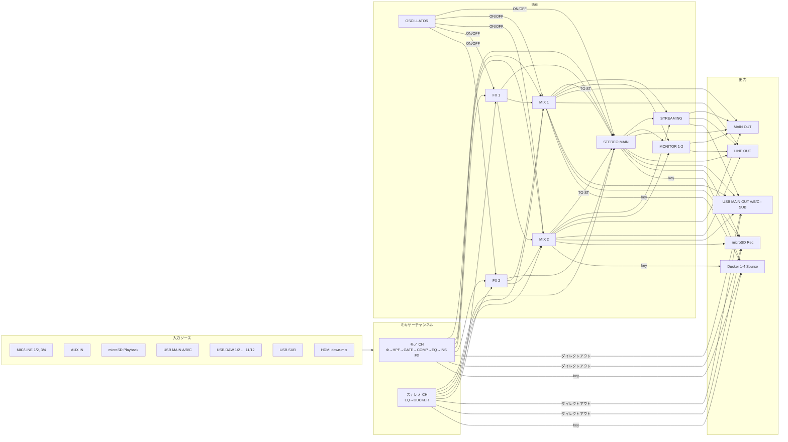

# 装置ルーティングモデル

> English version: [../en/device-model.md](../en/device-model.md)

本ツールが扱う YAMAHA URX シリーズのルーティング構造と接続制約を定義する。
これは GUI 上で「接続可能な経路のみ結線できる」制約 (constraint engine) の根拠であり、
コード (`src/models/`) のデータ定義はこのドキュメントと一致させる。

## 出典

- 公式ブロックダイアグラム: `USB AUDIO INTERFACE URX44V URX44 URX22 Block Diagram`
  (Yamaha Corporation, 2026、ファイル ID `MWEM-C0`)。
  URL: <https://usa.yamaha.com/files/download/other_assets/5/2927055/urx44v_44_22_block_diagram_en_c0.pdf>
- 公式ユーザーガイド (HTML): <https://manual.yamaha.com/audio/music_audio_production/urx44_urx22/ug/en-US/>

> 著作物のため PDF 自体はリポジトリに含めない。構造を本ドキュメントに自分の表現で再構成する。

## 機種パラメータ

| 項目 | URX22 | URX44 | URX44V |
| --- | --- | --- | --- |
| モノ入力チャンネル | CH1–2 | CH1–4 | CH1–4 |
| ステレオ入力チャンネル | CH3/4, 5/6, 7/8, 9/10 | CH5/6, 7/8, 9/10, 11/12 | CH5/6, 7/8, 9/10, 11/12 |
| MIC/LINE combo 入力 | 2 (2 は Hi-Z) | 4 (3/4 は Hi-Z) | 4 (3/4 は Hi-Z) |
| MIC IN (front mini) | あり (MIC/LINE 1 入力に内部結線) | 同左 | 同左 |
| AUX IN | あり | あり | あり |
| アナログ出力 | MAIN OUT | MAIN OUT + LINE OUT | MAIN OUT + LINE OUT |
| USB ポート | MAIN(32bit) + SUB(16bit) | MAIN + SUB | MAIN + SUB |
| USB DAW 録音 ch | 10 | 12 | 12 |
| microSD 録音 | なし | あり (最大16track) | あり |
| HDMI | なし | なし | IN / THRU (8→2 down-mix) |
| MIX Bus | STEREO + MIX1 + MIX2 | 同左 | 同左 |
| FX Bus | FX1 + FX2 | 同左 | 同左 |

## 信号フロー概略

## 接続の決定点 (constraint engine の根拠)

ルーティングは自由結線ではなく、装置内の固定信号路に対する **限られた決定点** で構成される。
各決定点は「接続元の集合」と「受け口の多重度」を持つ。本ツールはこれを `RoutingRule` として表現する。

接続種別 (`kind`):

- `source` — 受け口は **1 本のみ** (セレクタ)。チャンネルの入力ソース選択、Bus のソース選択。
- `patch` — 受け口は **1 本のみ** (出力パッチ / Signal Assign)。**ただし USB 出力は例外**で、MONO IN
  ペアの 2 チャンネルを 2 本の結線として受ける (後述 §6)。
- `key` — 受け口は **1 本のみ** (Ducker のサイドチェイントリガ選択)。`source` と同じセレクタだが、
  モノペアのソースミラーリングを持たないため独立した種別とする (後述 §10)。
- `record` — 受け口は **1 本のみ** (microSD Rec のトラックペアごとのソース選択、後述 §8)。
- `send` — 受け口は **複数可** (Bus はミックス加算)。レベル/パン/PRE-POST/ON を持つ。チャンネル/FX から Bus への Send。
  ただし固定の主フェーダー経路 (CH/FX チャンネル → STEREO) は LEVEL/PAN + **STEREO アサイン ON** のみで **PRE/POST を持たない** (後述 §2)。
- `sendSwitch` — 受け口は **複数可** だが **ON/OFF のみ** (個別のレベル/パンを持たない Send)。MIX→STEREO の「TO ST」Send。

> `source` / `patch` / `key` / `record` の受け口は選択ワイヤを 2 本受け付けない (ソースは 1 本のみ)。
> 唯一の例外は MONO IN ペアの片チャンネルを受けている USB 出力で、そのチャンネルの相方を 2 本目として
> 受ける。それ以外の 2 本目と 3 本目は受けない (§6)。STREAMING のソースは「1 本まで」ではなく
> 「ちょうど 1 本」に保つ — 本体のリストに None が無いためである (§4)。
> `key` のワイヤはキャンバス 上で `source` と同じ青のセレクタ色で描画される。

### 1. チャンネル入力ソース (`source`, 受け口 1 本)

各ミキサーチャンネルは以下から入力ソースを 1 つ選択する。MIC/LINE と USB DAW は実機の入力選択が
2ch ペア単位 (1/2, 3/4 / 1/2…11/12) のため、それぞれ 1 つのソースノードで表す。front mini ジャックは
MIC/LINE 1 入力に内部結線され、独立したソース選択肢としては存在しない。

| 選択肢 | URX22 | URX44 | URX44V |
| --- | --- | --- | --- |
| MIC/LINE 1/2 | ✓ | ✓ | ✓ |
| MIC/LINE 3/4 | — | ✓ | ✓ |
| AUX IN | ✓ | ✓ | ✓ |
| microSD Playback | — | ✓ | ✓ |
| USB MAIN A / B / C | ✓ | ✓ | ✓ |
| USB DAW 1/2 … N | ✓ (…9/10) | ✓ (…11/12) | ✓ (…11/12) |
| USB SUB | ✓ | ✓ | ✓ |
| HDMI (down-mix) | — | — | ✓ |

> URX44V では全チャンネル (CH1–4, 5/6, 7/8, 9/10, 11/12) が USB MAIN A/B/C・USB DAW 各ペア・USB SUB を
> 入力ソースとして選択可能 (実機確認済み)。
>
> **モノ CH のペア連動**: CH1–4 は CH1/2・CH3/4 がペアを成し (モノ CH が CH1–2 の URX22 は CH1/2 のみ)、
> 片方の入力ソースを確定するともう片方も同じソースに確定する (例: CH1 で MIC/LINE 1/2 を選ぶと CH2 も
> MIC/LINE 1/2 になる)。本ツールは同一ソースノードを両 CH へ結線して表現する (L/R は CH の位置で暗黙的に決まる)。
>
> **All Input / All USB DAW はソースではない**: INPUT 画面の `[All Input]` / `[All USB DAW]` ボタンは
> 固定テーブルに従って入力ソースを書き換える一括設定アクション (ユーザーガイド「Dedicated channel
> screen > INPUT screen」)。All USB DAW は全チャンネルを書き換える: CHn/n+1 = USB DAW n/n+1。All Input
> は表に載るチャンネルだけを書き換え、残りはそのまま — URX44V / URX44 は CH1/2 = MIC/LINE 1/2・
> CH3/4 = MIC/LINE 3/4・CH5/6 = AUX IN で、CH7/8 以降は更新しない。URX22 は CH1/2 = MIC/LINE 1/2・
> CH3/4 = AUX IN で、CH5/6 以降は更新しない。チャンネルごとに選択するソースではないため、ソースノード
> としては扱わない。
>
> **新規プランの工場初期ソース**: `新規` 計画は各チャンネルにキャプチャ済みの工場ソースを結線する。
> モノ CH は MIC/LINE (CH1/2 ← MIC/LINE 1/2・CH3/4 ← MIC/LINE 3/4)、ステレオ CH は CH5/6 = AUX・
> CH7/8 = USB MAIN A・CH9/10 = USB MAIN B・CH11/12 = USB MAIN C (ステレオソースは param 209/210 から読み取り・
> URX44V 実機確認・URX44 同一)。URX22 はステレオ位置で 1 ペア下げた CH3/4 = AUX・CH5/6 = USB MAIN A・
> CH7/8 = USB MAIN B・CH9/10 = USB MAIN C の推定 (実機キャプチャ未取得)。

### 2. チャンネル → Bus send (`send`, 受け口 複数可)

各チャンネル出力は以下の Bus へ Send する。**いずれも固定 (`fixed`) = 常時結線・削除不可**:
実機は Send ルーティングの削除を持たず、各先に **ON スイッチ (SEND_ON) とレベル**があるだけなので、
これに合わせる (旧モデルの「ワイヤ有無 = SEND_ON」は廃止し、ON/OFF は接続パラメーター `params.on`
(既定 ON) で保持する)。LEVEL は共通の **level_gain** スケール **-∞ … +10.00 dB** (UG p155・スライダー
最下=-∞ off、1 ステップ上が -96.0 dB)。全フェーダー/Send/モニターが共有する。このスケールは連続値ではなく
**離散かつ非均一なグリッド** (低域は粗く・0 dB 付近ほど細かい) で、これは実機の画面が提示する値の集合である。
このため例えば -15.0 dB は本体で入力できない (隣接する刻みは -16 / -14 と飛ぶ)。スライダーはこのグリッドを
**インデックスで走査**し、各刻みに等しい移動量を与えるので 0 dB 付近の密な刻みが詰まらない (`core/levels.ts`)。
ただし**制御リンク経由でグリッド外の値を書くと、実機は丸めずに保持する** — URX44V で実測、2 つの level
パラメータで 6/6、書いた値がそのまま読み戻り、それぞれ notify でも告知された。つまりこのグリッドは
**実機の UI が提示する集合**であって、保存が受け付ける集合ではない。読み戻しが入口でスナップしないのは
それゆえで (architecture.md)、プランは実機が実際に持つ値を述べる。
PAN/BAL は実機スケール
**L63 – C – R63** (UG は C を中央=nominal と記載・L63/R63 がハードパン端)。PRE/POST は **その Send を
STEREO 主フェーダー (= CH → STEREO のレベル) より前 (PRE) で取るか後 (POST) で取るか**を示す。
基準である STEREO Send 自身は PRE/POST を持たない。

- STEREO — チャンネルの主フェーダー経路。ブロックダイアグラムでは破線の SEND ブロックの
  *外側*にあり、LEVEL/PAN + **STEREO アサイン ON/OFF** を編集可。この ON はファーム V1.3 で追加された
  **フェーダー後段の SEND TO STEREO スイッチ** (`params.on`・既定 ON) で、**チャンネルマスター (CH_ON) とは独立**
  (CH_ON はチャンネル全体を、この ON は STEREO への送りだけを切る)。**PRE/POST は持たない** (この経路が
  PRE/POST の基準点のため)。初期レベルは **unity (0 dB)**。コンソールではヘッドの **MUTE チップ** がこの STEREO
  アサインを切り替え (MIX ストリップの MUTE が TO ST 送りを切り替えるのと同じ)、チャンネルマスター (CH_ON) は
  **スクリブル電源 LED** が担う (オフのときストリップが減光する・グラフの mute ノードと同じ)。
- MIX 1 / MIX 2 — LEVEL/PAN/**PRE/POST** + **ON/OFF (SEND_ON)**。初期は **-∞ (オフ) ・ON**。
- FX 1 / FX 2 — LEVEL/**PRE/POST** + **ON/OFF (SEND_ON)** (FX Bus への Send はモノで **PAN を持たない**)。初期は **-∞ (オフ) ・ON**。

全 Send が常時結線になるため (URX44V で約 48 本 = 8 CH × 4 + 2 FX × 3 + 8 CH→STEREO + 2 MIX→STEREO)、
削除での整理はできない。代わりに **off (`params.on=false`) / レベル -∞ の Send は盤面で減光＋細い破線**で
後退させ、有効な経路だけが浮かび上がるようにする。ツールバーの **「OFF send を隠す」** トグルでこれらを
完全に隠せる (既定は表示)。MIX → STEREO の TO ST スイッチ (§3) も同じ off 減光の対象。

> **BUS Type (MIX 1 / MIX 2、CH SETTING)。** 各 MIX Bus は VARI (Send ごとに可変レベル。既定でツールが
> モデル化する挙動) か FIXED (固定レベル — その Bus への Send は調整可能な LEVEL を持たない)。**Pan Link**
> (VARI 時のみ) は各 Send の PAN を Send 元チャンネルの PAN に追従させ、個別 PAN を編集不可にする。MIX Bus
> ノードに保持し、接続パネルは FIXED で LEVEL、Pan Link で PAN を隠し、短い注記を表示する。CONSOLE も
> SENDS ラックで同じロックを適用し、その MIX 列のミニフェーダー (FIXED) / SEND PAN ノブ (Pan Link) を
> read-only にする。

> 盤面上では PRE の MIX/FX Send を **破線＋ソース直後の琥珀色「PRE」タップマーカー**で表示し、接続を選択せずに
> 視認できる。POST (既定) は実線・無印。画像出力 (PNG/PDF) にも反映される。

### 3. Bus 間 (`send` / `sendSwitch`)

- FX 1 / FX 2 チャンネル → STEREO / MIX 1 / MIX 2 (`send`。**いずれも固定** = 常時結線・削除不可。実機は Send
  ルーティングの削除を持たず、各先に **ON スイッチ (SEND_ON) とレベル**があるだけのため、これに合わせる
  (§2 の入力チャンネル → Bus Send と同じ固定＋`params.on` モデル。全 Send で統一済み)。
  - **チャンネル → STEREO** は FX の主経路で **PRE/POST なし**・**STEREO アサイン ON/OFF あり** (LEVEL/BAL +
    V1.3 のフェーダー後段 ON `params.on`・主経路は PRE/POST の基準点)。
  - **MIX 1/2 への Send** は LEVEL/BAL/**PRE/POST** + **ON/OFF (SEND_ON)** を持つ。ON/OFF は接続パラメーター
    (`params.on`、既定 ON) で保持し、コンソールの **MIX 1/2 ラック有効チップ**で切り替える。
  - 初期レベルはいずれも **-∞ (オフ)** でシードし、上げるまで加算されない。**工場出荷状態は全て ON**
    (SEND_ON=1・レベル -∞) で、`新規` 計画にも ON でシードする。
  - 各 FX チャンネルは独自の**チャンネル ON/OFF** (ミュート) も持つ。入力チャンネルの CH_ON と同じ扱いで、
    **工場出荷状態は FX 1 / FX 2 とも ON**。これはコンソールの**スクリブル電源 LED** — ヘッド MUTE は
    → STEREO アサインの ON/OFF を指す (送りごとの ON/OFF は SENDS ラックにある) ため、チャンネルマスターが
    オフのときはストリップが減光する (電源 LED 消灯)。盤面のノードも同様に減光し MUTE タグが付く。
  - MIX 1 / MIX 2 Bus も独自の**マスター ON/OFF** を持つ (STEREO マスターの ON と同じ Bus マスタースイッチ・
    工場 ON)。MIX → STEREO の TO ST スイッチとは独立。コンソールの**電源 LED** (またはグラフのインスペクタ)
    で編集する — マスターがオフのとき MIX ストリップが減光する (チャンネルマスターの
    オフを示すのと同じ表示)。STEREO / MIX のインスペクタのトグルは FX チャンネルと同じ「チャンネル」
    ラベルで Parameters セクション最上部に並ぶ。
  - STEREO マスターと各 MIX Bus は**マスター BALANCE** も持つ — Bus 出力の L/R バランス (±63・中央 0。STEREO
    は param 583、MIX は 676 で Bus ごとに L/R instance 連動)。編集はグラフのインスペクタ (フェーダーの下) と
    CONSOLE の master / MIX ストリップ (`BAL` ノブ)。**Pan Link を ON にしても実機は BALANCE ラベルのまま**:
    Pan Link は各 *Send* の pan をソースチャンネルに追従させるもので、Bus 出力バランスとは独立。
- OSCILLATOR → STEREO / MIX 1–2 / FX 1–2 (`sendSwitch`、加算 Send ではなく ON/OFF
  アサイン。オシレーターは単一のグローバルレベルを持つ。ステレオ宛先はワイヤに独立 L/R
  (`oscL` / `oscR`) を保持し、FX Bus はモノ)
- MIX 1 / MIX 2 → STEREO (`sendSwitch`、ブロックダイアグラムの MIX 1–2 OUT 内「TO ST」。**固定** = 常時結線・
  削除不可。ON/OFF のみで独立した LEVEL/PAN は持たない。on/off は接続パラメーター `params.on` (TO ST スイッチ・
  **工場出荷は OFF**) で保持し、off は盤面で減光表示する。実機反映: param `677`、ステレオ MIX の L インスタンス
  (MIX1=0 / MIX2=2)。実機 param-notify で確定)

> **Post Fader Send for FX (DAW Integration メニュー、V1.2 以降)。** 各 FX Bus は MIX Bus から
> **post-fader** で追加供給できる (FX 1 ← MIX n、FX 2 ← MIX n)。対応 DAW ソフト接続時のみ表示される
> DAW Integration 専用機能で、単体の制御アドレスを持たないため、本ツールではモデル化**しない**。

### 4. ストリーミング / モニタソース (`source`, 受け口 1 本)

- STREAMING 入力ソース ← STEREO OUT / MIX 1 OUT / MIX 2 OUT (DELAY あり)
- MONITOR 1–2 ソース ← STEREO OUT / MIX 1 OUT / MIX 2 OUT (MONO)

**STREAMING のソースは常にちょうど 1 つである。** 本体の STREAMING のソース選択シートは STEREO・MIX 1・
MIX 2 だけを出し、None を持たない (MONITOR のシートは None も出す)。アプリも STREAMING を同じように保つ
(`DeviceModel.requiredSources`、工場出荷の選択は STEREO): 新規プランは STEREO → STREAMING を持ち、
STREAMING のソースを記述しない文書は読み込み時にその結線を与えられてステータス行でその旨を伝え、別の
ソースを STREAMING へ描画すると持っている結線を置き換え (アンドゥ 1 回分)、最後の結線は削除できない
(インスペクタはその結線に削除ボタンを出さず、置き換え方を伝える)。書き込みが STREAMING のセレクタ
(705 / 706) へ NONE を送ることは無い。それでも実機がそこに NONE を持つことはある (ソフトウェアの書き込みで
至るため): それを見つけた Fetch とライブ同期の開始は、代わりに STEREO をプランに与えてステータス行でその旨を
伝え、次の書き込みが実機を STEREO にする (ライブセッションでは、操作者の次の編集が始める flush)。リストに無いソース (チャンネルの
スロット) を見つけた読み出しはそれを取らず、STREAMING を未読み出しとし、ライブ同期は開始しない。それでも
プランが STREAMING の結線を持たないことはある — NONE を見つけた follow の読み出しと `.urxf` 取り込み、および
その結線を取り除くアンドゥ / リドゥ (そのようなプランへ描画したソースのアンドゥ、または実機の読み出しが
STREAMING のソースを動かした後に再生するエントリ) である。そのプランの書き込みはこのセレクタへ何も送らず、
STREAMING へソースを描画するまで実機は現状を保つ。

STREAMING チャンネルは **DELAY** を持つ (DELAY 画面、STREAMING チャンネル専用)。on/off、**Delay Time**
(1.00 … 1000.00 ms、0.01 ms 刻み)、**Frame rate** セレクタ (24 / 25 / 29.97D / 29.97 / 30D / 30 / 60 /
120) で構成される。遅延量は単一の時間値で、Frame rate はその時間をフレーム数で表示する際の換算にのみ影響し、
遅延そのものは変えない。結線ではなくストリーミング Bus ノード (インスペクタの DELAY セクション) で編集する。

### 5. 出力パッチ (`patch`, 受け口 1 本)

アナログ出力 (MAIN / LINE) のソース選択。

| 出力 | 選択可能ソース | URX22 | URX44/44V |
| --- | --- | --- | --- |
| MAIN OUT | STEREO / MIX1 / MIX2 / STREAM / MONITOR1 / MONITOR2 | ✓ | ✓ |
| LINE OUT | 同上 | — | ✓ |

> PHONES 1 / 2 / front は MONITOR 1 / MONITOR 2 / MONITOR 1 への **1 対 1 固定結線**で
> ソース選択を持たないため、DAW Rec と同様に**編集対象ノードとして表現しない**
> (ユーザーガイド: 「Monitor 1、2 の信号は PHONES 1、2 から出力されます」)。

### 6. USB OUT Signal Assign (`patch`, ソース 1 つまたは MONO IN ペア)

| 出力 | 選択可能ソース |
| --- | --- |
| USB MAIN OUT A / B / C | STEREO OUT / STREAM OUT / MIX1 OUT / MIX2 OUT / CH 1–N OUT / MONO IN ペア |
| USB SUB OUT | 同上 |

実機の一覧は、単独のチャンネルと並べて各 MONO IN ペアを項目として持つ。ペアは機種のモノ CH ペアで、
**URX44 / URX44V は CH 1/2 と CH 3/4、URX22 は CH 1/2 のみ** (URX22 の CH 3/4 はステレオチャンネルで、
それ自体が 1 つのソースである)。プランはペアを、出力へ入る**通常の `patch` 結線 2 本** (各チャンネルから
1 本ずつ) として持ち、ペア専用のフィールドは持たない。したがって USB 出力が受けるのは結線 1 本か、
1 つのペアの 2 チャンネルである 2 本 (順序は問わない) で、それ以外の 2 本目と 3 本目は拒否する
(`monoPairOnly`): キャンバスはそれを描画せず、それを持つドキュメント (ファイル・`?plan=` リンク) は
読み込み時に拒否される。

- **書き込む値。** ソース選択は L と R の 2 半分を持つ。単独のソースは自身の L / R ポートを書き
  (単独のモノラルチャンネルは自身の入力スロット 1 つを両半分に書く)、ペアは結線の並び順に関わらず
  **L = primary (奇数) チャンネルのスロット、R = 相方のスロット** を書く。URX44V (System 1.3.1.0) での
  実測では、制御リンク経由で L に CH 3 のスロット、R に CH 4 のスロットを書くと、実機の画面には `CH3/4`
  と表示され、実機の画面で `CH 1/2` を選ぶと L に CH 1 のスロット、R に CH 2 のスロットが告知される。
  USB 出力へのそれ以外の結線の組は先頭の 1 本だけとして書くので、書き終えた実機が保持するのは常に
  実機の一覧にある選択である。
- **読み戻し。** L に primary のスロット、R に相方のスロットがあればペアの結線 2 本として読み、両半分が
  同じモノラルスロットならそのチャンネル 1 本として読む (プランが持っていた相方の結線は外す)。ソース 1 つ
  にもペアにも当たらない組 — 逆順のペア、別々のペアに属する 2 チャンネル、片半分だけ選択されもう片方が
  空 — は**未読**のまま残る: ノードはプラン自身の結線を保って未読バッジを付け、読み出しレポートが両半分を
  名指しする。実機の一覧はこのどれも持たない。同じ実機での実測では、L に CH 4・R に CH 3、L に CH 2・
  R に CH 3、L に CH 3・R は空、のいずれも制御リンク経由で書くと受理されて保持され、そのうち最初のもの
  を実機の画面で読むとソース欄が**空欄**になる。プランが取るべき選択がそこに無く、アプリもこれらを
  書かない。
- **ペアの Signal Type は USB 出力に及ばない。** 同じ実機での実測: ペアのリンクとリンク解除 (Signal Type
  STEREO / MONO × 2、「固定 (結線不可) の要素」参照) は USB 出力のソースを元のまま残し、リンク中も一覧は
  各チャンネル単独の項目を持っていた。したがってリンク遷移は USB 出力を書かず、リンク済みペアの片
  チャンネルが単独で USB 出力へ入ることもできる。キャンバス上では、リンク済みペアのチャンネルを描画すると
  ペアごと出力へ入る ([architecture.md](architecture.md))。

### 7. DAW Rec Signal Assign (固定、ノード非表示)

- CH n OUT → USB DAW OUT n の **1 対 1 固定結線** (ブロックダイアグラムにソース選択 box は無い)
- ルーティングを変更できないため、**編集対象ノードとしては表現しない** (`USB DAW OUT` ノードは持たない)
- N = 10 (URX22) / 12 (URX44, URX44V)

### 8. SD Rec Signal Assign (`record`、トラックペア毎にソース 1 本、URX44 / URX44V のみ)

- microSD Rec は最大 **16 トラック** を **8 つのステレオトラックペア** (1/2, 3/4, … 15/16) として
  録音する。各ペアは録音ソースを **1 つ**選択する — **チャンネルペア** (CH 1/2 … CH 11/12)・
  **STEREO**・**MIX** Bus のいずれか (ブロックダイアグラム "SD Rec Signal Assign"・RECORDER メニュー
  = Track Count + ペア毎の Source 選択 + 読取専用レベルメーター)。
- **単一ソース選択** (`record`) であり加算 Send ではない: **ソース毎の level / pan / PRE-POST を
  持たない**。録音されるタップ位置はチャンネルの **Rec Point**。
- SD Rec ノード (`out.sdrec`) はヘッダで、8 つのトラックペアスロット (`out.sdrec.t1` … `t8`) がその下に
  積み重なってぶら下がり、各スロットへソースを結線する。**Track Count** が有効ペア数を決める
  (それを超えるスロットは非表示)。microSD 再生は 2 トラック (ステレオ) で、入力ソース
  `microSD Playback` 1 個として表す。

> **ライブ制御**: トラック毎のソース割当は vd で読み書きする (param 736・トラック毎に port ref 1 個)。
> **Track Count は readback のみで書き込まない** — param 839 への書込は実機に届くが、broker が 8 段階の
> うち 1 つに上限を切るため、ソフトウェアからは「2 トラック」しか指定できず、そこから上げ直すこともできない
> ([known-issues.md](known-issues.md) 参照)。工場割当は
> トラック 1-12 = CH 1-12・トラック 13/14 = none・トラック 15/16 = STEREO・Track Count 16。

> **録音トラック数の根拠**: URX44V は microSD へ **最大16トラック録音 / 2トラック再生**
> (Yamaha 公式 URX44V 製品スペック)。URX44 も microSD 録音に対応する。
> DAW 録音は USB 経由で **1–12 が個別チャンネル**として扱える (実機確認済み)。

### 9. HDMI THRU (固定パススルー、ノード非表示、URX44V のみ)

- HDMI 入力 (Audio 2ch + Video) → HDMI THRU の **1 対 1 固定結線**。ソース選択を伴わないため、
  DAW Rec と同様に**編集対象ノードとして表現しない**。
- HDMI 入力自体はチャンネルの選択可能な入力ソースとして残る。

### 10. Ducker キーソース (`key`, 受け口 1 本)

- Ducker 1–4 Source ← CH 1–N OUT / STEREO OUT / MIX 1 OUT / MIX 2 OUT (サイドチェーンのトリガ選択)
- **チャンネルをキーにした場合、キーはそのチャンネルの CH OUT — ダイレクト出力と同じ Rec Point タップで、
  フェーダー・Ducker より前段** — なので、キー元チャンネルのフェーダー・ミュートはトリガーに影響しない。
  Bus キー (STEREO / MIX) はその Bus の OUT、すなわち**出力 insert FX の後**。ブロックダイアグラムは
  `STEREO OUT` / `MIX 1 OUT` / `MIX 2 OUT` のラベルを `INS FX` ブロックの外側に置いており、
  `DUCKER 1-4 SOURCE` ブロックはその名前を入力に取る。チャンネルをキーにしたワイヤ選択時にインスペクタが注記する。
- **ステレオのキーは検出前に MONO へ加算される — 平均でも大きい側の採用でもなく、和。**
  ブロックダイアグラムはステレオのソース (CH 5/6-11/12 OUT・STEREO OUT・MIX 1-2 OUT) と
  Ducker Source セレクトの間に `MONO` ブロックを置いており、その中身がどちらなのかは実測で決着した。
  したがって ducker がしきい値と比べる値は、相関のある素材では**片チャンネル単体より 6 dB 上**、
  無相関では 3 dB 上に来る — センターに定位した音は、同じ音をハードパンしたときには掛からない
  ducker を掛ける。MONO IN チャンネルだけがこのブロックを素通りする。
- 各 Ducker は 1 つのステレオチャンネルに搭載されるため、Ducker 1–4 は機種のステレオペアに順番に対応する: URX22 = CH 3/4・5/6・7/8・9/10、URX44 / URX44V = CH 5/6・7/8・9/10・11/12。盤面のノードラベルは単に `Ducker` とし、搭載先ペアは副題 (`CH 5/6 · Source`) に表示する。1–4 の序数はブロックダイアグラム上の列挙であり、ぶら下げ位置で搭載先 CH が分かるためノードには重ねて表示しない。
- 表示上、Ducker は独立した出力ではなく搭載先チャンネルに属するため、専用種別 `ducker` のノードとして対応ステレオチャンネルの真下にぶら下げて描く (配置・移動・非表示の挙動は [architecture.md](architecture.md) 参照)。
- Ducker の ON/OFF (`duckerOn`、工場出荷は OFF) がオフのときは、ミュートしたチャンネルと同じくノードを減光し `OFF` タグを付ける (バイパスを示す。ミュートではないため `MUTE` ではなく `OFF`)。
- Ducker はチャンネル主経路の **フェーダー後段** にあるため、STEREO 主経路と POST 送りはダック対象だが、**PRE (pre-fader) 送りはその手前でタップするためダックされない**。Ducker ON のチャンネルに PRE 送りがある場合、インスペクタが固定接続の注記の隣にその旨を表示する (盤面には表示せず情報過多を避ける)。

## 固定 (結線不可) の要素

- チャンネルストリップの処理順 (Φ → HPF → GATE → COMP → EQ → INS FX) は固定。
  チャンネルの **Rec Point** (録音 / ダイレクトアウトのタップ) はこのチェーン上の段を選ぶ:
  MONO IN は PRE GATE / PRE COMP / PRE EQ / PRE INS FX / PRE FADER、ST IN (EQ のみ) は
  PRE EQ / PRE FADER。既定は PRE FADER。配線ではなくチャンネルごとのパラメータとして保持する。
  SSMCS モードでは選択肢から PRE EQ が外れ (モーフィング処理に独立した EQ 段がないため)、
  PRE EQ 選択中に SSMCS へ切り替えるとタップは PRE COMP へ移る (実機挙動。プランナーも同じ動作)。
  - **USB MAIN / SUB・microSD Rec へのチャンネルダイレクトアウトはこの Rec Point でタップする**
    (= フェーダー・Ducker より前段)。フェーダー / Ducker を通した信号をこれらの出力へ送るには
    STEREO / MIX Bus を経由する必要がある (Bus は Ducker 後段)。プランナーはこれを注記で示す
    (`core/routing.ts` の `directOutTarget`): チャンネル → USB/SD のダイレクトアウト結線には
    Rec Point タップである旨を表示し、**Ducker が ON のチャンネルが USB ダイレクトアウトへ結線されて
    いる場合はインスペクタ上部に警告**を出す (`duckerBypassWarnings`)。microSD Rec はドライ収録が正当な
    ため警告対象外で、Rec Point で段を選べる旨の中立な注記に留める。キャンバス 上、これらの経路は右端の
    出力ではなく**チャンネル上辺の専用 Rec Point タップジャック**から出るため、迂回が図からも読み取れる。
    詳細は `architecture.md` の「Rec Point タップジャック」節を参照。
- MONO IN は **COMP/EQ Type** (CH SETTING) で COMP→EQ と **SSMCS** (Sweet Spot Morphing Channel Strip)
  を排他に切り替える。SSMCS は COMP / 4-band EQ を専用のモーフィング処理に置き換える:
  **Sweet Spot Data** プリセット (汎用 6 + アーティスト/用途 28 = 34) を 1 つ選び、**Comp Drive** /
  **Morphing** / **Out Gain** で追い込む。内部のコンプは Attack / Release / Ratio / Knee と
  サイドチェインフィルタ (Q / Freq / Gain) を持ち、EQ は **3 バンド (Low シェルフ / Mid ピーキング /
  High シェルフ)** で 4-band PEQ とは別物。ST IN は SSMCS を持たない (常に EQ のみ)。
  インスペクタは Type に応じて COMP/EQ セクションを SSMCS セクションへ差し替え、SSMCS Main
  セクションは GATE と COMP の間に置く。SSMCS と COMP→EQ は実機上で別バンクで切替をまたいで保持
  されないため、Type 切替時は切替先バンクを工場初期へリロードする (実機と一致 — 切替元の編集は失われ、
  バンクへの再入は常に工場初期から始まる): SSMCS は COMP/EQ を ON にし全値を実機初期値にリセット、
  COMP→EQ は COMP OFF / EQ ON に戻し comp / 4-band EQ / EQ 1-knob を工場値へリロードする。GATE は
  Type 非依存で不変。SSMCS の初期値は実機 MONO IN の SSMCS バンク (既定 "01 Basic" プリセット適用) を
  読み取った値。
- 各 EQ (入力チャンネル + 出力 STEREO / MIX Bus) は **1-knob** モードを持ち、1 つのノブで 4-band PEQ
  全体を駆動する: **on/off**・プリセット **type**・**level** (エフェクト深度 0–100 %)。type は共有
  プリセットで、**どの EQ インスタンスも 3 種すべて**を持つ — Intensity / Vocal / Loudness。
  (画面別サブセットとして記録していたが実測で否定。実機の MONO IN 用 EQ 画面も 3 択を出し、TYPE
  書き込みは常にその型の中立点へ level を初期化する — これを以前のプローブが「実機がプリセットを拒否した」と
  誤読していた。) 1-knob ON 時は実機がノブから 4-band PEQ を
  再計算するため、ツールはバンド値を**書き込まない** (実機駆動)。インスペクタはバンドタブを隠し、
  書込みもバンドコマンドをスキップする。
- モノ CH とステレオ CH の構成は固定 (機種で本数のみ変化)。MONO IN ペア (CH1/2, CH3/4) は
  **Signal Type** (CH SETTING) を持つ: STEREO は隣接 2 ch をリンク、MONO × 2 は独立 (既定)。
  ツールは 2 ノードを維持しフラグをペアの primary (奇数 ch) に保持する (1 ノードに統合しない)。
  リンク時はペア間に ♥ タイを描く。STEREO は **PAN / BAL** モードを追加し、**STEREO 化時は実機と同じく
  BAL で入る**。モード切替時・STEREO 化時・STEREO 解除時に、ペア両 ch の**全 bus send**
  (STEREO / MIX 1–2 / FX 1–2) の pan を、実機が同じ遷移で動かすのと同様に初期化する (各 ch の CH PAN は
  STEREO への固定 Send の pan なので一緒に動く): PAN は奇数 ch を左 (L63 = −63)・偶数 ch を右
  (R63 = +63) にハードパン、BAL と STEREO 解除は両方中央 (C = 0) にし、Send pan はネイティブのステレオ ch
  同様 BALANCE 表示になる (GRAPH/CONSOLE 双方で同一表示)。
  **リンク済みペアはモードに関わらず 1 組の値を持つ**: 片 ch への編集はもう一方へ自動ミラーされる
  (下記のヘッドアンプを除くノードパラメーター + 各 Send の LEVEL/PRE-POST/ON)。実機がそうするためである。PAN モードでの実測:
  片メンバーの Gate Threshold・Gate ON・Comp Threshold・HPF 周波数・CH フェーダー・CH ON・STEREO アサイン
  ON・MIX Send レベル・MIX Send ON・MIX Send PRE-POST を書くと、もう一方の同じ値も動いた。
  **モードが決めるのは pan である**。BAL では pan はペア共有のバランス 1 値なので両 ch で一致し
  (上記の初期化が中央を起点として与える)、他と同様にミラーされる。PAN では各 ch が自分の CH PAN と
  Send pan を保持し、片メンバーへ書いてももう一方は遷移が置いた位置に留まった。Signal Type / PAN-BAL
  フラグは primary のみ保持。**ヘッドアンプは各メンバー自身の値である — A.Gain・Clip Safe・位相反転・
  +48V・Hi-Z の 5 つ**: リンク中に片メンバーへ書いても BAL でも PAN でも相方の同じ値は動かず、未リンクの
  ペアを**リンクしたときも** secondary の入力段は primary からコピーされず両者が自分の値を保った
  (2026-09-11 実測)。アプリのミラーもこの 5 キー (`gain` / `clipSafe` / `phase` / `phantom` / `hiZ`) を
  相方の値のまま残し、リンク遷移でも書かない — 別々の音源を繋いだペアは 2 つのプリアンプを保つ。メーターも Signal Type に応答する — 実機のチャンネル調整画面は
  どちらのモードでもこのペアを 1 チャンネルとして測る ([channel-tuning.md](channel-tuning.md))。
- **STEREO のペアが Insert FX に持てるのは Compander だけ**。ユーザーガイドのエフェクトリストで
  STEREO のチャンネルペアへのインサートを認めているチャンネルエフェクトは COMPANDER-H /
  COMPANDER-S のみ (ペアに挿すとステレオ動作になる) で、GUITAR AMP CLASSICS 4 種と PITCH FIX は
  「Signal Type が STEREO の場合は使用できません」。ツールはリンク中、ペア両メンバーの Insert FX
  メニューでこの 5 つをロックする (どちらのペアでも、ペアを持つ全機種で — エフェクトリストはこれを
  **エフェクトごと**に述べて機種名を 1 つも挙げておらず、そのガイドは 3 機種共通で、URX22 も他と同じく
  MONO IN と Signal Type を持つ)。Signal Type の遷移自体が
  ペアの保持していたエフェクトを**どちらの向きでも**クリアするので、Compander を持ったまま STEREO を
  解除すると解除される。これはレートではなくエフェクト個別の規則で、下記のレート上限を先に判定する
  ため、全上限を超えたレートではリンク中でもレートを理由として報告する。
- **全チャンネル/FX チャンネルの Send (STEREO 主経路 + MIX 1–2 / FX 1–2 Send)、および MIX 1/2 → STEREO の
  TO ST は固定**。常時結線され初期接続済みで表示し、削除不可。上記の要素と異なり LEVEL/PAN/PRE-POST/ON
  (SEND_ON、TO ST は ON/OFF のみ) を編集できるため、(表示ノード間の) 配線として描画する。固定なのは経路のみで、
  レベル・ON/OFF は調整できる。off (ON=OFF) / -∞ の Send は盤面で減光表示する (§2)。
- MONITOR 1 / 2 は出力 **ON/OFF** (実機 MONITOR 画面の [ON] ボタン、工場 ON) を持ち、MONITOR ノードと
  コンソールの MONITOR ストリップの**スクリブル電源 LED** で切り替える (MONITOR ストリップは → STEREO send を
  持たないため MUTE チップは無い)。
- PHONES 1/2/front は MONITOR Bus への 1 対 1 固定結線 (ソース選択なし、ノード非表示)。PHONES は
  対応する MONITOR Bus と同一信号だが独立した **PHONES Level** (単位なしの 0.0 … 10.0 スケール、
  モニタフェーダーとは別) を持ち、MONITOR 1 / 2 ノードで編集する (PHONES 1 ↔ MONITOR 1、
  PHONES 2 ↔ MONITOR 2)。
- CUE Bus (ソロ/モニタ割り込み) は **表現しない**: ルーティングが電源 OFF で削除され、
  保存する計画として永続的な割当を保持できないため。

## サンプルレート依存の制約

| 制約 | 条件 |
| --- | --- |
| INS FX 利用不可 | サンプルレート 96 kHz 超 |
| ステレオ ch (CH 5/6–11/12) の EQ 利用不可 | サンプルレート 176.4 / 192 kHz |
| FX2 利用不可 | サンプルレート 96 kHz 超 |

> これらは **警告** として表示し (インスペクタの注記 + 該当ノードの減光・破線表示)、結線自体の
> 禁止には用いない — 実機もレート変更で結線を消すのではなく設定が無効になるだけで、この挙動と
> 整合する。サンプルレートは計画ごとに設定し、計画 JSON に保存する。
