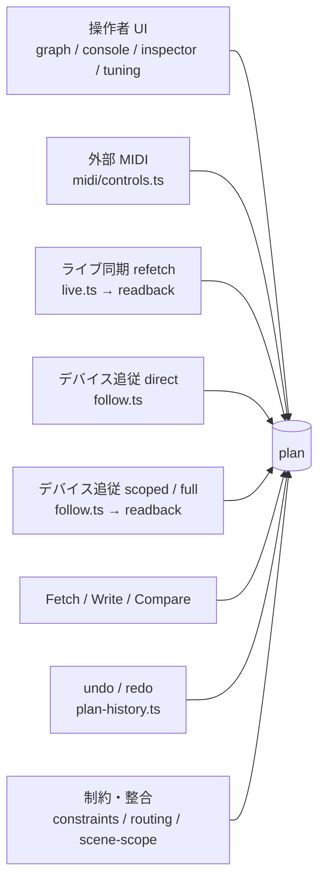

# ライブ同期レース診断ハーネス

ライブ同期中に、操作者の編集がデバイス由来の読み戻しに追い越されたり、送信されないまま
スナップショットに飲まれたりする欠陥を、体系的に検出するための計装ハーネスの設計。

## 背景 — なぜ個別修正ではないのか

ライブ同期中、1 つの可変 `plan` オブジェクトに対して 8 系統が独立に書き込む。所有権も版も
「誰が最後に書いたか」の記録も無い。



このうち refetch・追従・Fetch の 3 系統は、**読み始めた時刻と書き込む時刻が数百ミリ秒から
数秒離れる**。`readback.ts` はノードごと丸ごと代入するため、読みの途中で入った操作者の編集は
黙って上書きされる。上書きの後にスナップショットが採り直されると、その編集は差分ですら
なくなり、デバイスへ届かないまま消える。

同じ形は EQ 1-knob に限らず、COMP 1-knob、`compEqType`、insert FX セレクタ、MIDI pickup、
`captureSnapshot` の全呼び出しに等しく成立しうる。個別に潰すと 1 件ごとに実機セッションが要り、
直したことの証明も残らない。

## 段取り

| 段 | 内容 |
| --- | --- |
| 1 | トレースバス + フロントのタップ + contract テスト + `ci.yml` の drop guard |
| 2 | オフライン解析器 + 不変条件 |
| T-1 | 疑似デバイスと、その自己適合ケース |
| 4 | 台本ジェスチャ駆動 + CI ジョブ |
| 5 | 実機較正と、解析器が出した違反ごとの修正 |

T-1 を飛ばすと T0 の床が意味を持たない。疑似デバイスが指定通りの遅延・notify・拒否を出せて
いるかを、疑似デバイス自身のログで先に確認する。

**段 3 (Rust 側タイムスタンプと `performance.now()` / `Instant` の時計較正) は取り下げた。**
このハーネスの経路に Rust は 1 行も入らない — 疑似デバイスは `window.__TAURI_INTERNALS__` ごと
差し替えるので、`ParamUpdate` / `MeterUpdate` に時刻を載せてもどのケースからも到達できず、読む側も
存在しない。加えて `ParamUpdate` は `PartialEq` を導出して `BULK_CHANGE` との比較に使っており、
時刻フィールドは等価性の意味を壊す。実機の往復のどこで時間を使っているかという問いは、経過時間を
既に計測している self-test / Compare 側の診断機能に属する。**計装は測る対象があって初めて意味を持つ**
ので、この段は「あとで」ではなく無しにする。

## 確定した方針

- **観測性**: `VITE_TRACE=1` の専用ビルド（`VITE_DEMO` と同じビルドフラグ方式）で probe を含む
  production 形状バンドルを作り、計装ティアだけそれを配信する。既存の production 配信 E2E は
  無改変で、通常ビルドに probe は入らないため `ci.yml` の drop guard はそのまま効く
- **Tauri event plugin を疑似デバイスに実装する**（`transformCallback` + `plugin:event|listen`）。
  無いと `dropzone.ts` が DOM ハンドラを登録せず `tauri://drag-drop` も届かないため、ドラッグ &
  ドロップが両方向から到達不能になり、`menu://edit` も発火しない
- **時計制御はバリア方式が基本**。疑似デバイスが特定の `vd_get` / `vd_set` を Promise で止め、
  テストが解放した瞬間にページ内からジェスチャを撃つ。窓の境界が判定になるケースはこれ以外に
  弁護できない。IPC に紐付かない 50 ms 以下の窓だけ `page.clock` を明示ステップで併用する
- **WebKit プロジェクトを 3 ケース限定で追加**。前例は `scripts/meter-bench-run.mjs`
- **機種軸は URX44V と URX22 の 2 機種**

## 変える軸

| 軸 | 値 |
| --- | --- |
| ジェスチャ形状 | 単発クリック / 連続ドラッグ / キーオートリピート / ホイール連打 / テキスト入力 / モーダル開閉 / 合成 pointerdown（pointerup 無し） / 多段フロー |
| 編集の投入位相 | 0-40 ms / 41-119 ms / 120-170 ms / 171-299 ms / 300±20 ms / 301-899 ms / 900 ms 以降 / 45-55 ms |
| デバイス遅延 | 0 / 25 / 100 / 250 ms、派生してノード読み 0.9-2 秒・全体読み 6-27 秒 |
| notify 挙動 | 無言 / echo のみ / echo と実変化 / 実変化のみ / 集中度しきい値超のバースト / BULK_CHANGE / 未登録アドレス |
| 第 2 の操作者 | 無し / MIDI absolute / MIDI pickup / MIDI トグルとフィードバック / 実機パネル掃引 / undo / ファイルフロー |
| 失敗注入 | 無し / 書込拒否 / 応答コード 400 / 読込拒否 / 受理して無視 / リンク切断 / device-lost ラッチ / メーター失敗 |
| 書込アドレス集合の形 | 形状不変 / バンク入替 / 集合縮小 / エンジン再束縛 / ワイヤ依存 / 解決不能な穴 / scene スコープ / 文字列経路 / planExternal |
| 画面状態 | GRAPH / CONSOLE / CONSOLE 非表示 / チューニング画面 / 他モーダル / テキストフォーカス / MIDI パネル |
| undo 項目の状態 | 未開 / 境界を持たない項目が開いている / 押下中 / ドラッグ中 / テキストフォーカス中 / 適用中 |
| 機種 | URX44V / URX22 |

投入位相の各値は、次の実定数の縁に置いてある。

| 定数 | 値 | 位置 |
| --- | --- | --- |
| `DEBOUNCE_MS` | 120 ms | `src/core/control/live.ts` |
| `RECONCILE_DEBOUNCE_MS` | 300 ms | `src/core/control/follow.ts` |
| `IDLE_FULL_MS` | 900 ms | `src/core/control/follow.ts` |
| `MAX_CONCENTRATION` | 3 | `src/core/control/follow.ts` |
| `REFLECT_MIN_MS` | 50 ms | `src/main.ts` |
| `IDLE_COMMIT_MS` | 300 ms | `src/ui/history.ts` |
| `RECENT_MS` / `ECHO_MS` | 300 ms | `src/core/midi/engine.ts` |

### 定数の読み方で誤りやすい 3 点

- `armSettle()` と `armIdle()` は両方張られ、settle 側の照合は idle タイマーを解除しない。
  echo でない notify 1 発ごとに、300 ms 後の scoped または強制照合と、900 ms 後の**全体**照合が
  必ず両方走る。「scoped だけで済む」経路は存在しない
- `REFLECT_MIN_MS` は 50 ms の合流遅延ではなく先頭縁レートリミット。直前 50 ms に反映が
  無ければ待ちは 0
- `isEcho` に時間窓は無く、書込のスナップショットは ack の**後**に書かれる。判別変数は
  「自分の ack に対して echo が先か後か」であり、遅い echo ではなく早い echo だけが問題になる

## 不変条件

解析器が機械判定する。違反ごとに該当レコード対を出す。

| 番号 | 名称 | 内容 |
| --- | --- | --- |
| 1 | 追い越し | デバイス由来の書込で、その読みの開始が同一キーへの UI 書込より前 |
| 2 | 取りこぼし | UI 書込に対応する書込コマンドが、次のスナップショット採取までに 1 件も出ていない |
| 3 | スナップショット汚染 | 採取時点で、送信済みでない値がスナップショットに入った (節 A)。または、そのアドレスへ最後に送った値とエントリが矛盾する (節 B「値の形」・オプトイン) |
| 4 | 区間重複 | flush / refetch / scoped 照合 / 全体照合 / Fetch / Write のうち 2 つ以上が時間的に交差 |
| 5 | echo 誤判定 | 直前に同値で書いたアドレスの notify を非 echo と判定した、またはその逆 |
| 6 | 刺激の到達性 | ケースが押した notify をブリッジが拒否した = アプリは何も見ていない (節 A)。プランが発行しているのにそのセッションが登録していないアドレス = デバイス側変更が配達不能 (節 B「育った窓」)。その背後に旧「登録遅れ」検査をハーネス自己点検として残す (節 C) |
| 7 | 反映遅延 | プラン書込から実描画までがフレーム予算を超過 |
| 8 | 送信順序 | 送信列が翻訳の意図順（セレクタが配列より前）を守っているか |
| 9 | ジェスチャ‑項目整合 | 1 操作ジェスチャが正確に 1 undo 項目、または証明可能に 0 |
| 10 | 切り離された対象への書込 | DOM 対象が置換された、またはポインタ捕捉を失ったハンドラからの書込 |
| 11 | メータースロット排他 | 生きた登録は常に 1 つ。自分が持たないストリームを解除しない |
| 12 | アドレス集合の一致 | 発行コマンド集合とスナップショットのキー集合が一致 |
| 13 | 著作者帰属 | 台帳の全書込が正確に 1 人の書き手に解決する |
| 14 | 孤児プランへの書込 | `main.ts` がもう参照していない `Plan` への書込 |
| 15 | 拒否の完全性 | 拒否は状態を消費せず、条件解消後の同一再試行が 1 回で通る |
| 16 | 終了後の静止 | セッション終了またはプラン差し替えの後に、書込・IPC・タイマーコールバックが無い |

3 も 2 節構成で、後者は**オプトイン**である。節 A は従来のもの — 走行中に一度も送っていない値がスナップ
ショットに入っており、次の差分が実機に渡したことのない値を基準に測ってしまう。節 B は**値の形**で、その
アドレスは送っているのにエントリが別の値を持つ。書込後の読み staleness が作るのはこの形である: フラッシュが
X を書き、staleness 窓の中の読みが書く前の値を返し、その後の `capture` が、同じフラッシュがそこへ書いた
エントリの上にその値を載せる。次の差分の盲点になるだけでなく、X に対する実機自身の notify が他人の変更として
届く (`live.ts` の `isEcho` は素のスナップショット一致) ため、誰も頼んでいない scoped リコンサイルとアイドル
スイープの費用も付く。節 B はケースが `deviceState` (`snapshot` と同一瞬間に読んだ `memOf`) を渡したときだけ
走る。無いと偽陽性の量産機になる免責が 2 つ要るためである: **アプリ自身が走行中に送った**値は、自分の書込が
別の順で戻ってきたものであり、**実機が保持している**値は丸め込みのケースである — `capture()` はあらゆる
実機読み出しからスナップショットのエントリを動かすので、「最後の送信と食い違う」だけでは何も証明しない。
既存ケースはどれも渡していないので、判定が変わったケースは無い。

6 は当初「毎フラッシュで一致するか」を検証する条件だったが、追従の登録は `begin()` と照合完了
後にしか更新されない設計であり、アプリ側の構造編集は登録を古いまま残す。したがって**設計通りの
挙動**である。疑似デバイスがブリッジの登録集合フィルタを持って以降、この条件は 2 節構成になった。
番号は表・解析器・参照している全ケースを揃えたまま保つため据え置く。

- **節 A ── 刺激の到達性**。`registrationWindow` 内の `notify-drop`。ケースが押した notify を
  ブリッジが拒否した = それが引き起こすはずだったものはアプリに届いておらず、それに乗った不在判定は
  無条件に通る。この不変条件の実働主題はこちらで、**ケースが何も測っていないとき**にちょうど発火する。
  ただし**拒否そのものが主題**のケース (microSD Track Count、CH → FX タップ、scene スコープが落とす
  アドレス、SETUP > GENERAL) は該当アドレスを `expectedDrops` に列挙し、節 A はそれを差し引く。
  さもないとケース自身の判定が所見として印字され、ブリッジのフィルタが作ったまさにその一群で
  「clean」が clean を意味しなくなる。節 B・C と違い `registration` を持たずに判定する ── 落ちた
  notify が届いていないことはケースが登録を捕捉したかどうかと無関係であり、登録の有無で門を作ると
  登録を捕捉しないケース全部でこの検査が黙って失われる。
- **節 C ── 登録遅れ**。登録スナップショットの外にある**配達済み** notify (センチネルは除外)。
  フィルタ導入後、これはもうアプリについての観測になり得ない ── 到達経路は `BULK_CHANGE` センチネル
  (アドレスを持たないので除外) か、間違った瞬間を指す `registrationWindow` しかない。ケースが与えた
  窓に対する**ハーネス自己点検**として残す。

- **節 B ── 育った窓**。`emitted ∖ registered` = アプリが現に書いているのに、デバイス側変更を
  ブリッジが落とすアドレス。`follow.subscribe()` は `begin()` と照合完了後にしか再登録しないので、
  構造を変える編集は何かが照合するまで窓を開けたままにする。発行集合は書込からではなく
  **ライブスナップショットのキー集合** (spec の `snapshot`・trace probe 由来) として読む: 書込ベースの形は
  不変条件 12 が既に計算しているうえ、**状態**の読み取りとしては両方向に誤る ── 窓が開いたままでも
  grow フラッシュが窓から出れば沈黙し、後の `capture()` が閉じた窓を報告し続ける。同一瞬間の 2 つの
  読みに対する状態述語なので `registrationWindow` は適用されず、`snapshot` を `registration` と
  対で渡す必要がある。

節 B の clean は「発行集合が登録集合に収まっている」を意味**しない**。次のものは見えない: `planToCommands`
には既に居るがまだフラッシュされていないアドレス (不変条件 2 の主題)、既に閉じた窓、文字列パス
(`vd_set_str` = CH 名・Sweet Spot Data。スナップショットにも登録にもエントリを持たない)、`planExternal`
param、セッションが無い状態。逆向きの差は意図的に判定しない: `FOLLOW_USB` (848) は手で登録に足されて
おりどのスナップショットにも無いが、これは無害な向きである。

`vd_params_subscribe` の `addrs` 引数がそのまま登録集合なので、以上はすべて機械的に採れる。

この 3 節は番号を共有していても問いの種類が違うので、所見 (`Finding`) はすべて **`class`** を持つ ──
`product` (アプリが誤動作した) / `case` (ケースが何も測っていない可能性がある) / `harness`
(ハーネスが自己矛盾した) ── で、`report()` は不変条件番号より先に class で束ねる。既定は `product`
で、条件 6 以外はすべてこれ。条件 6 の内訳は節 A が `case`、節 B が `product`、節 C が `harness`。
読み手が答えるべき問いが群ごとに違う ── アプリを直すのか、ケースを直すのか、ハーネスを直すのか。

## ティアとケース

各ティアは前のティアが緑でなければ解釈できない。T0 が赤いまま T1 が赤いのは、アプリではなく
ハーネスのバグ。

ケースごとの手順・疑似デバイス設定・判定は `e2e/race/t*.spec.ts` の各ファイルが唯一の真実として持つ。
この表は何を測るケースなのかを述べる。

### T0 baseline — 床と到達性

| id | 対象 | 何を測るか |
| --- | --- | --- |
| `baseline-quiescent-floor` | 全体 | 無操作のライブセッションが書込も読み戻しも生まないこと。全ケースの判定はこの痕跡との差分 |
| `baseline-single-edit-latency-ladder` | console | 単一編集を 4 遅延で。以降の全位相が測られる基準線と、遅れのどこまでが回線かの較正 |
| `baseline-graph-surface-sweep` | graph | GRAPH の全ジェスチャが駆動語彙で撃てること。書かないはずのジェスチャが本当に書かないことの否定側判定 |
| `baseline-console-surface-sweep` | console | CONSOLE の全操作。フェーダーの可動域が 3 か所で別々に書かれている件を既知オフセットで連続実行 |
| `baseline-inspector-surface-sweep` | inspector | 全ノード種の全制御。「トグルは再描画、スライダーはしない」規則を制御ごとに固定 |
| `baseline-tuning-surface-sweep` | tuning | GATE / COMP / EQ 画面。閉じ方 3 通りと fine グリッドの適用範囲 |
| `baseline-shell-flows-sweep` | 混合 | 同意ゲート・ライセンス・読込報告・レート選択・更新確認・投入・最近使用・環境設定の全行 |
| `baseline-view-locale-churn` | 混合 | ジェスチャ中に全再構築を起こす唯一のデバイス非依存の経路 (言語・テーマ・ビュー切替) |

### T1 overtake — 追い越しと取りこぼしの本体

| id | 対象 | 何を測るか |
| --- | --- | --- |
| `overtake-scoped-readback-vs-edit-ladder` | console | scoped 読みが編集を追い越す最小形。読み窓に沿って位相を振る |
| `overtake-full-reconcile-vs-edit-ladder` | 混合 | 数秒の全体照合が編集・undo・プラン差し替えを受け付けてしまうか |
| `overtake-edit-during-flush-send-loop` | console | 送信ループ内の 2 度目以降の編集。単一の保留枠が複数編集を畳むか |
| `overtake-edit-during-converge-await` | inspector | 凍結コピー経路の対照。ここが赤ければコピーが失われている |
| `overtake-edit-during-refetch-await` | tuning | 生プランを採るスナップショットに編集が飲まれる。対照との差が欠陥の所在 |
| `overtake-converge-and-refetch-one-flush` | 混合 | 2 つの修復が 1 フラッシュに乗り、弱い方が後に走る |
| `overtake-converge-latch-starvation` | console | 送信が枯れる方向の欠陥。連続編集中にデバイスへ何も届かなくなるか |
| `overtake-notify-echo-vs-genuine-during-flush` | console | 位相とアドレスを固定し、真の echo かどうかだけを変える |
| `overtake-direct-notify-ahead-of-the-send-loop` | console | 凍結されたコマンド列がまだ到達していないアドレスへのデバイス側変化 |
| `overtake-reconcile-during-reconcile` | 混合 | 照合自体の再入。操作者を入れずに測る |
| `overtake-direct-scoped-coalesce-boundary` | console | 反映合流窓の縁で、直接反映が全体反映へ格上げされるか |
| `overtake-drag-flush-backpressure` | console | 現実的なドラッグと現実的な回線。操作者が体感する収束時間 |
| `overtake-refetch-reads-before-the-write-settles` | tuning | 疑似デバイスに状態が無かった唯一の窓 = 受理済みでまだ報告できない書込。`t1c-refetch-stale.spec.ts` |

### T2 shape-change — 書込アドレス集合の形を変える param

| id | 対象 | 何を測るか |
| --- | --- | --- |
| `shape-comp-eq-type-bank-swap` | inspector | アドレスの同一性と値の極性が同時に変わる唯一の param |
| `shape-eq-oneknob-registration-blindspot` | tuning | 再計算を起こした当のブール値が、再計算の通知先を集合から外す自己盲目。落ちた窓の正典 |
| `shape-eq-oneknob-level-refetch-storm` | tuning | ドラッグ中に毎フラッシュ読み戻しが走り、履歴が再基準化され続ける |
| `shape-insert-fx-select-ordering` | inspector | 値ではなくコマンド 2 件の順序が正しさを決める唯一のケース |
| `shape-insert-fx-engine-array-collision` | inspector | 2 つのプラン所有者が 1 つのデバイスアドレスを共有する構造的衝突 |
| `shape-fx-effect-type-slot-family` | inspector | param id ではなくスロット集合が変わる。undo が構造上不完全になる |
| `shape-signal-type-pair-link` | inspector | 書込が別ノード全体をデバイス側でリセットする唯一の param |
| `shape-pan-bal-mode-switch` | inspector | デバイスが他の接続の値を書き換える。undo 自体が古い書込になる |
| `shape-bus-type-and-pan-link-locks` | 混合 | ノード A への書込が、書かずにノード B・C の観測状態を変える |
| `shape-sdrec-track-count-readonly` | 混合 | デバイスが受理して破棄する唯一の param。中断原則の否定対照。デバイス側変更は届かない |
| `shape-sample-rate-and-follow-usb` | 混合 | 常に書込集合の先頭にあり、デバイスが自力で戻せる唯一のスカラー |
| `shape-scene-write-scope` | 混合 | 非プランの設定が、書込差分・スナップショット・登録を一斉に作り替え、落としたアドレスへの追従を盲目にする |
| `shape-routing-wire-selectors` | graph | 意図的な NONE 番兵と、偶発的な穴（何も言わない）を並べる |
| `shape-send-emission-wire-presence` | console | 最も日常的な操作が、モード切替に見えない形で集合の形を変える。読み取り専用の FX タップは追従不能 |
| `shape-refused-and-acked-writes` | 混合 | 3 つの拒否形と、閉じない差分がフラッシュループを作らないか |
| `shape-string-path-writes` | 混合 | 差分機構を完全に迂回する書込。無害な例と重大な例を並置。デバイス側リネームは配達されない |
| `shape-device-setup-plan-external` | 混合 | 一度も発行・読戻・登録されない = 配達されない param 群と、唯一の傍受フック |
| `shape-insert-fx-rate-and-slot-availability` | inspector | 発行の門ではなくデータとして表現された制約と、ノード間の取り合い |

### T3 undo — 境界・和音・拒否・再基準化・リセット

| id | 対象 | 何を測るか |
| --- | --- | --- |
| `undo-pointer-boundary-ladder` | console | 遅延確定・保留の着地・ドラッグ畳みの 3 規則をマクロタスクの縁で |
| `undo-drag-latch-and-orphan-press` | 混合 | pointerup を伴わない合成 pointerdown が待機時間の受け皿を封じる |
| `undo-keyup-autorepeat-boundary` | console | ステップキーは境界、文字キーは境界でない、の 2 規則を同一走行で |
| `undo-focusout-text-boundary` | graph | 待機間隔を意図的に超えても確定させたくない唯一の形 |
| `undo-idle-backstop-wheel-ladder` | inspector | DOM 境界を持たないジェスチャを、それを定義する定数の縁で |
| `undo-window-blur-mid-drag` | console | ポインタイベント無しでジェスチャが終わる唯一の経路 |
| `undo-diff-at-commit-post-mutations` | inspector | 漏斗自身が `markChanged` の後に行う 4 か所の追加変更 |
| `undo-empty-diff-and-redo-stack` | graph | スタック自身の算術（空差分・redo 無効化・上限退避）と遷移時のみの深さ報告 |
| `undo-chord-ownership-matrix` | history | 7 つのフォーカス対象 × 8 つの和音形。誰が打鍵を所有するかの網羅表 |
| `undo-refusal-ladder` | history | 拒否の順序と、拒否が項目を消費しないこと。許容側も含む |
| `undo-apply-sequence-hidden-and-viewport` | graph | 適用の順序そのものと、undo の書込がデバイスへ届くこと |
| `undo-during-device-activity-ladder` | history | 5 つのデバイス動作 × 5 つの位相。門が経路ごとかリンクごとかを表にする |
| `undo-entry-survives-device-sweep` | history | 実機を触っている間のアプリ編集が 1 エントリとして残り、その下の既存エントリも残ること |
| `undo-reset-paths-and-pending-commit` | history | 7 つのリセット経路と、リセットを生き延びる 2 つの競合 |
| `undo-macos-edit-menu-path` | history | 唯一のネイティブ面。和音と拒否順序が異なる唯一の経路 |

### T4 midi — 門を持たない第 2 の操作者

| id | 対象 | 何を測るか |
| --- | --- | --- |
| `midi-vs-main-fader-absolute` | midi | MIDI の反映が、捕捉中のポインタの下でストリップを差し替える |
| `midi-vs-send-fader-relative-baseline` | midi | 相対ドラッグは MIDI 書込を上書きではなく算術で消す |
| `midi-pickup-without-output-port` | midi | 出力ポートが開いていないと pickup が解除されない |
| `midi-toggle-echo-window-ladder` | midi | 1 発限りの防御が、本物の押下とループバックを区別できない |
| `midi-gang-fanout-and-head-reelection` | midi | 1 対多の書き手と、無関係な編集が所有権を移す |
| `midi-learn-arm-during-rerender` | midi | 第 2 操作者の**設定**がデバイスと競合する唯一のケース |
| `midi-write-during-refetch-snapshot` | midi | 門を持たない書き手と、スナップショット再基準化の組み合わせ |
| `midi-rebase-eats-ui-entry-ladder` | midi | 単一の書き手が 2 つの矛盾する分類を受ける唯一の場所 |
| `midi-14bit-pair-and-cross-binding` | midi | 値の方針ではなくメッセージの復号。永久に発火しない割当も作れる |
| `midi-bal-mirror-clobbers-partner` | midi | 衝突がアプリ側 2 者間で、鏡映を介して起きる唯一のケース |

### T5 drop — 失敗注入

| id | 対象 | 何を測るか |
| --- | --- | --- |
| `drop-link-loss-mid-flush-ladder` | 混合 | セッション終了宣言の後に何件の書込が漏れ出るか |
| `drop-link-loss-mid-reconcile` | 混合 | 半分だけ読めたプランが権威として反映され、履歴がそれに対してリセットされる |
| `drop-write-reject-mid-send` | 混合 | 再試行が新鮮な差分から組まれ、順序が中断を生き延びるか |
| `drop-read-reject-mid-fetch` | 混合 | 生きた書き手が前任のプランに繋がったままになる唯一の経路 |
| `drop-device-lost-latch` | 混合 | リンクイベントとして来ない唯一の切断形。消耗による失敗 |
| `drop-bulk-change-sentinel-mid-drag` | console | 最大のデバイス側事象が、最小のアプリ状態（押下中のポインタ）に落ちる |
| `drop-unknown-address-notify-storm` | 混合 | 3 本立て: 解決不能 (落ちた窓) / 解決可能 / 未登録 (拒否) |
| `drop-missed-notify-idle-net` | console | デバイスが何も言わない場合。安全網の起動条件が守る対象と同じか |
| `drop-concentration-threshold` | 混合 | 追従層で唯一の整数しきい値をまたぐ |

### T6 teardown — セッションとプランの生存期間

| id | 対象 | 何を測るか |
| --- | --- | --- |
| `teardown-plan-replacement-during-reconcile` | 混合 | Fetch を守る門が、追従が始めた同一の読みを守っていない |
| `teardown-model-switch-during-flush` | 混合 | アドレス語彙そのものが実行中の操作の下で変わる |
| `teardown-live-toggle-race` | 混合 | セッション生存期間そのもの。世代印が反証可能になる唯一の場所 |
| `teardown-deactivate-with-armed-timers` | 混合 | モジュール水準のラッチがセッション毎に閉じているか |
| `teardown-dyn-screen-close-during-refresh` | tuning | ドラッグ保護のための遅延機構自体が危険になる |
| `teardown-flow-refusals` | 混合 | 守られた読みと守られていない読みを、同一のフロー (File > New・File > Open・機種切替) で対比 |

### T7 meter — プロセスに 1 つの購読

| id | 対象 | 何を測るか |
| --- | --- | --- |
| `meter-slot-handover` | 混合 | 受け渡しの基準線。以下 2 件はこれとの差分 |
| `meter-late-unsub-kills-console` | 混合 | 閉じた画面の遅れた解除が、コンソールの新しいストリームを落とす |
| `meter-rescope-inside-subpending-ladder` | console | 登録待ちの中に届いた再スコープが丸ごと落ちる |
| `meter-tap-change-resubscribe` | console | 1 ストリップの変更で全ストリップが黙る。機種別表の解決も |
| `meter-feed-paint-vs-follow-churn` | console | 正しさではなく費用を測る唯一のケース |
| `meter-error-ends-session` | 混合 | 報告された失敗と沈黙した失敗の差 |

### T8 stress — 収束・ファズ・ジッタ・リーク

| id | 対象 | 何を測るか |
| --- | --- | --- |
| `stress-three-operators-one-node` | 混合 | 操作者・MIDI・実機パネルが 1 チャンネルを同時に駆動して収束するか |
| `stress-seeded-schedule-fuzz` | 混合 | 誰も仮説を立てなかった 3 者同時の交錯。種で決定的に再現できること |
| `stress-latency-jitter-storm` | console | ジッタは応答の到着時刻を散らす。固定遅延との対比で「散らばり」と「キュー深度」を分ける |
| `stress-long-session-quiescence` | 混合 | 操作が生む状態ではなく、操作を生き延びる状態 |

### 差分設計

多くのケースが同一ジェスチャの位相梯子、または 1 変数だけを変えた対で構成されている。
**梯子でないケースの検出は「所見」であって「発見」ではない**という運用にする。

主な対は、converge 待ちと refetch 待ち、scene スコープと全スコープ、実機掃引の有無、
MIDI 出力ポートの開閉、churn の有無、ジッタの有無、登録済みと未登録の notify、
CONSOLE の表示と非表示、守られた Fetch と守られていない照合。

## 疑似デバイスの契約

現行の E2E スタブは次のマイクロタスクで解決するため、本書のどの窓も存在しない。疑似デバイスは
次を満たす必要がある。

| 記号 | 要件 |
| --- | --- |
| a | param id ごとに設定できる遅延と、任意のジッタ |
| b | 実状態マップ。読み戻しは書かれた値を返す — `staleAfterWrite` (項 n) が台本を書かない限り即座に。加えて「書かれた値と無関係に X を返す」乖離フック |
| c | notify スケジューラ。echo・実変化・未登録アドレス・BULK_CHANGE・沈黙を、受理した書込に対する相対時刻で発行 |
| d | 拒否注入。コマンド番号と param id で、伝送拒否・応答コード 400・受理して無視を撃ち分ける |
| e | device-lost ラッチ（以後すべてのコマンドが同一理由で失敗） |
| f | リンク切断イベントの任意発火 |
| g | メーターと param の各チャンネル。購読遅延を独立制御し、購読・解除のカウンタを持つ |
| h | 接続ごとに増える世代印と、それを尊重する切断 |
| i | MIDI ブリッジ。入力バーストの台本と、出力バイトのログ |
| j | `menu://edit` の発行と、メニュー状態・ラベル送信のカウンタ |
| k | `transformCallback` と `plugin:event|listen` |
| l | ブリッジの notify フィルタ。param notify を渡すのは購読が張られている間かつそのセッションが登録したアドレスのみ、加えて `BULK_CHANGE` センチネル ── `Subs::absorb` を写し、バッチ内のエントリ単位で判定する |
| m | 同じフィルタのメーター側。読み値を渡すのはメーターチャンネルが張られている間かつそのセッションが登録した `(meter_id, x)` のみ。読み値は必ずアドレスを持つのでセンチネルは無い |
| n | 書込後の読み staleness。`staleAfterWrite[addr] = n` で、そのアドレスへの**各**書込の後 n 回の読みが、その書込の**前**に持っていた値を返す。`mem` は真値のまま = 実機は書込を**受理**しており、まだ報告できないだけである。数値経路のみ。窓を**終わらせる**のはこの設定の役目ではない: 値を変える書込は必ず告知され (下記)、その告知は台本の読み回数が残っていようと窓を閉じる |
| o | その告知そのもの。ケースがアームする必要はなく無条件である: 実機が**報告する値**を変える書込は、その **ACK から** `cfg.announceMs` (100 = 実測中央値) 後に告知される。沈黙は 3 通りあり、いずれも同じ規則から出る — 同値書込 (実測: 18 件が 0〜1 ms で ACK され、告知はゼロ)、`ignoreWrites` のアドレス (ACK して格納しないので報告値は動かない)、`diverge` されたアドレス (実機は元から持っている値を主張し続ける) |

加えて **バリア**: `blockAt({ cmd, nth })` で特定のコマンドを止め、`release()` で解放する。

項 n と o は疑似デバイスがその生涯ずっと**持っていなかった**ものであり、その欠落は中立ではなかった —
「ハーネス側で学んだこと」を参照。どの読みが stale かは**時間ではなく回数**で決まる。バリアが存在する理由と
同じで、時間で決めると全判定が CI 負荷の性質になる。staleness は両隣とは別物である — `divergeAt` は「アプリが
書いたことのない値を実機が保持し、決して一致しない」、`ignoreWrites` は「ACK だけ返して格納しない」(したがって
何もアームしない)、staleness は「少し後に一致する」であり、アプリの修復経路はすべて「もう一度読む」ことの上に
建っている。

項 o は**ノブではなく契約**であり、重要な点が 2 つある。疑似デバイスは **announce する義務を負う**: 値を変える
書込を受理しながら一切 announce しない機器は、どの URX 実測も記述していないので、announce を待ってから読み直す
アプリを疑似デバイス自身の矛盾で落とすことになる。そして基準は**キュー点ではなく ACK** であり、これは細部では
ない。遅いリンクの profile では、キュー点基準の告知は**アプリが自分の書込の成功を知らされる前に**届き、実機が
一度も見せていない順序になる (ACK は 0〜1 ms、notify は書込発行から 9〜204 ms で、必ず ACK の後)。t8-stress は
これで赤になり、修正を入れても赤のままだった。ACK 基準に直すと通り、しかも main アームと数字が完全に一致する。
`announceMs` は live.ts の 120 ms フラッシュ窓より**下**でなければならない。さもないと告知はドラッグの次の書込に
日常的に追い越され、動いてしまったスナップショットに対して届き、実機由来の変更として適用される — これは告知が
遅いことの危険であって、アプリの何かの危険ではない。

**矯正 (coercion) は意図的に一切モデル化していない。** `diverge` は**読み**を曲げるだけで `mem` に触らないので、
実機が報告する値は動いておらず、告知すべきものが無い。主張値を告知させれば、それはアプリが一度も送っていない値を
運ぶ notify = アプリから見れば矯正ではなく**実機由来の変更**であり、既に `divergeAt` を使っている十数本の spec の
意味を黙って変えてしまう。実機が書込を矯正するのか、あるいは ACK して黙って捨てるのかは**未測定**で — 計装した
実機セッション 3 本で一度も観測されていない — **測定できるのかどうかも分かっていない**。したがってこれは「測れば
決まる保留」ではない。そういう機器挙動が実際に観測されたときにノブを足すのであって、その前には足さない。

**そもそもフィルタが必要な理由は推測でなく実測 (2026-07-31)**。ブローカーに接続して**何も登録していない**
クライアントにも、push ストリームは丸ごと届く ── 購読を一切張っていない接続にメーターフレームと
自走する RTC フィールド (`789`-`794`) が届いた。ブローカーは全ブロードキャストしており、そのストリームと
アプリの間に立っているのは `Subs::absorb` だけである。無条件に転送する疑似デバイスが「出荷されていない
デバイス」を測ることになるのはこのため。

(l) について: `vd_params_subscribe` は登録集合を丸ごと差し替え、`vd_params_unsubscribe` は
チャンネルを落とす (Rust 側 `param_ch = None` の効き目のある半分)。Rust の `param_addrs.clear()` に
あたる処理は**意図的に写していない**: `paramAddrs` はハーネス側の「アプリが**最後に**登録した
アドレス」という観測点で、セッション終了後に約 80 のスペック箇所が読んでいる。駆動側のヘルパは
`pushNotify` (エントリごとの判定を返す ── 配達なら `""`、拒否なら理由)、**`pushNotifyDelivered`**
(押した上で拒否されたアドレスを名指しして throw する。アプリの**応答**が主題のケースはこれを使う)、
**`pushBulkChange`** (全体照合を 1 回起こす正規の手段)、**`notifyDropsOf`** (拒否そのものが主題の
ケース向け)。

どちらの購読も、疑似デバイスが他の値を確定させるのと同じ**キュー投入時点**で張られる。理由も同じで、
`vd.rs` の `ParamsSubscribe` / `MetersSubscribe` 節は登録を*送る*だけ (`reg_param` / `reg_meter` は
撃ち放しで、応答は後から `pump` が回収する) であり、ハンドラ内でソケット読み取りが起きない =
`absorb` が走り得ない。登録が飛行中に届いた notify は、したがって**後から新しい集合で判定され新しい
チャンネルへ配達される**。解決時点で張ると古い集合で判定して古いチャンネルへ配るという二重の誤りに
なり、しかも購読へのバリアや `subscribe` 遅延の台本で実際に到達できてしまう。この設置は拒否分岐と
device-lost 分岐よりも**手前**に置いてある: Rust 側の代入は登録ループの結果に関わらず実行され、失敗は
`reply` だけで返るため、拒否された購読でも購読は差し替わり、前の購読が残ることはない。

チャンネルが落ちるもう 1 つの経路が**接続の世代**である。`vd_connect` と世代印の一致する
`vd_disconnect` はどちらも teardown を走らせ、両チャンネルと両登録集合を落とす ── `Cmd::Shutdown` で
ワーカーごと `Subs` 全体が消えること (および `install()` が前のワーカーを落とすこと) の写しである。
これが無いと、疑似デバイス側の判定条件は「アプリが unsubscribe を呼んだか」となり、ブリッジ側の
「ワーカーが生きているか」とずれる ── アプリの unsubscribe は撃ち放しなので、この差は実在の窓になる。
アドレス集合 2 つは teardown を生き延びる。理由は (l) に述べたとおり。

(m) について: 同じ 3 つの形をそのまま 1 段下に置いたもの。`vd_meters_subscribe` は登録集合を丸ごと
差し替え、`vd_meters_unsubscribe` はチャンネルを落とす (Rust 側 `meter_ch = None`)。`meterAddrs` を
残すのは `paramAddrs` と同じ理由。ヘルパは `pushMeters` (フレームごとの判定を返す)、
**`pushMetersDelivered`** (拒否されたアドレスを名指しして push 地点で throw する。**読み値表示**が
主題のケースはこれを使う ── 拒否されたフレームは「再描画されなかったバー」と区別できない)、
**`meterDropsOf`**。痕跡に残すのは拒否されたフレームだけで、種別も専用の `meter-drop` にしてある:
実機のフィードは連続していて 1 読み値 1 レコードでは痕跡が埋まるうえ、種別を分けることで
param notify の到達性を判定する不変条件 6 にメーターの通信が混ざらない。これ以前はメーター側に
フィルタが無く、各スペックが自前で押す前に絞っていたため、製品のアプリが決して受け取れない
フレームが何も残さず消えていた ── (l) が param 側で潰したのと同じ欠陥の型である。

## 駆動側の規約

- 値が主題なら、合成ドラッグより focus とキーステップを優先する。最も頑健で、1 押下が 1 undo
  項目に対応する
- ワイヤ選択の合成 pointerdown（pointerup 無し）は意図的に使い、押下状態への副作用を痕跡に
  残す。これは待機時間の受け皿を黙って封じる
- 各ステップは**意図した位相と実際に達成した位相を両方**記録する。梯子は達成値が入って初めて
  解釈できる

## 実装と実行

`e2e/race/` に実装済み。ハーネスは **独立した 2 つの Playwright プロジェクト** ── Chromium の
`race` と、`@webkit` タグ付きケース用の `race-webkit` ── で、いずれも同じ専用サーバー (ポート 4174)
から **trace ビルド**を配信して走る。通常の E2E は `chromium` プロジェクトのまま無改変・無変化。

| ファイル | 役割 |
| --- | --- |
| `fake-device.ts` | 疑似デバイス、バリア、トレース、MIDI ブリッジ、event plugin |
| `analyze.ts` | 不変条件 1 / 2 / 3 / 4 / 6 / 8 / 12 / 13 / 16 と時系列の整形 |
| `t0`〜`t8` + `t0b`〜`tzb` | ティア別のケース |
| `t2c`〜`t2f` | T2 の残り 8 ケース (書込アドレス集合の形を変える param のうち、後から埋めた分) |
| `t9-probe.spec.ts` | probe 自身の契約と、不変条件 13 / 3 |

**上のティア表のケースは全件、id で対応するスペックに存在する** — 1 件を確かめるなら
`grep -rF <id> e2e/race`、全体の台帳は id そのもの。**駆動されていない**のは `test.skip` の
サブアーム数件だけで (`grep -rn "test.skip" e2e/race` が台帳)、それぞれ理由を隣に書いてある
(固定接続なので UI から削除できない / 判定を分離できる観測点が無い / `--experimental` の launch mode を
疑似デバイスに偽らせるとアプリではなくハーネスを測ることになる、等)。

```sh
pnpm test:e2e:app                # 従来のスイート (--project=chromium。race は testIgnore で除外)
pnpm test:e2e:race               # ハーネス
pnpm test:e2e:race --shard=1/3   # 分割
pnpm test:e2e:race:webkit        # WebKit で走るケース (@webkit タグ)
```

**引数を渡すとき `--` を挟まない**。pnpm 10 は区切りを消費せずスクリプトへそのまま渡し、Playwright は
`--` 以降を位置引数のファイルフィルタとして読む。つまり `pnpm test:e2e:race -- --shard=1/3` は
**全シャードでハーネス全体を走らせ、しかも成功する** ── 3 倍のコストを黙って払う。

`race` プロジェクトはテストタイムアウトを **120 秒**に上げ、CI のリトライを **1 回**に下げている。
最長のケースは 2 ワーカーの CI ランナーで 60 秒 (converge ラウンド = 約 800 アドレスの逐次読みを
バリアで跨ぐ) なので、既定の 30 秒では通るケースが欠陥に見えるタイムアウトへ化ける。3 倍ではなく
2 倍にしてあるのは、それ以上が要る数ケースが自分で宣言している (`tzb-tail` / `t8-stress` の
`test.setTimeout`) ため。全体をそこに合わせると、他の全ケースがリトライごとに 3 分焼いてから報告する
ことになる。リトライを 2 回でなく 1 回にするのも同じ理由で、ここのピンは遅延ではなくバリアの上に
置いてあるから、3 回目で通るケースはピンが保っているのではなく flake であり、2 回のリトライは
それが main へ到達するまで隠し通せてしまう。

**`race-webkit`** は同じハーネスを、macOS ビルドが実際に描画するエンジンで走らせる。対象は
**判定がアプリの論理ではなくエンジンに関わる 3 ケースだけ** ── ポインタ捕捉下でのストリップラック
作り直し、同じ状況でのビュー全体の作り直し、そして和音 × フォーカス対象の総当たり (テキスト入力欄の
undo は WebKit 自身が持ち、アプリは意図的に `preventDefault` しない)。それ以外を回しても Chromium が
既に覆っている論理を数分かけて測り直すだけになる。前例は同じ理由で WebKit を使う
`scripts/meter-bench-run.mjs`。ケースはパスではなく **`@webkit` タグ**で選ぶので、ファイル間を移動
させても集合から外れない。

| 条件 | 所要 |
| --- | --- |
| `--workers=4` で race ティア全体 | 約 6 分 (162 ケース。Apple silicon・分離実行での実測) |
| 最も重いファイル (T2) 単体 | 約 2.5 分 |

所要を書くのは**この表だけ**である。`CLAUDE.md` は 2 つ目の値を書かずにここを指す (2 か所に書けば
必ず片方だけが古くなる)。

遅いのは**全体照合 (約 800 回の逐次読み) を意図的に複数回起こすケース**で、測っている対象そのものの
コスト。分割は `--shard=1/3`、ファイル単位、`--grep` のいずれでも効く。**通し実行を 1 コマンドに
連鎖させない**。

**その skip のうち 1 件は「未着手」ではなく到達不能と確定している**:
`shape-routing-wire-selectors` の「解決不能な出所」は、`sourcePorts()`
が null を返す条件を `models/build.ts` がセレクタ出所として認めず、プラン側から仕込んでも
`validatePlan` が採用前に弾くため、測れるのは読込報告であってセレクタではない。

### どのティアがどこで走るか

プロジェクトの境界はそのまま CI のティア分割でもあり、そこで切った根拠が次の実測値。2 ワーカーの
`ubuntu-latest` ランナーでの測定:

| ティア | テスト数 | マシン時間 | 最遅テスト | 実行元 |
| --- | --- | --- | --- | --- |
| `chromium` — 従来のスイート | 383 | 3.5 分 | 2.7 秒 | `ci.yml`。全 PR と main への push |
| `race` — ハーネス | 156 | 22.4 分 | 60 秒 | `race.yml`。3 分割 |
| `race-webkit` | 5 | 28 秒 | 26 秒 | `race.yml`。専用ジョブ |

ハーネス単体で **E2E のマシン時間の 86%** を占める。これが通常の PR ティアから外した理由で、3.5 分の
従来スイートは「マージ後に回す」より「PR ごとに回す」方が安いが、22.4 分はそうならない。

代わりに走るのが**アプリのバージョンを変える唯一の PR** の上。その PR は他に何も載せず、マージが
そのままリリースのタグ生成 (`tag-release.yml`) になるので、ハーネスはユーザーが実際にインストール
する唯一のコミットの直前に立つ。タグの後ろではなく前である点が本質で、リリース時に回すと既に存在
するタグについて報告することになる。`paths: package.json` だけでは「バージョン更新」を意味しない
(Dependabot が毎週そのファイルを触る) ため、`race.yml` の `detect` ジョブが PR の前後で `version`
フィールドを比較し、動いたときだけシャードが走る。

ブランチに対して手動で回す場合 ── バージョン PR が立つ前に判定を前倒しする経路で、**任意であって義務ではない**:

```sh
gh workflow run race.yml --ref <branch>
```

引き換えに失うもの: **どの PR にもハーネスを走らせる義務は無く**、通常のマージでも走らないので、
破壊はバージョン PR か、誰かが選んで実行した手動実行で
表面化し、絞り込みはライブ同期面の `git log` が担う。WebKit はブラウザのダウンロードが別なので
専用ジョブにしてある。3 回払うとケース自体より高くつく。

### 観測点

不変条件 1 / 2 / 4 / 8 / 12 / 16 は「その IPC が起きたか起きなかったか」の主張なので、**疑似デバイスが
見た IPC・DOM・ステータス行だけ**で決まる。アプリのモジュールスコープを覗く必要は無い。

残る 2 つ ── 13 (著作者帰属) と一般形の 3 (スナップショット汚染) ── だけが probe を要する。
`VITE_TRACE=1` の専用ビルド (`.env.trace`、`vite build --mode trace`) にだけ入る読み取り専用 probe
(`src/ui/trace-probe.ts`) が答える。**通常ビルドからは静的に落ち、`ci.yml` が `__urxConsole` /
`__urxKeyProbe` と並べて落ちたままであることを検査する**。`import.meta.env.DEV` ではなくビルドフラグに
したのは、E2E が意図して production ビルドを配信しているからで、dev バンドルで計装ティアを走らせると
別物を試すことになる。

| 問い | 使うもの |
| --- | --- |
| どのプランキーを**誰が**書いたか (13) | `ledgerOf(page)` |
| ライブスナップショットが**何を保持しているか** (3) | `snapshotOf(page)` |
| 確定済みのアンドゥ / リドゥ深さ | `depthOf(page)` |

台帳は自前で作らず **undo が使っている差分器 (`clonePlanState` + `diffPlans`) を再利用する**。
差分器を通らない書き込みは定義上アンドゥ不能な書き込みでもあるので、台帳と undo 項目が食い違えない。
書き手は `markChanged(source)` / `planReadFromDevice(source)` と device-follow の 3 経路・undo・load
で名指しする。

**8 番目の書き手だけは意図的に固有の `WriteSource` を持たない**。制約 / 整合性の書き手は自分のタイミングで
書くことがない。`constraints.ts` は読むだけ、`routing.ts` のミラー
(`mirrorBalPair` / `applyPairTransition` / `mirrorLinkedInsertFx`) は UI / MIDI のファネル内で
`markChanged(source)` より前に走り、`scene-scope.ts` の `applySceneExternal` が走る 2 箇所はどちらも
共有プランの外側 — `applyDeviceStateScoped` では readback の私的コピーへ、`loadFromText` では
`loadPlan` が差し替える前の受け入れ文書へ書く。いずれもその後のマージまたは差し替えを通ってはじめて
プランに届くので、その場でサンプルを打っても当該の書き込みがまだ触れていないプランを差分することになる。
したがってキーは乗っているファネルに帰属する — ミラーなら `ui` / `midi`、シーンスコープのファイルなら
`load`、保持されたシーン外の値ならデバイス読み出しのソース (`device-action` / `follow-full` / `refetch`)
— で、13 が名指しするのもそのファネルである。この書き手を他の書き手と組ませたケースは、この書き手ではなく
ファネルを測ることになる。

13 は IPC ログには決して現れない。**負けた側の書き込みはコマンドにならないから**である。

```
[13] connParams[ch1:out bus.stereo:in].level was written by {ui, follow-scoped}
     between 462 and 2810 ms; the last writer was "follow-scoped"
```

## 確定した所見

床が clean であることが、以下がハーネスのノイズでない根拠になっている。

**T0 — 床**: 無操作のライブセッション 4 秒でデバイスコマンド **0 件**、指摘 0 件（通知が無ければ
settle も idle 網も張られない）。フェーダー 1 detent は遅延 0 / 25 / 100 / 250 ms のいずれでも書込
ちょうど 1 件、プランとデバイスが一致、指摘 0 件。

**T1 — 追い越し**

- **scoped 照合が編集を追い越していた → 修正済み**。読みが編集の前に発行され (444 ms)、編集が入り
  (451 ms)、書込はデバイスに届く (586 ms) のに、保留していた読みが編集前の値で解決して照合完了時
  (3327 ms) に**画面が元へ戻って**いた。約 20 秒後の全体照合でようやく修復されるが、それは先の書込が
  既に届いていたという偶然に依存していた。**値が失われるのではなく、プランがデバイスの持たない値を
  主張する**形。読み出しを専用複製に対して走らせてマージし戻すようにしたので、照合完了の時点で
  操作者の値が残る (`justAfter=+0.4`。従来は `0.0` へ巻き戻っていた)
- **converge 待ち中の編集は生き残る**（対照）。同じジェスチャ・同じ位置で指摘 0 件。これにより
  refetch 側の喪失が「長い待ちの帰結」ではないことが確定した
- **converge ラッチによる枯渇**: converge param が差分に残ったまま 120 ms 未満の間隔で編集し続けると、
  5 秒間デバイスへ**1 コマンドも出ない**。喪失ではないが、その間ずっと実機は古い値を鳴らしている
- **echo と ack の順序**: ブローカーが ack より速く echo を返すと、アプリは自分の書込をデバイス側の
  変化として適用し、全体読み戻しへ昇格する。1 回のエコーに数百読みの代価
- **フラッシュがデバイス由来の値を実機へ書き戻していた → 修正済み**。送信ループを CH 1 のフェーダーで
  保留させたまま pan の notify を届けると、ループは 1 コマンド後ろの CH 1 pan に到達し、**notify 前**の
  値を送っていた。デバイスは `24` を報告した直後に `0` を持たされ、続く idle 掃引がその `0` をプランへ
  引き戻すので、実機側で行われた操作が端から端まで取り消される。`stress-three-operators-one-node` が
  断定できないまま数えていたのはこの欠陥で、**同一ケース 4 走行で書き戻し 0 / 2 / 3 / 3 件** (すべて
  pan)、修正後は 4 走行とも 0 件

**T2 — アドレス集合の形**

- **EQ 1-knob の自己盲目**。単発 notify の差分で分離: 集合から外れたバンドアドレスへの notify 1 発が
  全体照合 **2 回**、外れていないアドレスへの 1 発が **1 回**。どちらも 1 コントロールなので集中度
  しきい値は踏まない。登録数は ON のフラッシュ後も 796 のまま (登録遅れ)、最初の照合後に 778 =
  ちょうど 18 のバンドアドレスが落ちる。**4 発バーストの測定はしきい値超過と交絡していて弁別しない**
- **1-knob OFF で 18 のバンドアドレスすべてが、登録されていないアドレスへ書かれる**
- **COMP/EQ バンク入替**は、まだ登録されていない新バンク 2 アドレスへ書く。放棄したバンクへの notify は
  全体照合 2 回、生きているバンクへは 1 回
- **Signal Type = STEREO** は両インデックスへ書き、**相方ノードを丸ごと再著作する**。undo 1 回で
  全部戻る。ただし converge ラウンドは**修復ではなく再送**で、実機が相方をリセットしても
  アプリの値を押し戻し続ける
- **insert FX の順序は clean** (セレクタ 135 がバイパス 134 より前)。対照として機能

**T3 — アンドゥ**

- **pointerup を伴わない合成 pointerdown**（E2E がワイヤ選択に使う標準手口）が押下状態を永久に
  「down」のまま残し、300 ms の待機確定を封じる。**1.2 秒離れた 2 つのホイールバーストが 1 項目に
  融合**（対照は 2 項目、実測ギャップ 121 ms）
- **実機を触っている間のアプリ側編集が黙ってアンドゥ不能だった — 修正済み。** direct 追従の notify が
  毎回 `planHistory.rebase()` を呼び、開いているエントリを落として 300 ms の待機確定も取り消していた
  ため、notify と notify の間に落ちたホイール編集は何も記録されず、Ctrl+Z はその下のエントリを消費した
  (フェーダーは戻したかった値を**通り越して**跳ぶ)。direct 経路は notify が著したキーだけを吸収する
  ようにした。修正後の実測は 100 ms の notify 間隔内の Δ = 5 / 40 / 95 ms いずれでも、編集は押し始めた
  位置へ戻り、掃引前のエントリはその下に残る
- 保留中の照合の中で撃った undo は適用されるが、その照合が両スタックを消す
- 適用順序は正しい（永続ミラーが再描画より前、ビューポート不変、`markChanged` が最後）

**T4 — MIDI**

- **MIDI は保留中の読み込み中も一切ゲートされない**（実行中フラグ・ファイルフロー・モーダル・ドラッグ
  のどれにも拒否されない）。その書込はスナップショットに飲まれる
- MIDI 由来のストリップ再構築が捕捉中のポインタの下で要素を差し替え、画面とデバイスが食い違ったまま
  静置しても戻らない
- **BAL 鏡映**が、MIDI の 1 メッセージごとに元ノードのパラメータ全体を相方へ深いコピーし、直前の
  無関係な UI 編集を破壊する
- 相対ドラッグは pointerdown 時に凍結した基準値から絶対値を再計算するので、途中の MIDI 書込を
  上書きではなく**算術で消す**

**T5 — 失敗注入**

- **リンク切断後も書込が漏れ出る**。送信ループのどの位置で落としても漏れ、位置が後ろほど件数は減る
- 書込拒否では**最初の拒否で中断**する＝規約どおり
- **集中度の断崖**: 1 窓に 4 ペアで全体読みへ昇格、3 ペアなら scoped のまま
- **もう解決しないアドレスへの notify 5 発は全体読みを起こし、登録済み 5 発は起こさない。
  一度も登録されていないアドレスへの 5 発は何も起こさない**

**T6 / tzb — 終了処理**

- **追従照合の最中の File > New は拒否されない**（`reconcileAll` は実行中フラグを立てない）。孤児に
  なった掃引の後始末が、死んだセッションのステータス行に追従完了を出し、その履歴リセットが**新しい
  プランで作られた項目を消す**
- 購読・解除の呼び出し順が、コンソールのメーター登録が**自分でしていない呼び出しに押しのけられる**
  ことを示す
- **機種切替がフラッシュより長生きする**と、実行中のコマンドが旧機種のアドレスを狙い続ける
- Fetch の読みが拒否されると**部分的なプランが確定**し、MIDI の束縛キャッシュは破棄されたプランを
  掴んだまま残る
- チューニング画面の Close 押下が、繰り越された再描画に挟まれて**飲まれる**ことがある

**T2c〜T2f — 後から埋めた 8 ケース**（すべて実測、すべてピン済み）

- **1-knob LEVEL のドラッグが 1 つのアンドゥ項目にならなかった → 修正済み**。refetch のたびに
  `planHistory.rebase()` がプラン全体を再クローンしていたため、同じドラッグが 0 項目 (Ctrl+Z が前の
  ジェスチャまで届く) にも 1 項目 (最後の再基準化以降しか記述しない = 91 単位のうち 75 が到達不能) にも
  なった。どちらになるかはポインタとデバイス往復の競争。実測は修正後 `1 項目 / Ctrl+Z: 91 → 0 (押下開始
  位置) / 1-Knob は on のまま`。ストーム自体は設計どおり残る (レベルを運んだフラッシュ窓ごとに 1 ノード
  読み戻し)。実効フラッシュ周期は 205 ms → 330 ms、1 窓あたり約 67 `vd_get` + 1 `vd_get_str`
- **FX エフェクト種別の undo は構造上不完全 — ただし「不完全」の中身は測ってみると 2 つに割れた**。
  Rev-X (12 スロット) → Mono Delay (10 スロット) で 3 到着 / 5 退出 / 7 共有。
  **退出スロットを undo が戻さないのは欠陥ではない**: セレクタが配列を型付けし直すので、選択されて
  いない family のスロットはアプリの状態ではない。`681:0:6` は Rev-X ではサブタイプ index を運ぶ
  (Hall/Room/Plate で 0/1/2 と実測) ので、「復元」すると生きているリバーブへ範囲外のサブタイプを
  書き込むことになる。**真の欠陥はプラン側にあった → 修正済み**: 1 つの FX チャンネルの families が
  params マップを共有しているのに、**別スロットを指す記述子が同じ `key` を持っていた** —
  `hpf` / `lpf` / `hiRatio` / `initialDelay` / `diffusion` / `feedback` の 6 つ。Rev-X の HPF は
  20 Hz 起点 1/6 oct、delay のそれは 15 Hz 起点 1/12 oct なので、共有キーは一方の index を他方の
  パラメータへ書いていた。family 資格付きの名前に分離し、旧プランは保存時の type の family へ移行する
  (`reverbTime` は両リバーブとも slot 7 = 同一パラメータなので共有のまま)
- **デバイス側の Pan Link ON がインスペクタに古い PAN スライダーを残した → 修正済み**。
  `reflectFollow` の direct 分岐が `refreshInspector()` を呼ばないため、`core/midi/controls.ts` が同じ
  コントロールを拒否している最中に画面のスライダーは生きており、ArrowRight 1 回で
  **`147:0:0 = 153:0:0 = -42` が実機へ出た** ── 8 件のうち唯一、誤った値を線に乗せる欠陥だった
- **共有アドレスは差分が永久に閉じなかった → 修正済み**。元の姿: `writableAddrList` に重複排除が無いので
  1 アドレスに 2 命令・スナップショットは 1 枠。以降どのフラッシュも余分な 2 書込を払い続け、実機の閾値が
  2 オーナーの値の間で交互に振れ、止めるのはリコンサイルだけ (修復ではなく片方の消去)。現在の姿:
  `planToCommands` が**本体アドレス 1 つにつきコマンド 1 つ**を発行する (最後が勝つ・位置はそのまま。
  `collapseSharedAddrs`)。差分は閉じ、登録もアドレスあたり 1 件になり、負けたオーナーの編集は**発行時点で**
  落ち、オーナー集合ごとに 1 回はっきり報告される (architecture.md「1 つの本体アドレスに複数のオーナー」)
- **SETUP > GENERAL への notify は何も買わない ── その notify はブリッジを越えない**。Rust 側の
  `Subs::absorb` (`src-tauri/src/vd.rs`) は param notify を**登録集合 (`param_addrs`) +
  `BULK_CHANGE` に限って**フロントへ渡す。登録集合は書込アドレス集合そのものなので、
  **プランが一度も発行しないアドレスはセッション中ずっと配達不能**であり、SETUP > GENERAL の 13
  アドレスはその最大の一族にすぎない。文字列経路のアドレス (`NAME` / `SWEET_SPOT`)、読み取り専用の
  アドレス (839 microSD Track Count、193 CH → FX センドタップ)、そして機器スコープ `"scene"` が落とす
  64 アドレスも同じ穴に入る。従来の「約 1350 読み」は、出荷版が受け取り得ない刺激に疑似デバイスが
  答えていた数字だった。**疑似デバイスは `absorb` を写すようになった** ── `pushNotify` はバッチ内の
  エントリ単位でそのセッションの登録集合と突き合わせ、拒否を独自の `notify-drop` 種別として記録し、
  素通りするのは `pushBulkChange` だけ ── ので、該当ケースは代わりに拒否そのものを測る。帰結は
  置き換えた価格より悪い: `DeviceFollow.armIdle()` は `onNotify` の中からしか到達できないので、
  配達される notify を 1 発も受け取らないセッションには idle の安全網も無い。発見する予定が
  何も立たないまま変更が見えなくなる
- **登録は converge / refetch フラッシュに遅れる。その窓こそが到達可能な「未知アドレスの昇格」**。
  `live.ts` の `capture()` はスナップショットとアドレス索引を同時に組み、`begin()` / `resync()` /
  converge 後 / refetch 後に走る。`follow.ts` の `subscribe()` は `begin()` と照合完了後にしか
  走らない。したがって `sideEffect` 付き編集のフラッシュは索引だけを縮め、ブローカ側の登録は
  大きいまま ── アドレスは配達されるのに `live.lookup` が解決しない、という本物の全体読み昇格が
  そこで起きる。**通常の編集ではこの窓は開かない** ── ワイヤ削除は `capture()` も `subscribe()` も
  再実行しないので、アドレスは依然解決し追従は普通に適用する。リポジトリ内の窓の開き手は 3 つ:
  EQ 1-Knob ON (`sideEffect: "refetch"`、18 の PEQ バンドアドレスを落とす)、COMP/EQ Type
  (`converge`)、Insert FX (`converge`。ただしセッション開始前にエフェクトを仕込むこと ── さもないと
  スロットは*育った窓*の側になる)。アドレスを使わない代替が `BULK_CHANGE` センチネルで、これは
  仕様上フィルタを素通りする
- **撤回 ── 「機器スコープ scene はデバイス側ノブ操作 1 回の代償を倍にする」**。scene スコープの
  セッションはそのアドレスを登録していないので notify は拒否される ── 代償は倍ではなくゼロである。
  正しい所見は、**この設定は落とした 64 アドレスへの追従を黙って盲目にする**こと。実機で動かした
  MONITOR_LEVEL や OSC_MODE は、そのセッション中ずっとアプリに伝わらない
- **撤回 ── 「839 / 193 / デバイス側リネームは追従が高くつく (各 2 回の全体照合)」**。3 つとも
  高くつくのではなく**追従不能**である。とくに**実機で行ったチャンネル名の変更は一切拾われない**:
  名前アドレスは登録に入ることが無く (文字列経路でスナップショットにも載らない)、idle の安全網も
  配達された notify でしか張られない。修復手段自体は残っている ── 全体照合自身の `vd_get_str` ──
  が、セッション中にそれを予定するものが無い
- **サンプルレートの undo 拒否は項目全体に及ぶ**。同じジェスチャ窓を共有した無関係な編集も一緒に
  拒否されるのに、ステータス行はレートのことしか言わない。項目全体を拒むこと自体は正しい (部分的な
  undo は操作者が一度も居なかった状態を作り、しかも `markChanged` 経由で実機へ押し出される)。
  なお「その項目は再試行される前に破棄される」は言い過ぎだった: `deactivateLive` は履歴をリセット
  しないので、セッションを抜ければ同じ押下が通る ── 拒否は破棄ではなく延期である。破棄されるのは
  デバイス側がレートを動かした場合だけで、それは全体リコンサイルの `reset()` の話。**文言の穴は解消済み**:
  レート以外も含むエントリには専用の文字列を出し (`undoRateLiveMixed`。エントリのフィールド集合が
  `sampleRate` だけかで切り替える)、どちらの文字列も「破棄ではなく保留」であることを述べる

**WebKit との比較 (`race-webkit`)**: ポインタ捕捉下でのストリップ作り直しは**エンジン非依存**だった。
両エンジンとも判定に効く観測値は一致する (作り直し後の掴んでいる要素は `connected=false` = 切り離され、
画面は MIDI の値 `+5.0` を出し、切り離された側は `-1.2` を持ち、デバイスは `-120` で終わる)。差は
1 ドラッグあたりのフラッシュ回数だけ (Chromium 11〜12 / WebKit 9) で、これは pointermove の処理コスト
であって挙動ではない。

**T7 — メーター**: 受け渡しの基準線は clean で、世代印は遅れた解除を実際に抑止している。

**T8 — 収束**: 3 者同時駆動でも最終的にプラン・デバイス・画面は一致する。ただし**不変条件 4（読み込み
中の書込）は全走行で発火**し、1 走行あたり 22〜32 件の重複を数えた。

## ハーネスが駆動した修正

### 1. スナップショット側 ── refetch の後始末 (`live.ts`)

refetch の後始末が生のプランを再基準化していたため、**待ち時間中に別ノードへ入れた編集が
「デバイス真値」として記録され、二度と差分にならなかった**。測定値:
`snapshot holds 139:0:1 = 40 / device holds undefined / screen shows +0.4` ── 画面は操作者の値を
保ち、デバイスは一度も受け取っていない。

**この検証を設計するときに一度間違えた**: 当初は refetch が**スコープするノード**を編集していたが、
それは読み戻しによる上書きであって汚染ではない。スコープ**外**のノードを編集して初めて、
「プランは値を保ったまま、送信だけが起きない」という汚染そのものが分離できる。上書きの側は別の
欠陥として `t1-overtake.spec.ts` に残した ── それが次の修正になる。

### 2. プラン側 ── 読み出しのマージ (`readback.readIntoPlan`)

読み戻しはノードごとに丸ごと代入する。読みは数百 ms (1 ノード) から数十秒 (デバイス全体) かかるので、
その窓の中で操作者が動かした値はジェスチャが存在する前にサンプルされた値で置き換えられていた。
`readIntoPlan` はプランの**専用複製**に対して読み、アンドゥの差分器で 2 段に当て直す:
**実機の値が先、読み出し中に入った編集がその上**。順序が機構そのもので、逆に書くと欠陥が残る。

**この 2 つは同時に入らなければならない**。プラン側だけを入れると、読み戻しは編集を上書きしなくなる
一方でスナップショットが実プランを採り続けるので、「画面は操作者の値を保ち、デバイスは受け取らず、
二度と差分にならない」── カタログ中で最悪の結果に変わってしまう。そこで読み出しは自分が使った複製を
**返し**、`live.ts` の capture 2 本 (`captureSnapshot` / `captureRefetched`) は 1 本に統合して、
**形はライブプラン・値はその複製**から採る。所有ノードによる分割は複製が存在した時点で不要になった ──
複製がそのまま「この読みが確定した範囲での実機の状態」だからである。

副産物として 3 件が直った: 取得のキャンセルはプランに触れないので**復元が要らなくなり**、
プランオブジェクトを差し替える 2 本目の経路が消えた (MIDI の束縛が捨てられたプランに残る欠陥の原因)。
スコープ付き読み出しが実際には名前も読むため、従来の分割では**読んだ直後の名前を再送**していた。
読み出し後にプランが増やしたアドレスは、以前は実プランから実機真値として記録されて二度と送られな
かったが、いまはスナップショットに載せないので次の差分が送る。

回帰は `t1-overtake.spec.ts` / `t9-probe.spec.ts` / `t4-midi.spec.ts` と、単体の
`read-merge.test.ts` / `live.test.ts` が持つ。

### 3. 孤児の読み出しと拒否のゲート (`main.ts`)

follow 側の読み (リコンサイル 2 種と 1-knob 再取得) は発行時のプランに束縛され、差し替えられていれば
結果ごと捨てる。プランを差し替える箇所では `abandonFollowWork()` が中断する。またアンドゥはこの 3 つの
読み出し中も拒否するようになった (従来は操作者が始める 2 つだけ)。**拒否はエントリを閉じる前**に
判定する ── 閉じてしまうと読み出し自身の書込がエントリに焼き付き、再試行がそれを実機へ押し返す。

### 4. インスペクタの再描画を選択の足跡に限る (`main.ts` / `inspector.ts`)

デバイス側の Pan Link ON は `follow: "direct"` なので direct 分岐で反映されるが、その分岐は
`refreshInspector()` を呼んでいなかった。インスペクタが表示しているのは**別ノードを owner に持つ
コントロール**なので、ロックが外したはずのスライダーが画面に残り、しかも生きていた。

無条件の呼び出しは不可 ── direct 分岐は約 20 Hz で、`renderInspector` は `replaceChildren` から
始まる。そこで**選択が読むノード**に限った (`inspector.ts` の `inspectorNodes()`: ノード選択=そのノード /
ワイヤ選択=**両端**。宛先バスの BUS Type・Pan Link が送りコントロールの有無を決めるため)。足跡は
描画側が持つので param カタログの増減で腐らない。併せて再描画がフォーカスとスクロールを継承する。

残余の窓 (再描画前に操作者の指が乗っているスライダー) は、書込経路 `onUpdateParams` でも
`mixSendLocks` を問うことで塞いだ。実測: 切り離されたスライダーの `input` は 1 コマンドも出さず、
理由をステータス行に出す。

### 5. 読み戻しの再基準化をキー単位にする (`plan-history.ts` / `main.ts`)

`refetchNodes` の `planHistory.rebase()` がプラン全体を再クローンしていたため、ドラッグ中の値ごと
基準に取り込み、開いている項目を落としていた。`readIntoPlan` が既に計算している
`diffPlans(before, deviceView)` を `devicePatch` として返し、基準は
**そのエントリの `before` 側を基準がまだ保持しているキーだけ**吸収する (`applyPatchInContext`)。

規則が効く理由: ドラッグ中のキーは読み発行より前に操作者が動かしているので必ず文脈不一致 = スキップ。
デバイスが計算した `eqBands` は一致するので取り込まれる。**実機がエコーを返すか量子化するかに
依存しない**のが要点で、未実測の実機挙動に判定を委ねずに済む。

まとめ反映 (`reflectFollow`) は生産者を跨いで合流するため何が実機由来か知り得ない。よって
`planReadFromDevice` を `planValuesChanged` (probe + MIDI フィードバック) と履歴の確定に分け、
反映側は前者だけを呼ぶ。**MIDI が依存していた `rebase()` はその場へ逐語的に移設**したので、
この変更が動かす挙動は 1 つだけになる。

**direct 追従の適用**は、読み戻し以外で実機の値をプランへ書く唯一のもう 1 箇所であり、同じ規則が
当てはまる。ここはプラン全体の `rebase()` のままだったが、掃引のケースがその代償を名指しした —
実機を触っている間のアプリ側編集が黙ってアンドゥ不能になり、それを取り消すはずの Ctrl+Z は
その下のエントリを消費していた。`applyDirect` は値を置けたかどうかしか返さず、書き込み先も
1 箇所ではない (大半はノード param、フェーダー / パン / アサイン ON は接続 param) ため、
呼び出しの前後でクローンを取って差分を出す。範囲を絞った差分器では、direct フラグが付いた新しい
param が黙って漏れうるからである。プラン全体のクローン + 差分は URX44V の既定プランで 0.12 ms、
notify は毎秒およそ 10 件。ケースも入れ替わり、`undo-rebase-dropped-by-device-sweep` は
1 押し深い `undo-entry-survives-device-sweep` になった — 編集は押し始めた位置へ戻り、
掃引前に確定したエントリはその下に残っている。

### 6. ペアレベルのセレクタを pan より先に出す (`translate.ts`)

`buildCommands` は pan を運ぶ 2 つの接続ブロック (CH_PAN / SEND_PAN) を、`SIGNAL_TYPE` と `PAN_BAL` を
運ぶペアレベル CH SETTING ブロックより**前**に出していた。実測: BAL→PAN の切替でペアの pan 10 アドレスが
すべて `891:0:0` より前に線へ出ていた (undo も同じ)。

891 は pan を**型付けしない** — 同じパラメータが両モードで同じ id・同じ ±63 エンコード。891 が行うのは
**書込副作用**で、BAL→PAN は `141` と送り pan 8 本を ±63 に叩き、PAN→BAL と連結解除は同じ 9 本を 0 に
する (`.urxf` 全体差分と対象読み出しで実測)。つまりセレクタより前に書いた pan は誤読されるのではなく
**破棄される**。順序規則は insert FX (135 → 134) と FX タイプ (679 → 681 配列) と同一。

修正は 2 ブロックの相対移動のみ (コマンド集合・値・所有印は不変で、追加行と削除行をソートすると一致)。
`PAN_BAL` の `sideEffect: "converge"` は残す ── 順序が正しくなったので converge は**修復ではなく網**に
なった。実測: 切替フラッシュ・undo フラッシュとも不変条件 8 は clean。

### 7. インサート FX の可用性を 1 箇所に集約する (`constraints.ts`)

インスペクタは他ノードの占有 (`taken`) を計算し、コンソールはレートしか見ていなかった。実測: CH 2 が
1 ジェスチャ前に取ったエフェクトを CH 3 のチップが選び直し、`135:0:2` + `134:0:2` を線へ出した ──
CH 3 自身のインスペクタがその選択肢を灰色にしている最中に。

`constraints.ts` に `insertFxMenu(model, plan, nodeId)` を置き、全選択肢を**ロック理由つき**
(`"rate" | "slot" | null`) で返す。インスペクタはそれを直接描画し、コンソールの候補列はその上に
定義する (`insertFxFree`)。3 つ目のロック理由が増えても両画面にどちらの UI ファイルも編集せずに届く。
`params.ts` は import ゼロの純データ、`translate.ts` は発行路 (UI 専用規則を隣に置くと発行時に参照する
誘惑を作る) なので、どちらも置き場所にならない。

副題 2 つ。レートで全滅しているときのバイパストグルは**ロックして OFF 表示** ── ステレオ CH EQ の
`channelEqUnavailable` と同じ idiom で、書込集合は動かさない (画面 OFF・プラン ON の意図的な乖離)。
既に 2 ノードが 1 スロットを主張しているプランは**読み込み時に警告し、操作者の判断で開く** ── ただし
**ファイル / `?plan=` / ドロップ / 最近使った の経路だけ**で、実機読み戻しはこの検査を走らせない
(実機が権威で、拒否すると Fetch 自体が失敗して現状を読めなくなる)。この非対称性がそのまま「拒否
ではなく警告」の理由でもある: 読み戻し後にアプリ自身がそういうプランを書くので、拒否すると自分の
文書に対して Fetch → 保存 → 再オープンが成立しなくなる。不正な配線の方は拒否のまま ── そちらは
このアプリが表現できないプランである。`routing.ts` は `constraints.ts` を import できない
(循環: constraints → translate → routing) ので、検証の funnel は独立した `plan-validate.ts` に置き、
`insertFxMenu` と同じスロット集計 (`insertFxCensus`) を読む。

スロットを取ったときは**コンソール全体を再描画**する (他ストリップのチップが取れるものも変わるため)。
WebKit で実測 **8.8 ms**/回 (p95 13、max 14) と 16.7 ms フレームに収まり、発火は 1 ジェスチャ 1 回。
バイパス切替は従来どおり in-place。

### 8. 1 つの本体アドレスに 1 つのコマンド (`translate.ts`)

コンパンダーを持つ MONO IN 2 チャンネルは、どちらも入力コンパンダーのエンジン配列 (`689:0:<slot>` ──
チャンネル軸が無い) に書くので、`planToCommands` は同じ 6 アドレスを異なる値で 2 回発行していた。ライブの
スナップショットはアドレスをキーにした Map で片方しか保持できないため、以降どのフラッシュも 2 命令とも送り、
実機の閾値は 2 オーナーの値の間で振れ続けた。差分は決して閉じなかった。

現在の `planToCommands` は、重複したアドレスを**最後のコマンド**に畳み込み、位置はそのコマンド自身の位置に
残す (`collapseSharedAddrs`)。最後が勝つのは順序どおりの送信が実機に残す値がもともとそれだからで、実機の
最終状態は変わらない。位置を動かさないのが重要なのは、タイプセレクタが束ねたエンジン配列をそのタイプの既定値で
埋め直すためで、繰り上げた生存コマンドは後続オーナーのセレクタより前に書かれて消される。畳み込みは
スコープフィルタの**前**に走るので、シーンの部分集合は `all.filter(pred)` のままである。

落ちたことは黙って飲み込まず報告する。生存コマンドと同じ値を持つ重複は損失ではない (実機読み出しが必ず作る
状態がこれ) ので、値が異なるオーナーだけを生存コマンドに刻み、報告は**値駆動**になる。実際の損失で発火し、
ラッチの同一性は**オーナー集合**なので、居座った衝突は 1 文であってフラッシュごとではない。面は 3 つ ──
ライブのステータス行、書き込み確認 (前置き。「書き込む変更はありません」にも付ける)、照合レポートの
"Shared device settings" セクション ── と、意図的な沈黙が 1 つ: 取得と `.urxf` 取り込みはコマンドを
発行しない。ファイルから開いた衝突プランの方は沈黙しない: 読み込み時に警告され (修正 7)、
書き込まれた時点で同じ 3 面に出る。

ラッチを解くのは**`capture()`** であって、衝突が無かったフラッシュだけではない ── 初版は後者で、反証が
これを捕らえた。リコンサイルは共有アドレスを 1 回読んで両オーナーに配るので乖離が消えるが、再ベースは
`resync()` を通るだけで**フラッシュを 1 回も走らせない** (デバイス追従は `planValuesChanged` を funnel に
使い、`markChanged` と違ってスケジュールしない)。そのため操作者の当然の次の一手 ── 値が戻ってしまったので
やり直す ── が生む 2 度目の損失が「既に言った」として飲み込まれ、書込 0・文言無しになっていた。経過時間で
再武装させるのも意図的に採らない: 発行リストは何を編集していようと居座った衝突を運ぶので、時間駆動だと
無関係な作業中に繰り返してしまう。

実測の前後: 登録はエンジンスロットあたり 2 件 → 1 件。負けたオーナーの編集は「以降フラッシュごとに幻の
2 書込」→「書込 0 + ステータス行 1 回」。

### 9. 追従側がスナップショットを動かしたらフラッシュの値を取り直す (`live.ts`)

フラッシュはプランの変換を**フラッシュ開始時に 1 回だけ**行い、その後は変化したアドレスごとに `vd_set` を
await していた。各コマンドを突き合わせる相手のスナップショットは一緒に凍結されない: 追従側はその await の
内側からスナップショットへ書く ── `noteDirect` は direct notify が運んだ 1 エントリを差し替え、リコンサイル
の `capture()` はマップ全体を作り直す。ループはその後、デバイスが動かしたアドレスに到達し、凍結された自分
のコマンドが最新エントリと食い違うのを見て、**プランがもう持っていない値**を送っていた。デバイス自身の 1
つ前の値である。アプリの誰もそれを書いていないので不変条件 13 では見えない ── 回線上では操作者の書込と
区別がつかない。

害は冗長な書込ではない。出ていくのはデバイス側の移動の**前**の値なので、もう一方の手が回している最中の
ノブが押し戻され、続く idle の安全網がその戻った値をプランへ読み込む: 操作は端から端まで取り消され、その
あと画面とデバイスは一致する。`stress-three-operators-one-node` の収束アサーションが通り続けていたのは
これが理由で、収束はする ── 誤った値へ。

フラッシュは `snapshotEpoch` を持つようにした。加算するのは `noteDirect` と `capture()` だけで、フラッシュ
自身の `snapshot.set` は加算しない (加算するとコマンドごとに取り直しになる)。コマンドとコマンドの間で
カウンタが動いていたら `planToCommands` を取り直し、以降の値をそちらから読む。取り直すのは**値だけ**:
順序はフラッシュ自身のものを保つ (順序が意味を持つ ── セレクタは自分が束ねる配列を後から埋める。修正 8)。
フラッシュ中に生えたアドレスは対象外で、それはアプリ側の未送信編集であり、その `markChanged` が既に後続の
フラッシュを予約している。フラッシュ中にプランから消えたアドレスは送らずに飛ばす。

実測、`stress-three-operators-one-node` を 4 回: **書き戻し 0 / 2 / 3 / 3 → 0 / 0 / 0 / 0**。件数は notify が
フラッシュの await 列のどこに落ちたかの関数で、だからこのケースは長らく数値のログ出力に留めていた。窓を
正確に置くのはバリアケース `overtake-direct-notify-ahead-of-the-send-loop` で、判定はそちらが持つ。stress
側の件数はティアの回帰検知として 0 を断定するようにした。

## ハーネス側で学んだこと

反証がアプリの欠陥より先にハーネスの誤りを出した。同じ罠を踏まないために記す。

- **静止は「まだ始まっていない」でも真になる**。`waitQuiet` をジェスチャ直後に呼ぶと即座に返り、
  「何も送られなかった」を誤って報告する。**不在が結論のケースは `settleAfter`** を使う
- **疑似デバイスはその生涯ずっと「ACK された瞬間に書込が読める」機器だった**。そんな URX は存在しない。
  URX44V (System V1.3.1.0) で実測 (2026-08-01): 書いた直後の同一アドレスへの GET は、その書込自身の
  notify が届くまで**その書込が置き換えた前の値**を返す — 書込発行から 9〜204 ms、6 アドレス・値ペアリング
  87 サンプルで反例ゼロ、param 種別とは無関係。疑似デバイスは書込をキュー時点で確定し、同じマップから読みに
  答えていたので、「ACK 済み」と「読める」の間の状態が**そもそも無かった**。したがって、書いたアドレスを
  読み戻す全ケースは存在し得ない機器をモデル化しており、この窓に属する欠陥クラスは未テストどころか
  **到達不能**だった。バリアでは代用できない — 止めるのは**キュー**なので、読みと書きを一緒に遅らせる。
  欠けていた状態が `staleAfterWrite` (契約の項 n) で、それを必要とした最初のケースが `t1c-refetch-stale`。
  一般化できる教訓が 2 つある。疑似デバイスの時間モデルは **IPC 表面から推定**したものであり、そこに見える
  のは ACK であって「読めるようになる境界」ではない。そしてこの欠落はハーネスの内側からは発見できず、実機に
  対する計装ビルドが要った。さらに、状態を足した結果アンカーの張り直しが必要になったのは無関係なティアの
  ケースだった (`t2c` はドラッグが書くアドレスで refetch 回数を数えており、正しいアプリはもうそれを読まない)
  — 疑似デバイスに無い状態は、欠陥を隠すだけでなく、その周りに書かれる判定の形まで決めてしまう
- **足りない状態を足して終わりではなかった — 状態には基準が要り、最初の基準は出典の実測と矛盾していた**。
  告知 (契約の項 o) は当初、**キュー点**から `announceMs` 後に予定していた。遅いリンクの profile では、これは
  書込自身の notify を**その ACK より先に**配達する。そんな URX は無い — ACK は 0〜1 ms、notify は書込発行から
  9〜204 ms で、30/30 とも必ず ACK の後である。`t8-stress` は赤になり、修正を入れても赤のままだった。編集列の
  着地が期待 +5.0 に対して −2.0 / +10.0 / −0.4 と走行ごとに変わり、しかも画面と実機が毎回一致していた —
  重大なアプリ欠陥にしか見えない形である。ACK 基準に直すと通り、数字は main アームと完全に一致した
  (書込 16 件・queue depth 2・両 jitter profile とも +5.0)。教訓は 2 つ。新しい機器状態の価値は、その時間を
  **何に対して測ったか**で決まる。実機が最も狭く括れる区間は「ACK から notify まで」(58〜151 ms) なので、
  基準はそこに置く。そして赤いケースは、**両アームが同じ疑似デバイスで走るまで**アプリについての証拠には
  ならない。ここでの最初の試行は、間に変更が入った疑似デバイスで修正ツリーと main を比べており、そのまま
  報告していれば**ハーネスが自分で作った欠陥の原因を修正のせいにする**ところだった
- **フィルタされた刺激は「静止」の第 2 の形**。ブリッジが拒否した notify は、アプリを
  「まだ何も起きていない」のと寸分違わぬ状態に残す。不在判定は無条件に通り、ケース全体が緑のまま
  何も測っていない状態になり得る。アプリの応答が主題のケースは `settleAfter` に加えて**配達の判定**
  (`pushNotifyDelivered`) を置くこと。未知アドレスの昇格が欲しいケースは、落ちた窓 (`sideEffect`
  付き編集のフラッシュ) を開けるか `BULK_CHANGE` センチネルを使うかのどちらかしかない。フィルタ
  導入前は、照合を起こす 4 箇所 (`9999:0:0` ×3、`758:0:0` ×3) が出荷版では決して始まらないスイープを
  駆動していた
- **不変条件 6 と 12 は位相を合わせないと成立しない**。登録はある瞬間のスナップショットで、書込と
  notify は走行全体に散る。`registrationWindow` でスナップショットが記述する窓に限る
- **バリアは自分の判定を自分で満たしてしまう**。`blockAt` は以降の同種コマンドを同じゲートで止めるので、
  「X は保留中のコマンドより前に発行された」は解放時刻に対して自明に真になる
- **疑似デバイス自身の性質を実行結果として報告しない**。種の決定性も、等遅延なら FIFO であることも、
  疑似デバイスが受理した書込を `mem` が保持していることも、アプリについては何も言っていない。
  それでも 2 つのケースがそこに乗っており、`vd.rs` と同じく単一ワーカーで直列化するよう疑似デバイスを
  直したときに両方撤回した。1 つ目は**応答の追い越し**で、各コマンドが自分のタイマーだけを待っていた
  ために安いコマンドが高いコマンドを追い越せた、という疑似デバイス固有の性質だった。実ブリッジは
  一度に 1 コマンドしか答えないので、いまは構造的に 0 であり、どの実行でも発生しない。この検証が
  本来押さえていたことは**キュー深度** (リンク上に 2 本のチェーンが同時に載っていること) として残り、
  直列化しても消えない。2 つ目は、**メーター登録が保留中の調整画面を閉じる**経路が読み出しで
  できていた件で、直列ワーカーでは その読み出しが保留中の登録の後ろに並ぶため、この窓にはそもそも
  入れない。ケースは読み出しを要さない Close ボタンで閉じる形にし、同じ世代スタンプを測っている
- **`paramAddrs` / `meterAddrs` は「購読が生きている」証拠にはならない**。効いてくるのは複数
  セッションのケースである。この 2 つは解除でも teardown でも意図的に残る (「最後に登録した」
  観測点だから) ので、セッション再開後の
  `expect.poll(() => meterAddrsOf(page)).toContain(X)` は**前のセッションの集合**で満たされ、
  新しいセッションが何も登録しないうちに通過し得る。ブリッジが実際に判定に使うのは非公開の登録集合で、
  そちらは teardown が消す ── したがって証拠になるのは `pushMetersDelivered` /
  `pushNotifyDelivered` (アドレスが生きていなければ push 地点で throw する) のほうである。
  読みやすさのためにアドレス集合を poll するのは構わないが、それだけを門にしてはならない
- **拒否された刺激に対する「コスト 0」の表明は、アプリではなくフィルタの性質である**。ブリッジが
  notify を落とした時点で昇格は到達不能なので、「読みゼロ・照合ゼロ」は、仮にアプリが未知アドレスで
  全体走査するよう退行していても成り立ってしまう。これらのケースでアプリ側を見ているのは登録集合への
  所属判定 (`why === ["unregistered"]`) のほうである。そちらを必ず表明し、コストの数字はその**帰結**
  として書くこと
- **「報告されない書込」を探す述語は `unreported > 0` であって `reported === 0 && unreported > 0`
  ではない**。後者は、一部のキーを報告して残りを漏斗の裏で書くジェスチャ ── 実際に見つかった形 ──
  を原理的に検出できない
- **不変条件 8 (`spec.order`) は渡されたトレース内での各アドレスの「最初の書込」で判定する**。1 回の
  フラッシュについての順序主張は、**そのフラッシュに切り出したトレース**に対して問わなければならない。
  両方向の誤りを実測した: 走行全体で問うと無関係な 2 ジェスチャ間の逆転を報告し、逆に**実際に逆転して
  いる PAN/BAL のフラッシュを「clean」と報告した** (`891` の最初の書込が数秒前の STEREO 連結に属する
  ため)
- **converge ラウンドの `diffPlan` 読みパスは、その時点の書込アドレス集合そのもの**。probe もリコンサイル
  も要らずに「集合の形が変わった」を数値にできる第 3 の観測点になる (URX44V 既定プランで 793〜795 読み)
- **`writableAddrList` に重複排除は無い**ので、登録内の同一アドレスの出現数 = そのアドレスへ書く
  プラン所有者の数。共有アドレスの検出が probe 無しでできる。**この手法は現在は偽である**:
  発行リストは `planToCommands` のチョークポイントで重複排除されるため (上記の修正 8)、登録内の
  どのアドレスも出現数は 1 になる。共有アドレスは畳み込みの報告 (`collisionOwners`) か
  トレース probe の plan-key 台帳から検出する
- **`divergeAt` を converge ラウンドが読むアドレスに使うのは罠**。毎ラウンド同じ不一致を見るので
  収束しない (803 読みの converge が 3 連続した)
- **フォーカスを動かすマウス押下は `focusout` を発火し、それは履歴の境界**。合成スライダードラッグは
  アンドゥ項目を 2 つ作る (最初の編集がその場でコミットされる)
- **`goLive` の前にオフラインの編集をすると、ライブ開始が破棄確認を出す**。疑似デバイスは既定で
  これを断るので、`goLive` は他の症状なしに `#btn-live[aria-pressed="true"]` でタイムアウトする
- **判定していないものを判定したように印字しない**。空の spec で `analyze()` を呼ぶと不変条件 4 しか
  出せず、オフラインのスイープには読みも書きも無いので必ず「clean」になる

これらは 2 回の反証ラウンドで**空虚な判定 24 件・過剰な主張 28 件**として摘出され、修正または撤回した。

## 既知のギャップ

- `playwright.config.ts` は production ビルドを配信するため、`import.meta.env.DEV` のハンドルは
  静的に消える。`addInitScript` はグローバルしか触れず、`main.ts` のモジュールスコープには
  届かない。`VITE_TRACE=1` ビルドはこの制約に対する回答である
- 実際に使える観測点は DOM・ステータス行・`localStorage`・疑似デバイスが見た IPC の 4 つ。
  このうちメニュー状態の送信が、機械可読な唯一の undo 深さ信号である
- 世代印の実装は Rust 側にあるため、JavaScript の疑似デバイスで実装しても疑似デバイスを試す
  だけになる。切断に渡された世代印の引数だけを判定する
- macOS のネイティブメニュー本体、実パスのドラッグ & ドロップ、スリープ抑止の OS 拒否は
  自動化の外に残る
- コードベースにテスト用 id の語彙が無く、全ケースが現行の DOM id とクラス名に依存している
- **プランの「編集」は IPC トレースに現れない**。現れるのはその書込だけで、フラッシュ窓 (最大 120 ms)
  分だけ遅れ、読みが解決した後も続く。したがって「編集が読み窓の内側に落ちたか」をトレースだけで
  決める述語は作れない。読み戻しマージが入ってからこれが判定の分かれ目になったケースが 1 件ある
  (`tzb` の BULK_CHANGE。単独実行では `-7.0` = シーン、`--workers=4` では `-14.0` = ドラッグの通過値)。
  正しく決めるにはバリアで編集を置くしかないが、そのケースの変数は既に「リコールがジェスチャの
  どこに落ちるか」なので、置き換えになってしまう。現状は無条件に成り立つ側だけを判定し、
  ポインタ下のキーはログに出している ── **プランと実機がそのキーで食い違って終わるか**も含む。
  これは同じインターリーブを反対側から見たものでしかなく、CI が両者一致のケース (D=1500 で双方
  `-7.2`) を出すまでは判定していた。CI のリトライ 2 回がそれを隠していた
- 文字列パス (`vd_set_str` = CH 名・Sweet Spot Data) はアドレス集合系の不変条件すべての外にある ──
  スナップショットにも登録にもエントリを持たないので、節 B は構造上これについて沈黙する。
  **実機で確定 (2026-07-31)**: チャンネルのリネームがブロードキャストするのは
  `/vd/parameters/18:0:0` 1 本だけで、他には何も出ない (`BULK_CHANGE` もポインタ param も無し)。
  **本体 LCD で操作してもクライアントが書いても同一**。名前アドレスは登録集合に入らないため
  ブリッジが落とし、**リネームは追従されない**。拾うのは次にそのノードを覆う照合のみで、これは
  `readPass` が同じノードフィルタの下で `nameControl` 経由の名前も読むため。実機側の事実は
  私設 param 台帳に記録した

## 関連

- `docs/ja/architecture.md` — ライブ同期とデバイス追従の設計、キーボード割当
- `docs/ja/channel-tuning.md` — `sideEffect` の converge と refetch の分岐
- `docs/ja/known-issues.md` — デバイスに反映できない制約
